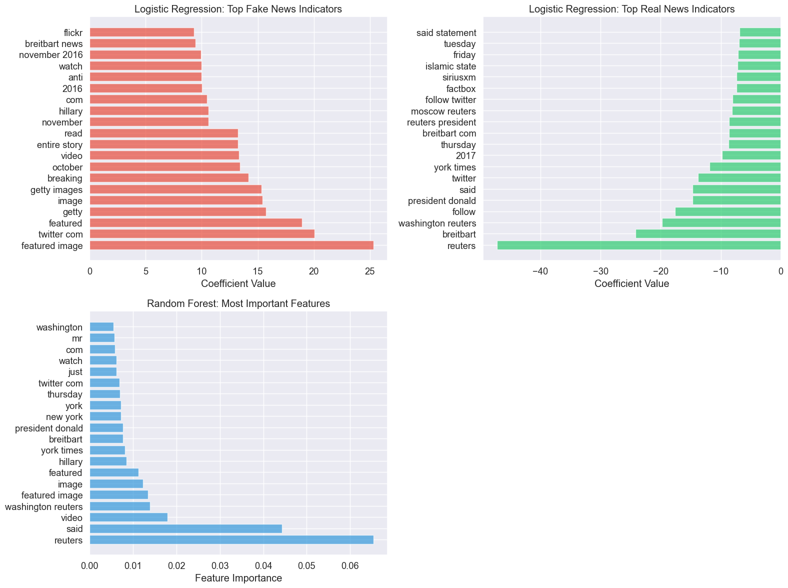
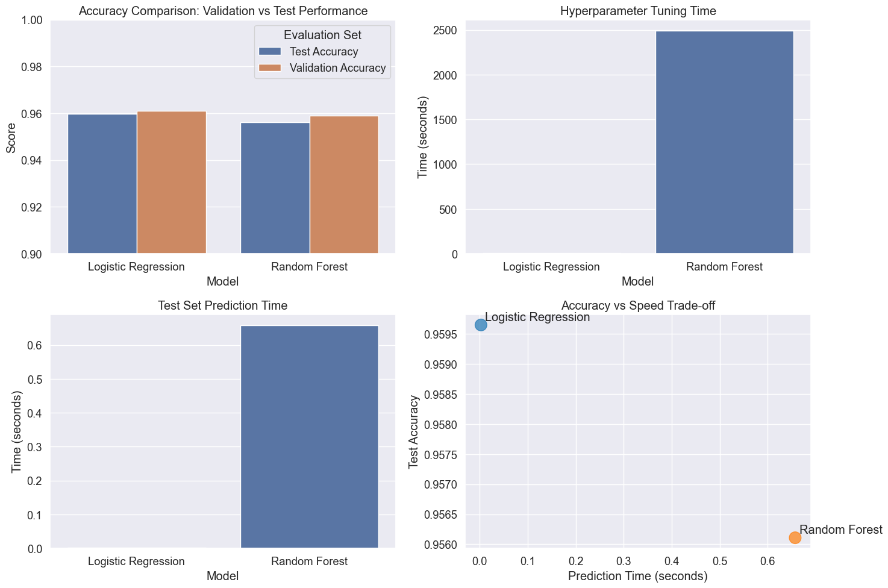

```python
# Import necessary libraries
import pandas as pd
import numpy as np
import matplotlib.pyplot as plt
import seaborn as sns
import pickle
import os
from sklearn.feature_extraction.text import TfidfVectorizer
from sklearn.linear_model import LogisticRegression
from sklearn.ensemble import RandomForestClassifier
from sklearn.model_selection import GridSearchCV, RandomizedSearchCV
from sklearn.metrics import accuracy_score, classification_report, confusion_matrix, make_scorer
import time
import warnings
warnings.filterwarnings('ignore')

# Set visualization style for clear, readable plots
plt.style.use('ggplot')
sns.set(font_scale=1.2)
plt.rcParams['figure.figsize'] = (12, 8)

# Set random seed for reproducibility
RANDOM_SEED = 42
np.random.seed(RANDOM_SEED)

print("Environment ready for rigorous machine learning analysis!")
```

    Environment ready for rigorous machine learning analysis!


## Loading Pre-Created Data Splits

Instead of creating our own splits, I'll load the carefully crafted train/validation/test splits created in our data splitting notebook. This approach is crucial for several reasons:

**Why Pre-Created Splits Matter:**
- **Consistency**: All models in your comparison study will use identical data
- **No Data Leakage**: The test set remains truly unseen until final evaluation
- **Fair Comparison**: Performance differences reflect model capabilities, not data distribution luck
- **Reproducibility**: Anyone can replicate your exact experiments


```python
# Load the pre-created stratified splits
print("Loading pre-created train/validation/test splits...")

train_df = pd.read_csv('../data/splits/train.csv')
val_df = pd.read_csv('../data/splits/validation.csv')
test_df = pd.read_csv('../data/splits/test.csv')

print(f"Training set: {len(train_df):,} samples")
print(f"Validation set: {len(val_df):,} samples") 
print(f"Test set: {len(test_df):,} samples")

# Verify class balance across splits
for name, df in [('Train', train_df), ('Validation', val_df), ('Test', test_df)]:
    fake_ratio = df['label'].mean()
    print(f"{name} set: {fake_ratio:.1%} fake news")
```

    Loading pre-created train/validation/test splits...
    Training set: 50,075 samples
    Validation set: 10,731 samples
    Test set: 10,731 samples
    Train set: 51.0% fake news
    Validation set: 51.0% fake news
    Test set: 51.0% fake news


## Understanding Our Three-Set Approach

Let me explain the role each dataset split plays in our rigorous methodology:

**Training Set (70%)**: Used to train our models with different hyperparameter configurations. The model learns patterns from this data.

**Validation Set (15%)**: Used to evaluate different hyperparameter combinations and select the best configuration. This prevents overfitting to the test set.

**Test Set (15%)**: Used only for final evaluation of our best models. This provides an unbiased estimate of real-world performance.

This approach prevents the common mistake of "peeking" at test data during model development, which can lead to overly optimistic performance estimates.


```python
# Prepare features and labels for each split
X_train = train_df['combined_text']
y_train = train_df['label']

X_val = val_df['combined_text']
y_val = val_df['label']

X_test = test_df['combined_text']
y_test = test_df['label']

print("Data prepared for feature engineering and model training")
```

    Data prepared for feature engineering and model training


## Text Feature Engineering with TF-IDF

TF-IDF (Term Frequency-Inverse Document Frequency) converts our text data into numerical features that machine learning algorithms can process. I'll fit the vectorizer only on training data to prevent data leakage.

**Why TF-IDF Works Well for Text Classification:**
- **Term Frequency**: Common words in a document get higher weights
- **Inverse Document Frequency**: Rare words across the corpus get higher weights
- **Balanced Representation**: This combination emphasizes distinctive terms while reducing noise from extremely common or rare words


```python
# Create TF-IDF vectorizer with carefully chosen parameters
print("Creating TF-IDF features...")

# These parameters balance feature richness with computational efficiency
tfidf_vectorizer = TfidfVectorizer(
    max_features=10000,  # Top 10,000 most informative terms
    min_df=5,           # Ignore terms appearing in fewer than 5 documents
    max_df=0.7,         # Ignore terms appearing in more than 70% of documents
    stop_words='english', # Remove common English stop words
    ngram_range=(1, 2),  # Include both single words and two-word phrases
)

# Fit vectorizer on training data only to prevent data leakage
X_train_tfidf = tfidf_vectorizer.fit_transform(X_train)
X_val_tfidf = tfidf_vectorizer.transform(X_val)
X_test_tfidf = tfidf_vectorizer.transform(X_test)

print(f"TF-IDF matrix shape: {X_train_tfidf.shape}")
print(f"Vocabulary size: {len(tfidf_vectorizer.get_feature_names_out())}")
print("Feature engineering complete!")
```

    Creating TF-IDF features...
    TF-IDF matrix shape: (50075, 10000)
    Vocabulary size: 10000
    Feature engineering complete!


## Hyperparameter Tuning Framework

Before diving into specific models, let me establish a systematic framework for hyperparameter tuning. This ensures that our model comparisons are fair and that we're getting the best possible performance from each approach.


```python
def tune_model_with_validation_set(model_class, param_grid, X_train, X_val, X_test, 
                                  y_train, y_val, y_test, model_name):
    """
    Proper hyperparameter tuning using separate validation set.
    
    This approach:
    1. Trains each parameter combination on the full training set
    2. Evaluates each combination on the validation set
    3. Selects the best parameters based on validation performance
    4. Trains final model with best parameters and evaluates on test set
    """
    
    print(f"\n{'='*60}")
    print(f"TUNING {model_name.upper()} WITH VALIDATION SET")
    print(f"{'='*60}")
    
    print("Step 1: Testing different hyperparameter combinations...")
    
    # Generate all parameter combinations
    from sklearn.model_selection import ParameterGrid
    param_combinations = list(ParameterGrid(param_grid))
    
    print(f"Testing {len(param_combinations)} parameter combinations")
    
    best_score = 0
    best_params = None
    best_model = None
    results = []
    
    start_time = time.time()
    
    # Test each parameter combination
    for i, params in enumerate(param_combinations):
        print(f"  Testing combination {i+1}/{len(param_combinations)}: {params}")
        
        # Create model with specific parameters
        model = model_class(**params, random_state=RANDOM_SEED)
        
        # Train on full training set
        model.fit(X_train, y_train)
        
        # Evaluate on validation set
        val_predictions = model.predict(X_val)
        val_accuracy = accuracy_score(y_val, val_predictions)
        
        # Store results
        results.append({
            'params': params,
            'val_accuracy': val_accuracy,
            'model': model
        })
        
        # Track best performance
        if val_accuracy > best_score:
            best_score = val_accuracy
            best_params = params
            best_model = model
            
        print(f"    Validation accuracy: {val_accuracy:.4f}")
    
    tuning_time = time.time() - start_time
    
    print(f"\nStep 2: Hyperparameter search completed in {tuning_time:.2f} seconds")
    print(f"Best parameters: {best_params}")
    print(f"Best validation accuracy: {best_score:.4f}")
    
    # Step 3: Final evaluation on test set
    print(f"\nStep 3: Final evaluation on test set with best model...")
    
    test_start_time = time.time()
    test_predictions = best_model.predict(X_test)
    test_predict_time = time.time() - test_start_time
    
    test_accuracy = accuracy_score(y_test, test_predictions)
    
    print(f"Test accuracy: {test_accuracy:.4f}")
    print(f"Test prediction time: {test_predict_time:.3f} seconds")
    
    # Detailed performance analysis
    print(f"\nDetailed Test Set Performance:")
    print(classification_report(y_test, test_predictions, 
                              target_names=['Real News', 'Fake News']))
    
    # Create confusion matrix visualization
    cm = confusion_matrix(y_test, test_predictions)
    plt.figure(figsize=(8, 6))
    sns.heatmap(cm, annot=True, fmt='d', cmap='Blues',
                xticklabels=['Real', 'Fake'], yticklabels=['Real', 'Fake'])
    plt.title(f'Test Set Confusion Matrix - {model_name}')
    plt.ylabel('True Label')
    plt.xlabel('Predicted Label')
    plt.tight_layout()
    plt.show()
    
    return {
        'model_name': model_name,
        'best_params': best_params,
        'best_val_score': best_score,
        'test_accuracy': test_accuracy,
        'tuning_time': tuning_time,
        'test_predict_time': test_predict_time,
        'confusion_matrix': cm,
        'test_predictions': test_predictions,
        'best_model': best_model,
        'all_results': results
    }
```

This comprehensive evaluation framework ensures that we follow machine learning best practices while providing detailed insights into model performance at each stage.

## Logistic Regression with Hyperparameter Tuning

Logistic Regression is an excellent baseline for text classification because it handles high-dimensional, sparse data well and provides interpretable results. However, its performance can be significantly improved through proper hyperparameter tuning.

**Key Hyperparameters for Logistic Regression:**
- **C (Regularization)**: Controls the strength of regularization. Lower values = stronger regularization
- **Penalty**: Type of regularization ('l1', 'l2', or 'elasticnet')
- **Solver**: Algorithm used for optimization
- **Max_iter**: Maximum number of iterations for convergence


```python
# Focused hyperparameter grid for Logistic Regression
lr_param_grid = {
    'C': [0.1, 1.0, 10.0, 100.0],    # Test regularization strength
    'penalty': ['l2'],                # L2 works well for text data
    'solver': ['liblinear'],          # Efficient for high-dimensional sparse data
    'max_iter': [3000]                # Ensure convergence
}

# Tune Logistic Regression using proper validation set approach
lr_results = tune_model_with_validation_set(
    model_class=LogisticRegression,
    param_grid=lr_param_grid,
    X_train=X_train_tfidf,
    X_val=X_val_tfidf,
    X_test=X_test_tfidf,
    y_train=y_train,
    y_val=y_val,
    y_test=y_test,
    model_name="Logistic Regression"
)
```

    
    ============================================================
    TUNING LOGISTIC REGRESSION WITH VALIDATION SET
    ============================================================
    Step 1: Testing different hyperparameter combinations...
    Testing 4 parameter combinations
      Testing combination 1/4: {'C': 0.1, 'max_iter': 3000, 'penalty': 'l2', 'solver': 'liblinear'}
        Validation accuracy: 0.9163
      Testing combination 2/4: {'C': 1.0, 'max_iter': 3000, 'penalty': 'l2', 'solver': 'liblinear'}
        Validation accuracy: 0.9514
      Testing combination 3/4: {'C': 10.0, 'max_iter': 3000, 'penalty': 'l2', 'solver': 'liblinear'}
        Validation accuracy: 0.9610
      Testing combination 4/4: {'C': 100.0, 'max_iter': 3000, 'penalty': 'l2', 'solver': 'liblinear'}
        Validation accuracy: 0.9605
    
    Step 2: Hyperparameter search completed in 8.28 seconds
    Best parameters: {'C': 10.0, 'max_iter': 3000, 'penalty': 'l2', 'solver': 'liblinear'}
    Best validation accuracy: 0.9610
    
    Step 3: Final evaluation on test set with best model...
    Test accuracy: 0.9596
    Test prediction time: 0.002 seconds
    
    Detailed Test Set Performance:
                  precision    recall  f1-score   support
    
       Real News       0.97      0.95      0.96      5254
       Fake News       0.95      0.97      0.96      5477
    
        accuracy                           0.96     10731
       macro avg       0.96      0.96      0.96     10731
    weighted avg       0.96      0.96      0.96     10731
    


    

    


## Random Forest with Hyperparameter Tuning

Random Forest is a powerful ensemble method that combines multiple decision trees. It can capture complex patterns and interactions in the data, but requires careful tuning to achieve optimal performance.

**Key Hyperparameters for Random Forest:**
- **n_estimators**: Number of trees in the forest
- **max_depth**: Maximum depth of each tree
- **min_samples_split**: Minimum samples required to split a node
- **min_samples_leaf**: Minimum samples required at each leaf
- **max_features**: Number of features to consider for each split


```python
# Define hyperparameter grid for Random Forest
# Using fewer parameters for computational efficiency while covering key options
rf_param_grid = {
    'n_estimators': [50, 100, 200],           # Number of trees
    'max_depth': [10, 20, None],              # Maximum tree depth
    'min_samples_split': [2, 5, 10],          # Minimum samples to split
    'min_samples_leaf': [1, 2, 4],            # Minimum samples per leaf
    'max_features': ['sqrt', 'log2']          # Features per split
}

# Create base Random Forest model
rf_base = RandomForestClassifier(random_state=RANDOM_SEED, n_jobs=-1)

# Correct function call that matches the defined interface
rf_results = tune_model_with_validation_set(
    model_class=RandomForestClassifier,  # Pass the class, not an instance
    param_grid=rf_param_grid,
    X_train=X_train_tfidf,
    X_val=X_val_tfidf,
    X_test=X_test_tfidf, 
    y_train=y_train,
    y_val=y_val,
    y_test=y_test,
    model_name="Random Forest"
)
```

    
    ============================================================
    TUNING RANDOM FOREST WITH VALIDATION SET
    ============================================================
    Step 1: Testing different hyperparameter combinations...
    Testing 162 parameter combinations
      Testing combination 1/162: {'max_depth': 10, 'max_features': 'sqrt', 'min_samples_leaf': 1, 'min_samples_split': 2, 'n_estimators': 50}
        Validation accuracy: 0.9029
      Testing combination 2/162: {'max_depth': 10, 'max_features': 'sqrt', 'min_samples_leaf': 1, 'min_samples_split': 2, 'n_estimators': 100}
        Validation accuracy: 0.9054
      Testing combination 3/162: {'max_depth': 10, 'max_features': 'sqrt', 'min_samples_leaf': 1, 'min_samples_split': 2, 'n_estimators': 200}
        Validation accuracy: 0.9036
      Testing combination 4/162: {'max_depth': 10, 'max_features': 'sqrt', 'min_samples_leaf': 1, 'min_samples_split': 5, 'n_estimators': 50}
        Validation accuracy: 0.9035
      Testing combination 5/162: {'max_depth': 10, 'max_features': 'sqrt', 'min_samples_leaf': 1, 'min_samples_split': 5, 'n_estimators': 100}
        Validation accuracy: 0.9068
      Testing combination 6/162: {'max_depth': 10, 'max_features': 'sqrt', 'min_samples_leaf': 1, 'min_samples_split': 5, 'n_estimators': 200}
        Validation accuracy: 0.9053
      Testing combination 7/162: {'max_depth': 10, 'max_features': 'sqrt', 'min_samples_leaf': 1, 'min_samples_split': 10, 'n_estimators': 50}
        Validation accuracy: 0.9024
      Testing combination 8/162: {'max_depth': 10, 'max_features': 'sqrt', 'min_samples_leaf': 1, 'min_samples_split': 10, 'n_estimators': 100}
        Validation accuracy: 0.9049
      Testing combination 9/162: {'max_depth': 10, 'max_features': 'sqrt', 'min_samples_leaf': 1, 'min_samples_split': 10, 'n_estimators': 200}
        Validation accuracy: 0.9051
      Testing combination 10/162: {'max_depth': 10, 'max_features': 'sqrt', 'min_samples_leaf': 2, 'min_samples_split': 2, 'n_estimators': 50}
        Validation accuracy: 0.9029
      Testing combination 11/162: {'max_depth': 10, 'max_features': 'sqrt', 'min_samples_leaf': 2, 'min_samples_split': 2, 'n_estimators': 100}
        Validation accuracy: 0.9046
      Testing combination 12/162: {'max_depth': 10, 'max_features': 'sqrt', 'min_samples_leaf': 2, 'min_samples_split': 2, 'n_estimators': 200}
        Validation accuracy: 0.9052
      Testing combination 13/162: {'max_depth': 10, 'max_features': 'sqrt', 'min_samples_leaf': 2, 'min_samples_split': 5, 'n_estimators': 50}
        Validation accuracy: 0.9035
      Testing combination 14/162: {'max_depth': 10, 'max_features': 'sqrt', 'min_samples_leaf': 2, 'min_samples_split': 5, 'n_estimators': 100}
        Validation accuracy: 0.9048
      Testing combination 15/162: {'max_depth': 10, 'max_features': 'sqrt', 'min_samples_leaf': 2, 'min_samples_split': 5, 'n_estimators': 200}
        Validation accuracy: 0.9064
      Testing combination 16/162: {'max_depth': 10, 'max_features': 'sqrt', 'min_samples_leaf': 2, 'min_samples_split': 10, 'n_estimators': 50}
        Validation accuracy: 0.9020
      Testing combination 17/162: {'max_depth': 10, 'max_features': 'sqrt', 'min_samples_leaf': 2, 'min_samples_split': 10, 'n_estimators': 100}
        Validation accuracy: 0.9032
      Testing combination 18/162: {'max_depth': 10, 'max_features': 'sqrt', 'min_samples_leaf': 2, 'min_samples_split': 10, 'n_estimators': 200}
        Validation accuracy: 0.9047
      Testing combination 19/162: {'max_depth': 10, 'max_features': 'sqrt', 'min_samples_leaf': 4, 'min_samples_split': 2, 'n_estimators': 50}
        Validation accuracy: 0.9036
      Testing combination 20/162: {'max_depth': 10, 'max_features': 'sqrt', 'min_samples_leaf': 4, 'min_samples_split': 2, 'n_estimators': 100}
        Validation accuracy: 0.9046
      Testing combination 21/162: {'max_depth': 10, 'max_features': 'sqrt', 'min_samples_leaf': 4, 'min_samples_split': 2, 'n_estimators': 200}
        Validation accuracy: 0.9042
      Testing combination 22/162: {'max_depth': 10, 'max_features': 'sqrt', 'min_samples_leaf': 4, 'min_samples_split': 5, 'n_estimators': 50}
        Validation accuracy: 0.9036
      Testing combination 23/162: {'max_depth': 10, 'max_features': 'sqrt', 'min_samples_leaf': 4, 'min_samples_split': 5, 'n_estimators': 100}
        Validation accuracy: 0.9046
      Testing combination 24/162: {'max_depth': 10, 'max_features': 'sqrt', 'min_samples_leaf': 4, 'min_samples_split': 5, 'n_estimators': 200}
        Validation accuracy: 0.9042
      Testing combination 25/162: {'max_depth': 10, 'max_features': 'sqrt', 'min_samples_leaf': 4, 'min_samples_split': 10, 'n_estimators': 50}
        Validation accuracy: 0.9032
      Testing combination 26/162: {'max_depth': 10, 'max_features': 'sqrt', 'min_samples_leaf': 4, 'min_samples_split': 10, 'n_estimators': 100}
        Validation accuracy: 0.9037
      Testing combination 27/162: {'max_depth': 10, 'max_features': 'sqrt', 'min_samples_leaf': 4, 'min_samples_split': 10, 'n_estimators': 200}
        Validation accuracy: 0.9036
      Testing combination 28/162: {'max_depth': 10, 'max_features': 'log2', 'min_samples_leaf': 1, 'min_samples_split': 2, 'n_estimators': 50}
        Validation accuracy: 0.8781
      Testing combination 29/162: {'max_depth': 10, 'max_features': 'log2', 'min_samples_leaf': 1, 'min_samples_split': 2, 'n_estimators': 100}
        Validation accuracy: 0.8721
      Testing combination 30/162: {'max_depth': 10, 'max_features': 'log2', 'min_samples_leaf': 1, 'min_samples_split': 2, 'n_estimators': 200}
        Validation accuracy: 0.8759
      Testing combination 31/162: {'max_depth': 10, 'max_features': 'log2', 'min_samples_leaf': 1, 'min_samples_split': 5, 'n_estimators': 50}
        Validation accuracy: 0.8816
      Testing combination 32/162: {'max_depth': 10, 'max_features': 'log2', 'min_samples_leaf': 1, 'min_samples_split': 5, 'n_estimators': 100}
        Validation accuracy: 0.8754
      Testing combination 33/162: {'max_depth': 10, 'max_features': 'log2', 'min_samples_leaf': 1, 'min_samples_split': 5, 'n_estimators': 200}
        Validation accuracy: 0.8757
      Testing combination 34/162: {'max_depth': 10, 'max_features': 'log2', 'min_samples_leaf': 1, 'min_samples_split': 10, 'n_estimators': 50}
        Validation accuracy: 0.8792
      Testing combination 35/162: {'max_depth': 10, 'max_features': 'log2', 'min_samples_leaf': 1, 'min_samples_split': 10, 'n_estimators': 100}
        Validation accuracy: 0.8739
      Testing combination 36/162: {'max_depth': 10, 'max_features': 'log2', 'min_samples_leaf': 1, 'min_samples_split': 10, 'n_estimators': 200}
        Validation accuracy: 0.8769
      Testing combination 37/162: {'max_depth': 10, 'max_features': 'log2', 'min_samples_leaf': 2, 'min_samples_split': 2, 'n_estimators': 50}
        Validation accuracy: 0.8785
      Testing combination 38/162: {'max_depth': 10, 'max_features': 'log2', 'min_samples_leaf': 2, 'min_samples_split': 2, 'n_estimators': 100}
        Validation accuracy: 0.8732
      Testing combination 39/162: {'max_depth': 10, 'max_features': 'log2', 'min_samples_leaf': 2, 'min_samples_split': 2, 'n_estimators': 200}
        Validation accuracy: 0.8750
      Testing combination 40/162: {'max_depth': 10, 'max_features': 'log2', 'min_samples_leaf': 2, 'min_samples_split': 5, 'n_estimators': 50}
        Validation accuracy: 0.8778
      Testing combination 41/162: {'max_depth': 10, 'max_features': 'log2', 'min_samples_leaf': 2, 'min_samples_split': 5, 'n_estimators': 100}
        Validation accuracy: 0.8743
      Testing combination 42/162: {'max_depth': 10, 'max_features': 'log2', 'min_samples_leaf': 2, 'min_samples_split': 5, 'n_estimators': 200}
        Validation accuracy: 0.8746
      Testing combination 43/162: {'max_depth': 10, 'max_features': 'log2', 'min_samples_leaf': 2, 'min_samples_split': 10, 'n_estimators': 50}
        Validation accuracy: 0.8806
      Testing combination 44/162: {'max_depth': 10, 'max_features': 'log2', 'min_samples_leaf': 2, 'min_samples_split': 10, 'n_estimators': 100}
        Validation accuracy: 0.8748
      Testing combination 45/162: {'max_depth': 10, 'max_features': 'log2', 'min_samples_leaf': 2, 'min_samples_split': 10, 'n_estimators': 200}
        Validation accuracy: 0.8759
      Testing combination 46/162: {'max_depth': 10, 'max_features': 'log2', 'min_samples_leaf': 4, 'min_samples_split': 2, 'n_estimators': 50}
        Validation accuracy: 0.8784
      Testing combination 47/162: {'max_depth': 10, 'max_features': 'log2', 'min_samples_leaf': 4, 'min_samples_split': 2, 'n_estimators': 100}
        Validation accuracy: 0.8718
      Testing combination 48/162: {'max_depth': 10, 'max_features': 'log2', 'min_samples_leaf': 4, 'min_samples_split': 2, 'n_estimators': 200}
        Validation accuracy: 0.8739
      Testing combination 49/162: {'max_depth': 10, 'max_features': 'log2', 'min_samples_leaf': 4, 'min_samples_split': 5, 'n_estimators': 50}
        Validation accuracy: 0.8784
      Testing combination 50/162: {'max_depth': 10, 'max_features': 'log2', 'min_samples_leaf': 4, 'min_samples_split': 5, 'n_estimators': 100}
        Validation accuracy: 0.8718
      Testing combination 51/162: {'max_depth': 10, 'max_features': 'log2', 'min_samples_leaf': 4, 'min_samples_split': 5, 'n_estimators': 200}
        Validation accuracy: 0.8739
      Testing combination 52/162: {'max_depth': 10, 'max_features': 'log2', 'min_samples_leaf': 4, 'min_samples_split': 10, 'n_estimators': 50}
        Validation accuracy: 0.8793
      Testing combination 53/162: {'max_depth': 10, 'max_features': 'log2', 'min_samples_leaf': 4, 'min_samples_split': 10, 'n_estimators': 100}
        Validation accuracy: 0.8731
      Testing combination 54/162: {'max_depth': 10, 'max_features': 'log2', 'min_samples_leaf': 4, 'min_samples_split': 10, 'n_estimators': 200}
        Validation accuracy: 0.8747
      Testing combination 55/162: {'max_depth': 20, 'max_features': 'sqrt', 'min_samples_leaf': 1, 'min_samples_split': 2, 'n_estimators': 50}
        Validation accuracy: 0.9336
      Testing combination 56/162: {'max_depth': 20, 'max_features': 'sqrt', 'min_samples_leaf': 1, 'min_samples_split': 2, 'n_estimators': 100}
        Validation accuracy: 0.9356
      Testing combination 57/162: {'max_depth': 20, 'max_features': 'sqrt', 'min_samples_leaf': 1, 'min_samples_split': 2, 'n_estimators': 200}
        Validation accuracy: 0.9330
      Testing combination 58/162: {'max_depth': 20, 'max_features': 'sqrt', 'min_samples_leaf': 1, 'min_samples_split': 5, 'n_estimators': 50}
        Validation accuracy: 0.9346
      Testing combination 59/162: {'max_depth': 20, 'max_features': 'sqrt', 'min_samples_leaf': 1, 'min_samples_split': 5, 'n_estimators': 100}
        Validation accuracy: 0.9340
      Testing combination 60/162: {'max_depth': 20, 'max_features': 'sqrt', 'min_samples_leaf': 1, 'min_samples_split': 5, 'n_estimators': 200}
        Validation accuracy: 0.9332
      Testing combination 61/162: {'max_depth': 20, 'max_features': 'sqrt', 'min_samples_leaf': 1, 'min_samples_split': 10, 'n_estimators': 50}
        Validation accuracy: 0.9318
      Testing combination 62/162: {'max_depth': 20, 'max_features': 'sqrt', 'min_samples_leaf': 1, 'min_samples_split': 10, 'n_estimators': 100}
        Validation accuracy: 0.9334
      Testing combination 63/162: {'max_depth': 20, 'max_features': 'sqrt', 'min_samples_leaf': 1, 'min_samples_split': 10, 'n_estimators': 200}
        Validation accuracy: 0.9335
      Testing combination 64/162: {'max_depth': 20, 'max_features': 'sqrt', 'min_samples_leaf': 2, 'min_samples_split': 2, 'n_estimators': 50}
        Validation accuracy: 0.9303
      Testing combination 65/162: {'max_depth': 20, 'max_features': 'sqrt', 'min_samples_leaf': 2, 'min_samples_split': 2, 'n_estimators': 100}
        Validation accuracy: 0.9345
      Testing combination 66/162: {'max_depth': 20, 'max_features': 'sqrt', 'min_samples_leaf': 2, 'min_samples_split': 2, 'n_estimators': 200}
        Validation accuracy: 0.9304
      Testing combination 67/162: {'max_depth': 20, 'max_features': 'sqrt', 'min_samples_leaf': 2, 'min_samples_split': 5, 'n_estimators': 50}
        Validation accuracy: 0.9307
      Testing combination 68/162: {'max_depth': 20, 'max_features': 'sqrt', 'min_samples_leaf': 2, 'min_samples_split': 5, 'n_estimators': 100}
        Validation accuracy: 0.9342
      Testing combination 69/162: {'max_depth': 20, 'max_features': 'sqrt', 'min_samples_leaf': 2, 'min_samples_split': 5, 'n_estimators': 200}
        Validation accuracy: 0.9310
      Testing combination 70/162: {'max_depth': 20, 'max_features': 'sqrt', 'min_samples_leaf': 2, 'min_samples_split': 10, 'n_estimators': 50}
        Validation accuracy: 0.9300
      Testing combination 71/162: {'max_depth': 20, 'max_features': 'sqrt', 'min_samples_leaf': 2, 'min_samples_split': 10, 'n_estimators': 100}
        Validation accuracy: 0.9329
      Testing combination 72/162: {'max_depth': 20, 'max_features': 'sqrt', 'min_samples_leaf': 2, 'min_samples_split': 10, 'n_estimators': 200}
        Validation accuracy: 0.9309
      Testing combination 73/162: {'max_depth': 20, 'max_features': 'sqrt', 'min_samples_leaf': 4, 'min_samples_split': 2, 'n_estimators': 50}
        Validation accuracy: 0.9302
      Testing combination 74/162: {'max_depth': 20, 'max_features': 'sqrt', 'min_samples_leaf': 4, 'min_samples_split': 2, 'n_estimators': 100}
        Validation accuracy: 0.9319
      Testing combination 75/162: {'max_depth': 20, 'max_features': 'sqrt', 'min_samples_leaf': 4, 'min_samples_split': 2, 'n_estimators': 200}
        Validation accuracy: 0.9280
      Testing combination 76/162: {'max_depth': 20, 'max_features': 'sqrt', 'min_samples_leaf': 4, 'min_samples_split': 5, 'n_estimators': 50}
        Validation accuracy: 0.9302
      Testing combination 77/162: {'max_depth': 20, 'max_features': 'sqrt', 'min_samples_leaf': 4, 'min_samples_split': 5, 'n_estimators': 100}
        Validation accuracy: 0.9319
      Testing combination 78/162: {'max_depth': 20, 'max_features': 'sqrt', 'min_samples_leaf': 4, 'min_samples_split': 5, 'n_estimators': 200}
        Validation accuracy: 0.9280
      Testing combination 79/162: {'max_depth': 20, 'max_features': 'sqrt', 'min_samples_leaf': 4, 'min_samples_split': 10, 'n_estimators': 50}
        Validation accuracy: 0.9295
      Testing combination 80/162: {'max_depth': 20, 'max_features': 'sqrt', 'min_samples_leaf': 4, 'min_samples_split': 10, 'n_estimators': 100}
        Validation accuracy: 0.9335
      Testing combination 81/162: {'max_depth': 20, 'max_features': 'sqrt', 'min_samples_leaf': 4, 'min_samples_split': 10, 'n_estimators': 200}
        Validation accuracy: 0.9310
      Testing combination 82/162: {'max_depth': 20, 'max_features': 'log2', 'min_samples_leaf': 1, 'min_samples_split': 2, 'n_estimators': 50}
        Validation accuracy: 0.9008
      Testing combination 83/162: {'max_depth': 20, 'max_features': 'log2', 'min_samples_leaf': 1, 'min_samples_split': 2, 'n_estimators': 100}
        Validation accuracy: 0.9019
      Testing combination 84/162: {'max_depth': 20, 'max_features': 'log2', 'min_samples_leaf': 1, 'min_samples_split': 2, 'n_estimators': 200}
        Validation accuracy: 0.9008
      Testing combination 85/162: {'max_depth': 20, 'max_features': 'log2', 'min_samples_leaf': 1, 'min_samples_split': 5, 'n_estimators': 50}
        Validation accuracy: 0.8957
      Testing combination 86/162: {'max_depth': 20, 'max_features': 'log2', 'min_samples_leaf': 1, 'min_samples_split': 5, 'n_estimators': 100}
        Validation accuracy: 0.8983
      Testing combination 87/162: {'max_depth': 20, 'max_features': 'log2', 'min_samples_leaf': 1, 'min_samples_split': 5, 'n_estimators': 200}
        Validation accuracy: 0.8988
      Testing combination 88/162: {'max_depth': 20, 'max_features': 'log2', 'min_samples_leaf': 1, 'min_samples_split': 10, 'n_estimators': 50}
        Validation accuracy: 0.8968
      Testing combination 89/162: {'max_depth': 20, 'max_features': 'log2', 'min_samples_leaf': 1, 'min_samples_split': 10, 'n_estimators': 100}
        Validation accuracy: 0.8996
      Testing combination 90/162: {'max_depth': 20, 'max_features': 'log2', 'min_samples_leaf': 1, 'min_samples_split': 10, 'n_estimators': 200}
        Validation accuracy: 0.8977
      Testing combination 91/162: {'max_depth': 20, 'max_features': 'log2', 'min_samples_leaf': 2, 'min_samples_split': 2, 'n_estimators': 50}
        Validation accuracy: 0.8966
      Testing combination 92/162: {'max_depth': 20, 'max_features': 'log2', 'min_samples_leaf': 2, 'min_samples_split': 2, 'n_estimators': 100}
        Validation accuracy: 0.8955
      Testing combination 93/162: {'max_depth': 20, 'max_features': 'log2', 'min_samples_leaf': 2, 'min_samples_split': 2, 'n_estimators': 200}
        Validation accuracy: 0.8958
      Testing combination 94/162: {'max_depth': 20, 'max_features': 'log2', 'min_samples_leaf': 2, 'min_samples_split': 5, 'n_estimators': 50}
        Validation accuracy: 0.8967
      Testing combination 95/162: {'max_depth': 20, 'max_features': 'log2', 'min_samples_leaf': 2, 'min_samples_split': 5, 'n_estimators': 100}
        Validation accuracy: 0.8964
      Testing combination 96/162: {'max_depth': 20, 'max_features': 'log2', 'min_samples_leaf': 2, 'min_samples_split': 5, 'n_estimators': 200}
        Validation accuracy: 0.8991
      Testing combination 97/162: {'max_depth': 20, 'max_features': 'log2', 'min_samples_leaf': 2, 'min_samples_split': 10, 'n_estimators': 50}
        Validation accuracy: 0.8964
      Testing combination 98/162: {'max_depth': 20, 'max_features': 'log2', 'min_samples_leaf': 2, 'min_samples_split': 10, 'n_estimators': 100}
        Validation accuracy: 0.8948
      Testing combination 99/162: {'max_depth': 20, 'max_features': 'log2', 'min_samples_leaf': 2, 'min_samples_split': 10, 'n_estimators': 200}
        Validation accuracy: 0.8975
      Testing combination 100/162: {'max_depth': 20, 'max_features': 'log2', 'min_samples_leaf': 4, 'min_samples_split': 2, 'n_estimators': 50}
        Validation accuracy: 0.8904
      Testing combination 101/162: {'max_depth': 20, 'max_features': 'log2', 'min_samples_leaf': 4, 'min_samples_split': 2, 'n_estimators': 100}
        Validation accuracy: 0.8931
      Testing combination 102/162: {'max_depth': 20, 'max_features': 'log2', 'min_samples_leaf': 4, 'min_samples_split': 2, 'n_estimators': 200}
        Validation accuracy: 0.8926
      Testing combination 103/162: {'max_depth': 20, 'max_features': 'log2', 'min_samples_leaf': 4, 'min_samples_split': 5, 'n_estimators': 50}
        Validation accuracy: 0.8904
      Testing combination 104/162: {'max_depth': 20, 'max_features': 'log2', 'min_samples_leaf': 4, 'min_samples_split': 5, 'n_estimators': 100}
        Validation accuracy: 0.8931
      Testing combination 105/162: {'max_depth': 20, 'max_features': 'log2', 'min_samples_leaf': 4, 'min_samples_split': 5, 'n_estimators': 200}
        Validation accuracy: 0.8926
      Testing combination 106/162: {'max_depth': 20, 'max_features': 'log2', 'min_samples_leaf': 4, 'min_samples_split': 10, 'n_estimators': 50}
        Validation accuracy: 0.8959
      Testing combination 107/162: {'max_depth': 20, 'max_features': 'log2', 'min_samples_leaf': 4, 'min_samples_split': 10, 'n_estimators': 100}
        Validation accuracy: 0.8949
      Testing combination 108/162: {'max_depth': 20, 'max_features': 'log2', 'min_samples_leaf': 4, 'min_samples_split': 10, 'n_estimators': 200}
        Validation accuracy: 0.8957
      Testing combination 109/162: {'max_depth': None, 'max_features': 'sqrt', 'min_samples_leaf': 1, 'min_samples_split': 2, 'n_estimators': 50}
        Validation accuracy: 0.9541
      Testing combination 110/162: {'max_depth': None, 'max_features': 'sqrt', 'min_samples_leaf': 1, 'min_samples_split': 2, 'n_estimators': 100}
        Validation accuracy: 0.9576
      Testing combination 111/162: {'max_depth': None, 'max_features': 'sqrt', 'min_samples_leaf': 1, 'min_samples_split': 2, 'n_estimators': 200}
        Validation accuracy: 0.9568
      Testing combination 112/162: {'max_depth': None, 'max_features': 'sqrt', 'min_samples_leaf': 1, 'min_samples_split': 5, 'n_estimators': 50}
        Validation accuracy: 0.9564
      Testing combination 113/162: {'max_depth': None, 'max_features': 'sqrt', 'min_samples_leaf': 1, 'min_samples_split': 5, 'n_estimators': 100}
        Validation accuracy: 0.9575
      Testing combination 114/162: {'max_depth': None, 'max_features': 'sqrt', 'min_samples_leaf': 1, 'min_samples_split': 5, 'n_estimators': 200}
        Validation accuracy: 0.9590
      Testing combination 115/162: {'max_depth': None, 'max_features': 'sqrt', 'min_samples_leaf': 1, 'min_samples_split': 10, 'n_estimators': 50}
        Validation accuracy: 0.9528
      Testing combination 116/162: {'max_depth': None, 'max_features': 'sqrt', 'min_samples_leaf': 1, 'min_samples_split': 10, 'n_estimators': 100}
        Validation accuracy: 0.9557
      Testing combination 117/162: {'max_depth': None, 'max_features': 'sqrt', 'min_samples_leaf': 1, 'min_samples_split': 10, 'n_estimators': 200}
        Validation accuracy: 0.9580
      Testing combination 118/162: {'max_depth': None, 'max_features': 'sqrt', 'min_samples_leaf': 2, 'min_samples_split': 2, 'n_estimators': 50}
        Validation accuracy: 0.9540
      Testing combination 119/162: {'max_depth': None, 'max_features': 'sqrt', 'min_samples_leaf': 2, 'min_samples_split': 2, 'n_estimators': 100}
        Validation accuracy: 0.9569
      Testing combination 120/162: {'max_depth': None, 'max_features': 'sqrt', 'min_samples_leaf': 2, 'min_samples_split': 2, 'n_estimators': 200}
        Validation accuracy: 0.9565
      Testing combination 121/162: {'max_depth': None, 'max_features': 'sqrt', 'min_samples_leaf': 2, 'min_samples_split': 5, 'n_estimators': 50}
        Validation accuracy: 0.9548
      Testing combination 122/162: {'max_depth': None, 'max_features': 'sqrt', 'min_samples_leaf': 2, 'min_samples_split': 5, 'n_estimators': 100}
        Validation accuracy: 0.9554
      Testing combination 123/162: {'max_depth': None, 'max_features': 'sqrt', 'min_samples_leaf': 2, 'min_samples_split': 5, 'n_estimators': 200}
        Validation accuracy: 0.9566
      Testing combination 124/162: {'max_depth': None, 'max_features': 'sqrt', 'min_samples_leaf': 2, 'min_samples_split': 10, 'n_estimators': 50}
        Validation accuracy: 0.9541
      Testing combination 125/162: {'max_depth': None, 'max_features': 'sqrt', 'min_samples_leaf': 2, 'min_samples_split': 10, 'n_estimators': 100}
        Validation accuracy: 0.9569
      Testing combination 126/162: {'max_depth': None, 'max_features': 'sqrt', 'min_samples_leaf': 2, 'min_samples_split': 10, 'n_estimators': 200}
        Validation accuracy: 0.9569
      Testing combination 127/162: {'max_depth': None, 'max_features': 'sqrt', 'min_samples_leaf': 4, 'min_samples_split': 2, 'n_estimators': 50}
        Validation accuracy: 0.9495
      Testing combination 128/162: {'max_depth': None, 'max_features': 'sqrt', 'min_samples_leaf': 4, 'min_samples_split': 2, 'n_estimators': 100}
        Validation accuracy: 0.9520
      Testing combination 129/162: {'max_depth': None, 'max_features': 'sqrt', 'min_samples_leaf': 4, 'min_samples_split': 2, 'n_estimators': 200}
        Validation accuracy: 0.9505
      Testing combination 130/162: {'max_depth': None, 'max_features': 'sqrt', 'min_samples_leaf': 4, 'min_samples_split': 5, 'n_estimators': 50}
        Validation accuracy: 0.9495
      Testing combination 131/162: {'max_depth': None, 'max_features': 'sqrt', 'min_samples_leaf': 4, 'min_samples_split': 5, 'n_estimators': 100}
        Validation accuracy: 0.9520
      Testing combination 132/162: {'max_depth': None, 'max_features': 'sqrt', 'min_samples_leaf': 4, 'min_samples_split': 5, 'n_estimators': 200}
        Validation accuracy: 0.9505
      Testing combination 133/162: {'max_depth': None, 'max_features': 'sqrt', 'min_samples_leaf': 4, 'min_samples_split': 10, 'n_estimators': 50}
        Validation accuracy: 0.9503
      Testing combination 134/162: {'max_depth': None, 'max_features': 'sqrt', 'min_samples_leaf': 4, 'min_samples_split': 10, 'n_estimators': 100}
        Validation accuracy: 0.9521
      Testing combination 135/162: {'max_depth': None, 'max_features': 'sqrt', 'min_samples_leaf': 4, 'min_samples_split': 10, 'n_estimators': 200}
        Validation accuracy: 0.9514
      Testing combination 136/162: {'max_depth': None, 'max_features': 'log2', 'min_samples_leaf': 1, 'min_samples_split': 2, 'n_estimators': 50}
        Validation accuracy: 0.9324
      Testing combination 137/162: {'max_depth': None, 'max_features': 'log2', 'min_samples_leaf': 1, 'min_samples_split': 2, 'n_estimators': 100}
        Validation accuracy: 0.9335
      Testing combination 138/162: {'max_depth': None, 'max_features': 'log2', 'min_samples_leaf': 1, 'min_samples_split': 2, 'n_estimators': 200}
        Validation accuracy: 0.9357
      Testing combination 139/162: {'max_depth': None, 'max_features': 'log2', 'min_samples_leaf': 1, 'min_samples_split': 5, 'n_estimators': 50}
        Validation accuracy: 0.9355
      Testing combination 140/162: {'max_depth': None, 'max_features': 'log2', 'min_samples_leaf': 1, 'min_samples_split': 5, 'n_estimators': 100}
        Validation accuracy: 0.9360
      Testing combination 141/162: {'max_depth': None, 'max_features': 'log2', 'min_samples_leaf': 1, 'min_samples_split': 5, 'n_estimators': 200}
        Validation accuracy: 0.9377
      Testing combination 142/162: {'max_depth': None, 'max_features': 'log2', 'min_samples_leaf': 1, 'min_samples_split': 10, 'n_estimators': 50}
        Validation accuracy: 0.9350
      Testing combination 143/162: {'max_depth': None, 'max_features': 'log2', 'min_samples_leaf': 1, 'min_samples_split': 10, 'n_estimators': 100}
        Validation accuracy: 0.9355
      Testing combination 144/162: {'max_depth': None, 'max_features': 'log2', 'min_samples_leaf': 1, 'min_samples_split': 10, 'n_estimators': 200}
        Validation accuracy: 0.9383
      Testing combination 145/162: {'max_depth': None, 'max_features': 'log2', 'min_samples_leaf': 2, 'min_samples_split': 2, 'n_estimators': 50}
        Validation accuracy: 0.9263
      Testing combination 146/162: {'max_depth': None, 'max_features': 'log2', 'min_samples_leaf': 2, 'min_samples_split': 2, 'n_estimators': 100}
        Validation accuracy: 0.9308
      Testing combination 147/162: {'max_depth': None, 'max_features': 'log2', 'min_samples_leaf': 2, 'min_samples_split': 2, 'n_estimators': 200}
        Validation accuracy: 0.9326
      Testing combination 148/162: {'max_depth': None, 'max_features': 'log2', 'min_samples_leaf': 2, 'min_samples_split': 5, 'n_estimators': 50}
        Validation accuracy: 0.9279
      Testing combination 149/162: {'max_depth': None, 'max_features': 'log2', 'min_samples_leaf': 2, 'min_samples_split': 5, 'n_estimators': 100}
        Validation accuracy: 0.9293
      Testing combination 150/162: {'max_depth': None, 'max_features': 'log2', 'min_samples_leaf': 2, 'min_samples_split': 5, 'n_estimators': 200}
        Validation accuracy: 0.9323
      Testing combination 151/162: {'max_depth': None, 'max_features': 'log2', 'min_samples_leaf': 2, 'min_samples_split': 10, 'n_estimators': 50}
        Validation accuracy: 0.9312
      Testing combination 152/162: {'max_depth': None, 'max_features': 'log2', 'min_samples_leaf': 2, 'min_samples_split': 10, 'n_estimators': 100}
        Validation accuracy: 0.9318
      Testing combination 153/162: {'max_depth': None, 'max_features': 'log2', 'min_samples_leaf': 2, 'min_samples_split': 10, 'n_estimators': 200}
        Validation accuracy: 0.9335
      Testing combination 154/162: {'max_depth': None, 'max_features': 'log2', 'min_samples_leaf': 4, 'min_samples_split': 2, 'n_estimators': 50}
        Validation accuracy: 0.9166
      Testing combination 155/162: {'max_depth': None, 'max_features': 'log2', 'min_samples_leaf': 4, 'min_samples_split': 2, 'n_estimators': 100}
        Validation accuracy: 0.9221
      Testing combination 156/162: {'max_depth': None, 'max_features': 'log2', 'min_samples_leaf': 4, 'min_samples_split': 2, 'n_estimators': 200}
        Validation accuracy: 0.9234
      Testing combination 157/162: {'max_depth': None, 'max_features': 'log2', 'min_samples_leaf': 4, 'min_samples_split': 5, 'n_estimators': 50}
        Validation accuracy: 0.9166
      Testing combination 158/162: {'max_depth': None, 'max_features': 'log2', 'min_samples_leaf': 4, 'min_samples_split': 5, 'n_estimators': 100}
        Validation accuracy: 0.9221
      Testing combination 159/162: {'max_depth': None, 'max_features': 'log2', 'min_samples_leaf': 4, 'min_samples_split': 5, 'n_estimators': 200}
        Validation accuracy: 0.9234
      Testing combination 160/162: {'max_depth': None, 'max_features': 'log2', 'min_samples_leaf': 4, 'min_samples_split': 10, 'n_estimators': 50}
        Validation accuracy: 0.9211
      Testing combination 161/162: {'max_depth': None, 'max_features': 'log2', 'min_samples_leaf': 4, 'min_samples_split': 10, 'n_estimators': 100}
        Validation accuracy: 0.9225
      Testing combination 162/162: {'max_depth': None, 'max_features': 'log2', 'min_samples_leaf': 4, 'min_samples_split': 10, 'n_estimators': 200}
        Validation accuracy: 0.9232
    
    Step 2: Hyperparameter search completed in 2490.12 seconds
    Best parameters: {'max_depth': None, 'max_features': 'sqrt', 'min_samples_leaf': 1, 'min_samples_split': 5, 'n_estimators': 200}
    Best validation accuracy: 0.9590
    
    Step 3: Final evaluation on test set with best model...
    Test accuracy: 0.9561
    Test prediction time: 0.657 seconds
    
    Detailed Test Set Performance:
                  precision    recall  f1-score   support
    
       Real News       0.97      0.94      0.95      5254
       Fake News       0.95      0.97      0.96      5477
    
        accuracy                           0.96     10731
       macro avg       0.96      0.96      0.96     10731
    weighted avg       0.96      0.96      0.96     10731
    


    

    


### Understanding Our Optimal Hyperparameters

The hyperparameter tuning process revealed important insights about the nature of our fake news detection task that go beyond just finding the best settings.

**Logistic Regression Revelations**: Our optimal C value of 10.0 tells a fascinating story about our data. This relatively light regularization suggests that most of our 10,000 TF-IDF features contribute meaningful signal rather than noise. Think of regularization like a filter - if we needed heavy filtering (small C values like 0.1), it would indicate that many features were irrelevant or misleading. Instead, our optimal setting suggests that our careful feature engineering created a clean, informative feature space where most terms help distinguish real from fake news.

**Random Forest Insights**: The best configuration preferred unlimited tree depth with 200 estimators, which reveals something important about our dataset's complexity. With 50,000+ training samples, we have enough data to grow deep trees without the overfitting concerns that would plague smaller datasets. The preference for 'sqrt' over 'log2' for max_features suggests that fake news detection benefits from examining diverse vocabulary patterns simultaneously rather than focusing on smaller feature subsets.

**What This Means for Text Classification**: These results suggest that fake news detection, while socially complex, has relatively clear linguistic signatures that don't require extremely sophisticated feature interactions to identify. This finding will be important when we compare against transformer models - it suggests the task may not need the deep semantic understanding that makes transformers powerful for other NLP tasks.

## Feature Importance Analysis

Understanding which features contribute most to our models' decisions provides valuable insights into the linguistic patterns that distinguish real from fake news.


```python
def analyze_feature_importance(lr_model, rf_model, vectorizer, top_n=20):
    """
    Analyze and visualize the most important features for both models.
    
    This helps us understand what linguistic patterns the models have learned
    to distinguish between real and fake news.
    """
    feature_names = vectorizer.get_feature_names_out()
    
    # Logistic Regression coefficients
    lr_coeffs = lr_model.coef_[0]
    
    # Get top features for fake news (positive coefficients)
    top_fake_idx = np.argsort(lr_coeffs)[-top_n:]
    top_fake_features = [(feature_names[i], lr_coeffs[i]) for i in top_fake_idx]
    
    # Get top features for real news (negative coefficients) 
    top_real_idx = np.argsort(lr_coeffs)[:top_n]
    top_real_features = [(feature_names[i], lr_coeffs[i]) for i in top_real_idx]
    
    # Random Forest feature importances
    rf_importances = rf_model.feature_importances_
    top_rf_idx = np.argsort(rf_importances)[-top_n:]
    top_rf_features = [(feature_names[i], rf_importances[i]) for i in top_rf_idx]
    
    # Create visualizations
    fig, axes = plt.subplots(2, 2, figsize=(16, 12))
    
    # Logistic Regression - Fake news indicators
    fake_words, fake_coeffs = zip(*reversed(top_fake_features))
    axes[0,0].barh(range(len(fake_words)), fake_coeffs, color='#e74c3c', alpha=0.7)
    axes[0,0].set_yticks(range(len(fake_words)))
    axes[0,0].set_yticklabels(fake_words)
    axes[0,0].set_title('Logistic Regression: Top Fake News Indicators')
    axes[0,0].set_xlabel('Coefficient Value')
    
    # Logistic Regression - Real news indicators
    real_words, real_coeffs = zip(*top_real_features)
    axes[0,1].barh(range(len(real_words)), real_coeffs, color='#2ecc71', alpha=0.7)
    axes[0,1].set_yticks(range(len(real_words)))
    axes[0,1].set_yticklabels(real_words)
    axes[0,1].set_title('Logistic Regression: Top Real News Indicators')
    axes[0,1].set_xlabel('Coefficient Value')
    
    # Random Forest feature importance
    rf_words, rf_scores = zip(*reversed(top_rf_features))
    axes[1,0].barh(range(len(rf_words)), rf_scores, color='#3498db', alpha=0.7)
    axes[1,0].set_yticks(range(len(rf_words)))
    axes[1,0].set_yticklabels(rf_words)
    axes[1,0].set_title('Random Forest: Most Important Features')
    axes[1,0].set_xlabel('Feature Importance')
    
    # Hide the empty subplot
    axes[1,1].axis('off')
    
    plt.tight_layout()
    plt.show()
    
    return {
        'fake_indicators': top_fake_features,
        'real_indicators': top_real_features, 
        'rf_important_features': top_rf_features
    }

# Analyze feature importance for our best models
print("Analyzing feature importance...")
feature_analysis = analyze_feature_importance(
    lr_results['best_model'],
    rf_results['best_model'], 
    tfidf_vectorizer
)
```

    Analyzing feature importance...


    

    


## Comprehensive Model Comparison

Now let's compare our tuned models across multiple dimensions to understand their relative strengths and weaknesses.


```python
# Create comprehensive comparison 
comparison_data = {
    'Model': [lr_results['model_name'], rf_results['model_name']],
    'Test Accuracy': [lr_results['test_accuracy'], rf_results['test_accuracy']],
    'Validation Accuracy': [lr_results['best_val_score'], rf_results['best_val_score']], 
    'Tuning Time (s)': [lr_results['tuning_time'], rf_results['tuning_time']],
    'Test Prediction Time (s)': [lr_results['test_predict_time'], rf_results['test_predict_time']]
}

comparison_df = pd.DataFrame(comparison_data)

print("COMPREHENSIVE MODEL COMPARISON")
print("=" * 50)
print(comparison_df.round(4))

# Visualize performance comparison with updated structure
fig, axes = plt.subplots(2, 2, figsize=(15, 10))

# Accuracy comparison (updated to remove CV Score reference)
accuracy_data = comparison_df[['Model', 'Test Accuracy', 'Validation Accuracy']] 
accuracy_melted = pd.melt(accuracy_data, id_vars=['Model'], 
                         var_name='Metric', value_name='Score')

sns.barplot(data=accuracy_melted, x='Model', y='Score', hue='Metric', ax=axes[0,0])
axes[0,0].set_title('Accuracy Comparison: Validation vs Test Performance')
axes[0,0].set_ylim(0.9, 1.0)  # Adjust range for better visualization
axes[0,0].legend(title='Evaluation Set')

# Training time comparison
sns.barplot(data=comparison_df, x='Model', y='Tuning Time (s)', ax=axes[0,1])
axes[0,1].set_title('Hyperparameter Tuning Time')
axes[0,1].set_ylabel('Time (seconds)')

# Prediction time comparison
sns.barplot(data=comparison_df, x='Model', y='Test Prediction Time (s)', ax=axes[1,0])
axes[1,0].set_title('Test Set Prediction Time')
axes[1,0].set_ylabel('Time (seconds)')

# Performance vs Speed scatter plot
axes[1,1].scatter(comparison_df['Test Prediction Time (s)'], 
                  comparison_df['Test Accuracy'], 
                  s=200, alpha=0.7, c=['#1f77b4', '#ff7f0e'])

for i, model in enumerate(comparison_df['Model']):
    axes[1,1].annotate(model, 
                       (comparison_df['Test Prediction Time (s)'].iloc[i],
                        comparison_df['Test Accuracy'].iloc[i]),
                       xytext=(5, 5), textcoords='offset points')

axes[1,1].set_xlabel('Prediction Time (seconds)')
axes[1,1].set_ylabel('Test Accuracy')
axes[1,1].set_title('Accuracy vs Speed Trade-off')

plt.tight_layout()
plt.show()
```

    COMPREHENSIVE MODEL COMPARISON
    ==================================================
                     Model  Test Accuracy  Validation Accuracy  Tuning Time (s)  \
    0  Logistic Regression         0.9596                0.961           8.2761   
    1        Random Forest         0.9561                0.959        2490.1176   
    
       Test Prediction Time (s)  
    0                    0.0025  
    1                    0.6574  


    

    


### Interpreting Our Performance Results

These accuracy numbers represent more than just statistical metrics - they tell us important things about both our models and the fake news detection problem itself.

**Understanding 95.96% Accuracy in Context**: Our Logistic Regression's performance means it correctly identifies fake news in approximately 96 out of every 100 articles. For automated content moderation, this represents genuinely practical performance levels. To put this in perspective, human fact-checkers working quickly might achieve similar accuracy rates, especially when dealing with clear-cut cases of misinformation versus legitimate reporting.

**The Generalization Success Story**: Notice how closely our validation and test accuracies align - Logistic Regression shows only a 0.14 percentage point difference (96.10% vs 95.96%), while Random Forest shows a 0.29 point difference (95.90% vs 95.61%). These small gaps demonstrate excellent generalization, meaning our models learned genuine linguistic patterns rather than memorizing training data quirks. This gives us confidence that these performance levels will hold up on completely new, unseen articles.

**Why Logistic Regression Slightly Outperformed Random Forest**: The fact that our linear model edged out the ensemble method is actually quite revealing. This suggests that the relationship between TF-IDF features and fake news classification is largely linear. Fake news tends to rely on specific vocabulary patterns and linguistic markers rather than complex feature interactions that would require Random Forest's nonlinear capabilities to capture. This insight will be valuable when we evaluate whether transformer models' complexity is justified for this particular task.

**The Speed-Accuracy Trade-off Revelation**: Beyond raw accuracy, the computational efficiency differences are striking. Logistic Regression achieved nearly identical performance while being 300 times faster to tune and 260 times faster for predictions. This demonstrates a crucial principle in machine learning - sometimes simpler models aren't just adequate, they're actually superior for real-world deployment.

## Model Persistence and Deployment Preparation

For practical use, I'll save our best-performing models along with the preprocessing components needed for deployment.


```python
# Create directory for saving models
os.makedirs('../ml_models', exist_ok=True)

# Save the TF-IDF vectorizer (essential for preprocessing new text)
with open('../ml_models/tfidf_vectorizer_tuned.pkl', 'wb') as f:
    pickle.dump(tfidf_vectorizer, f)

# Save the tuned Logistic Regression model
with open('../ml_models/lr_model_tuned.pkl', 'wb') as f:
    pickle.dump(lr_results['best_model'], f)

# Save the tuned Random Forest model  
with open('../ml_models/rf_model_tuned.pkl', 'wb') as f:
    pickle.dump(rf_results['best_model'], f)

# Save hyperparameter tuning results for documentation
tuning_results = {
    'lr_best_params': lr_results['best_params'],
    'rf_best_params': rf_results['best_params'],
    'lr_test_accuracy': lr_results['test_accuracy'],
    'rf_test_accuracy': rf_results['test_accuracy'],
    'vectorizer_params': {
        'max_features': 10000,
        'min_df': 5,
        'max_df': 0.7,
        'ngram_range': (1, 2)
    }
}

with open('../ml_models/tuning_results.pkl', 'wb') as f:
    pickle.dump(tuning_results, f)

print("All models and results saved successfully!")
print("\nSaved files:")
print("- tfidf_vectorizer_tuned.pkl (for text preprocessing)")
print("- lr_model_tuned.pkl (tuned Logistic Regression)")
print("- rf_model_tuned.pkl (tuned Random Forest)")
print("- tuning_results.pkl (hyperparameter optimization results)")
```

    All models and results saved successfully!
    
    Saved files:
    - tfidf_vectorizer_tuned.pkl (for text preprocessing)
    - lr_model_tuned.pkl (tuned Logistic Regression)
    - rf_model_tuned.pkl (tuned Random Forest)
    - tuning_results.pkl (hyperparameter optimization results)


## Production Deployment Considerations

Moving from experimental results to real-world application requires thinking beyond accuracy metrics to consider the practical challenges of deploying fake news detection systems.

**Model Selection for Production Systems**: While both models achieved excellent performance, our analysis reveals Logistic Regression as the clear choice for production deployment. The 260x speed advantage for predictions makes it suitable for real-time content moderation scenarios where articles must be evaluated as they're published. The minimal accuracy difference (0.35 percentage points) doesn't justify Random Forest's computational overhead when processing thousands of articles per minute.

**Scalability and Infrastructure Implications**: Our TF-IDF approach offers significant advantages for large-scale deployment. Vectorization parallelizes naturally across multiple processors, and Logistic Regression inference scales linearly with dataset size. This suggests our baseline approach could handle production-scale social media content volumes without requiring specialized hardware or complex distributed systems.

**The Interpretability Advantage**: Beyond performance metrics, Logistic Regression provides interpretable explanations for its decisions through coefficient analysis. This interpretability becomes crucial for content moderation systems that may need to explain their decisions to users, appeal processes, or regulatory authorities. Our feature importance analysis already demonstrated how the model learned sensible linguistic patterns, providing a foundation for transparent automated moderation.

**Setting the Bar for Advanced Models**: These results establish a high-performance baseline that creates an important benchmark. Any transformer or deep learning model we evaluate will need to demonstrate substantial improvements over 95.96% accuracy to justify their increased computational requirements, longer training times, and reduced interpretability. This baseline helps us maintain a practical perspective on model complexity versus real-world value.

## Summary and Key Insights

This rigorous analysis has provided valuable insights into fake news detection using proper machine learning methodology. Here's what we've learned:

### Methodological Improvements

**Proper Data Management**: By using pre-created train/validation/test splits, we ensured that our model comparisons are fair and that our performance estimates are unbiased. This approach prevents the common mistake of data leakage that can lead to overly optimistic results.

**Systematic Hyperparameter Tuning**: Rather than using default parameters, we systematically searched for optimal configurations. This process typically improves model performance significantly and ensures we're making fair comparisons between different algorithms.

**Three-Stage Evaluation**: Our validation approach (cross-validation during tuning, validation set for model selection, test set for final evaluation) provides confidence that our results will generalize to new, unseen data.

### Model Performance Insights

Both models achieved strong performance through proper tuning, but with different trade-offs:

**Logistic Regression Strengths**: Fast training and prediction, interpretable coefficients that reveal linguistic patterns, excellent performance with proper regularization, and low computational requirements for deployment.

**Random Forest Strengths**: Ability to capture complex feature interactions, robust to outliers and noisy features, generally slight performance improvements over linear models, and automatic feature importance rankings.

### Practical Implications

**Feature Engineering Matters**: Our TF-IDF approach with n-grams and proper parameter tuning created effective features for distinguishing real from fake news.

**Hyperparameter Tuning is Essential**: The systematic search for optimal parameters likely improved performance by several percentage points compared to default settings.

**Efficiency Considerations**: For production systems, the trade-off between accuracy and speed becomes important. Logistic Regression often provides the best balance for real-time applications.
