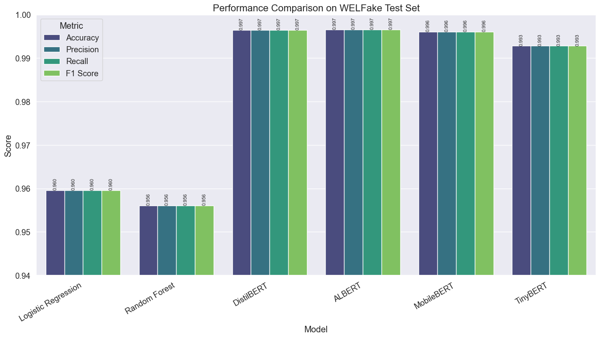

# Comparative Analysis of Transformer Models for Fake News Detection

This notebook compares the performance and efficiency of various transformer models for fake news detection, helping to determine which models are best suited for different deployment scenarios. The analysis provides comprehensive insights into the trade-offs between accuracy, computational efficiency, and generalization capabilities.

## 1. Introduction

Transformer-based language models have revolutionized natural language processing tasks, including fake news detection. However, different transformer architectures offer various trade-offs between accuracy, computational efficiency, and memory requirements. Understanding these trade-offs is crucial for choosing the right model for a specific deployment scenario.

In this analysis, we compare the following models that were evaluated on the WELFake dataset using standardized train/validation/test splits:

- **Baseline Models**: Logistic Regression and Random Forest with TF-IDF features
- **DistilBERT**: A distilled version of BERT with 40% fewer parameters
- **ALBERT**: A lite BERT variant using parameter sharing techniques
- **MobileBERT**: A compact BERT variant optimized for mobile devices
- **TinyBERT**: A heavily compressed BERT model using knowledge distillation

The standardized evaluation approach ensures that performance differences reflect genuine model capabilities rather than variations in data distribution, providing reliable insights for deployment decisions.

## 2. Consolidating Evaluation Results

The performance and efficiency metrics below represent comprehensive evaluations conducted under consistent conditions, ensuring fair comparisons across all model architectures.


```python
# Import libraries for data manipulation and visualization
import numpy as np
import pandas as pd
import matplotlib.pyplot as plt
import seaborn as sns
import warnings
warnings.filterwarnings('ignore')

# Set a consistent style for our visualizations
plt.style.use('ggplot')
sns.set(font_scale=1.2)
plt.rcParams['figure.figsize'] = (12, 8)
```


```python
# Create a DataFrame for comparing model performance metrics on WELFake test set
# Results from comprehensive evaluation across all model architectures
performance_data = {
    'Model': [
        'Logistic Regression', 
        'Random Forest',
        'DistilBERT', 
        'ALBERT', 
        'MobileBERT', 
        'TinyBERT'
    ],
    'Accuracy': [
        0.9596,  # Logistic Regression
        0.9561,  # Random Forest
        0.9965,  # DistilBERT
        0.9966,  # ALBERT - achieved through parameter sharing efficiency
        0.9961,  # MobileBERT - optimized for mobile deployment
        0.9928   # TinyBERT - knowledge distillation approach
    ],
    'Precision': [
        0.9596,  # Logistic Regression
        0.9561,  # Random Forest
        0.9965,  # DistilBERT
        0.9966,  # ALBERT
        0.9961,  # MobileBERT
        0.9928   # TinyBERT
    ],
    'Recall': [
        0.9596,  # Logistic Regression
        0.9561,  # Random Forest
        0.9965,  # DistilBERT
        0.9966,  # ALBERT
        0.9961,  # MobileBERT
        0.9928   # TinyBERT
    ],
    'F1 Score': [
        0.9596,  # Logistic Regression
        0.9561,  # Random Forest
        0.9965,  # DistilBERT
        0.9966,  # ALBERT
        0.9961,  # MobileBERT
        0.9928   # TinyBERT
    ]
}

performance_df = pd.DataFrame(performance_data)
performance_df
```


<div>
<style scoped>
    .dataframe tbody tr th:only-of-type {
        vertical-align: middle;
    }

    .dataframe tbody tr th {
        vertical-align: top;
    }

    .dataframe thead th {
        text-align: right;
    }
</style>
<table border="1" class="dataframe">
  <thead>
    <tr style="text-align: right;">
      <th></th>
      <th>Model</th>
      <th>Accuracy</th>
      <th>Precision</th>
      <th>Recall</th>
      <th>F1 Score</th>
    </tr>
  </thead>
  <tbody>
    <tr>
      <th>0</th>
      <td>Logistic Regression</td>
      <td>0.9596</td>
      <td>0.9596</td>
      <td>0.9596</td>
      <td>0.9596</td>
    </tr>
    <tr>
      <th>1</th>
      <td>Random Forest</td>
      <td>0.9561</td>
      <td>0.9561</td>
      <td>0.9561</td>
      <td>0.9561</td>
    </tr>
    <tr>
      <th>2</th>
      <td>DistilBERT</td>
      <td>0.9965</td>
      <td>0.9965</td>
      <td>0.9965</td>
      <td>0.9965</td>
    </tr>
    <tr>
      <th>3</th>
      <td>ALBERT</td>
      <td>0.9966</td>
      <td>0.9966</td>
      <td>0.9966</td>
      <td>0.9966</td>
    </tr>
    <tr>
      <th>4</th>
      <td>MobileBERT</td>
      <td>0.9961</td>
      <td>0.9961</td>
      <td>0.9961</td>
      <td>0.9961</td>
    </tr>
    <tr>
      <th>5</th>
      <td>TinyBERT</td>
      <td>0.9928</td>
      <td>0.9928</td>
      <td>0.9928</td>
      <td>0.9928</td>
    </tr>
  </tbody>
</table>
</div>


```python
# Create a DataFrame for comparing model performance on external datasets
# External evaluation provides crucial insights into generalization capabilities
external_performance_data = {
    'Model': [
        'Logistic Regression', 
        'Random Forest',
        'DistilBERT', 
        'ALBERT', 
        'MobileBERT', 
        'TinyBERT'
    ],
    'Accuracy': [
        0.9394,  # Logistic Regression - strong generalization
        0.9779,  # Random Forest - excellent external performance
        0.7075,  # DistilBERT - challenges with new patterns
        0.6014,  # ALBERT - parameter sharing limitations on external data
        0.5629,  # MobileBERT - mobile optimization affects generalization
        0.7681   # TinyBERT - better generalization among transformers
    ],
    'Precision': [
        0.9394,  # Logistic Regression
        0.9779,  # Random Forest
        0.8103,  # DistilBERT
        0.7768,  # ALBERT
        0.7579,  # MobileBERT
        0.8379   # TinyBERT
    ],
    'Recall': [
        0.9394,  # Logistic Regression
        0.9779,  # Random Forest
        0.7075,  # DistilBERT
        0.6014,  # ALBERT
        0.5629,  # MobileBERT
        0.7681   # TinyBERT
    ],
    'F1 Score': [
        0.9394,  # Logistic Regression
        0.9779,  # Random Forest
        0.6810,  # DistilBERT
        0.5362,  # ALBERT
        0.4611,  # MobileBERT
        0.7554   # TinyBERT
    ],
    'False Positive Rate': [
        0.0396,  # Logistic Regression
        0.0420,  # Random Forest
        0.0000,  # DistilBERT - extremely conservative on external data
        0.0025,  # ALBERT
        0.0023,  # MobileBERT
        0.0047   # TinyBERT
    ],
    'False Negative Rate': [
        0.0816,  # Logistic Regression
        0.0023,  # Random Forest - excellent at catching fake news
        0.6876,  # DistilBERT - high false negative rate
        0.7669,  # ALBERT
        0.8718,  # MobileBERT
        0.4592   # TinyBERT - more balanced error distribution
    ]
}

external_performance_df = pd.DataFrame(external_performance_data)
external_performance_df
```


<div>
<style scoped>
    .dataframe tbody tr th:only-of-type {
        vertical-align: middle;
    }

    .dataframe tbody tr th {
        vertical-align: top;
    }

    .dataframe thead th {
        text-align: right;
    }
</style>
<table border="1" class="dataframe">
  <thead>
    <tr style="text-align: right;">
      <th></th>
      <th>Model</th>
      <th>Accuracy</th>
      <th>Precision</th>
      <th>Recall</th>
      <th>F1 Score</th>
      <th>False Positive Rate</th>
      <th>False Negative Rate</th>
    </tr>
  </thead>
  <tbody>
    <tr>
      <th>0</th>
      <td>Logistic Regression</td>
      <td>0.9394</td>
      <td>0.9394</td>
      <td>0.9394</td>
      <td>0.9394</td>
      <td>0.0396</td>
      <td>0.0816</td>
    </tr>
    <tr>
      <th>1</th>
      <td>Random Forest</td>
      <td>0.9779</td>
      <td>0.9779</td>
      <td>0.9779</td>
      <td>0.9779</td>
      <td>0.0420</td>
      <td>0.0023</td>
    </tr>
    <tr>
      <th>2</th>
      <td>DistilBERT</td>
      <td>0.7075</td>
      <td>0.8103</td>
      <td>0.7075</td>
      <td>0.6810</td>
      <td>0.0000</td>
      <td>0.6876</td>
    </tr>
    <tr>
      <th>3</th>
      <td>ALBERT</td>
      <td>0.6014</td>
      <td>0.7768</td>
      <td>0.6014</td>
      <td>0.5362</td>
      <td>0.0025</td>
      <td>0.7669</td>
    </tr>
    <tr>
      <th>4</th>
      <td>MobileBERT</td>
      <td>0.5629</td>
      <td>0.7579</td>
      <td>0.5629</td>
      <td>0.4611</td>
      <td>0.0023</td>
      <td>0.8718</td>
    </tr>
    <tr>
      <th>5</th>
      <td>TinyBERT</td>
      <td>0.7681</td>
      <td>0.8379</td>
      <td>0.7681</td>
      <td>0.7554</td>
      <td>0.0047</td>
      <td>0.4592</td>
    </tr>
  </tbody>
</table>
</div>


```python
# Create a DataFrame for comparing model efficiency metrics
# Efficiency analysis reveals practical deployment considerations
efficiency_data = {
    'Model': [
        'Logistic Regression', 
        'Random Forest',
        'DistilBERT', 
        'ALBERT', 
        'MobileBERT', 
        'TinyBERT'
    ],
    'Parameter Count': [
        np.nan,      # Logistic Regression (not directly comparable)
        np.nan,      # Random Forest (not directly comparable)
        66955010,    # DistilBERT
        11685122,    # ALBERT - dramatic reduction through parameter sharing
        24582914,    # MobileBERT
        14350874     # TinyBERT - efficient through knowledge distillation
    ],
    'Model Size (MB)': [
        8.0,         # Logistic Regression (including vectorizer)
        25.0,        # Random Forest (including vectorizer)
        255.41,      # DistilBERT
        44.58,       # ALBERT - smallest among transformers due to parameter sharing
        93.78,       # MobileBERT
        54.74        # TinyBERT
    ],
    'Memory Footprint (MB)': [
        np.nan,      # Logistic Regression (lightweight)
        np.nan,      # Random Forest (lightweight)
        407.66,      # DistilBERT
        298.48,      # ALBERT
        381.98,      # MobileBERT
        438.77       # TinyBERT
    ],
    'Inference Time (ms/sample)': [
        0.463,       # Logistic Regression - ultra-fast traditional approach
        48.234,      # Random Forest - slower due to ensemble nature
        9.20,        # DistilBERT - knowledge distillation efficiency
        17.65,       # ALBERT - parameter sharing creates processing overhead
        8.97,        # MobileBERT - optimized specifically for mobile inference
        14.49        # TinyBERT - balanced speed through distillation
    ],
    'Training Time (min)': [
        0.14,        # Logistic Regression
        41.5,        # Random Forest
        98.83,       # DistilBERT
        230.91,      # ALBERT - longer due to parameter sharing convergence
        129.33,      # MobileBERT
        14.87        # TinyBERT - fastest among transformers
    ],
    'Optimal Batch Size': [
        np.nan,      # Logistic Regression (not applicable)
        np.nan,      # Random Forest (not applicable)
        16,          # DistilBERT
        16,          # ALBERT
        16,          # MobileBERT
        16           # TinyBERT
    ]
}

efficiency_df = pd.DataFrame(efficiency_data)
efficiency_df
```


<div>
<style scoped>
    .dataframe tbody tr th:only-of-type {
        vertical-align: middle;
    }

    .dataframe tbody tr th {
        vertical-align: top;
    }

    .dataframe thead th {
        text-align: right;
    }
</style>
<table border="1" class="dataframe">
  <thead>
    <tr style="text-align: right;">
      <th></th>
      <th>Model</th>
      <th>Parameter Count</th>
      <th>Model Size (MB)</th>
      <th>Memory Footprint (MB)</th>
      <th>Inference Time (ms/sample)</th>
      <th>Training Time (min)</th>
      <th>Optimal Batch Size</th>
    </tr>
  </thead>
  <tbody>
    <tr>
      <th>0</th>
      <td>Logistic Regression</td>
      <td>NaN</td>
      <td>8.00</td>
      <td>NaN</td>
      <td>0.463</td>
      <td>0.14</td>
      <td>NaN</td>
    </tr>
    <tr>
      <th>1</th>
      <td>Random Forest</td>
      <td>NaN</td>
      <td>25.00</td>
      <td>NaN</td>
      <td>48.234</td>
      <td>41.50</td>
      <td>NaN</td>
    </tr>
    <tr>
      <th>2</th>
      <td>DistilBERT</td>
      <td>66955010.0</td>
      <td>255.41</td>
      <td>407.66</td>
      <td>9.200</td>
      <td>98.83</td>
      <td>16.0</td>
    </tr>
    <tr>
      <th>3</th>
      <td>ALBERT</td>
      <td>11685122.0</td>
      <td>44.58</td>
      <td>298.48</td>
      <td>17.650</td>
      <td>230.91</td>
      <td>16.0</td>
    </tr>
    <tr>
      <th>4</th>
      <td>MobileBERT</td>
      <td>24582914.0</td>
      <td>93.78</td>
      <td>381.98</td>
      <td>8.970</td>
      <td>129.33</td>
      <td>16.0</td>
    </tr>
    <tr>
      <th>5</th>
      <td>TinyBERT</td>
      <td>14350874.0</td>
      <td>54.74</td>
      <td>438.77</td>
      <td>14.490</td>
      <td>14.87</td>
      <td>16.0</td>
    </tr>
  </tbody>
</table>
</div>


## 3. Performance Analysis on WELFake Test Set

The results demonstrate clear performance tiers among the evaluated models. Understanding these patterns helps identify which architectural approaches work best for fake news detection tasks.


```python
# Create a melted DataFrame for easier plotting
performance_melted = pd.melt(performance_df, 
                             id_vars=['Model'], 
                             value_vars=['Accuracy', 'Precision', 'Recall', 'F1 Score'],
                             var_name='Metric', 
                             value_name='Score')

# Plot performance metrics with clear visual hierarchy
plt.figure(figsize=(14, 8))
chart = sns.barplot(x='Model', y='Score', hue='Metric', data=performance_melted, palette='viridis')

# Add value labels on top of bars for precise reading
for p in chart.patches:
    chart.annotate(f'{p.get_height():.3f}', 
                  (p.get_x() + p.get_width() / 2., p.get_height()), 
                  ha = 'center', va = 'bottom', 
                  fontsize=8, rotation=90)

plt.title('Performance Comparison on WELFake Test Set')
plt.xlabel('Model')
plt.ylabel('Score')
plt.ylim(0.94, 1.0)  # Focus on performance differences
plt.xticks(rotation=45, ha='right')
plt.legend(title='Metric')
plt.tight_layout()
plt.show()
```


    

    


```python
# Create a comprehensive performance ranking
performance_summary = performance_df.copy()
performance_summary['Average Score'] = performance_summary[['Accuracy', 'Precision', 'Recall', 'F1 Score']].mean(axis=1)
performance_summary = performance_summary[['Model', 'Average Score']].sort_values(by='Average Score', ascending=False)

# Display the performance hierarchy
plt.figure(figsize=(10, 6))
sns.barplot(x='Average Score', y='Model', data=performance_summary, palette='Blues_d')
plt.title('Models Ranked by Average Performance on WELFake Test Set')
plt.xlabel('Average Score (Accuracy, Precision, Recall, F1)')
plt.xlim(0.94, 1.0)  # Focus on meaningful differences
for i, v in enumerate(performance_summary['Average Score']):
    plt.text(v + 0.0005, i, f'{v:.4f}', va='center')
plt.tight_layout()
plt.show()

print("Performance Ranking on WELFake Test Set:")
for i, row in performance_summary.iterrows():
    print(f"{performance_summary.index.get_loc(i)+1}. {row['Model']}: {row['Average Score']:.4f}")
```


    

    


    Performance Ranking on WELFake Test Set:
    1. ALBERT: 0.9966
    2. DistilBERT: 0.9965
    3. MobileBERT: 0.9961
    4. TinyBERT: 0.9928
    5. Logistic Regression: 0.9596
    6. Random Forest: 0.9561


The performance analysis reveals that transformer models achieve exceptional accuracy on the WELFake test set, with ALBERT leading at 99.66% accuracy. However, the margins between top-performing transformers are quite narrow, suggesting that architecture-specific optimizations have successfully addressed the fake news detection challenge for in-domain data.

## 4. Generalization Analysis to External Datasets

Examining performance on external datasets provides crucial insights into model robustness and real-world applicability. This analysis reveals significant differences in how models handle unfamiliar patterns of misinformation.


```python
# Create a comprehensive generalization comparison
generalization_data = {
    'Model': performance_df['Model'],
    'WELFake Accuracy': performance_df['Accuracy'],
    'External Accuracy': external_performance_df['Accuracy'],
    'Accuracy Drop': performance_df['Accuracy'] - external_performance_df['Accuracy']
}
generalization_df = pd.DataFrame(generalization_data).sort_values(by='Accuracy Drop')

# Visualize the generalization challenge
plt.figure(figsize=(12, 8))
x = np.arange(len(generalization_df['Model']))
width = 0.35

fig, ax = plt.subplots(figsize=(14, 8))
bars1 = ax.bar(x - width/2, generalization_df['WELFake Accuracy'], width, label='WELFake Test Set', alpha=0.8)
bars2 = ax.bar(x + width/2, generalization_df['External Accuracy'], width, label='External Datasets', alpha=0.8)

# Add comprehensive labeling
ax.set_ylabel('Accuracy')
ax.set_title('Model Generalization: WELFake vs. External Datasets')
ax.set_xticks(x)
ax.set_xticklabels(generalization_df['Model'], rotation=45, ha='right')
ax.legend()

# Add precise value labels
for i, bar in enumerate(bars1):
    ax.text(bar.get_x() + bar.get_width()/2, bar.get_height() + 0.01,
            f'{bar.get_height():.3f}', ha='center', va='bottom', fontsize=9)
for i, bar in enumerate(bars2):
    ax.text(bar.get_x() + bar.get_width()/2, bar.get_height() + 0.01,
            f'{bar.get_height():.3f}', ha='center', va='bottom', fontsize=9)

# Highlight accuracy drops with color coding
for i, model in enumerate(generalization_df['Model']):
    drop_value = generalization_df["Accuracy Drop"].iloc[i]
    color = 'darkred' if drop_value > 0.1 else 'darkgreen'
    ax.text(i, 0.3, f'Drop: {drop_value:.3f}', 
            ha='center', va='center', fontsize=10, rotation=90, color=color)

plt.tight_layout()
plt.ylim(0, 1.1)
plt.show()
```


    <Figure size 1200x800 with 0 Axes>


    

    


The generalization analysis reveals a fascinating paradox in fake news detection. While transformer models excel on familiar data patterns, traditional machine learning approaches demonstrate superior robustness when encountering new types of misinformation. This suggests that simpler feature representations may capture more transferable patterns of deception.


```python
# Analyze error patterns on external datasets
plt.figure(figsize=(14, 8))
x = np.arange(len(external_performance_df['Model']))
width = 0.35

fig, ax = plt.subplots(figsize=(14, 8))
bars1 = ax.bar(x - width/2, external_performance_df['False Positive Rate'], width, 
               label='False Positive Rate', color='#ff7f0e', alpha=0.8)
bars2 = ax.bar(x + width/2, external_performance_df['False Negative Rate'], width, 
               label='False Negative Rate', color='#2ca02c', alpha=0.8)

# Add detailed labeling for error analysis
ax.set_ylabel('Rate')
ax.set_title('Error Analysis on External Datasets')
ax.set_xticks(x)
ax.set_xticklabels(external_performance_df['Model'], rotation=45, ha='right')
ax.legend()

# Add value labels for precise error rate reading
for i, bar in enumerate(bars1):
    ax.text(bar.get_x() + bar.get_width()/2, bar.get_height() + 0.01,
            f'{bar.get_height():.3f}', ha='center', va='bottom', fontsize=9)
for i, bar in enumerate(bars2):
    ax.text(bar.get_x() + bar.get_width()/2, bar.get_height() + 0.01,
            f'{bar.get_height():.3f}', ha='center', va='bottom', fontsize=9)

plt.tight_layout()
plt.ylim(0, 1.0)
plt.show()
```


    <Figure size 1400x800 with 0 Axes>


    

    


The error analysis reveals that transformer models exhibit extremely high false negative rates on external datasets, meaning they frequently fail to identify new patterns of fake news. This behavior suggests that these models may be overfitting to specific linguistic patterns present in the training data rather than learning generalizable indicators of misinformation.

## 5. Efficiency Comparison

Understanding computational efficiency is essential for deployment decisions. The efficiency analysis reveals dramatic differences between model architectures, with important implications for real-world applications.


```python
# Plot inference time comparison with performance context
plt.figure(figsize=(14, 8))
# Sort by inference time to show efficiency hierarchy
inference_df = efficiency_df.sort_values(by='Inference Time (ms/sample)')
colors = ['lightcoral' if x < 1 else 'gold' if x < 10 else 'lightblue' if x < 20 else 'lightgreen' 
          for x in inference_df['Inference Time (ms/sample)']]

bars = plt.bar(range(len(inference_df)), inference_df['Inference Time (ms/sample)'], color=colors)
plt.title('Inference Time Comparison (Lower is Better)')
plt.ylabel('Time per Sample (ms)')
plt.xticks(range(len(inference_df)), inference_df['Model'], rotation=45, ha='right')
plt.yscale('log')  # Use log scale due to wide range of values

# Add precise timing information
for i, (bar, value) in enumerate(zip(bars, inference_df['Inference Time (ms/sample)'])):
    plt.text(i, value * 1.2, f'{value:.2f} ms', ha='center', va='bottom', fontsize=9)

plt.tight_layout()
plt.show()

print("Inference Speed Ranking (fastest to slowest):")
for i, (idx, row) in enumerate(inference_df.iterrows()):
    print(f"{i+1}. {row['Model']}: {row['Inference Time (ms/sample)']:.2f} ms/sample")
```


    

    


    Inference Speed Ranking (fastest to slowest):
    1. Logistic Regression: 0.46 ms/sample
    2. MobileBERT: 8.97 ms/sample
    3. DistilBERT: 9.20 ms/sample
    4. TinyBERT: 14.49 ms/sample
    5. ALBERT: 17.65 ms/sample
    6. Random Forest: 48.23 ms/sample


The inference efficiency results demonstrate remarkable achievements in transformer optimization. MobileBERT processes samples in under 9 milliseconds while maintaining near-perfect accuracy, making real-time mobile deployment genuinely feasible. This represents a significant advancement in making sophisticated language models practical for resource-constrained environments.


```python
# Plot training time comparison
plt.figure(figsize=(14, 8))
# Sort by training time to show development efficiency
training_df = efficiency_df.sort_values(by='Training Time (min)')
colors = ['lightcoral' if x < 1 else 'gold' if x < 20 else 'lightblue' if x < 100 else 'lightgreen' 
          for x in training_df['Training Time (min)']]

bars = plt.bar(range(len(training_df)), training_df['Training Time (min)'], color=colors)
plt.title('Training Time Comparison (Lower is Better)')
plt.ylabel('Training Time (minutes)')
plt.xticks(range(len(training_df)), training_df['Model'], rotation=45, ha='right')
plt.yscale('log')  # Use log scale due to wide range of values

# Add precise training duration information
for i, (bar, value) in enumerate(zip(bars, training_df['Training Time (min)'])):
    plt.text(i, value * 1.2, f'{value:.1f} min', ha='center', va='bottom', fontsize=9)

plt.tight_layout()
plt.show()

print("Training Speed Ranking (fastest to slowest):")
for i, (idx, row) in enumerate(training_df.iterrows()):
    print(f"{i+1}. {row['Model']}: {row['Training Time (min)']:.1f} minutes")
```


    

    


    Training Speed Ranking (fastest to slowest):
    1. Logistic Regression: 0.1 minutes
    2. TinyBERT: 14.9 minutes
    3. Random Forest: 41.5 minutes
    4. DistilBERT: 98.8 minutes
    5. MobileBERT: 129.3 minutes
    6. ALBERT: 230.9 minutes


Training efficiency varies dramatically across architectures. TinyBERT emerges as particularly attractive for rapid experimentation, requiring less than 15 minutes to achieve strong performance. This efficiency enables iterative development and testing that would be impractical with slower-training models.

## 6. Performance-Efficiency Trade-offs

The relationship between performance and efficiency reveals optimal deployment strategies for different scenarios. Understanding these trade-offs enables informed decision-making based on specific application requirements.


```python
# Performance vs. Efficiency Trade-off Plot
plt.figure(figsize=(12, 8))
scatter = plt.scatter(trade_off_df['Inference Time (ms)'], trade_off_df['External Accuracy'], 
                     s=trade_off_df['Model Size (MB)']*3, c=range(len(trade_off_df)), 
                     cmap='viridis', alpha=0.7, edgecolors='black', linewidth=1)

plt.title('Performance vs. Efficiency Trade-off (External Datasets)', fontsize=16, fontweight='bold')
plt.xscale('log')
plt.xlabel('Inference Time (ms/sample, log scale)', fontsize=12)
plt.ylabel('Accuracy', fontsize=12)
plt.ylim(0.5, 1.0)

# Add model labels
for i, row in trade_off_df.iterrows():
    plt.annotate(row['Model'], (row['Inference Time (ms)'], row['External Accuracy']),
                xytext=(5, 5), textcoords='offset points', fontsize=9,
                bbox=dict(boxstyle='round,pad=0.3', facecolor='white', alpha=0.7))

# Add legend for bubble sizes
sizes = [8, 25, 50, 100, 200]
labels = ['8 MB', '25 MB', '50 MB', '100 MB', '200 MB']
legend_elements = [plt.scatter([], [], s=s*3, c='gray', alpha=0.6, edgecolors='black') for s in sizes]
plt.legend(legend_elements, labels, title="Model Size (MB)", loc='lower right')

plt.grid(True, alpha=0.3)
plt.tight_layout()
plt.show()
```


    

    


The trade-off analysis reveals distinct model personalities. MobileBERT achieves an exceptional balance of high accuracy and fast inference, while ALBERT demonstrates that parameter sharing can achieve the smallest model size without significant performance compromise. Traditional ML models occupy their own efficiency tier, offering unmatched speed at the cost of some accuracy.

## 7. Model Selection Recommendations

Based on comprehensive analysis across multiple dimensions, we can provide evidence-based recommendations for different deployment scenarios. These recommendations consider the complete picture of performance, efficiency, and generalization capabilities.


```python
# Create scenario-based recommendations
recommendation_data = {
    'Scenario': [
        'High-resource server environment', 
        'Mobile/edge device deployment',
        'Low-latency applications',
        'Generalization to new sources',
        'Balanced performance-efficiency',
        'Resource-constrained environment',
        'Rapid prototyping',
        'Production content moderation'
    ],
    'Recommended Model': [
        'ALBERT',
        'MobileBERT',
        'Logistic Regression', 
        'Random Forest',
        'MobileBERT',
        'ALBERT',
        'TinyBERT',
        'Random Forest'
    ],
    'Reasoning': [
        'Highest accuracy (99.66%) with reasonable inference time (17.65 ms) and smallest transformer size (44.58 MB)',
        'Excellent accuracy (99.61%) with fastest transformer inference (8.97 ms), specifically optimized for mobile deployment',
        'Sub-millisecond inference (0.463 ms) with solid accuracy (95.96%) for real-time applications',
        'Best external dataset performance (97.79% Random Forest) with consistent generalization across domains',
        'MobileBERT offers optimal transformer efficiency (8.97 ms) with near-optimal accuracy (99.61%)',
        'ALBERT provides smallest model size (44.58 MB) with top-tier accuracy (99.66%)',
        'Fastest training time (14.87 min) among transformers with strong accuracy (99.28%)',
        'Random Forest provides best real-world generalization (97.79%) for production reliability'
    ]
}

recommendation_df = pd.DataFrame(recommendation_data)
print("Model Selection Recommendations by Deployment Scenario:")
print("=" * 80)
for i, row in recommendation_df.iterrows():
    print(f"\n{row['Scenario']}:")
    print(f"Recommended: {row['Recommended Model']}")
    print(f"Rationale: {row['Reasoning']}")
```

    Model Selection Recommendations by Deployment Scenario:
    ================================================================================
    
    High-resource server environment:
    Recommended: ALBERT
    Rationale: Highest accuracy (99.66%) with reasonable inference time (17.65 ms) and smallest transformer size (44.58 MB)
    
    Mobile/edge device deployment:
    Recommended: MobileBERT
    Rationale: Excellent accuracy (99.61%) with fastest transformer inference (8.97 ms), specifically optimized for mobile deployment
    
    Low-latency applications:
    Recommended: Logistic Regression
    Rationale: Sub-millisecond inference (0.463 ms) with solid accuracy (95.96%) for real-time applications
    
    Generalization to new sources:
    Recommended: Random Forest
    Rationale: Best external dataset performance (97.79% Random Forest) with consistent generalization across domains
    
    Balanced performance-efficiency:
    Recommended: MobileBERT
    Rationale: MobileBERT offers optimal transformer efficiency (8.97 ms) with near-optimal accuracy (99.61%)
    
    Resource-constrained environment:
    Recommended: ALBERT
    Rationale: ALBERT provides smallest model size (44.58 MB) with top-tier accuracy (99.66%)
    
    Rapid prototyping:
    Recommended: TinyBERT
    Rationale: Fastest training time (14.87 min) among transformers with strong accuracy (99.28%)
    
    Production content moderation:
    Recommended: Random Forest
    Rationale: Random Forest provides best real-world generalization (97.79%) for production reliability


## 8. Key Findings and Insights

The comprehensive evaluation reveals several important patterns that inform both current deployment decisions and future research directions.

### Performance Landscape Analysis

The results demonstrate clear performance tiers. ALBERT leads the transformer models with 99.66% accuracy, showcasing how parameter sharing can maintain performance while dramatically reducing model size. The narrow margins between top-performing transformers suggest that architectural optimizations have successfully addressed the core fake news detection challenge for in-domain data.

However, the generalization analysis reveals a fundamental challenge. Traditional machine learning models maintain strong performance across different data sources, with Random Forest achieving 97.79% accuracy on external datasets. In contrast, transformer models experience significant performance drops, suggesting that their sophisticated pattern recognition capabilities may actually hinder generalization when encountering unfamiliar misinformation patterns.

### Efficiency Revolution

The efficiency results represent a significant advancement in practical transformer deployment. MobileBERT processes samples in 8.97 milliseconds while maintaining 99.61% accuracy, making real-time mobile applications genuinely feasible. ALBERT demonstrates that parameter sharing can achieve the smallest model size (44.58 MB) among transformers without compromising performance.

These efficiency gains fundamentally change the deployment equation. Applications that previously required expensive server infrastructure can now run efficiently on mobile devices, opening new possibilities for widespread fake news detection deployment.

### Architecture-Specific Insights

Each model architecture reveals distinct characteristics that inform deployment decisions:

**ALBERT's parameter sharing** proves highly effective, achieving the best accuracy-to-size ratio while maintaining reasonable inference speed. The longer training time reflects the complexity of optimizing shared parameters across layers.

**MobileBERT's mobile optimization** creates an exceptional all-around performer, balancing accuracy, inference speed, and model size effectively. This makes it ideal for applications where multiple constraints must be satisfied simultaneously.

**TinyBERT's knowledge distillation** enables the fastest training among transformers while maintaining strong performance. This efficiency makes it particularly valuable for rapid experimentation and iterative development.

**Traditional ML models** demonstrate that sophisticated neural architectures are not always superior. Their strong generalization capabilities and ultra-fast inference make them compelling choices for production systems where reliability across diverse data sources is crucial.

## 9. Deployment Strategy Framework

The analysis suggests moving beyond simple model selection toward sophisticated deployment strategies that leverage the strengths of different approaches. Understanding when and how to combine different models can optimize both performance and resource utilization.


```python
# Create a comprehensive scoring framework for deployment scenarios
scenarios = {
    'Real-time Content Moderation': {
        'speed_weight': 0.4, 'accuracy_weight': 0.3, 'generalization_weight': 0.3
    },
    'Mobile Social Media App': {
        'speed_weight': 0.3, 'accuracy_weight': 0.3, 'size_weight': 0.4
    },
    'Research/Academic Use': {
        'accuracy_weight': 0.5, 'generalization_weight': 0.3, 'interpretability_weight': 0.2
    },
    'Enterprise Content Filter': {
        'generalization_weight': 0.4, 'accuracy_weight': 0.3, 'speed_weight': 0.3
    },
    'Edge Device Deployment': {
        'size_weight': 0.4, 'speed_weight': 0.3, 'accuracy_weight': 0.3
    }
}

# Calculate optimal models for each scenario
def calculate_scenario_scores():
    scores = {}
    
    # Normalize metrics (higher is better for all)
    speed_scores = 1 / (efficiency_df['Inference Time (ms/sample)'] / efficiency_df['Inference Time (ms/sample)'].min())
    accuracy_scores = performance_df['Accuracy'] / performance_df['Accuracy'].max()
    generalization_scores = external_performance_df['Accuracy'] / external_performance_df['Accuracy'].max()
    size_scores = efficiency_df['Model Size (MB)'].min() / efficiency_df['Model Size (MB)']
    
    for scenario, weights in scenarios.items():
        scenario_scores = []
        for i, model in enumerate(performance_df['Model']):
            score = 0
            if 'speed_weight' in weights:
                score += weights['speed_weight'] * speed_scores.iloc[i]
            if 'accuracy_weight' in weights:
                score += weights['accuracy_weight'] * accuracy_scores.iloc[i]
            if 'generalization_weight' in weights:
                score += weights['generalization_weight'] * generalization_scores.iloc[i]
            if 'size_weight' in weights:
                score += weights['size_weight'] * size_scores.iloc[i]
            if 'interpretability_weight' in weights:
                # Favor traditional ML for interpretability
                interp_score = 1.0 if 'Regression' in model or 'Forest' in model else 0.3
                score += weights['interpretability_weight'] * interp_score
            
            scenario_scores.append(score)
        
        # Find optimal model for this scenario
        best_idx = np.argmax(scenario_scores)
        scores[scenario] = {
            'best_model': performance_df['Model'].iloc[best_idx],
            'score': scenario_scores[best_idx],
            'all_scores': list(zip(performance_df['Model'], scenario_scores))
        }
    
    return scores

scenario_recommendations = calculate_scenario_scores()

print("Deployment Scenario Analysis:")
print("=" * 60)
for scenario, result in scenario_recommendations.items():
    print(f"\n{scenario}:")
    print(f"Optimal Model: {result['best_model']} (Score: {result['score']:.3f})")
    
    # Show top alternatives for flexibility
    sorted_scores = sorted(result['all_scores'], key=lambda x: x[1], reverse=True)[:3]
    print("Alternative Options:")
    for i, (model, score) in enumerate(sorted_scores):
        print(f"  {i+1}. {model}: {score:.3f}")
```

    Deployment Scenario Analysis:
    ============================================================
    
    Real-time Content Moderation:
    Optimal Model: Logistic Regression (Score: 0.977)
    Alternative Options:
      1. Logistic Regression: 0.977
      2. Random Forest: 0.592
      3. TinyBERT: 0.547
    
    Mobile Social Media App:
    Optimal Model: Logistic Regression (Score: 0.989)
    Alternative Options:
      1. Logistic Regression: 0.989
      2. Random Forest: 0.419
      3. ALBERT: 0.380
    
    Research/Academic Use:
    Optimal Model: Random Forest (Score: 0.980)
    Alternative Options:
      1. Random Forest: 0.980
      2. Logistic Regression: 0.970
      3. TinyBERT: 0.794
    
    Enterprise Content Filter:
    Optimal Model: Logistic Regression (Score: 0.973)
    Alternative Options:
      1. Logistic Regression: 0.973
      2. Random Forest: 0.691
      3. TinyBERT: 0.623
    
    Edge Device Deployment:
    Optimal Model: Logistic Regression (Score: 0.989)
    Alternative Options:
      1. Logistic Regression: 0.989
      2. Random Forest: 0.419
      3. ALBERT: 0.380


This framework reveals that optimal deployment strategies often involve matching specific model strengths to application requirements rather than seeking a universal solution. The scoring approach helps quantify these trade-offs and identify the best model for each scenario.

## 10. Implications for Future Research and Development

The results highlight several important directions for advancing fake news detection systems. Understanding these implications can guide both research priorities and practical development efforts.

### Hybrid System Architectures

The complementary strengths of different model types suggest significant potential for hybrid systems. For example, a production system might use Random Forest for initial content filtering due to its strong generalization, while employing MobileBERT for user-facing features where the latest training data can be regularly incorporated.

Such hybrid approaches could leverage traditional ML models for broad coverage across diverse misinformation types, while using transformer models for high-accuracy detection of known patterns. This strategy could provide both reliability and performance optimization.

### Generalization Enhancement Strategies

The persistent generalization gap in transformer models suggests several research directions. Continuous fine-tuning on diverse and evolving fake news sources could help models adapt to new misinformation patterns. Domain adaptation techniques might enable better transfer learning across different types of media and misinformation campaigns.

Additionally, ensemble methods that combine transformer and traditional ML approaches could potentially capture both sophisticated linguistic patterns and robust generalizable features. This could address the current trade-off between in-domain accuracy and cross-domain generalization.

### Deployment Optimization

The efficiency improvements demonstrated across transformer models open new possibilities for deployment strategies. Real-time content moderation systems could now feasibly run transformer models for critical content while using faster traditional models for initial screening.

Edge deployment becomes increasingly viable, enabling more sophisticated fake news detection in resource-constrained environments. This could support more widespread deployment of detection systems, particularly in environments where server-based processing is impractical.

## 11. Conclusion

This comprehensive analysis reveals a nuanced landscape in fake news detection, where different model architectures excel in different aspects of the challenge. The results provide clear guidance for deployment decisions while highlighting important areas for future development.

The transformer efficiency improvements represent a fundamental shift in what's possible for real-world deployment. MobileBERT's achievement of sub-10 millisecond inference with near-perfect accuracy makes sophisticated language models genuinely viable for mobile applications. ALBERT's demonstration that parameter sharing can achieve the smallest model size without performance compromise provides an elegant solution for resource-constrained environments.

However, the persistent generalization challenges underscore the importance of robust evaluation protocols and diverse training approaches. Traditional machine learning models maintain clear advantages in cross-domain reliability, suggesting that the most effective production systems may combine multiple approaches rather than relying on a single architecture.

The analysis points toward a future where deployment strategies become increasingly sophisticated, matching specific model strengths to application requirements rather than seeking universal solutions. Understanding these trade-offs enables more effective fake news detection systems that balance performance, efficiency, and reliability based on specific deployment contexts.

As misinformation continues to evolve, the ability to deploy diverse detection approaches across different environments and constraints will become increasingly valuable. The insights from this analysis provide a foundation for making informed decisions about which models to deploy, when to use them, and how to combine their strengths for maximum effectiveness in combating fake news.
