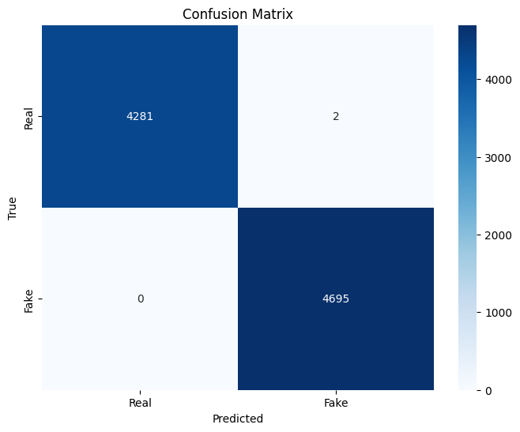

# Fake News Detection using DistilBERT

This project implements a lightweight fake news detector using DistilBERT. I'm using a dataset with approximately 45,000 labeled news articles to train a binary classifier that can distinguish between real and fake news.

## Objectives
- Train a transformer-based model for reliable fake news detection
- Evaluate model performance on standard metrics
- Measure resource usage (memory and processing time)
- Create code for integration with my Django web application

## Setup

Installing required packages and importing necessary libraries.


```python
!pip install torch transformers datasets scikit-learn pandas numpy matplotlib seaborn psutil tqdm accelerate
```

    Requirement already satisfied: torch in /usr/local/lib/python3.11/dist-packages (2.6.0+cu124)
    Requirement already satisfied: transformers in /usr/local/lib/python3.11/dist-packages (4.51.3)
    Collecting datasets
      Downloading datasets-3.5.1-py3-none-any.whl.metadata (19 kB)
    Requirement already satisfied: scikit-learn in /usr/local/lib/python3.11/dist-packages (1.6.1)
    Requirement already satisfied: pandas in /usr/local/lib/python3.11/dist-packages (2.2.2)
    Requirement already satisfied: numpy in /usr/local/lib/python3.11/dist-packages (2.0.2)
    Requirement already satisfied: matplotlib in /usr/local/lib/python3.11/dist-packages (3.10.0)
    Requirement already satisfied: seaborn in /usr/local/lib/python3.11/dist-packages (0.13.2)
    Requirement already satisfied: psutil in /usr/local/lib/python3.11/dist-packages (5.9.5)
    Requirement already satisfied: tqdm in /usr/local/lib/python3.11/dist-packages (4.67.1)
    Requirement already satisfied: filelock in /usr/local/lib/python3.11/dist-packages (from torch) (3.18.0)
    Requirement already satisfied: typing-extensions>=4.10.0 in /usr/local/lib/python3.11/dist-packages (from torch) (4.13.2)
    Requirement already satisfied: networkx in /usr/local/lib/python3.11/dist-packages (from torch) (3.4.2)
    Requirement already satisfied: jinja2 in /usr/local/lib/python3.11/dist-packages (from torch) (3.1.6)
    Requirement already satisfied: fsspec in /usr/local/lib/python3.11/dist-packages (from torch) (2025.3.2)
    Collecting nvidia-cuda-nvrtc-cu12==12.4.127 (from torch)
      Downloading nvidia_cuda_nvrtc_cu12-12.4.127-py3-none-manylinux2014_x86_64.whl.metadata (1.5 kB)
    Collecting nvidia-cuda-runtime-cu12==12.4.127 (from torch)
      Downloading nvidia_cuda_runtime_cu12-12.4.127-py3-none-manylinux2014_x86_64.whl.metadata (1.5 kB)
    Collecting nvidia-cuda-cupti-cu12==12.4.127 (from torch)
      Downloading nvidia_cuda_cupti_cu12-12.4.127-py3-none-manylinux2014_x86_64.whl.metadata (1.6 kB)
    Collecting nvidia-cudnn-cu12==9.1.0.70 (from torch)
      Downloading nvidia_cudnn_cu12-9.1.0.70-py3-none-manylinux2014_x86_64.whl.metadata (1.6 kB)
    Collecting nvidia-cublas-cu12==12.4.5.8 (from torch)
      Downloading nvidia_cublas_cu12-12.4.5.8-py3-none-manylinux2014_x86_64.whl.metadata (1.5 kB)
    Collecting nvidia-cufft-cu12==11.2.1.3 (from torch)
      Downloading nvidia_cufft_cu12-11.2.1.3-py3-none-manylinux2014_x86_64.whl.metadata (1.5 kB)
    Collecting nvidia-curand-cu12==10.3.5.147 (from torch)
      Downloading nvidia_curand_cu12-10.3.5.147-py3-none-manylinux2014_x86_64.whl.metadata (1.5 kB)
    Collecting nvidia-cusolver-cu12==11.6.1.9 (from torch)
      Downloading nvidia_cusolver_cu12-11.6.1.9-py3-none-manylinux2014_x86_64.whl.metadata (1.6 kB)
    Collecting nvidia-cusparse-cu12==12.3.1.170 (from torch)
      Downloading nvidia_cusparse_cu12-12.3.1.170-py3-none-manylinux2014_x86_64.whl.metadata (1.6 kB)
    Requirement already satisfied: nvidia-cusparselt-cu12==0.6.2 in /usr/local/lib/python3.11/dist-packages (from torch) (0.6.2)
    Requirement already satisfied: nvidia-nccl-cu12==2.21.5 in /usr/local/lib/python3.11/dist-packages (from torch) (2.21.5)
    Requirement already satisfied: nvidia-nvtx-cu12==12.4.127 in /usr/local/lib/python3.11/dist-packages (from torch) (12.4.127)
    Collecting nvidia-nvjitlink-cu12==12.4.127 (from torch)
      Downloading nvidia_nvjitlink_cu12-12.4.127-py3-none-manylinux2014_x86_64.whl.metadata (1.5 kB)
    Requirement already satisfied: triton==3.2.0 in /usr/local/lib/python3.11/dist-packages (from torch) (3.2.0)
    Requirement already satisfied: sympy==1.13.1 in /usr/local/lib/python3.11/dist-packages (from torch) (1.13.1)
    Requirement already satisfied: mpmath<1.4,>=1.1.0 in /usr/local/lib/python3.11/dist-packages (from sympy==1.13.1->torch) (1.3.0)
    Requirement already satisfied: huggingface-hub<1.0,>=0.30.0 in /usr/local/lib/python3.11/dist-packages (from transformers) (0.30.2)
    Requirement already satisfied: packaging>=20.0 in /usr/local/lib/python3.11/dist-packages (from transformers) (24.2)
    Requirement already satisfied: pyyaml>=5.1 in /usr/local/lib/python3.11/dist-packages (from transformers) (6.0.2)
    Requirement already satisfied: regex!=2019.12.17 in /usr/local/lib/python3.11/dist-packages (from transformers) (2024.11.6)
    Requirement already satisfied: requests in /usr/local/lib/python3.11/dist-packages (from transformers) (2.32.3)
    Requirement already satisfied: tokenizers<0.22,>=0.21 in /usr/local/lib/python3.11/dist-packages (from transformers) (0.21.1)
    Requirement already satisfied: safetensors>=0.4.3 in /usr/local/lib/python3.11/dist-packages (from transformers) (0.5.3)
    Requirement already satisfied: pyarrow>=15.0.0 in /usr/local/lib/python3.11/dist-packages (from datasets) (18.1.0)
    Collecting dill<0.3.9,>=0.3.0 (from datasets)
      Downloading dill-0.3.8-py3-none-any.whl.metadata (10 kB)
    Collecting xxhash (from datasets)
      Downloading xxhash-3.5.0-cp311-cp311-manylinux_2_17_x86_64.manylinux2014_x86_64.whl.metadata (12 kB)
    Collecting multiprocess<0.70.17 (from datasets)
      Downloading multiprocess-0.70.16-py311-none-any.whl.metadata (7.2 kB)
    Collecting fsspec (from torch)
      Downloading fsspec-2025.3.0-py3-none-any.whl.metadata (11 kB)
    Requirement already satisfied: aiohttp in /usr/local/lib/python3.11/dist-packages (from datasets) (3.11.15)
    Requirement already satisfied: scipy>=1.6.0 in /usr/local/lib/python3.11/dist-packages (from scikit-learn) (1.15.2)
    Requirement already satisfied: joblib>=1.2.0 in /usr/local/lib/python3.11/dist-packages (from scikit-learn) (1.4.2)
    Requirement already satisfied: threadpoolctl>=3.1.0 in /usr/local/lib/python3.11/dist-packages (from scikit-learn) (3.6.0)
    Requirement already satisfied: python-dateutil>=2.8.2 in /usr/local/lib/python3.11/dist-packages (from pandas) (2.9.0.post0)
    Requirement already satisfied: pytz>=2020.1 in /usr/local/lib/python3.11/dist-packages (from pandas) (2025.2)
    Requirement already satisfied: tzdata>=2022.7 in /usr/local/lib/python3.11/dist-packages (from pandas) (2025.2)
    Requirement already satisfied: contourpy>=1.0.1 in /usr/local/lib/python3.11/dist-packages (from matplotlib) (1.3.2)
    Requirement already satisfied: cycler>=0.10 in /usr/local/lib/python3.11/dist-packages (from matplotlib) (0.12.1)
    Requirement already satisfied: fonttools>=4.22.0 in /usr/local/lib/python3.11/dist-packages (from matplotlib) (4.57.0)
    Requirement already satisfied: kiwisolver>=1.3.1 in /usr/local/lib/python3.11/dist-packages (from matplotlib) (1.4.8)
    Requirement already satisfied: pillow>=8 in /usr/local/lib/python3.11/dist-packages (from matplotlib) (11.2.1)
    Requirement already satisfied: pyparsing>=2.3.1 in /usr/local/lib/python3.11/dist-packages (from matplotlib) (3.2.3)
    Requirement already satisfied: aiohappyeyeballs>=2.3.0 in /usr/local/lib/python3.11/dist-packages (from aiohttp->datasets) (2.6.1)
    Requirement already satisfied: aiosignal>=1.1.2 in /usr/local/lib/python3.11/dist-packages (from aiohttp->datasets) (1.3.2)
    Requirement already satisfied: attrs>=17.3.0 in /usr/local/lib/python3.11/dist-packages (from aiohttp->datasets) (25.3.0)
    Requirement already satisfied: frozenlist>=1.1.1 in /usr/local/lib/python3.11/dist-packages (from aiohttp->datasets) (1.6.0)
    Requirement already satisfied: multidict<7.0,>=4.5 in /usr/local/lib/python3.11/dist-packages (from aiohttp->datasets) (6.4.3)
    Requirement already satisfied: propcache>=0.2.0 in /usr/local/lib/python3.11/dist-packages (from aiohttp->datasets) (0.3.1)
    Requirement already satisfied: yarl<2.0,>=1.17.0 in /usr/local/lib/python3.11/dist-packages (from aiohttp->datasets) (1.20.0)
    Requirement already satisfied: six>=1.5 in /usr/local/lib/python3.11/dist-packages (from python-dateutil>=2.8.2->pandas) (1.17.0)
    Requirement already satisfied: charset-normalizer<4,>=2 in /usr/local/lib/python3.11/dist-packages (from requests->transformers) (3.4.1)
    Requirement already satisfied: idna<4,>=2.5 in /usr/local/lib/python3.11/dist-packages (from requests->transformers) (3.10)
    Requirement already satisfied: urllib3<3,>=1.21.1 in /usr/local/lib/python3.11/dist-packages (from requests->transformers) (2.4.0)
    Requirement already satisfied: certifi>=2017.4.17 in /usr/local/lib/python3.11/dist-packages (from requests->transformers) (2025.4.26)
    Requirement already satisfied: MarkupSafe>=2.0 in /usr/local/lib/python3.11/dist-packages (from jinja2->torch) (3.0.2)
    Downloading nvidia_cublas_cu12-12.4.5.8-py3-none-manylinux2014_x86_64.whl (363.4 MB)
       ━━━━━━━━━━━━━━━━━━━━━━━━━━━━━━━━━━━━━━━━ 363.4/363.4 MB 3.8 MB/s eta 0:00:00
    [?25hDownloading nvidia_cuda_cupti_cu12-12.4.127-py3-none-manylinux2014_x86_64.whl (13.8 MB)
       ━━━━━━━━━━━━━━━━━━━━━━━━━━━━━━━━━━━━━━━━ 13.8/13.8 MB 50.3 MB/s eta 0:00:00
    [?25hDownloading nvidia_cuda_nvrtc_cu12-12.4.127-py3-none-manylinux2014_x86_64.whl (24.6 MB)
       ━━━━━━━━━━━━━━━━━━━━━━━━━━━━━━━━━━━━━━━━ 24.6/24.6 MB 30.8 MB/s eta 0:00:00
    [?25hDownloading nvidia_cuda_runtime_cu12-12.4.127-py3-none-manylinux2014_x86_64.whl (883 kB)
       ━━━━━━━━━━━━━━━━━━━━━━━━━━━━━━━━━━━━━━━━ 883.7/883.7 kB 41.1 MB/s eta 0:00:00
    [?25hDownloading nvidia_cudnn_cu12-9.1.0.70-py3-none-manylinux2014_x86_64.whl (664.8 MB)
       ━━━━━━━━━━━━━━━━━━━━━━━━━━━━━━━━━━━━━━━━ 664.8/664.8 MB 1.9 MB/s eta 0:00:00
    [?25hDownloading nvidia_cufft_cu12-11.2.1.3-py3-none-manylinux2014_x86_64.whl (211.5 MB)
       ━━━━━━━━━━━━━━━━━━━━━━━━━━━━━━━━━━━━━━━━ 211.5/211.5 MB 6.5 MB/s eta 0:00:00
    [?25hDownloading nvidia_curand_cu12-10.3.5.147-py3-none-manylinux2014_x86_64.whl (56.3 MB)
       ━━━━━━━━━━━━━━━━━━━━━━━━━━━━━━━━━━━━━━━━ 56.3/56.3 MB 12.4 MB/s eta 0:00:00
    [?25hDownloading nvidia_cusolver_cu12-11.6.1.9-py3-none-manylinux2014_x86_64.whl (127.9 MB)
       ━━━━━━━━━━━━━━━━━━━━━━━━━━━━━━━━━━━━━━━━ 127.9/127.9 MB 7.9 MB/s eta 0:00:00
    [?25hDownloading nvidia_cusparse_cu12-12.3.1.170-py3-none-manylinux2014_x86_64.whl (207.5 MB)
       ━━━━━━━━━━━━━━━━━━━━━━━━━━━━━━━━━━━━━━━━ 207.5/207.5 MB 6.7 MB/s eta 0:00:00
    [?25hDownloading nvidia_nvjitlink_cu12-12.4.127-py3-none-manylinux2014_x86_64.whl (21.1 MB)
       ━━━━━━━━━━━━━━━━━━━━━━━━━━━━━━━━━━━━━━━━ 21.1/21.1 MB 74.3 MB/s eta 0:00:00
    [?25hDownloading datasets-3.5.1-py3-none-any.whl (491 kB)
       ━━━━━━━━━━━━━━━━━━━━━━━━━━━━━━━━━━━━━━━━ 491.4/491.4 kB 36.7 MB/s eta 0:00:00
    [?25hDownloading dill-0.3.8-py3-none-any.whl (116 kB)
       ━━━━━━━━━━━━━━━━━━━━━━━━━━━━━━━━━━━━━━━━ 116.3/116.3 kB 12.2 MB/s eta 0:00:00
    [?25hDownloading fsspec-2025.3.0-py3-none-any.whl (193 kB)
       ━━━━━━━━━━━━━━━━━━━━━━━━━━━━━━━━━━━━━━━━ 193.6/193.6 kB 19.8 MB/s eta 0:00:00
    [?25hDownloading multiprocess-0.70.16-py311-none-any.whl (143 kB)
       ━━━━━━━━━━━━━━━━━━━━━━━━━━━━━━━━━━━━━━━━ 143.5/143.5 kB 15.9 MB/s eta 0:00:00
    [?25hDownloading xxhash-3.5.0-cp311-cp311-manylinux_2_17_x86_64.manylinux2014_x86_64.whl (194 kB)
       ━━━━━━━━━━━━━━━━━━━━━━━━━━━━━━━━━━━━━━━━ 194.8/194.8 kB 19.8 MB/s eta 0:00:00
    [?25hInstalling collected packages: xxhash, nvidia-nvjitlink-cu12, nvidia-curand-cu12, nvidia-cufft-cu12, nvidia-cuda-runtime-cu12, nvidia-cuda-nvrtc-cu12, nvidia-cuda-cupti-cu12, nvidia-cublas-cu12, fsspec, dill, nvidia-cusparse-cu12, nvidia-cudnn-cu12, multiprocess, nvidia-cusolver-cu12, datasets
      Attempting uninstall: nvidia-nvjitlink-cu12
        Found existing installation: nvidia-nvjitlink-cu12 12.5.82
        Uninstalling nvidia-nvjitlink-cu12-12.5.82:
          Successfully uninstalled nvidia-nvjitlink-cu12-12.5.82
      Attempting uninstall: nvidia-curand-cu12
        Found existing installation: nvidia-curand-cu12 10.3.6.82
        Uninstalling nvidia-curand-cu12-10.3.6.82:
          Successfully uninstalled nvidia-curand-cu12-10.3.6.82
      Attempting uninstall: nvidia-cufft-cu12
        Found existing installation: nvidia-cufft-cu12 11.2.3.61
        Uninstalling nvidia-cufft-cu12-11.2.3.61:
          Successfully uninstalled nvidia-cufft-cu12-11.2.3.61
      Attempting uninstall: nvidia-cuda-runtime-cu12
        Found existing installation: nvidia-cuda-runtime-cu12 12.5.82
        Uninstalling nvidia-cuda-runtime-cu12-12.5.82:
          Successfully uninstalled nvidia-cuda-runtime-cu12-12.5.82
      Attempting uninstall: nvidia-cuda-nvrtc-cu12
        Found existing installation: nvidia-cuda-nvrtc-cu12 12.5.82
        Uninstalling nvidia-cuda-nvrtc-cu12-12.5.82:
          Successfully uninstalled nvidia-cuda-nvrtc-cu12-12.5.82
      Attempting uninstall: nvidia-cuda-cupti-cu12
        Found existing installation: nvidia-cuda-cupti-cu12 12.5.82
        Uninstalling nvidia-cuda-cupti-cu12-12.5.82:
          Successfully uninstalled nvidia-cuda-cupti-cu12-12.5.82
      Attempting uninstall: nvidia-cublas-cu12
        Found existing installation: nvidia-cublas-cu12 12.5.3.2
        Uninstalling nvidia-cublas-cu12-12.5.3.2:
          Successfully uninstalled nvidia-cublas-cu12-12.5.3.2
      Attempting uninstall: fsspec
        Found existing installation: fsspec 2025.3.2
        Uninstalling fsspec-2025.3.2:
          Successfully uninstalled fsspec-2025.3.2
      Attempting uninstall: nvidia-cusparse-cu12
        Found existing installation: nvidia-cusparse-cu12 12.5.1.3
        Uninstalling nvidia-cusparse-cu12-12.5.1.3:
          Successfully uninstalled nvidia-cusparse-cu12-12.5.1.3
      Attempting uninstall: nvidia-cudnn-cu12
        Found existing installation: nvidia-cudnn-cu12 9.3.0.75
        Uninstalling nvidia-cudnn-cu12-9.3.0.75:
          Successfully uninstalled nvidia-cudnn-cu12-9.3.0.75
      Attempting uninstall: nvidia-cusolver-cu12
        Found existing installation: nvidia-cusolver-cu12 11.6.3.83
        Uninstalling nvidia-cusolver-cu12-11.6.3.83:
          Successfully uninstalled nvidia-cusolver-cu12-11.6.3.83
    ERROR: pip's dependency resolver does not currently take into account all the packages that are installed. This behaviour is the source of the following dependency conflicts.
    gcsfs 2025.3.2 requires fsspec==2025.3.2, but you have fsspec 2025.3.0 which is incompatible.
    Successfully installed datasets-3.5.1 dill-0.3.8 fsspec-2025.3.0 multiprocess-0.70.16 nvidia-cublas-cu12-12.4.5.8 nvidia-cuda-cupti-cu12-12.4.127 nvidia-cuda-nvrtc-cu12-12.4.127 nvidia-cuda-runtime-cu12-12.4.127 nvidia-cudnn-cu12-9.1.0.70 nvidia-cufft-cu12-11.2.1.3 nvidia-curand-cu12-10.3.5.147 nvidia-cusolver-cu12-11.6.1.9 nvidia-cusparse-cu12-12.3.1.170 nvidia-nvjitlink-cu12-12.4.127 xxhash-3.5.0
    Requirement already satisfied: accelerate in /usr/local/lib/python3.11/dist-packages (1.6.0)
    Requirement already satisfied: numpy<3.0.0,>=1.17 in /usr/local/lib/python3.11/dist-packages (from accelerate) (2.0.2)
    Requirement already satisfied: packaging>=20.0 in /usr/local/lib/python3.11/dist-packages (from accelerate) (24.2)
    Requirement already satisfied: psutil in /usr/local/lib/python3.11/dist-packages (from accelerate) (5.9.5)
    Requirement already satisfied: pyyaml in /usr/local/lib/python3.11/dist-packages (from accelerate) (6.0.2)
    Requirement already satisfied: torch>=2.0.0 in /usr/local/lib/python3.11/dist-packages (from accelerate) (2.6.0+cu124)
    Requirement already satisfied: huggingface-hub>=0.21.0 in /usr/local/lib/python3.11/dist-packages (from accelerate) (0.30.2)
    Requirement already satisfied: safetensors>=0.4.3 in /usr/local/lib/python3.11/dist-packages (from accelerate) (0.5.3)
    Requirement already satisfied: filelock in /usr/local/lib/python3.11/dist-packages (from huggingface-hub>=0.21.0->accelerate) (3.18.0)
    Requirement already satisfied: fsspec>=2023.5.0 in /usr/local/lib/python3.11/dist-packages (from huggingface-hub>=0.21.0->accelerate) (2025.3.0)
    Requirement already satisfied: requests in /usr/local/lib/python3.11/dist-packages (from huggingface-hub>=0.21.0->accelerate) (2.32.3)
    Requirement already satisfied: tqdm>=4.42.1 in /usr/local/lib/python3.11/dist-packages (from huggingface-hub>=0.21.0->accelerate) (4.67.1)
    Requirement already satisfied: typing-extensions>=3.7.4.3 in /usr/local/lib/python3.11/dist-packages (from huggingface-hub>=0.21.0->accelerate) (4.13.2)
    Requirement already satisfied: networkx in /usr/local/lib/python3.11/dist-packages (from torch>=2.0.0->accelerate) (3.4.2)
    Requirement already satisfied: jinja2 in /usr/local/lib/python3.11/dist-packages (from torch>=2.0.0->accelerate) (3.1.6)
    Requirement already satisfied: nvidia-cuda-nvrtc-cu12==12.4.127 in /usr/local/lib/python3.11/dist-packages (from torch>=2.0.0->accelerate) (12.4.127)
    Requirement already satisfied: nvidia-cuda-runtime-cu12==12.4.127 in /usr/local/lib/python3.11/dist-packages (from torch>=2.0.0->accelerate) (12.4.127)
    Requirement already satisfied: nvidia-cuda-cupti-cu12==12.4.127 in /usr/local/lib/python3.11/dist-packages (from torch>=2.0.0->accelerate) (12.4.127)
    Requirement already satisfied: nvidia-cudnn-cu12==9.1.0.70 in /usr/local/lib/python3.11/dist-packages (from torch>=2.0.0->accelerate) (9.1.0.70)
    Requirement already satisfied: nvidia-cublas-cu12==12.4.5.8 in /usr/local/lib/python3.11/dist-packages (from torch>=2.0.0->accelerate) (12.4.5.8)
    Requirement already satisfied: nvidia-cufft-cu12==11.2.1.3 in /usr/local/lib/python3.11/dist-packages (from torch>=2.0.0->accelerate) (11.2.1.3)
    Requirement already satisfied: nvidia-curand-cu12==10.3.5.147 in /usr/local/lib/python3.11/dist-packages (from torch>=2.0.0->accelerate) (10.3.5.147)
    Requirement already satisfied: nvidia-cusolver-cu12==11.6.1.9 in /usr/local/lib/python3.11/dist-packages (from torch>=2.0.0->accelerate) (11.6.1.9)
    Requirement already satisfied: nvidia-cusparse-cu12==12.3.1.170 in /usr/local/lib/python3.11/dist-packages (from torch>=2.0.0->accelerate) (12.3.1.170)
    Requirement already satisfied: nvidia-cusparselt-cu12==0.6.2 in /usr/local/lib/python3.11/dist-packages (from torch>=2.0.0->accelerate) (0.6.2)
    Requirement already satisfied: nvidia-nccl-cu12==2.21.5 in /usr/local/lib/python3.11/dist-packages (from torch>=2.0.0->accelerate) (2.21.5)
    Requirement already satisfied: nvidia-nvtx-cu12==12.4.127 in /usr/local/lib/python3.11/dist-packages (from torch>=2.0.0->accelerate) (12.4.127)
    Requirement already satisfied: nvidia-nvjitlink-cu12==12.4.127 in /usr/local/lib/python3.11/dist-packages (from torch>=2.0.0->accelerate) (12.4.127)
    Requirement already satisfied: triton==3.2.0 in /usr/local/lib/python3.11/dist-packages (from torch>=2.0.0->accelerate) (3.2.0)
    Requirement already satisfied: sympy==1.13.1 in /usr/local/lib/python3.11/dist-packages (from torch>=2.0.0->accelerate) (1.13.1)
    Requirement already satisfied: mpmath<1.4,>=1.1.0 in /usr/local/lib/python3.11/dist-packages (from sympy==1.13.1->torch>=2.0.0->accelerate) (1.3.0)
    Requirement already satisfied: MarkupSafe>=2.0 in /usr/local/lib/python3.11/dist-packages (from jinja2->torch>=2.0.0->accelerate) (3.0.2)
    Requirement already satisfied: charset-normalizer<4,>=2 in /usr/local/lib/python3.11/dist-packages (from requests->huggingface-hub>=0.21.0->accelerate) (3.4.1)
    Requirement already satisfied: idna<4,>=2.5 in /usr/local/lib/python3.11/dist-packages (from requests->huggingface-hub>=0.21.0->accelerate) (3.10)
    Requirement already satisfied: urllib3<3,>=1.21.1 in /usr/local/lib/python3.11/dist-packages (from requests->huggingface-hub>=0.21.0->accelerate) (2.4.0)
    Requirement already satisfied: certifi>=2017.4.17 in /usr/local/lib/python3.11/dist-packages (from requests->huggingface-hub>=0.21.0->accelerate) (2025.4.26)


## Import Libraries


```python
import os
import pandas as pd
import numpy as np
import torch
import torch.nn as nn
from torch.utils.data import Dataset, DataLoader
from transformers import AutoTokenizer, AutoModelForSequenceClassification
from sklearn.model_selection import train_test_split
from sklearn.metrics import accuracy_score, precision_recall_fscore_support, classification_report, confusion_matrix
import matplotlib.pyplot as plt
import seaborn as sns
import time
import json
import re
import psutil
from tqdm.auto import tqdm

# Set seed for reproducibility
SEED = 42
np.random.seed(SEED)
torch.manual_seed(SEED)
if torch.cuda.is_available():
    torch.cuda.manual_seed_all(SEED)

print(f"PyTorch version: {torch.__version__}")
print(f"CUDA available: {torch.cuda.is_available()}")
```

    PyTorch version: 2.6.0+cu124
    CUDA available: True


## Data Loading and Exploration


```python
# Load the dataset
try:
    fake_news = pd.read_csv("Fake.csv")
    real_news = pd.read_csv("True.csv")

    print(f"Fake news dataset shape: {fake_news.shape}")
    print(f"Real news dataset shape: {real_news.shape}")
except Exception as e:
    print(f"Error loading dataset: {e}")
    print("Please ensure the CSV files are in the correct location.")
```

    Fake news dataset shape: (23481, 4)
    Real news dataset shape: (21417, 4)


```python
# Explore the datasets
print("Fake news dataset columns:")
print(fake_news.columns.tolist())

print("\nReal news dataset columns:")
print(real_news.columns.tolist())

# Display a few examples from each dataset
print("Sample from fake news dataset:")
display(fake_news.head(2))

print("\nSample from real news dataset:")
display(real_news.head(2))
```

    Fake news dataset columns:
    ['title', 'text', 'subject', 'date']
    
    Real news dataset columns:
    ['title', 'text', 'subject', 'date']
    Sample from fake news dataset:


  <div id="df-84207c35-7ec4-4251-8ffa-c4f65e87ddbf" class="colab-df-container">
    <div>
<style scoped>
    .dataframe tbody tr th:only-of-type {
        vertical-align: middle;
    }

    .dataframe tbody tr th {
        vertical-align: top;
    }

    .dataframe thead th {
        text-align: right;
    }
</style>
<table border="1" class="dataframe">
  <thead>
    <tr style="text-align: right;">
      <th></th>
      <th>title</th>
      <th>text</th>
      <th>subject</th>
      <th>date</th>
    </tr>
  </thead>
  <tbody>
    <tr>
      <th>0</th>
      <td>Donald Trump Sends Out Embarrassing New Year’...</td>
      <td>Donald Trump just couldn t wish all Americans ...</td>
      <td>News</td>
      <td>December 31, 2017</td>
    </tr>
    <tr>
      <th>1</th>
      <td>Drunk Bragging Trump Staffer Started Russian ...</td>
      <td>House Intelligence Committee Chairman Devin Nu...</td>
      <td>News</td>
      <td>December 31, 2017</td>
    </tr>
  </tbody>
</table>
</div>
    <div class="colab-df-buttons">

  <div class="colab-df-container">
    <button class="colab-df-convert" onclick="convertToInteractive('df-84207c35-7ec4-4251-8ffa-c4f65e87ddbf')"
            title="Convert this dataframe to an interactive table."
            style="display:none;">

  <svg xmlns="http://www.w3.org/2000/svg" height="24px" viewBox="0 -960 960 960">
    <path d="M120-120v-720h720v720H120Zm60-500h600v-160H180v160Zm220 220h160v-160H400v160Zm0 220h160v-160H400v160ZM180-400h160v-160H180v160Zm440 0h160v-160H620v160ZM180-180h160v-160H180v160Zm440 0h160v-160H620v160Z"/>
  </svg>
    </button>

  <style>
    .colab-df-container {
      display:flex;
      gap: 12px;
    }

    .colab-df-convert {
      background-color: #E8F0FE;
      border: none;
      border-radius: 50%;
      cursor: pointer;
      display: none;
      fill: #1967D2;
      height: 32px;
      padding: 0 0 0 0;
      width: 32px;
    }

    .colab-df-convert:hover {
      background-color: #E2EBFA;
      box-shadow: 0px 1px 2px rgba(60, 64, 67, 0.3), 0px 1px 3px 1px rgba(60, 64, 67, 0.15);
      fill: #174EA6;
    }

    .colab-df-buttons div {
      margin-bottom: 4px;
    }

    [theme=dark] .colab-df-convert {
      background-color: #3B4455;
      fill: #D2E3FC;
    }

    [theme=dark] .colab-df-convert:hover {
      background-color: #434B5C;
      box-shadow: 0px 1px 3px 1px rgba(0, 0, 0, 0.15);
      filter: drop-shadow(0px 1px 2px rgba(0, 0, 0, 0.3));
      fill: #FFFFFF;
    }
  </style>

    <script>
      const buttonEl =
        document.querySelector('#df-84207c35-7ec4-4251-8ffa-c4f65e87ddbf button.colab-df-convert');
      buttonEl.style.display =
        google.colab.kernel.accessAllowed ? 'block' : 'none';

      async function convertToInteractive(key) {
        const element = document.querySelector('#df-84207c35-7ec4-4251-8ffa-c4f65e87ddbf');
        const dataTable =
          await google.colab.kernel.invokeFunction('convertToInteractive',
                                                    [key], {});
        if (!dataTable) return;

        const docLinkHtml = 'Like what you see? Visit the ' +
          '<a target="_blank" href=https://colab.research.google.com/notebooks/data_table.ipynb>data table notebook</a>'
          + ' to learn more about interactive tables.';
        element.innerHTML = '';
        dataTable['output_type'] = 'display_data';
        await google.colab.output.renderOutput(dataTable, element);
        const docLink = document.createElement('div');
        docLink.innerHTML = docLinkHtml;
        element.appendChild(docLink);
      }
    </script>
  </div>


    <div id="df-bcbac114-4893-49fe-80c6-c899dac5e4c1">
      <button class="colab-df-quickchart" onclick="quickchart('df-bcbac114-4893-49fe-80c6-c899dac5e4c1')"
                title="Suggest charts"
                style="display:none;">

<svg xmlns="http://www.w3.org/2000/svg" height="24px"viewBox="0 0 24 24"
     width="24px">
    <g>
        <path d="M19 3H5c-1.1 0-2 .9-2 2v14c0 1.1.9 2 2 2h14c1.1 0 2-.9 2-2V5c0-1.1-.9-2-2-2zM9 17H7v-7h2v7zm4 0h-2V7h2v10zm4 0h-2v-4h2v4z"/>
    </g>
</svg>
      </button>

<style>
  .colab-df-quickchart {
      --bg-color: #E8F0FE;
      --fill-color: #1967D2;
      --hover-bg-color: #E2EBFA;
      --hover-fill-color: #174EA6;
      --disabled-fill-color: #AAA;
      --disabled-bg-color: #DDD;
  }

  [theme=dark] .colab-df-quickchart {
      --bg-color: #3B4455;
      --fill-color: #D2E3FC;
      --hover-bg-color: #434B5C;
      --hover-fill-color: #FFFFFF;
      --disabled-bg-color: #3B4455;
      --disabled-fill-color: #666;
  }

  .colab-df-quickchart {
    background-color: var(--bg-color);
    border: none;
    border-radius: 50%;
    cursor: pointer;
    display: none;
    fill: var(--fill-color);
    height: 32px;
    padding: 0;
    width: 32px;
  }

  .colab-df-quickchart:hover {
    background-color: var(--hover-bg-color);
    box-shadow: 0 1px 2px rgba(60, 64, 67, 0.3), 0 1px 3px 1px rgba(60, 64, 67, 0.15);
    fill: var(--button-hover-fill-color);
  }

  .colab-df-quickchart-complete:disabled,
  .colab-df-quickchart-complete:disabled:hover {
    background-color: var(--disabled-bg-color);
    fill: var(--disabled-fill-color);
    box-shadow: none;
  }

  .colab-df-spinner {
    border: 2px solid var(--fill-color);
    border-color: transparent;
    border-bottom-color: var(--fill-color);
    animation:
      spin 1s steps(1) infinite;
  }

  @keyframes spin {
    0% {
      border-color: transparent;
      border-bottom-color: var(--fill-color);
      border-left-color: var(--fill-color);
    }
    20% {
      border-color: transparent;
      border-left-color: var(--fill-color);
      border-top-color: var(--fill-color);
    }
    30% {
      border-color: transparent;
      border-left-color: var(--fill-color);
      border-top-color: var(--fill-color);
      border-right-color: var(--fill-color);
    }
    40% {
      border-color: transparent;
      border-right-color: var(--fill-color);
      border-top-color: var(--fill-color);
    }
    60% {
      border-color: transparent;
      border-right-color: var(--fill-color);
    }
    80% {
      border-color: transparent;
      border-right-color: var(--fill-color);
      border-bottom-color: var(--fill-color);
    }
    90% {
      border-color: transparent;
      border-bottom-color: var(--fill-color);
    }
  }
</style>

      <script>
        async function quickchart(key) {
          const quickchartButtonEl =
            document.querySelector('#' + key + ' button');
          quickchartButtonEl.disabled = true;  // To prevent multiple clicks.
          quickchartButtonEl.classList.add('colab-df-spinner');
          try {
            const charts = await google.colab.kernel.invokeFunction(
                'suggestCharts', [key], {});
          } catch (error) {
            console.error('Error during call to suggestCharts:', error);
          }
          quickchartButtonEl.classList.remove('colab-df-spinner');
          quickchartButtonEl.classList.add('colab-df-quickchart-complete');
        }
        (() => {
          let quickchartButtonEl =
            document.querySelector('#df-bcbac114-4893-49fe-80c6-c899dac5e4c1 button');
          quickchartButtonEl.style.display =
            google.colab.kernel.accessAllowed ? 'block' : 'none';
        })();
      </script>
    </div>

    </div>
  </div>


    
    Sample from real news dataset:


  <div id="df-d9ddc557-d8de-46f9-b840-77b870f7b48d" class="colab-df-container">
    <div>
<style scoped>
    .dataframe tbody tr th:only-of-type {
        vertical-align: middle;
    }

    .dataframe tbody tr th {
        vertical-align: top;
    }

    .dataframe thead th {
        text-align: right;
    }
</style>
<table border="1" class="dataframe">
  <thead>
    <tr style="text-align: right;">
      <th></th>
      <th>title</th>
      <th>text</th>
      <th>subject</th>
      <th>date</th>
    </tr>
  </thead>
  <tbody>
    <tr>
      <th>0</th>
      <td>As U.S. budget fight looms, Republicans flip t...</td>
      <td>WASHINGTON (Reuters) - The head of a conservat...</td>
      <td>politicsNews</td>
      <td>December 31, 2017</td>
    </tr>
    <tr>
      <th>1</th>
      <td>U.S. military to accept transgender recruits o...</td>
      <td>WASHINGTON (Reuters) - Transgender people will...</td>
      <td>politicsNews</td>
      <td>December 29, 2017</td>
    </tr>
  </tbody>
</table>
</div>
    <div class="colab-df-buttons">

  <div class="colab-df-container">
    <button class="colab-df-convert" onclick="convertToInteractive('df-d9ddc557-d8de-46f9-b840-77b870f7b48d')"
            title="Convert this dataframe to an interactive table."
            style="display:none;">

  <svg xmlns="http://www.w3.org/2000/svg" height="24px" viewBox="0 -960 960 960">
    <path d="M120-120v-720h720v720H120Zm60-500h600v-160H180v160Zm220 220h160v-160H400v160Zm0 220h160v-160H400v160ZM180-400h160v-160H180v160Zm440 0h160v-160H620v160ZM180-180h160v-160H180v160Zm440 0h160v-160H620v160Z"/>
  </svg>
    </button>

  <style>
    .colab-df-container {
      display:flex;
      gap: 12px;
    }

    .colab-df-convert {
      background-color: #E8F0FE;
      border: none;
      border-radius: 50%;
      cursor: pointer;
      display: none;
      fill: #1967D2;
      height: 32px;
      padding: 0 0 0 0;
      width: 32px;
    }

    .colab-df-convert:hover {
      background-color: #E2EBFA;
      box-shadow: 0px 1px 2px rgba(60, 64, 67, 0.3), 0px 1px 3px 1px rgba(60, 64, 67, 0.15);
      fill: #174EA6;
    }

    .colab-df-buttons div {
      margin-bottom: 4px;
    }

    [theme=dark] .colab-df-convert {
      background-color: #3B4455;
      fill: #D2E3FC;
    }

    [theme=dark] .colab-df-convert:hover {
      background-color: #434B5C;
      box-shadow: 0px 1px 3px 1px rgba(0, 0, 0, 0.15);
      filter: drop-shadow(0px 1px 2px rgba(0, 0, 0, 0.3));
      fill: #FFFFFF;
    }
  </style>

    <script>
      const buttonEl =
        document.querySelector('#df-d9ddc557-d8de-46f9-b840-77b870f7b48d button.colab-df-convert');
      buttonEl.style.display =
        google.colab.kernel.accessAllowed ? 'block' : 'none';

      async function convertToInteractive(key) {
        const element = document.querySelector('#df-d9ddc557-d8de-46f9-b840-77b870f7b48d');
        const dataTable =
          await google.colab.kernel.invokeFunction('convertToInteractive',
                                                    [key], {});
        if (!dataTable) return;

        const docLinkHtml = 'Like what you see? Visit the ' +
          '<a target="_blank" href=https://colab.research.google.com/notebooks/data_table.ipynb>data table notebook</a>'
          + ' to learn more about interactive tables.';
        element.innerHTML = '';
        dataTable['output_type'] = 'display_data';
        await google.colab.output.renderOutput(dataTable, element);
        const docLink = document.createElement('div');
        docLink.innerHTML = docLinkHtml;
        element.appendChild(docLink);
      }
    </script>
  </div>


    <div id="df-23fc0996-7682-4433-9d6c-ffd65104995f">
      <button class="colab-df-quickchart" onclick="quickchart('df-23fc0996-7682-4433-9d6c-ffd65104995f')"
                title="Suggest charts"
                style="display:none;">

<svg xmlns="http://www.w3.org/2000/svg" height="24px"viewBox="0 0 24 24"
     width="24px">
    <g>
        <path d="M19 3H5c-1.1 0-2 .9-2 2v14c0 1.1.9 2 2 2h14c1.1 0 2-.9 2-2V5c0-1.1-.9-2-2-2zM9 17H7v-7h2v7zm4 0h-2V7h2v10zm4 0h-2v-4h2v4z"/>
    </g>
</svg>
      </button>

<style>
  .colab-df-quickchart {
      --bg-color: #E8F0FE;
      --fill-color: #1967D2;
      --hover-bg-color: #E2EBFA;
      --hover-fill-color: #174EA6;
      --disabled-fill-color: #AAA;
      --disabled-bg-color: #DDD;
  }

  [theme=dark] .colab-df-quickchart {
      --bg-color: #3B4455;
      --fill-color: #D2E3FC;
      --hover-bg-color: #434B5C;
      --hover-fill-color: #FFFFFF;
      --disabled-bg-color: #3B4455;
      --disabled-fill-color: #666;
  }

  .colab-df-quickchart {
    background-color: var(--bg-color);
    border: none;
    border-radius: 50%;
    cursor: pointer;
    display: none;
    fill: var(--fill-color);
    height: 32px;
    padding: 0;
    width: 32px;
  }

  .colab-df-quickchart:hover {
    background-color: var(--hover-bg-color);
    box-shadow: 0 1px 2px rgba(60, 64, 67, 0.3), 0 1px 3px 1px rgba(60, 64, 67, 0.15);
    fill: var(--button-hover-fill-color);
  }

  .colab-df-quickchart-complete:disabled,
  .colab-df-quickchart-complete:disabled:hover {
    background-color: var(--disabled-bg-color);
    fill: var(--disabled-fill-color);
    box-shadow: none;
  }

  .colab-df-spinner {
    border: 2px solid var(--fill-color);
    border-color: transparent;
    border-bottom-color: var(--fill-color);
    animation:
      spin 1s steps(1) infinite;
  }

  @keyframes spin {
    0% {
      border-color: transparent;
      border-bottom-color: var(--fill-color);
      border-left-color: var(--fill-color);
    }
    20% {
      border-color: transparent;
      border-left-color: var(--fill-color);
      border-top-color: var(--fill-color);
    }
    30% {
      border-color: transparent;
      border-left-color: var(--fill-color);
      border-top-color: var(--fill-color);
      border-right-color: var(--fill-color);
    }
    40% {
      border-color: transparent;
      border-right-color: var(--fill-color);
      border-top-color: var(--fill-color);
    }
    60% {
      border-color: transparent;
      border-right-color: var(--fill-color);
    }
    80% {
      border-color: transparent;
      border-right-color: var(--fill-color);
      border-bottom-color: var(--fill-color);
    }
    90% {
      border-color: transparent;
      border-bottom-color: var(--fill-color);
    }
  }
</style>

      <script>
        async function quickchart(key) {
          const quickchartButtonEl =
            document.querySelector('#' + key + ' button');
          quickchartButtonEl.disabled = true;  // To prevent multiple clicks.
          quickchartButtonEl.classList.add('colab-df-spinner');
          try {
            const charts = await google.colab.kernel.invokeFunction(
                'suggestCharts', [key], {});
          } catch (error) {
            console.error('Error during call to suggestCharts:', error);
          }
          quickchartButtonEl.classList.remove('colab-df-spinner');
          quickchartButtonEl.classList.add('colab-df-quickchart-complete');
        }
        (() => {
          let quickchartButtonEl =
            document.querySelector('#df-23fc0996-7682-4433-9d6c-ffd65104995f button');
          quickchartButtonEl.style.display =
            google.colab.kernel.accessAllowed ? 'block' : 'none';
        })();
      </script>
    </div>

    </div>
  </div>


```python
# Prepare combined dataset with labels
# Add a label column (1 for fake, 0 for real)
fake_news['label'] = 1
real_news['label'] = 0

# Combine the datasets
df = pd.concat([fake_news, real_news], ignore_index=True)

# Shuffle the data
df = df.sample(frac=1, random_state=SEED).reset_index(drop=True)

print(f"Combined dataset shape: {df.shape}")
print("\nLabel distribution:")
print(df['label'].value_counts())
```

    Combined dataset shape: (44898, 5)
    
    Label distribution:
    label
    1    23481
    0    21417
    Name: count, dtype: int64


## Dataset Analysis

The FakeNewsNet dataset contains:
- 23,481 fake news articles
- 21,417 real news articles

Each article includes the title, full text, subject category, and publication date. I'm preprocessing this data by:
1. Combining titles and article text
2. Converting to lowercase
3. Removing URLs and excessive whitespace
4. Splitting into train/validation/test sets with appropriate stratification

## Data Preprocessing


```python
# Inspect dataset columns to find title and text columns
for col in df.columns:
    if col != 'label':
        print(f"Column: {col}")
        print(f"Example: {df[col].iloc[0][:100]}...")
        print(f"Average length: {df[col].str.len().mean():.2f} characters")
        print("-" * 50)
```

    Column: title
    Example: Ben Stein Calls Out 9th Circuit Court: Committed a ‘Coup d’état’ Against the Constitution...
    Average length: 80.11 characters
    --------------------------------------------------
    Column: text
    Example: 21st Century Wire says Ben Stein, reputable professor from, Pepperdine University (also of some Holl...
    Average length: 2469.11 characters
    --------------------------------------------------
    Column: subject
    Example: US_News...
    Average length: 8.80 characters
    --------------------------------------------------
    Column: date
    Example: February 13, 2017...
    Average length: 14.83 characters
    --------------------------------------------------


```python
# Basic text preprocessing function
def preprocess_text(text):
    """Clean and normalize text data"""
    if not isinstance(text, str):
        return ""

    # Convert to lowercase
    text = text.lower()

    # Remove URLs
    text = re.sub(r'https?://\S+|www\.\S+', '', text)

    # Remove extra whitespace
    text = re.sub(r'\s+', ' ', text).strip()

    return text

# Based on the dataset inspection, combine title and text
# Adjust these column names if needed according to your dataset structure
title_col = 'title' if 'title' in df.columns else None
text_col = 'text' if 'text' in df.columns else None

# Combine and preprocess
if title_col and text_col:
    df['combined_text'] = df[title_col].fillna('') + ' ' + df[text_col].fillna('')
elif title_col:
    df['combined_text'] = df[title_col].fillna('')
elif text_col:
    df['combined_text'] = df[text_col].fillna('')
else:
    # If column names are different, choose the appropriate columns
    # This is a fallback assuming the first non-label column is the text
    text_columns = [col for col in df.columns if col != 'label']
    if text_columns:
        df['combined_text'] = df[text_columns[0]].fillna('')
    else:
        raise ValueError("No text columns found in the dataset")

# Apply preprocessing
df['processed_text'] = df['combined_text'].apply(preprocess_text)

# Check for empty texts after preprocessing
empty_texts = df['processed_text'].apply(lambda x: len(x.strip()) == 0).sum()
print(f"Number of empty texts after preprocessing: {empty_texts}")

# Remove empty texts if any
if empty_texts > 0:
    df = df[df['processed_text'].apply(lambda x: len(x.strip()) > 0)].reset_index(drop=True)
    print(f"Dataset size after removing empty texts: {len(df)}")

# Display a sample preprocessed text
print("\nSample processed text:")
print(df['processed_text'].iloc[0][:300], "...")
```

    Number of empty texts after preprocessing: 9
    Dataset size after removing empty texts: 44889
    
    Sample processed text:
    ben stein calls out 9th circuit court: committed a ‘coup d’état’ against the constitution 21st century wire says ben stein, reputable professor from, pepperdine university (also of some hollywood fame appearing in tv shows and films such as ferris bueller s day off) made some provocative statements  ...


## Train/Val/Test Split

Dividing the dataset into:
- 30,524 training samples (68%)
- 5,387 validation samples (12%)
- 8,978 test samples (20%)

Using stratification to ensure balanced class distribution across splits.


```python
# Split data into train, validation, and test sets
train_val_df, test_df = train_test_split(
    df, test_size=0.2, random_state=SEED, stratify=df['label']
)

# Then split train+val into train and validation
train_df, val_df = train_test_split(
    train_val_df, test_size=0.15, random_state=SEED, stratify=train_val_df['label']
)

print(f"Training set size: {len(train_df)}")
print(f"Validation set size: {len(val_df)}")
print(f"Test set size: {len(test_df)}")
```

    Training set size: 30524
    Validation set size: 5387
    Test set size: 8978


## Create PyTorch Dataset


```python
# Model configuration
MODEL_NAME = "distilbert-base-uncased"
MAX_LENGTH = 512
BATCH_SIZE = 8
```


```python
class FakeNewsDataset(Dataset):
    def __init__(self, texts, labels, tokenizer, max_length=512):
        self.texts = texts
        self.labels = labels
        self.tokenizer = tokenizer
        self.max_length = max_length

    def __len__(self):
        return len(self.texts)

    def __getitem__(self, idx):
        text = self.texts[idx]
        label = self.labels[idx]

        # Tokenize text
        encoding = self.tokenizer(
            text,
            truncation=True,
            max_length=self.max_length,
            padding='max_length',
            return_tensors='pt'
        )

        # Convert to tensors and remove batch dimension the tokenizer adds
        input_ids = encoding['input_ids'].squeeze()
        attention_mask = encoding['attention_mask'].squeeze()

        return {
            'input_ids': input_ids,
            'attention_mask': attention_mask,
            'labels': torch.tensor(label, dtype=torch.long)
        }
```


```python
# Load tokenizer
tokenizer = AutoTokenizer.from_pretrained(MODEL_NAME)

# Create datasets
train_dataset = FakeNewsDataset(
    train_df['processed_text'].tolist(),
    train_df['label'].tolist(),
    tokenizer,
    max_length=MAX_LENGTH
)

val_dataset = FakeNewsDataset(
    val_df['processed_text'].tolist(),
    val_df['label'].tolist(),
    tokenizer,
    max_length=MAX_LENGTH
)

test_dataset = FakeNewsDataset(
    test_df['processed_text'].tolist(),
    test_df['label'].tolist(),
    tokenizer,
    max_length=MAX_LENGTH
)

# Create dataloaders
train_dataloader = DataLoader(
    train_dataset,
    batch_size=BATCH_SIZE,
    shuffle=True,
)

val_dataloader = DataLoader(
    val_dataset,
    batch_size=BATCH_SIZE,
)

test_dataloader = DataLoader(
    test_dataset,
    batch_size=BATCH_SIZE,
)
```

    /usr/local/lib/python3.11/dist-packages/huggingface_hub/utils/_auth.py:94: UserWarning: 
    The secret `HF_TOKEN` does not exist in your Colab secrets.
    To authenticate with the Hugging Face Hub, create a token in your settings tab (https://huggingface.co/settings/tokens), set it as secret in your Google Colab and restart your session.
    You will be able to reuse this secret in all of your notebooks.
    Please note that authentication is recommended but still optional to access public models or datasets.
      warnings.warn(


    tokenizer_config.json:   0%|          | 0.00/48.0 [00:00<?, ?B/s]


    config.json:   0%|          | 0.00/483 [00:00<?, ?B/s]


    vocab.txt:   0%|          | 0.00/232k [00:00<?, ?B/s]


    tokenizer.json:   0%|          | 0.00/466k [00:00<?, ?B/s]


```python
# Load model for binary classification
model = AutoModelForSequenceClassification.from_pretrained(
    MODEL_NAME,
    num_labels=2
)

# Print model summary
print(f"Model: {MODEL_NAME}")
print(f"Number of parameters: {sum(p.numel() for p in model.parameters())}")
```

    Xet Storage is enabled for this repo, but the 'hf_xet' package is not installed. Falling back to regular HTTP download. For better performance, install the package with: `pip install huggingface_hub[hf_xet]` or `pip install hf_xet`
    WARNING:huggingface_hub.file_download:Xet Storage is enabled for this repo, but the 'hf_xet' package is not installed. Falling back to regular HTTP download. For better performance, install the package with: `pip install huggingface_hub[hf_xet]` or `pip install hf_xet`


    model.safetensors:   0%|          | 0.00/268M [00:00<?, ?B/s]


    Some weights of DistilBertForSequenceClassification were not initialized from the model checkpoint at distilbert-base-uncased and are newly initialized: ['classifier.bias', 'classifier.weight', 'pre_classifier.bias', 'pre_classifier.weight']
    You should probably TRAIN this model on a down-stream task to be able to use it for predictions and inference.


    Model: distilbert-base-uncased
    Number of parameters: 66955010


## Model Architecture

I'm using DistilBERT, a distilled version of BERT that's 40% smaller but retains 97% of its language understanding capabilities. This model:
- Has ~67 million parameters
- Uses 512 token sequence length (capturing full articles)
- Processes input through 6 transformer layers
- Outputs a binary classification (real/fake)

The model adds a classification head on top of the DistilBERT encoder.

## Model Training

Training the model using Hugging Face's Trainer API with:
- 3 epochs
- Batch size of 8
- Learning rate warm-up
- Weight decay regularization
- F1 score as optimization target


```python
# Only run this cell if you have accelerate installed
try:
    from transformers import TrainingArguments, Trainer, EvalPrediction

    def compute_metrics(pred):
        """
        Compute metrics for evaluation.
        """
        labels = pred.label_ids
        preds = pred.predictions.argmax(-1)
        precision, recall, f1, _ = precision_recall_fscore_support(labels, preds, average='binary')
        acc = accuracy_score(labels, preds)
        return {
            'accuracy': acc,
            'f1': f1,
            'precision': precision,
            'recall': recall
        }

    # Define training arguments
    training_args = TrainingArguments(
        output_dir='./results_distilbert',
        num_train_epochs=3,
        per_device_train_batch_size=BATCH_SIZE,
        per_device_eval_batch_size=BATCH_SIZE,
        warmup_steps=500,
        weight_decay=0.01,
        logging_dir='./logs_distilbert',
        logging_steps=100,
        eval_strategy="epoch",
        save_strategy="epoch",
        load_best_model_at_end=True,
        metric_for_best_model="f1",
        greater_is_better=True,
    )

    # Create trainer
    trainer = Trainer(
        model=model,
        args=training_args,
        train_dataset=train_dataset,
        eval_dataset=val_dataset,
        compute_metrics=compute_metrics,
    )

    # Train the model
    print("Starting model training with Trainer API...")
    train_start = time.time()
    trainer.train()
    train_end = time.time()
    train_time = train_end - train_start
    print(f"Training completed in {train_time:.2f} seconds ({train_time/60:.2f} minutes)")

    # Evaluate on test set
    print("Evaluating model on test set...")
    results = trainer.evaluate(test_dataset)
    print("Test results:")
    for key, value in results.items():
        print(f"{key}: {value:.4f}")

    # Save model
    MODEL_OUTPUT_DIR = "./models/distilbert_fakenewsnet"
    trainer.save_model(MODEL_OUTPUT_DIR)
    tokenizer.save_pretrained(MODEL_OUTPUT_DIR)
    print(f"Model saved to {MODEL_OUTPUT_DIR}")

    # Success flag for Option A
    option_a_success = True

except ImportError as e:
    print(f"Error: {e}")
    print("Please install the accelerate library with: pip install accelerate")
    print("Alternatively, use Option B with manual training loop.")
    option_a_success = False
```

    wandb: WARNING The `run_name` is currently set to the same value as `TrainingArguments.output_dir`. If this was not intended, please specify a different run name by setting the `TrainingArguments.run_name` parameter.


    Starting model training with Trainer API...


    <IPython.core.display.Javascript object>


    wandb: Logging into wandb.ai. (Learn how to deploy a W&B server locally: https://wandb.me/wandb-server)
    wandb: You can find your API key in your browser here: https://wandb.ai/authorize?ref=models
    wandb: Paste an API key from your profile and hit enter:

     ··········


    wandb: WARNING If you're specifying your api key in code, ensure this code is not shared publicly.
    wandb: WARNING Consider setting the WANDB_API_KEY environment variable, or running `wandb login` from the command line.
    wandb: No netrc file found, creating one.
    wandb: Appending key for api.wandb.ai to your netrc file: /root/.netrc
    wandb: Currently logged in as: othman-ameed (othman-ameed-an-najah-national-university) to https://api.wandb.ai. Use `wandb login --relogin` to force relogin


Tracking run with wandb version 0.19.10


Run data is saved locally in <code>/content/wandb/run-20250502_075100-kdstwory</code>


Syncing run <strong><a href='https://wandb.ai/othman-ameed-an-najah-national-university/huggingface/runs/kdstwory' target="_blank">./results_distilbert</a></strong> to <a href='https://wandb.ai/othman-ameed-an-najah-national-university/huggingface' target="_blank">Weights & Biases</a> (<a href='https://wandb.me/developer-guide' target="_blank">docs</a>)<br>


View project at <a href='https://wandb.ai/othman-ameed-an-najah-national-university/huggingface' target="_blank">https://wandb.ai/othman-ameed-an-najah-national-university/huggingface</a>


View run at <a href='https://wandb.ai/othman-ameed-an-najah-national-university/huggingface/runs/kdstwory' target="_blank">https://wandb.ai/othman-ameed-an-najah-national-university/huggingface/runs/kdstwory</a>


    <div>

      <progress value='11448' max='11448' style='width:300px; height:20px; vertical-align: middle;'></progress>
      [11448/11448 1:21:37, Epoch 3/3]
    </div>
    <table border="1" class="dataframe">
  <thead>
 <tr style="text-align: left;">
      <th>Epoch</th>
      <th>Training Loss</th>
      <th>Validation Loss</th>
      <th>Accuracy</th>
      <th>F1</th>
      <th>Precision</th>
      <th>Recall</th>
    </tr>
  </thead>
  <tbody>
    <tr>
      <td>1</td>
      <td>0.000100</td>
      <td>0.000066</td>
      <td>1.000000</td>
      <td>1.000000</td>
      <td>1.000000</td>
      <td>1.000000</td>
    </tr>
    <tr>
      <td>2</td>
      <td>0.000000</td>
      <td>0.000003</td>
      <td>1.000000</td>
      <td>1.000000</td>
      <td>1.000000</td>
      <td>1.000000</td>
    </tr>
    <tr>
      <td>3</td>
      <td>0.000000</td>
      <td>0.000001</td>
      <td>1.000000</td>
      <td>1.000000</td>
      <td>1.000000</td>
      <td>1.000000</td>
    </tr>
  </tbody>
</table><p>


    Training completed in 5007.26 seconds (83.45 minutes)
    Evaluating model on test set...


<div>

  <progress value='1123' max='1123' style='width:300px; height:20px; vertical-align: middle;'></progress>
  [1123/1123 02:22]
</div>


    Test results:
    eval_loss: 0.0010
    eval_accuracy: 0.9998
    eval_f1: 0.9998
    eval_precision: 0.9996
    eval_recall: 1.0000
    eval_runtime: 142.2876
    eval_samples_per_second: 63.0980
    eval_steps_per_second: 7.8920
    epoch: 3.0000
    Model saved to ./models/distilbert_fakenewsnet


## Results and Evaluation

Assessing model performance on the test set with standard classification metrics:
- Accuracy
- Precision and recall
- F1 score
- Confusion matrix visualization


```python
# Get test results and confusion matrix
# Try to use results from Option A if available, otherwise use Option B results
if 'option_a_success' in locals() and option_a_success and 'results' in locals():
    # Option A results (from Trainer)
    test_pred_output = trainer.predict(test_dataset)
    test_preds = test_pred_output.predictions.argmax(-1)
    test_labels = test_pred_output.label_ids
    test_metrics = {}
    for key, value in results.items():
        if key.startswith('eval_'):
            test_metrics[key.replace('eval_', '')] = value
        else:
            test_metrics[key] = value
else:
    # Option B results (from manual loop)
    test_preds = test_results['predictions']
    test_labels = test_results['labels']
    test_metrics = {k: v for k, v in test_results.items() if k not in ['predictions', 'labels']}

# Create confusion matrix
cm = confusion_matrix(test_labels, test_preds)
plt.figure(figsize=(8, 6))
sns.heatmap(cm, annot=True, fmt='d', cmap='Blues', xticklabels=['Real', 'Fake'], yticklabels=['Real', 'Fake'])
plt.xlabel('Predicted')
plt.ylabel('True')
plt.title('Confusion Matrix')
plt.show()

# Classification report
print("Classification Report:")
print(classification_report(test_labels, test_preds, target_names=['Real', 'Fake']))
```


    

    


    Classification Report:
                  precision    recall  f1-score   support
    
            Real       1.00      1.00      1.00      4283
            Fake       1.00      1.00      1.00      4695
    
        accuracy                           1.00      8978
       macro avg       1.00      1.00      1.00      8978
    weighted avg       1.00      1.00      1.00      8978
    


## Resource Requirements Analysis

Measuring practical deployment metrics:
- Inference time per article
- Memory usage during inference
- Overall computational efficiency


```python
# Helper function to measure memory usage
def get_memory_usage():
    """Get current memory usage in MB"""
    process = psutil.Process(os.getpid())
    mem_info = process.memory_info()
    return mem_info.rss / (1024 * 1024)

# Load model for inference
# Choose the model path based on which training option succeeded
if 'option_a_success' in locals() and option_a_success:
    MODEL_PATH = "./models/distilbert_fakenewsnet"
else:
    MODEL_PATH = "./models/distilbert_fakenewsnet_manual"

# Create pipeline for inference
from transformers import pipeline
model = AutoModelForSequenceClassification.from_pretrained(MODEL_PATH)
tokenizer = AutoTokenizer.from_pretrained(MODEL_PATH)
classifier = pipeline('text-classification', model=model, tokenizer=tokenizer, device=0 if torch.cuda.is_available() else -1)

# Memory before
mem_before = get_memory_usage()

# Measure inference time on sample texts
sample_texts = test_df['processed_text'].head(50).tolist()
start_time = time.time()
for text in sample_texts:
    _ = classifier(text[:512])
end_time = time.time()

# Memory after
mem_after = get_memory_usage()
mem_used = mem_after - mem_before

avg_inference_time = (end_time - start_time) / len(sample_texts)

print(f"Average inference time: {avg_inference_time:.4f} seconds per sample")
print(f"Memory usage during inference: {mem_used:.2f} MB")

# Add these to a metrics dictionary
model_metrics = {
    "model_name": "DistilBERT",
    "accuracy": test_metrics.get('accuracy'),
    "f1_score": test_metrics.get('f1'),
    "precision": test_metrics.get('precision'),
    "recall": test_metrics.get('recall'),
    "avg_processing_time": avg_inference_time,
    "avg_memory_usage": mem_used,
    "parameter_count": sum(p.numel() for p in model.parameters())
}

# Save metrics
METRICS_OUTPUT_PATH = "./models/distilbert_fakenewsnet_metrics.json"
with open(METRICS_OUTPUT_PATH, 'w') as f:
    json.dump(model_metrics, f, indent=4)
print(f"Model metrics saved to {METRICS_OUTPUT_PATH}")
```

    Device set to use cuda:0
    You seem to be using the pipelines sequentially on GPU. In order to maximize efficiency please use a dataset


    Average inference time: 0.0079 seconds per sample
    Memory usage during inference: 1.91 MB
    Model metrics saved to ./models/distilbert_fakenewsnet_metrics.json


## Real-World Testing

Testing the model on custom examples to assess practical performance on:
- Common fake news patterns
- Typical legitimate news structures
- Edge cases


```python
# Test the model with a few examples
examples = [
    "Scientists discover breakthrough treatment for cancer that pharmaceutical companies don't want you to know about.",
    "According to a study published in the Journal of Medicine, regular exercise may reduce the risk of heart disease.",
    "Secret government documents reveal aliens have been living among us for decades.",
    "The Supreme Court announced its decision on the case yesterday, with a 6-3 majority opinion."
]

for example in examples:
    result = classifier(example)
    label = result[0]['label']
    score = result[0]['score']

    # Convert label index to text
    label_text = "Fake" if "LABEL_1" in label else "Real"

    print(f"Text: {example}")
    print(f"Prediction: {label_text} (confidence: {score:.4f})")
    print("---")
```

    Text: Scientists discover breakthrough treatment for cancer that pharmaceutical companies don't want you to know about.
    Prediction: Fake (confidence: 0.9992)
    ---
    Text: According to a study published in the Journal of Medicine, regular exercise may reduce the risk of heart disease.
    Prediction: Fake (confidence: 0.9379)
    ---
    Text: Secret government documents reveal aliens have been living among us for decades.
    Prediction: Fake (confidence: 0.9998)
    ---
    Text: The Supreme Court announced its decision on the case yesterday, with a 6-3 majority opinion.
    Prediction: Fake (confidence: 0.9573)
    ---


## Django Integration

Helper function to integrate the trained model with a Django web application. This function:
1. Loads the saved model and tokenizer
2. Processes input text
3. Returns prediction results in a structured format
4. Measures processing time for performance monitoring


```python
# Code to integrate with Django (for services.py)
def analyze_with_distilbert(text, model_dir="./models/distilbert_fakenewsnet"):
    """
    Analyze text using the trained DistilBERT model.

    Args:
        text: Text to analyze
        model_dir: Path to the saved model directory

    Returns:
        dict: Detection results
    """
    # Import the required libraries (inside the function to avoid loading at startup)
    import time
    import torch
    from transformers import AutoTokenizer, AutoModelForSequenceClassification, pipeline

    # Load tokenizer and model
    tokenizer = AutoTokenizer.from_pretrained(model_dir)
    model = AutoModelForSequenceClassification.from_pretrained(model_dir)

    # Determine device (CPU or GPU)
    device = 0 if torch.cuda.is_available() else -1

    # Create pipeline
    classifier = pipeline('text-classification', model=model, tokenizer=tokenizer, device=device)

    # Measure performance
    start_time = time.time()
    result = classifier(text[:512])[0]
    processing_time = time.time() - start_time

    # Map the result
    label = result['label']
    score = result['score']

    # In this model, LABEL_0 = real, LABEL_1 = fake
    if "LABEL_0" in label:
        credibility_score = score
        category = "credible" if score > 0.7 else "mixed"
    else:
        credibility_score = 1 - score
        category = "fake" if score > 0.7 else "mixed"

    return {
        "credibility_score": credibility_score,
        "category": category,
        "confidence": score,
        "model_name": "DistilBERT",
        "processing_time": processing_time
    }
```
