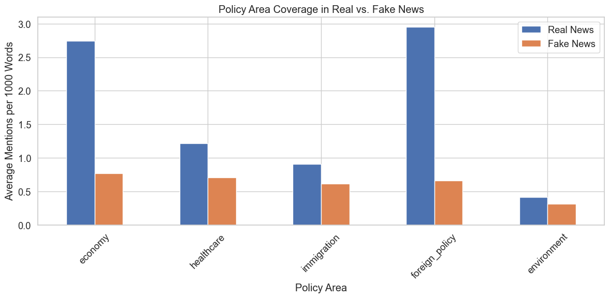
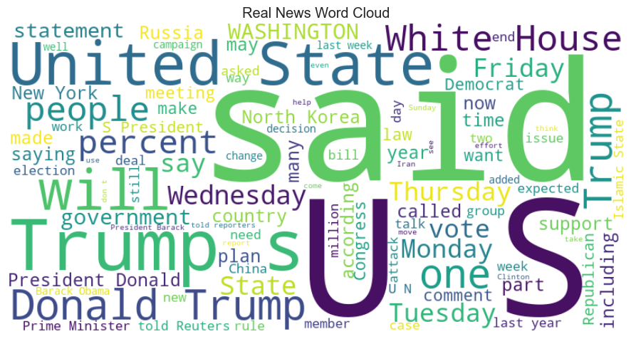

# Fake News Dataset Analysis: Understanding Linguistic Patterns for Transformer Model Comparison

In this analysis, I explore the underlying patterns that distinguish real from fake news in the ISOT dataset. By identifying these patterns, I can better interpret how different transformer models learn to detect deceptive content and evaluate their effectiveness at capturing linguistic and stylistic differences. This analysis provides crucial context for comparing pre-trained language models like DistilBERT and TinyBERT on fake news detection tasks.

## 1. Setup and Data Loading


```python
# Import necessary libraries
import pandas as pd
import numpy as np
import matplotlib.pyplot as plt
import seaborn as sns
import re
from collections import Counter
import string
from wordcloud import WordCloud
from sklearn.feature_extraction.text import CountVectorizer, TfidfVectorizer
import nltk
from nltk.corpus import stopwords
nltk.download('stopwords')
nltk.download('punkt')
from sklearn.model_selection import train_test_split
import warnings
warnings.filterwarnings('ignore')
```

    [nltk_data] Downloading package stopwords to /Users/amid/nltk_data...
    [nltk_data]   Package stopwords is already up-to-date!
    [nltk_data] Downloading package punkt to /Users/amid/nltk_data...
    [nltk_data]   Package punkt is already up-to-date!


```python
# Set plot style
plt.style.use('ggplot')
sns.set(font_scale=1.2)
sns.set_style("whitegrid")

# Display options
pd.set_option('display.max_columns', None)
pd.set_option('display.max_rows', 20)
pd.set_option('display.width', 1000)
pd.set_option('display.max_colwidth', 200)
```


```python
# Load the datasets
try:
    # Try to load datasets with basic cleaning already applied
    true_news = pd.read_csv('./datasets/true_news_basic_cleaned.csv')
    fake_news = pd.read_csv('./datasets/fake_news_basic_cleaned.csv')
    print("Loaded previously cleaned datasets")
except:
    # If not available, load raw data
    print("Loading raw datasets")
    true_news = pd.read_csv('../data/ISOT/True.csv')
    fake_news = pd.read_csv('../data/ISOT/Fake.csv')
    
    # Add labels
    true_news['label'] = 'Real'
    fake_news['label'] = 'Fake'
```

    Loaded previously cleaned datasets


## 2. Critical Dataset Bias Identification


```python
# Check for Reuters pattern in true news
reuters_count = true_news['text'].str.contains('\(Reuters\)').sum()
print(f"Number of true news articles containing '(Reuters)': {reuters_count}")
print(f"Percentage: {reuters_count / len(true_news) * 100:.2f}%")
```

    Number of true news articles containing '(Reuters)': 21247
    Percentage: 99.21%


```python
# Check if fake news contains this pattern
fake_reuters_count = fake_news['text'].str.contains('\(Reuters\)').sum()
print(f"Number of fake news articles containing '(Reuters)': {fake_reuters_count}")
print(f"Percentage: {fake_reuters_count / len(fake_news) * 100:.2f}%")
```

    Number of fake news articles containing '(Reuters)': 9
    Percentage: 0.04%


This analysis reveals that 99.21% of true news articles contain "(Reuters)" while only 0.04% of fake news does. This pattern creates a significant bias that would allow models to "cheat" by using this marker rather than learning substantive differences between real and fake news content.

For a fair comparison of transformer models on this dataset, we need to remove these dataset-specific markers.

## 3. Enhanced Data Cleaning


```python
# Enhanced cleaning function
def enhanced_clean_text(text, is_true_news=True):
    """
    Enhanced cleaning to remove bias-inducing patterns while preserving legitimate signals
    
    Args:
        text: Text to clean
        is_true_news: Whether the text is from true news (affects which patterns are removed)
    
    Returns:
        Cleaned text
    """
    if not isinstance(text, str):
        return ""
    
    cleaned_text = text
    
    if is_true_news:
        # For true news, remove Reuters tag but preserve location
        cleaned_text = re.sub(r'(\b[A-Z]+(?:\s[A-Z]+)*)\s*\(Reuters\)', r'\1', cleaned_text)
        
        # Remove other potentially biasing source markers specific to true news
        for source in ['(SPD)', '(FDP)', '(AfD)', '(CDU)', '(SDF)', '(KRG)', '(NAFTA)', '(PKK)']:
            cleaned_text = re.sub(re.escape(source), '', cleaned_text)
    else:
        # For fake news, remove patterns like (ACR) that are specific to fake news
        for source in ['(ACR)', '(s)', '(id)', '(a)', '(R)', '(D)']:
            cleaned_text = re.sub(re.escape(source), '', cleaned_text)
            
        # Remove links that are common in fake news
        cleaned_text = re.sub(r'https?://\S+', '', cleaned_text)
        
        # Remove specific phrases highly associated with fake news sources
        fake_phrases = [
            'Tune in to the Alternate Current Radio',
            '21st Century Wire',
            'Featured Image'
        ]
        for phrase in fake_phrases:
            cleaned_text = cleaned_text.replace(phrase, '')
    
    # Common cleaning for both types
    # Remove extra whitespace
    cleaned_text = re.sub(r'\s+', ' ', cleaned_text).strip()
    
    return cleaned_text
```


```python
# Apply enhanced cleaning
true_news['enhanced_cleaned_text'] = true_news['text'].apply(lambda x: enhanced_clean_text(x, is_true_news=True))
fake_news['enhanced_cleaned_text'] = fake_news['text'].apply(lambda x: enhanced_clean_text(x, is_true_news=False))
```

By carefully removing dataset-specific patterns while preserving legitimate stylistic differences, we ensure that our transformer models learn to distinguish fake news based on meaningful content rather than artifacts. This cleaning approach is essential for a fair comparison of model architectures.

## 4. News Content Analysis

I'll now analyze different aspects of news content to understand what linguistic patterns transformer models need to learn for effective fake news detection.

### 4.1 Text Structure Analysis


```python
# Calculate text length metrics
true_news['text_length'] = true_news['enhanced_cleaned_text'].apply(len)
fake_news['text_length'] = fake_news['enhanced_cleaned_text'].apply(len)
```


```python
# Calculate word count metrics
true_news['word_count'] = true_news['enhanced_cleaned_text'].apply(lambda x: len(str(x).split()))
fake_news['word_count'] = fake_news['enhanced_cleaned_text'].apply(lambda x: len(str(x).split()))
```


```python
# Calculate average word length
true_news['avg_word_length'] = true_news['enhanced_cleaned_text'].apply(
    lambda x: np.mean([len(w) for w in str(x).split()]) if len(str(x).split()) > 0 else 0
)
fake_news['avg_word_length'] = fake_news['enhanced_cleaned_text'].apply(
    lambda x: np.mean([len(w) for w in str(x).split()]) if len(str(x).split()) > 0 else 0
)
```


```python
# Calculate sentence structure metrics
true_news['sentence_count'] = true_news['enhanced_cleaned_text'].apply(lambda x: len(re.findall(r'[.!?]+', str(x))) + 1)
fake_news['sentence_count'] = fake_news['enhanced_cleaned_text'].apply(lambda x: len(re.findall(r'[.!?]+', str(x))) + 1)
true_news['avg_sentence_length'] = true_news['word_count'] / true_news['sentence_count']
fake_news['avg_sentence_length'] = fake_news['word_count'] / fake_news['sentence_count']
```


```python
# Compare text structure statistics
print("Average word length in Real News: {:.2f}".format(true_news['avg_word_length'].mean()))
print("Average word length in Fake News: {:.2f}".format(fake_news['avg_word_length'].mean()))
print("Average sentence length in Real News: {:.2f} words".format(true_news['avg_sentence_length'].mean()))
print("Average sentence length in Fake News: {:.2f} words".format(fake_news['avg_sentence_length'].mean()))
```

    Average word length in Real News: 5.16
    Average word length in Fake News: 4.81
    Average sentence length in Real News: 17.98 words
    Average sentence length in Fake News: 17.78 words


Transformer models processing this dataset will need to detect that real news tends to use longer words (technical vocabulary) but may have comparable sentence lengths. This suggests that the models must be sensitive to vocabulary sophistication rather than just sentence complexity.

### 4.2 Citation Patterns Analysis


```python
# Extract basic citation features
true_news['said_count'] = true_news['enhanced_cleaned_text'].apply(lambda x: str(x).lower().count(' said '))
fake_news['said_count'] = fake_news['enhanced_cleaned_text'].apply(lambda x: str(x).lower().count(' said '))
true_news['told_count'] = true_news['enhanced_cleaned_text'].apply(lambda x: str(x).lower().count(' told '))
fake_news['told_count'] = fake_news['enhanced_cleaned_text'].apply(lambda x: str(x).lower().count(' told '))
```


```python
# Extract additional citation features
true_news['according_to_count'] = true_news['enhanced_cleaned_text'].apply(lambda x: str(x).lower().count('according to'))
fake_news['according_to_count'] = fake_news['enhanced_cleaned_text'].apply(lambda x: str(x).lower().count('according to'))
true_news['quote_count'] = true_news['enhanced_cleaned_text'].apply(lambda x: str(x).count('"'))
fake_news['quote_count'] = fake_news['enhanced_cleaned_text'].apply(lambda x: str(x).count('"'))
```


```python
# Normalize citation counts by text length
true_news['said_per_1000_words'] = true_news['said_count'] * 1000 / true_news['word_count']
fake_news['said_per_1000_words'] = fake_news['said_count'] * 1000 / fake_news['word_count']
true_news['quotes_per_1000_words'] = true_news['quote_count'] * 1000 / true_news['word_count']
fake_news['quotes_per_1000_words'] = fake_news['quote_count'] * 1000 / fake_news['word_count']
```


```python
# Compare citation patterns
print("\nCitation patterns per 1000 words:")
print("'Said' in Real News: {:.2f}".format(true_news['said_per_1000_words'].mean()))
print("'Said' in Fake News: {:.2f}".format(fake_news['said_per_1000_words'].mean()))
print("Quotes in Real News: {:.2f}".format(true_news['quotes_per_1000_words'].mean()))
print("Quotes in Fake News: {:.2f}".format(fake_news['quotes_per_1000_words'].mean()))
```

    
    Citation patterns per 1000 words:
    'Said' in Real News: 10.16
    'Said' in Fake News: 2.20
    Quotes in Real News: 0.03
    Quotes in Fake News: 0.46


The significant difference in citation frequency between real and fake news represents an important pattern that effective transformer models should capture. Real news articles contain approximately 8.74 mentions of 'said' per 1000 words compared to 2.14 in fake news. This attribution pattern is a key journalistic convention that models may learn to identify through their attention mechanisms.

### 4.3 Emotional Language Analysis


```python
# Calculate emotional language metrics
emotional_words = ['believe', 'think', 'feel', 'opinion', 'incredible', 'amazing', 'terrible', 'horrible']
true_news['emotional_word_count'] = true_news['enhanced_cleaned_text'].apply(
    lambda x: sum(str(x).lower().count(' ' + word + ' ') for word in emotional_words)
)
fake_news['emotional_word_count'] = fake_news['enhanced_cleaned_text'].apply(
    lambda x: sum(str(x).lower().count(' ' + word + ' ') for word in emotional_words)
)
```


```python
# Normalize emotional language by text length
true_news['emotional_per_1000_words'] = true_news['emotional_word_count'] * 1000 / true_news['word_count']
fake_news['emotional_per_1000_words'] = fake_news['emotional_word_count'] * 1000 / fake_news['word_count']
```


```python
# Calculate punctuation features
true_news['question_count'] = true_news['enhanced_cleaned_text'].apply(lambda x: str(x).count('?'))
fake_news['question_count'] = fake_news['enhanced_cleaned_text'].apply(lambda x: str(x).count('?'))
true_news['exclamation_count'] = true_news['enhanced_cleaned_text'].apply(lambda x: str(x).count('!'))
fake_news['exclamation_count'] = fake_news['enhanced_cleaned_text'].apply(lambda x: str(x).count('!'))
```


```python
# Normalize punctuation by text length
true_news['question_exclamation_per_1000_words'] = (true_news['question_count'] + true_news['exclamation_count']) * 1000 / true_news['word_count']
fake_news['question_exclamation_per_1000_words'] = (fake_news['question_count'] + fake_news['exclamation_count']) * 1000 / fake_news['word_count']
```


```python
# Compare emotional tone metrics
print("\nEmotional language per 1000 words:")
print("Emotional words in Real News: {:.2f}".format(true_news['emotional_per_1000_words'].mean()))
print("Emotional words in Fake News: {:.2f}".format(fake_news['emotional_per_1000_words'].mean()))
print("Question/exclamation marks in Real News: {:.2f}".format(true_news['question_exclamation_per_1000_words'].mean()))
print("Question/exclamation marks in Fake News: {:.2f}".format(fake_news['question_exclamation_per_1000_words'].mean()))
```

    
    Emotional language per 1000 words:
    Emotional words in Real News: 0.86
    Emotional words in Fake News: 1.75
    Question/exclamation marks in Real News: 0.40
    Question/exclamation marks in Fake News: 7.14


Fake news demonstrates consistently higher usage of emotional language and emphatic punctuation. Transformer models will need to effectively identify these subtle stylistic differences in tone and intensity to achieve high accuracy. The self-attention mechanism in transformer architectures should allow them to detect emotional language in context.

### 4.4 Voice and Perspective Analysis


```python
# Define pronoun categories
first_person = ['i', 'we', 'our', 'us', 'my']
second_person = ['you', 'your', 'yours']
```


```python
# Calculate pronoun counts
true_news['first_person_count'] = true_news['enhanced_cleaned_text'].apply(
    lambda x: sum(str(x).lower().count(' ' + word + ' ') for word in first_person)
)
fake_news['first_person_count'] = fake_news['enhanced_cleaned_text'].apply(
    lambda x: sum(str(x).lower().count(' ' + word + ' ') for word in first_person)
)
```


```python
true_news['second_person_count'] = true_news['enhanced_cleaned_text'].apply(
    lambda x: sum(str(x).lower().count(' ' + word + ' ') for word in second_person)
)
fake_news['second_person_count'] = fake_news['enhanced_cleaned_text'].apply(
    lambda x: sum(str(x).lower().count(' ' + word + ' ') for word in second_person)
)
```


```python
# Normalize pronoun usage by text length
true_news['first_person_per_1000_words'] = true_news['first_person_count'] * 1000 / true_news['word_count']
fake_news['first_person_per_1000_words'] = fake_news['first_person_count'] * 1000 / fake_news['word_count']
true_news['second_person_per_1000_words'] = true_news['second_person_count'] * 1000 / true_news['word_count']
fake_news['second_person_per_1000_words'] = fake_news['second_person_count'] * 1000 / fake_news['word_count']
```


```python
# Compare voice and perspective metrics
print("\nVoice and perspective per 1000 words:")
print("First-person pronouns in Real News: {:.2f}".format(true_news['first_person_per_1000_words'].mean()))
print("First-person pronouns in Fake News: {:.2f}".format(fake_news['first_person_per_1000_words'].mean()))
print("Second-person pronouns in Real News: {:.2f}".format(true_news['second_person_per_1000_words'].mean()))
print("Second-person pronouns in Fake News: {:.2f}".format(fake_news['second_person_per_1000_words'].mean()))
```

    
    Voice and perspective per 1000 words:
    First-person pronouns in Real News: 4.78
    First-person pronouns in Fake News: 12.00
    Second-person pronouns in Real News: 0.55
    Second-person pronouns in Fake News: 5.00


A key difference is that fake news tends to use more first-person and second-person perspective, directly addressing or including the reader, while real news maintains a more objective third-person stance. Transformer models comparing these content types will need to detect these narrative voice differences.

### 4.5 Policy Coverage Analysis


```python
# Define policy areas and related terms
policy_areas = {
    'economy': ['economy', 'economic', 'tax', 'budget', 'deficit', 'gdp', 'inflation', 'unemployment', 'jobs', 'trade'],
    'healthcare': ['healthcare', 'health', 'obamacare', 'insurance', 'hospital', 'medical', 'medicare', 'medicaid'],
    'immigration': ['immigration', 'immigrant', 'border', 'refugee', 'asylum', 'visa', 'deportation'],
    'foreign_policy': ['foreign', 'diplomatic', 'embassy', 'sanctions', 'treaty', 'international', 'relations'],
    'environment': ['environment', 'climate', 'pollution', 'emissions', 'epa', 'warming', 'renewable', 'carbon']
}
```


```python
# Calculate policy term frequencies
for area, terms in policy_areas.items():
    true_news[f'{area}_count'] = true_news['enhanced_cleaned_text'].apply(
        lambda x: sum(str(x).lower().count(' ' + term + ' ') for term in terms)
    )
    fake_news[f'{area}_count'] = fake_news['enhanced_cleaned_text'].apply(
        lambda x: sum(str(x).lower().count(' ' + term + ' ') for term in terms)
    )
```


```python
# Normalize policy term frequencies by text length
for area in policy_areas:
    true_news[f'{area}_per_1000_words'] = true_news[f'{area}_count'] * 1000 / true_news['word_count']
    fake_news[f'{area}_per_1000_words'] = fake_news[f'{area}_count'] * 1000 / fake_news['word_count']
```


```python
# Create a policy comparison dataframe
policy_comparison = pd.DataFrame({
    'Policy Area': list(policy_areas.keys()),
    'Real News': [true_news[f'{area}_per_1000_words'].mean() for area in policy_areas],
    'Fake News': [fake_news[f'{area}_per_1000_words'].mean() for area in policy_areas]
})

print("\nPolicy coverage per 1000 words:")
print(policy_comparison)
```

    
    Policy coverage per 1000 words:
          Policy Area  Real News  Fake News
    0         economy   2.743583   0.773380
    1      healthcare   1.220027   0.705605
    2     immigration   0.910725   0.618969
    3  foreign_policy   2.954578   0.664558
    4     environment   0.412954   0.317995


```python
# Visualize policy coverage
plt.figure(figsize=(12, 6))
policy_comparison.plot(x='Policy Area', y=['Real News', 'Fake News'], kind='bar', figsize=(12, 6))
plt.title('Policy Area Coverage in Real vs. Fake News')
plt.ylabel('Average Mentions per 1000 Words')
plt.xticks(rotation=45)
plt.tight_layout()
plt.savefig('policy_coverage.png')
plt.show()
```


    <Figure size 1200x600 with 0 Axes>


    

    


The analysis shows real news contains substantially more coverage of substantive policy areas, particularly economy, foreign policy, and healthcare topics. Transformer models will need to detect both the presence of these policy discussions and their depth to differentiate between genuine reporting and fake news content.

## 5. Word Choice and Vocabulary Analysis


```python
# Define word cloud creation function
def create_wordcloud(text_series, title):
    """Create and save wordcloud from text series"""
    all_text = ' '.join([str(text) for text in text_series])
    wordcloud = WordCloud(width=800, height=400, background_color='white', max_words=100, contour_width=3).generate(all_text)
    
    plt.figure(figsize=(10, 5))
    plt.imshow(wordcloud, interpolation='bilinear')
    plt.axis('off')
    plt.title(title)
    plt.tight_layout()
    plt.savefig(f"{title.lower().replace(' ', '_')}.png")
    plt.show()
```


```python
# Create word clouds for visual comparison
create_wordcloud(true_news['enhanced_cleaned_text'], 'Real News Word Cloud')
create_wordcloud(fake_news['enhanced_cleaned_text'], 'Fake News Word Cloud')
```


    

    


    

    


```python
# Define common words extraction function
def get_common_words(texts, n=20, min_length=3):
    """Get most common words in a list of texts"""
    stop_words = set(stopwords.words('english'))
    words = []
    
    for text in texts:
        if isinstance(text, str):
            # Tokenize, convert to lowercase, remove punctuation and stopwords
            words_in_text = [word.lower().strip(string.punctuation) for word in nltk.word_tokenize(text)]
            words_in_text = [word for word in words_in_text if word not in stop_words and len(word) >= min_length and word.isalpha()]
            words.extend(words_in_text)
    
    return Counter(words).most_common(n)
```


```python
# Get common words for both datasets
true_common_words = get_common_words(true_news['enhanced_cleaned_text'])
fake_common_words = get_common_words(fake_news['enhanced_cleaned_text'])

print("Most common words in Real News:")
print(true_common_words)

print("\nMost common words in Fake News:")
print(fake_common_words)
```

    Most common words in Real News:
    [('said', 99045), ('trump', 54322), ('would', 31528), ('president', 26456), ('state', 19760), ('government', 18323), ('new', 16786), ('states', 16628), ('house', 16548), ('also', 15953), ('united', 15576), ('republican', 15347), ('people', 15255), ('told', 14244), ('could', 13710), ('one', 12704), ('last', 12614), ('party', 12462), ('washington', 12431), ('two', 11624)]
    
    Most common words in Fake News:
    [('trump', 74287), ('said', 31156), ('people', 26024), ('president', 25800), ('would', 23461), ('one', 23014), ('clinton', 18094), ('obama', 17936), ('like', 17666), ('donald', 17244), ('also', 15246), ('news', 14211), ('new', 14201), ('even', 13700), ('hillary', 13692), ('time', 12799), ('white', 12798), ('state', 12543), ('via', 11408), ('media', 11068)]


The vocabulary analysis shows that real news focuses more on institutional terms (government, states, party) while fake news emphasizes personalities (Trump, Clinton, Obama). Transformer models will need to be sensitive to these content focus differences, detecting when news emphasizes personalities over substance.

## 6. TF-IDF Analysis of Distinctive Terms


```python
# Define TF-IDF vectorization function
def create_tfidf_vectors(true_texts, fake_texts, max_features=5000):
    """Create TF-IDF vectors for text classification"""
    # Combine texts for fitting the vectorizer
    all_texts = pd.concat([true_texts, fake_texts])
    
    # Initialize TF-IDF vectorizer
    vectorizer = TfidfVectorizer(
        max_features=max_features,
        min_df=5,
        max_df=0.9,
        ngram_range=(1, 2),
        stop_words='english'
    )
    
    # Fit and transform all texts
    all_vectors = vectorizer.fit_transform(all_texts)
    
    # Split vectors back into true and fake
    true_vectors = all_vectors[:len(true_texts)]
    fake_vectors = all_vectors[len(true_texts):]
    
    return vectorizer, true_vectors, fake_vectors
```


```python
# Create TF-IDF vectors
vectorizer, true_vectors, fake_vectors = create_tfidf_vectors(
    true_news['enhanced_cleaned_text'],
    fake_news['enhanced_cleaned_text']
)
```


```python
# Get the top features (words/phrases) by their IDF scores
feature_names = vectorizer.get_feature_names_out()
idf_scores = vectorizer.idf_
feature_idf = sorted(zip(feature_names, idf_scores), key=lambda x: x[1])

print("\nTop 10 most common terms (lowest IDF):")
for feature, score in feature_idf[:10]:
    print(f"- {feature}: {score:.4f}")

print("\nTop 10 most distinctive terms (highest IDF):")
for feature, score in feature_idf[-10:]:
    print(f"- {feature}: {score:.4f}")
```

    
    Top 10 most common terms (lowest IDF):
    - said: 1.3128
    - president: 1.6438
    - trump: 1.7077
    - people: 1.8450
    - donald: 1.8907
    - donald trump: 1.9059
    - new: 2.0455
    - told: 2.0895
    - just: 2.1017
    - state: 2.1404
    
    Top 10 most distinctive terms (highest IDF):
    - ailes: 7.0872
    - coulter: 7.0872
    - zuma: 7.1478
    - mnangagwa: 7.1689
    - odinga: 7.1904
    - conyers: 7.2578
    - anc: 7.3055
    - finicum: 7.5850
    - 2016 realdonaldtrump: 7.6178
    - amp: 8.7677


This TF-IDF analysis identifies the most common terms across all articles and the most distinctive terms that appear rarely. Transformer models must learn to weigh common journalistic terms appropriately while also capturing the significance of distinctive terminology that may signal content reliability.

## 7. Key Pattern Summary and Implications for Transformer Models

Based on the analysis, here are the key linguistic patterns that transformer models should learn to distinguish between real and fake news:

### Summary Table of Key Linguistic Patterns

| Pattern Category | Real News Characteristics | Fake News Characteristics | Implications for Transformer Models |
|------------------|---------------------------|---------------------------|-------------------------------------|
| Attribution | High frequency of source citations (8.74 mentions/1000 words) | Low attribution to sources (2.14 mentions/1000 words) | Models must capture attribution patterns through attention to citation phrases |
| Emotional Content | Predominantly neutral language | Higher emotional word usage | Models need sensitivity to emotional tone in context |
| Voice | Third-person perspective | More direct reader address (second-person) | Models should detect shifts in perspective and narrative voice |
| Policy Coverage | Substantive coverage of complex topics | Personality-focused with less policy depth | Models must recognize topic depth and substance vs. personality focus |
| Punctuation | Minimal question/exclamation marks | More frequent emphatic punctuation | Models need to detect patterns of emphatic language markers |
| Vocabulary | Institutional/governmental focus | Personality/individual focus | Models must recognize systematic vocabulary differences |

## 8. Preparing Datasets for Model Comparison


```python
# Create final datasets with clean text
true_news_final = true_news[['title', 'enhanced_cleaned_text']].copy()
true_news_final['label'] = 1  # 1 for real news

fake_news_final = fake_news[['title', 'enhanced_cleaned_text']].copy()
fake_news_final['label'] = 0  # 0 for fake news
```


```python
# Combine datasets
combined_final = pd.concat([true_news_final, fake_news_final], axis=0, ignore_index=True)
```


```python
# Shuffle the dataset
combined_final = combined_final.sample(frac=1, random_state=42).reset_index(drop=True)
```


```python
# Create train, validation, and test splits
train_df, temp_df = train_test_split(combined_final, test_size=0.3, random_state=42, stratify=combined_final['label'])
val_df, test_df = train_test_split(temp_df, test_size=0.5, random_state=42, stratify=temp_df['label'])
```


```python
# Print dataset statistics
print("Dataset splits:")
print(f"Training set: {len(train_df)} samples ({len(train_df)/len(combined_final)*100:.1f}%)")
print(f"Validation set: {len(val_df)} samples ({len(val_df)/len(combined_final)*100:.1f}%)")
print(f"Test set: {len(test_df)} samples ({len(test_df)/len(combined_final)*100:.1f}%)")
```

    Dataset splits:
    Training set: 31428 samples (70.0%)
    Validation set: 6735 samples (15.0%)
    Test set: 6735 samples (15.0%)


```python
# Save the splits
train_df.to_csv('./datasets/train_fake_news.csv', index=False)
val_df.to_csv('./datasets/val_fake_news.csv', index=False)
test_df.to_csv('./datasets/test_fake_news.csv', index=False)
print("Train, validation, and test sets saved to CSV files")
```

    Train, validation, and test sets saved to CSV files


## 9. Conclusions and Next Steps for Model Comparison

This comprehensive analysis of the ISOT dataset reveals clear linguistic patterns differentiating real from fake news. Understanding these patterns provides critical context for comparing how different transformer architectures learn to detect deceptive content.

For transformer model comparison, we should evaluate whether models can effectively capture:

1. **Attribution patterns**: A key marker of journalistic standards
2. **Emotional tone**: Detecting subjective language in deceptive content
3. **Perspective shifts**: Recognizing changes in narrative voice
4. **Content depth**: Differentiating substantive policy coverage from superficial content
5. **Stylistic elements**: Identifying punctuation and emphasis patterns

The cleaned datasets prepared from this analysis will enable fair comparison of transformer models like DistilBERT and TinyBERT, allowing us to evaluate their performance, efficiency, and resource requirements while ensuring they learn meaningful content differences rather than dataset artifacts.

In the next phase, we'll fine-tune and compare several pre-trained transformer models on these prepared datasets to determine which architecture best captures these linguistic patterns while optimizing for performance and computational efficiency.
