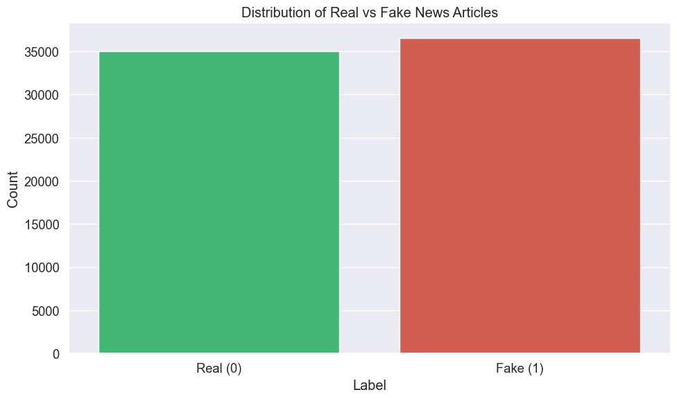

# Exploratory Data Analysis of WELFake Dataset

This notebook explores the WELFake dataset to understand its basic characteristics and identify patterns that distinguish real from fake news articles.

## 1. Introduction

The WELFake dataset is a comprehensive collection that combines real and fake news articles from various sources. It was created by merging four different datasets: PolitiFact, GossipCop, Reuters, and BuzzFeed.

This exploratory data analysis will help us understand:
- The distribution and balance of real vs. fake news
- Key linguistic differences between real and fake articles
- Visual and structural patterns that might distinguish fake news
- Potential features that could be useful for classification models

Understanding these patterns is essential before building any machine learning models for fake news detection.

## 2. Setting Up and Loading the Dataset

First, we'll import all necessary libraries for our analysis. We need pandas and numpy for data manipulation, matplotlib and seaborn for visualization, and NLTK for text processing. We'll also suppress warnings to keep our notebook clean.


```python
# Import necessary libraries for data analysis and visualization
import pandas as pd
import numpy as np
import matplotlib.pyplot as plt
import seaborn as sns
from collections import Counter
import nltk
from nltk.corpus import stopwords
import warnings
warnings.filterwarnings('ignore')

# Configure visualization settings
plt.style.use('ggplot')
sns.set(font_scale=1.2)
```


```python
# Load the WELFake dataset
df = pd.read_csv('WELFake_Dataset.csv')
```

## 3. Initial Data Exploration

Let's take a first look at the data:


```python
# Display the first few rows
df.head()
```


<div>
<style scoped>
    .dataframe tbody tr th:only-of-type {
        vertical-align: middle;
    }

    .dataframe tbody tr th {
        vertical-align: top;
    }

    .dataframe thead th {
        text-align: right;
    }
</style>
<table border="1" class="dataframe">
  <thead>
    <tr style="text-align: right;">
      <th></th>
      <th>Unnamed: 0</th>
      <th>title</th>
      <th>text</th>
      <th>label</th>
    </tr>
  </thead>
  <tbody>
    <tr>
      <th>0</th>
      <td>0</td>
      <td>LAW ENFORCEMENT ON HIGH ALERT Following Threat...</td>
      <td>No comment is expected from Barack Obama Membe...</td>
      <td>1</td>
    </tr>
    <tr>
      <th>1</th>
      <td>1</td>
      <td>NaN</td>
      <td>Did they post their votes for Hillary already?</td>
      <td>1</td>
    </tr>
    <tr>
      <th>2</th>
      <td>2</td>
      <td>UNBELIEVABLE! OBAMA’S ATTORNEY GENERAL SAYS MO...</td>
      <td>Now, most of the demonstrators gathered last ...</td>
      <td>1</td>
    </tr>
    <tr>
      <th>3</th>
      <td>3</td>
      <td>Bobby Jindal, raised Hindu, uses story of Chri...</td>
      <td>A dozen politically active pastors came here f...</td>
      <td>0</td>
    </tr>
    <tr>
      <th>4</th>
      <td>4</td>
      <td>SATAN 2: Russia unvelis an image of its terrif...</td>
      <td>The RS-28 Sarmat missile, dubbed Satan 2, will...</td>
      <td>1</td>
    </tr>
  </tbody>
</table>
</div>


```python
# Check the shape of the dataset
print(f"Dataset dimensions: {df.shape[0]} rows and {df.shape[1]} columns")
```

    Dataset dimensions: 72134 rows and 4 columns


```python
# Get basic information about the dataset
df.info()
```

    <class 'pandas.core.frame.DataFrame'>
    RangeIndex: 72134 entries, 0 to 72133
    Data columns (total 4 columns):
     #   Column      Non-Null Count  Dtype 
    ---  ------      --------------  ----- 
     0   Unnamed: 0  72134 non-null  int64 
     1   title       71576 non-null  object
     2   text        72095 non-null  object
     3   label       72134 non-null  int64 
    dtypes: int64(2), object(2)
    memory usage: 2.2+ MB


### Understanding the Dataset Structure

Looking at the first few rows, we can see that the dataset contains four columns:
- `Unnamed: 0`: An index column (not useful for our analysis)
- `title`: The headline of the news article
- `text`: The body content of the article
- `label`: Binary classification where 0 = Real news and 1 = Fake news

The dataset is substantial with 72,134 rows, giving us plenty of examples to analyze patterns.

## 4. Handling Missing Values

Before proceeding with analysis, we need to check for and handle missing values, which could affect our results or cause errors in processing.


```python
# Check for missing values
print("Missing values per column:")
print(df.isnull().sum())
```

    Missing values per column:
    Unnamed: 0      0
    title         558
    text           39
    label           0
    dtype: int64


### Cleaning the Data

We found 558 missing titles and 39 missing text entries. For our analysis, we need complete records with both title and text, so we'll remove these incomplete entries. The removal of 597 rows (less than 1% of our data) won't significantly impact our analysis but will ensure data quality.


```python
# Drop rows with missing values
df_clean = df.dropna()
print(f"Original dataset size: {df.shape[0]} rows")
print(f"Cleaned dataset size: {df_clean.shape[0]} rows")
print(f"Removed {df.shape[0] - df_clean.shape[0]} rows with missing values")
```

    Original dataset size: 72134 rows
    Cleaned dataset size: 71537 rows
    Removed 597 rows with missing values


## 5. Label Distribution

A well-balanced dataset is crucial for training unbiased models. Let's check the distribution of real and fake news articles to ensure we have sufficient examples of each class.


```python
# Count the number of real and fake news articles
label_counts = df_clean['label'].value_counts().reset_index()
label_counts.columns = ['Label', 'Count']
label_counts['Percentage'] = (label_counts['Count'] / label_counts['Count'].sum() * 100).round(2)
label_counts['Label'] = label_counts['Label'].map({0: 'Real', 1: 'Fake'})

print(label_counts)
```

      Label  Count  Percentage
    0  Fake  36509       51.04
    1  Real  35028       48.96


```python
# Visualize the distribution
plt.figure(figsize=(10, 6))
sns.countplot(x='label', data=df_clean, palette=['#2ecc71', '#e74c3c'])
plt.title('Distribution of Real vs Fake News Articles')
plt.xlabel('Label')
plt.ylabel('Count')
plt.xticks([0, 1], ['Real (0)', 'Fake (1)'])
plt.tight_layout()
plt.show()
```


    

    


### Dataset Balance Analysis

The dataset is well-balanced with 48.96% real news (35,028 articles) and 51.04% fake news (36,509 articles). This near-equal distribution is ideal for machine learning, as it reduces the risk of class bias during model training.

## 6. Text Length Analysis

Text length can be a distinguishing feature between real and fake news. Professional news sources might follow certain length standards, while fake news could be either unusually short (for clickbait) or unnecessarily long. We'll analyze title length, text length, and word count.


```python
# Add columns for text length
df_clean['title_length'] = df_clean['title'].apply(len)
df_clean['text_length'] = df_clean['text'].apply(len)
df_clean['word_count'] = df_clean['text'].apply(lambda x: len(x.split()))
```


```python
# Get summary statistics for text length by label
length_stats = df_clean.groupby('label')[['title_length', 'text_length', 'word_count']].agg(['mean', 'median'])
print("Text length statistics by label (0=Real, 1=Fake):")
print(length_stats)
```

    Text length statistics by label (0=Real, 1=Fake):
          title_length        text_length          word_count       
                  mean median        mean  median        mean median
    label                                                           
    0        68.790596   67.0  3495.31669  2642.5  577.615536  427.0
    1        85.131584   83.0  3098.34586  2235.0  512.850886  373.0


```python
# Visualize title and text length distribution
plt.figure(figsize=(14, 6))

plt.subplot(1, 2, 1)
sns.boxplot(data=df_clean, x='label', y='title_length', palette=['#2ecc71', '#e74c3c'])
plt.title('Title Length by Label')
plt.xlabel('Label')
plt.ylabel('Title Length (characters)')
plt.xticks([0, 1], ['Real (0)', 'Fake (1)'])

plt.subplot(1, 2, 2)
sns.boxplot(data=df_clean, x='label', y='text_length', palette=['#2ecc71', '#e74c3c'])
plt.title('Text Length by Label')
plt.xlabel('Label')
plt.ylabel('Text Length (characters)')
plt.xticks([0, 1], ['Real (0)', 'Fake (1)'])
plt.ylim(0, 10000)  # Limit y-axis for better visualization

plt.tight_layout()
plt.show()
```


    

    


### Length Comparison Insights

The statistics reveal interesting patterns:

1. **Title Length**: Fake news titles tend to be longer (mean: 85.13 characters) compared to real news (mean: 68.79 characters). This suggests fake news articles might use longer, more sensationalist headlines to attract attention.

2. **Text Length**: Interestingly, real news articles are generally longer (mean: 3,495 characters) than fake news (mean: 3,098 characters). This might indicate that legitimate news sources provide more comprehensive coverage.

3. **Word Count**: Similarly, real news contains more words on average (578 words) compared to fake news (513 words).

These length differences could serve as useful features in a classification model.

## 7. Common Words Analysis

The vocabulary used in news articles can provide significant clues about their authenticity. We'll analyze the most frequent words in both real and fake news after removing common stop words (like "the", "a", "and") that don't carry much meaning.


```python
# Download NLTK resources
nltk.download('stopwords')
nltk.download('punkt')

# Initialize stopwords
stop_words = set(stopwords.words('english'))
```

    [nltk_data] Downloading package stopwords to /Users/amid/nltk_data...
    [nltk_data]   Package stopwords is already up-to-date!
    [nltk_data] Downloading package punkt to /Users/amid/nltk_data...
    [nltk_data]   Package punkt is already up-to-date!


### Word Frequency Analysis Setup

We'll use NLTK to remove stop words and create a function to identify the most common words in our corpus. This will help us understand vocabulary differences between real and fake news.


```python
# Function to get most common words
def get_common_words(texts, n=20):
    """Extract most common words from a list of texts after removing stopwords"""
    # Join all texts
    text = ' '.join(texts)
    
    # Convert to lowercase and split
    words = text.lower().split()
    
    # Remove stopwords, punctuation, and short words
    words = [word for word in words if word.isalpha() and word not in stop_words and len(word) > 3]
    
    # Count word frequency
    return Counter(words).most_common(n)
```


```python
# Get most common words for real and fake news
real_common_words = get_common_words(df_clean[df_clean['label'] == 0]['text'])
fake_common_words = get_common_words(df_clean[df_clean['label'] == 1]['text'])

# Create DataFrames for visualization
real_words_df = pd.DataFrame(real_common_words, columns=['Word', 'Count'])
fake_words_df = pd.DataFrame(fake_common_words, columns=['Word', 'Count'])

# Display the common words
print("Most common words in real news:")
print(real_words_df)

print("\nMost common words in fake news:")
print(fake_words_df)
```

    Most common words in real news:
              Word   Count
    0         said  122295
    1        trump   70066
    2        would   61810
    3    president   41059
    4         also   36081
    5       people   33430
    6        could   29354
    7        state   28248
    8       united   27533
    9         last   26083
    10  republican   24121
    11        told   23799
    12  government   23783
    13       house   23781
    14        like   23010
    15      states   22001
    16       first   21268
    17        many   20644
    18      former   19434
    19       white   18607
    
    Most common words in fake news:
             Word  Count
    0       trump  83774
    1       would  42381
    2      people  39655
    3     clinton  33822
    4        said  31617
    5   president  30092
    6        like  29199
    7        also  27233
    8     hillary  26729
    9        even  24964
    10     donald  23717
    11      obama  23110
    12      could  19793
    13       many  19447
    14      state  19283
    15   american  18067
    16       time  17890
    17      white  17852
    18       news  17794
    19      first  16629


```python
# Visualize most common words
plt.figure(figsize=(16, 8))

plt.subplot(1, 2, 1)
sns.barplot(data=real_words_df.head(10), x='Count', y='Word', color='#2ecc71')
plt.title('Top 10 Words in Real News')
plt.xlabel('Frequency')

plt.subplot(1, 2, 2)
sns.barplot(data=fake_words_df.head(10), x='Count', y='Word', color='#e74c3c')
plt.title('Top 10 Words in Fake News')
plt.xlabel('Frequency')

plt.tight_layout()
plt.show()
```


    

    


### Vocabulary Pattern Insights

The most common words analysis reveals distinct patterns:

1. **Attribution Words**: "Said" appears much more frequently in real news (122,295 times) compared to fake news (31,617 times). This suggests real news more often attributes information to sources.

2. **Political References**: Both categories mention "Trump" frequently, but fake news has more references to specific political figures like "Clinton", "Hillary", and "Obama".

3. **Institutional Focus**: Real news uses more institutional terms like "government", "states", and "united", suggesting more focus on official entities.

4. **Emotional Language**: Fake news includes words like "even" more frequently, which can be used for emphasis or to express surprise.

The difference in language usage provides valuable insights into how fake news differs from legitimate reporting.

## 8. Title Analysis

Headlines are crucial in news articles—they create the first impression and determine if readers will engage with the content. Sensationalist titles are often associated with clickbait and fake news. Let's examine specific characteristics of titles that might distinguish fake from real news.


```python
# Check for all caps titles
df_clean['title_has_allcaps'] = df_clean['title'].apply(lambda x: any(word.isupper() and len(word) > 2 for word in x.split()))

# Check for excessive punctuation
df_clean['title_exclamation'] = df_clean['title'].apply(lambda x: '!' in x)
df_clean['title_question'] = df_clean['title'].apply(lambda x: '?' in x)
```


```python
# Calculate percentages for title characteristics by label
title_chars = df_clean.groupby('label')[['title_has_allcaps', 'title_exclamation', 'title_question']].mean() * 100
print("Title characteristics by label (percentage):")
print(title_chars)
```

    Title characteristics by label (percentage):
           title_has_allcaps  title_exclamation  title_question
    label                                                      
    0              23.538312           0.199840        2.446614
    1              63.198116          10.846641        7.318743


```python
# Visualize title characteristics
plt.figure(figsize=(12, 6))
title_chars.plot(kind='bar', colormap='RdYlGn_r')
plt.title('Title Characteristics by Label')
plt.xlabel('Label (0=Real, 1=Fake)')
plt.ylabel('Percentage')
plt.xticks([0, 1], ['Real', 'Fake'])
plt.legend(title='Feature')
plt.tight_layout()
plt.show()
```


    <Figure size 1200x600 with 0 Axes>


    

    


### Title Characteristics Findings

The title analysis reveals striking differences:

1. **All-Caps Words**: 63.2% of fake news titles contain words in ALL CAPS, compared to only 23.5% of real news titles. ALL CAPS is often used to create drama or urgency.

2. **Exclamation Marks**: 10.8% of fake news titles contain exclamation marks, versus just 0.2% of real news titles—a 54x difference! Exclamation marks often add unnecessary emphasis or emotional appeal.

3. **Question Marks**: 7.3% of fake news titles contain question marks, compared to 2.4% of real news titles. Questions can create curiosity or imply uncertainty.

These dramatic differences in title styling could be powerful indicators of potentially fake content.

## 9. Correlation Analysis

To understand how different features relate to each other and to the fake/real classification, we'll analyze correlations between features. Strong correlations can help identify the most useful predictors for our models.


```python
# Select features for correlation analysis
corr_features = ['label', 'title_length', 'text_length', 'word_count', 
                 'title_has_allcaps', 'title_exclamation', 'title_question']

# Calculate correlation matrix
correlation = df_clean[corr_features].corr()

# Visualize correlation matrix
plt.figure(figsize=(10, 8))
sns.heatmap(correlation, annot=True, cmap='coolwarm', fmt=".2f")
plt.title('Correlation Matrix')
plt.tight_layout()
plt.show()
```


    

    


### Correlation Insights

The correlation matrix reveals important relationships:

1. **Title Characteristics**: The strongest correlation with fake news (label=1) is the presence of all-caps words in titles (r=0.40), followed by title length (r=0.33) and exclamation marks (r=0.23).

2. **Text Length**: Interestingly, text length and word count show a slight negative correlation with fake news (r=-0.05), confirming our earlier observation that real news tends to be slightly longer.

3. **Feature Independence**: Many features show low correlation with each other, which is good for machine learning as it means they provide different types of information.

These correlations suggest that title characteristics, particularly the use of all-caps words, could be powerful predictors in a fake news detection model.

## 10. Saving Processed Data

Now that we've completed our analysis and feature engineering, we'll save the cleaned and enhanced dataset for future modeling work.


```python
# Save the cleaned dataset
df_clean.to_csv('WELFake_cleaned.csv', index=False)
print("Cleaned dataset saved to 'WELFake_cleaned.csv'")
```

    Cleaned dataset saved to 'WELFake_cleaned.csv'


The cleaned dataset now includes our engineered features (title length, text length, word count, and title characteristics), which will be valuable for building classification models.

## 11. Key Findings

Based on our exploratory data analysis of the WELFake dataset, here are the key findings:

### Key Findings

1. **Dataset Characteristics**
   - Well-balanced dataset: 48.96% real news vs. 51.04% fake news
   - Few missing values (less than 1% of records)

2. **Content Length Patterns**
   - Fake news titles are typically longer (85 vs. 69 characters on average)
   - Real news articles tend to have longer body text (3,495 vs. 3,098 characters on average)

3. **Linguistic Differences**
   - Real news uses more attribution words ("said" appears 4x more often)
   - Fake news references specific political figures more frequently
   - Real news focuses more on institutions and official entities

4. **Title Characteristics**
   - Fake news titles use ALL CAPS words nearly 3x more often (63% vs. 24%)
   - Fake news titles use exclamation marks 54x more often (10.8% vs. 0.2%)
   - Fake news titles use question marks 3x more often (7.3% vs. 2.4%)

The WELFake dataset provides rich opportunities for developing effective fake news detection models, with clear distinguishing features between real and fake news articles.
