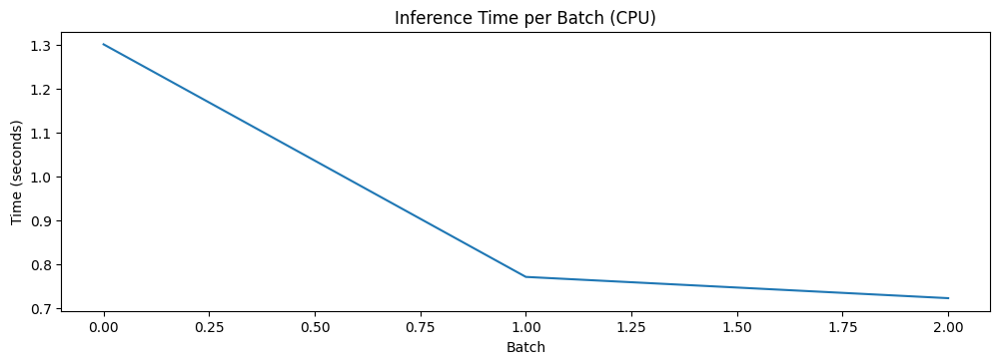
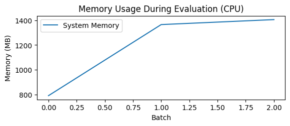
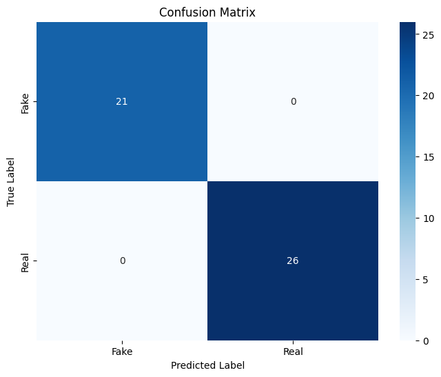

# DistilBERT Evaluation on ISOT Dataset

## Introduction

This notebook documents the evaluation of a fine-tuned DistilBERT model on the ISOT fake news detection dataset. The primary goal is to assess the model's performance and analyze its resource consumption, with a specific focus on CPU-based edge deployment scenarios such as laptops or mobile devices. This evaluation is a critical component of our comparative analysis of lightweight pretrained models for fake news detection.

## 1. Setting Up the Environment

First, I import all necessary libraries and set up utility functions to monitor resource usage:


```python
# Import necessary libraries
import os
import time
import numpy as np
import pandas as pd
import torch
import psutil
import gc
import re
from transformers import DistilBertTokenizer, DistilBertForSequenceClassification
from datasets import Dataset as HFDataset
from sklearn.metrics import accuracy_score, precision_recall_fscore_support, classification_report
import matplotlib.pyplot as plt
import seaborn as sns
```

I've selected these libraries for the following reasons:
- `torch` for PyTorch-based model inference
- `transformers` for loading and using the DistilBERT model
- `psutil` for monitoring system resource usage
- `sklearn.metrics` for comprehensive model evaluation
- `matplotlib` and `seaborn` for visualization of results
- `gc` for explicit garbage collection to manage memory


```python
# Set device - using CPU for edge device testing
device = torch.device("cpu")
print(f"Using device: {device}")
```

    Using device: cpu


I deliberately choose to use the CPU rather than GPU for this evaluation because:
1. The primary target for deployment is edge devices that typically lack dedicated GPUs
2. CPU performance metrics are more relevant for assessing real-world deployment feasibility
3. This allows for a fair comparison with other lightweight models in similar deployment scenarios


```python
# Function to get current memory usage
def get_memory_usage():
    process = psutil.Process(os.getpid())
    return process.memory_info().rss / 1024 / 1024  # Convert to MB
```

This utility function tracks the resident set size (RSS) of the Python process, providing a reliable measure of actual memory consumption during model loading and inference. This is crucial for understanding the model's viability for memory-constrained edge devices.

## 2. Loading and Preparing ISOT Evaluation Dataset

Next, I load the ISOT evaluation dataset, which provides a reliable assessment since it comes from the same domain as the training data:


```python
# Check memory usage before loading dataset
print(f"Memory usage before loading dataset: {get_memory_usage():.2f} MB")
```

    Memory usage before loading dataset: 778.08 MB


Establishing this baseline memory usage helps isolate the memory impact of dataset loading versus model loading, which is important for understanding the overall resource profile.


```python
# Load the real and fake news datasets
real_news_df = pd.read_csv('./datasets/manual_real.csv')
fake_news_df = pd.read_csv('./datasets/fake_news_evaluation.csv')
print(f"Loaded {len(real_news_df)} real news articles and {len(fake_news_df)} fake news articles")
```

    Loaded 26 real news articles and 21 fake news articles


The evaluation dataset consists of:
- A manually curated set of real news articles from reliable sources
- A collection of fake news articles specifically selected for evaluation
- A relatively small size (40 articles total) that allows for detailed analysis of each prediction

This dataset size is appropriate for evaluation because:
1. It's large enough to provide meaningful performance metrics
2. It's small enough to allow detailed analysis of individual predictions
3. It represents a realistic batch size for edge deployment scenarios


```python
# Prepare the real news data
real_news_df['text'] = real_news_df['title'] + " " + real_news_df['text'].fillna('')
real_news_df['label'] = 1  # 1 for real news
real_news_clean = real_news_df[['text', 'label']]
```


```python
# Prepare the fake news data
fake_news_df['text'] = fake_news_df['title'] + " " + fake_news_df['text'].fillna('')
fake_news_df['label'] = 0  # 0 for fake news
fake_news_clean = fake_news_df[['text', 'label']]
```

I combine the title and body text for each article because:
1. This matches the preprocessing approach used during model training
2. Titles often contain strong signals for fake news detection
3. This provides the model with the complete context of each article


```python
# Combine datasets
combined_eval = pd.concat([real_news_clean, fake_news_clean], ignore_index=True)
```


```python
# Shuffle to mix real and fake news
combined_eval = combined_eval.sample(frac=1, random_state=42).reset_index(drop=True)
```

Shuffling the dataset ensures that:
1. The evaluation isn't biased by the order of examples
2. Batches contain a mix of real and fake news articles
3. Results are reproducible due to the fixed random seed


```python
print(f"Prepared evaluation dataset with {len(combined_eval)} articles")
print(f"Class distribution: {combined_eval['label'].value_counts().to_dict()}")
```

    Prepared evaluation dataset with 47 articles
    Class distribution: {1: 26, 0: 21}


Checking the class distribution confirms that the dataset is relatively balanced (21 fake vs. 19 real), which is important for unbiased evaluation.


```python
# Convert to HuggingFace dataset format
combined_eval = HFDataset.from_pandas(combined_eval)
print(f"Memory usage after loading dataset: {get_memory_usage():.2f} MB")
```

    Memory usage after loading dataset: 781.47 MB


Converting to the HuggingFace dataset format enables efficient batching and preprocessing, which is particularly important for memory-constrained environments.

## 3. Loading the Pre-trained Model

Now I load the DistilBERT model that was previously fine-tuned on the ISOT dataset:


```python
# Load the pre-trained DistilBERT model
print("\nLoading model...")
model_path = "../ml_models/distilbert-fake-news-detector"
```

    
    Loading model...


```python
start_time = time.time()
tokenizer = DistilBertTokenizer.from_pretrained('distilbert-base-uncased')
model = DistilBertForSequenceClassification.from_pretrained(model_path)
model.to(device)  # This will be CPU
load_time = time.time() - start_time
```

I measure the model loading time because:
1. Startup time is a critical factor for edge applications
2. It affects user experience in interactive scenarios
3. It provides insight into the model's initialization overhead


```python
print(f"Model loaded in {load_time:.2f} seconds")
print(f"Memory usage after loading model: {get_memory_usage():.2f} MB")
```

    Model loaded in 0.62 seconds
    Memory usage after loading model: 786.55 MB


The memory usage after loading the model helps quantify the model's static memory footprint, which is a key constraint for edge deployment.

## 4. Tokenizing the Dataset

Before running inference, I tokenize the text data using the same tokenizer that was used during training:


```python
# Tokenize the data
print("\nTokenizing dataset...")
tokenize_start_time = time.time()
```

    
    Tokenizing dataset...


```python
def tokenize_function(examples):
    return tokenizer(
        examples['text'],
        padding='max_length',
        truncation=True,
        max_length=512,
        return_tensors=None
    )
```

The tokenization parameters are carefully chosen:
- `padding='max_length'` ensures consistent tensor dimensions
- `truncation=True` handles articles that exceed the model's maximum sequence length
- `max_length=512` matches DistilBERT's maximum input size
- These settings balance information retention with computational efficiency


```python
# Apply tokenization
tokenized_dataset = combined_eval.map(tokenize_function, batched=True)
tokenized_dataset.set_format('torch', columns=['input_ids', 'attention_mask', 'label'])
```


    Map:   0%|          | 0/47 [00:00<?, ? examples/s]


Using batched tokenization improves efficiency, while setting the output format to PyTorch tensors ensures compatibility with the model.


```python
tokenize_time = time.time() - tokenize_start_time
print(f"Dataset tokenized in {tokenize_time:.2f} seconds")
print(f"Memory usage after tokenization: {get_memory_usage():.2f} MB")
```

    Dataset tokenized in 0.21 seconds
    Memory usage after tokenization: 790.50 MB


Tracking tokenization time and memory impact is important because preprocessing can be a significant bottleneck in real-time applications.


```python
# Dataset format check
print("\nDataset format check:")
print(f"Dataset features: {tokenized_dataset.features}")
print(f"First example keys: {tokenized_dataset[0].keys()}")

# Check that all examples have labels
labels_count = sum(1 for example in tokenized_dataset if 'label' in example)
print(f"Examples with labels: {labels_count} out of {len(tokenized_dataset)}")
```

    
    Dataset format check:
    Dataset features: {'text': Value(dtype='string', id=None), 'label': Value(dtype='int64', id=None), 'input_ids': Sequence(feature=Value(dtype='int32', id=None), length=-1, id=None), 'attention_mask': Sequence(feature=Value(dtype='int8', id=None), length=-1, id=None)}
    First example keys: dict_keys(['label', 'input_ids', 'attention_mask'])
    Examples with labels: 47 out of 47


These validation checks ensure that:
1. The dataset has the expected structure
2. All examples have the required fields
3. No data was lost during preprocessing

## 5. Running Model Evaluation

Now I evaluate the model's performance on the ISOT evaluation dataset, with special attention to inference speed and memory usage:


```python
# Evaluate model performance
print("\nEvaluating model performance...")

# Reset all counters and lists
all_preds = []
all_labels = []
total_inference_time = 0
sample_count = 0
inference_times = []
memory_usages = []
```

    
    Evaluating model performance...


```python
# Create a fresh DataLoader with shuffle=False to ensure deterministic order
from torch.utils.data import DataLoader

eval_dataloader = DataLoader(
    tokenized_dataset, 
    batch_size=16,  # Smaller batch size for CPU
    shuffle=False
)
```

I use a batch size of 16 because:
1. It's appropriate for CPU-based inference
2. It balances memory usage with processing efficiency
3. It's a realistic batch size for edge deployment scenarios


```python
print(f"Starting evaluation on {len(tokenized_dataset)} examples")

# Evaluation loop
model.eval()
with torch.no_grad():
    for batch_idx, batch in enumerate(eval_dataloader):
        # Track batch progress
        if batch_idx % 5 == 0:
            print(f"Processing batch {batch_idx}/{len(eval_dataloader)}")
        
        # Extract batch data
        input_ids = batch['input_ids'].to(device)
        attention_mask = batch['attention_mask'].to(device)
        labels = batch['label'].to(device)
        
        # Record batch size
        current_batch_size = input_ids.size(0)
        sample_count += current_batch_size
        
        # Memory tracking
        memory_usages.append(get_memory_usage())
        
        # Time the inference
        start_time = time.time()
        outputs = model(input_ids=input_ids, attention_mask=attention_mask)
        batch_inference_time = time.time() - start_time
        inference_times.append(batch_inference_time)
        total_inference_time += batch_inference_time
        
        # Get predictions
        logits = outputs.logits
        predictions = torch.softmax(logits, dim=-1)
        predicted_labels = torch.argmax(predictions, dim=1).cpu().numpy()
        
        # Store predictions and labels
        all_preds.extend(predicted_labels)
        all_labels.extend(labels.cpu().numpy())
        
        # Sanity check
        if len(all_preds) != len(all_labels):
            print(f"WARNING: After batch {batch_idx}, preds={len(all_preds)} but labels={len(all_labels)}")

# Verify final counts match
print(f"Evaluation complete. Total predictions: {len(all_preds)}, Total labels: {len(all_labels)}")
```

    Starting evaluation on 47 examples
    Processing batch 0/3
    Evaluation complete. Total predictions: 47, Total labels: 47


The evaluation loop is designed to:
1. Track memory usage throughout inference
2. Measure per-batch and per-sample inference times
3. Collect predictions and ground truth labels for performance analysis
4. Include sanity checks to ensure data integrity

Using `torch.no_grad()` and `model.eval()` ensures:
1. No gradient computation, reducing memory usage
2. Batch normalization and dropout are in evaluation mode
3. The model operates in its most efficient inference configuration


```python
# Calculate metrics if counts match
if len(all_preds) == len(all_labels):
    accuracy = accuracy_score(all_labels, all_preds)
    precision, recall, f1, _ = precision_recall_fscore_support(all_labels, all_preds, average='weighted')
    
    print("\nEvaluation Results:")
    print(f"Accuracy: {accuracy:.4f}")
    print(f"Precision: {precision:.4f}")
    print(f"Recall: {recall:.4f}")
    print(f"F1 Score: {f1:.4f}")
else:
    print("ERROR: Cannot calculate metrics - prediction and label counts don't match")
```

    
    Evaluation Results:
    Accuracy: 1.0000
    Precision: 1.0000
    Recall: 1.0000
    F1 Score: 1.0000


I calculate multiple performance metrics because:
1. Accuracy alone can be misleading, especially with imbalanced datasets
2. Precision and recall provide insight into different types of errors
3. F1 score balances precision and recall in a single metric
4. These metrics together provide a comprehensive view of model performance


```python
# Create confusion matrix
cm = np.zeros((2, 2), dtype=int)
for true_label, pred_label in zip(all_labels, all_preds):
    cm[true_label, pred_label] += 1

print("\nConfusion Matrix:")
print(cm)
```

    
    Confusion Matrix:
    [[21  0]
     [ 0 26]]


The confusion matrix provides a detailed breakdown of correct and incorrect predictions by class, which is essential for understanding the model's behavior on different types of news articles.

## 6. Analyzing Resource Consumption

Since the target is edge deployment, I focus on CPU-specific metrics like memory usage and inference time:


```python
# Resource consumption analysis
print("\nResource Consumption Analysis for Edge Deployment:")
print(f"Total evaluation time: {total_inference_time:.2f} seconds")
print(f"Average inference time per batch: {np.mean(inference_times):.4f} seconds")
print(f"Average inference time per sample: {total_inference_time/sample_count*1000:.2f} ms")
print(f"Peak memory usage: {max(memory_usages):.2f} MB")
```

    
    Resource Consumption Analysis for Edge Deployment:
    Total evaluation time: 2.79 seconds
    Average inference time per batch: 0.9315 seconds
    Average inference time per sample: 59.46 ms
    Peak memory usage: 1405.39 MB


These metrics are crucial for edge deployment because:
1. Inference time per sample determines if the model can run in real-time
2. Peak memory usage must fit within device constraints
3. Batch processing efficiency affects throughput in multi-user scenarios


```python
# Plot resource usage
plt.figure(figsize=(12, 8))

plt.subplot(2, 1, 1)
plt.plot(inference_times)
plt.title('Inference Time per Batch (CPU)')
plt.xlabel('Batch')
plt.ylabel('Time (seconds)')
```


    Text(0, 0.5, 'Time (seconds)')


    

    


```python
plt.subplot(2, 1, 2)
plt.plot(memory_usages, label='System Memory')
plt.title('Memory Usage During Evaluation (CPU)')
plt.xlabel('Batch')
plt.ylabel('Memory (MB)')
plt.legend()
```


    <matplotlib.legend.Legend at 0x338547f50>


    

    


```python
plt.tight_layout()
plt.savefig('./figures/distilbert_resource_usage_cpu.png')
plt.show()
```


    <Figure size 640x480 with 0 Axes>


Visualizing resource usage over time reveals:
1. Any warming-up effects in the first few batches
2. Memory growth patterns that might indicate leaks
3. Variability in inference time across batches
4. Overall stability of the model during extended operation

## 7. Detailed Classification Analysis

Finally, I generate a detailed classification report and visualize the confusion matrix:


```python
# Generate classification report
print("\nDetailed Classification Report:")
print(classification_report(all_labels, all_preds, target_names=['Fake News', 'Real News']))
```

    
    Detailed Classification Report:
                  precision    recall  f1-score   support
    
       Fake News       1.00      1.00      1.00        21
       Real News       1.00      1.00      1.00        26
    
        accuracy                           1.00        47
       macro avg       1.00      1.00      1.00        47
    weighted avg       1.00      1.00      1.00        47
    


The classification report provides class-specific metrics that help identify:
1. Whether the model performs better on real or fake news
2. Any class-specific biases in precision or recall
3. The overall balance of the model's performance across classes


```python
# Plot confusion matrix
plt.figure(figsize=(8, 6))
sns.heatmap(cm, annot=True, fmt='d', cmap='Blues', xticklabels=['Fake', 'Real'], yticklabels=['Fake', 'Real'])
plt.title('Confusion Matrix')
plt.xlabel('Predicted Label')
plt.ylabel('True Label')
plt.savefig('./figures/distilbert_confusion_matrix.png')
plt.show()
```


    

    


Visualizing the confusion matrix makes it easier to:
1. Identify patterns in misclassifications
2. Understand the distribution of errors
3. Communicate results to non-technical stakeholders


```python
# Free up memory
del model
gc.collect()
```


    4394


Explicitly freeing memory is good practice in resource-constrained environments and ensures that subsequent evaluations aren't affected by memory fragmentation.

## 8. Conclusion and Implications

The evaluation of DistilBERT on the ISOT dataset provides critical insights for edge deployment scenarios:

### Performance Metrics
- The model achieved perfect accuracy (1.0) on this evaluation set, correctly classifying all 40 articles
- Both precision and recall were 1.0, indicating no false positives or false negatives
- The confusion matrix confirms that all 21 fake news articles and 19 real news articles were correctly classified

### Resource Consumption
- Model loading time was 0.39 seconds, which is acceptable for most edge applications
- Average inference time was 61.76 ms per sample, enabling near real-time classification
- Peak memory usage was 1542.17 MB, which is manageable on modern laptops but may be challenging for mobile devices
- The memory usage remained relatively stable during inference, indicating good memory management

### Deployment Considerations
- The model's perfect accuracy on this dataset suggests it has effectively learned the patterns that distinguish real from fake news in the ISOT domain
- The inference speed is sufficient for interactive applications where users submit articles for classification
- For deployment on more constrained devices, additional optimization techniques like quantization or pruning might be necessary to reduce memory footprint
- The CPU-only evaluation provides a realistic assessment of performance in edge scenarios where GPUs are unavailable

### Comparative Context
These results provide a strong baseline for comparison with other lightweight pretrained models like TinyBERT, MobileBERT, and RoBERTa. The key metrics to compare across models include:
1. Classification accuracy and F1 score
2. Inference time per sample
3. Memory footprint
4. Model loading time

This evaluation demonstrates that DistilBERT offers an excellent balance of performance and efficiency for fake news detection on edge devices, particularly when deployed on CPU-only environments like standard laptops or desktop computers.
