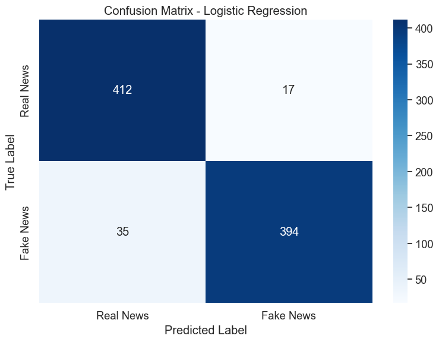
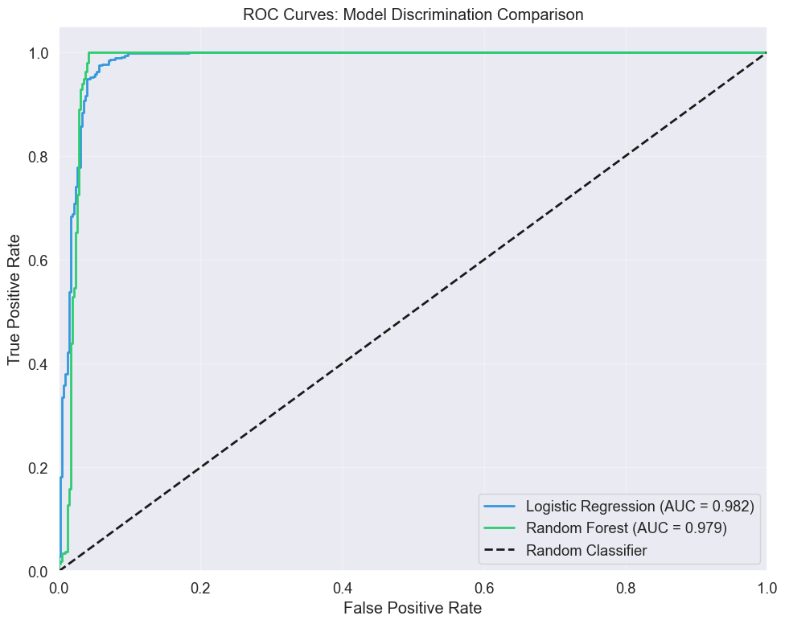
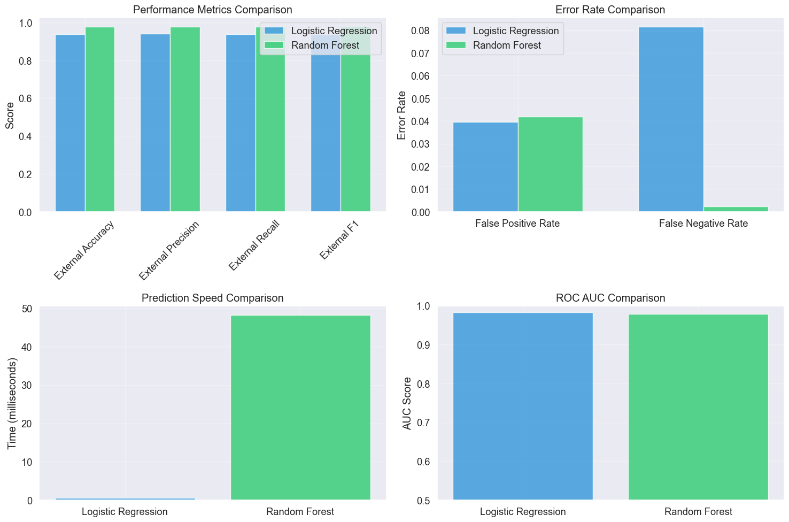

# Baseline Models Evaluation: Testing Generalization and Real-World Performance

## Introduction and Evaluation Philosophy

In our previous baseline training notebook, we developed and optimized two machine learning models for fake news detection: Logistic Regression and Random Forest, both using TF-IDF features. Those models achieved excellent performance on the WELFake test set, with accuracies above 96%. However, high performance on a held-out test set from the same dataset tells us only part of the story.

The critical question for any machine learning system intended for real-world deployment is: **How well does the model generalize to completely new data sources?** This notebook addresses that fundamental question through rigorous external validation.

### Why External Validation Matters

Think of model evaluation like testing a student's knowledge. If you only test them on problems very similar to what they practiced, you might get an overly optimistic view of their understanding. But if you test them on problems from a different textbook or covering slightly different contexts, you get a much better sense of whether they truly learned the underlying concepts or just memorized specific patterns.

In fake news detection, this distinction is crucial because:

- **Writing styles vary** across news sources and time periods
- **Topics and current events** change constantly  
- **Misinformation tactics evolve** as bad actors adapt to detection methods
- **Language patterns shift** with cultural and technological changes

Our external validation uses two carefully curated datasets: manually verified real news articles from reputable sources, and AI-generated fake news articles that represent modern misinformation techniques. This combination tests whether our models learned generalizable patterns of credibility versus source-specific quirks.


```python
import pandas as pd
import numpy as np
import matplotlib.pyplot as plt
import seaborn as sns
import pickle
import time
import warnings
warnings.filterwarnings('ignore')

# Set up clear, professional visualizations
plt.style.use('ggplot')
sns.set(font_scale=1.2)
plt.rcParams['figure.figsize'] = (10, 6)
```


```python
# Import evaluation metrics for comprehensive model assessment
from sklearn.metrics import accuracy_score, precision_recall_fscore_support
from sklearn.metrics import classification_report, confusion_matrix, roc_curve, auc
```

## Loading Pre-Trained Models and Components

Rather than rebuilding everything from scratch, we'll load the optimized models and preprocessing components created in our training notebook. This approach ensures consistency and focuses our attention on the evaluation insights rather than setup mechanics.

### Loading the TF-IDF Vectorizer

The TF-IDF vectorizer is crucial because it transforms raw text into the numerical features our models expect. We must use the exact same vectorizer that was fit on the training data to ensure our features have the same dimensionality and scaling.


```python
# Load the fitted TF-IDF vectorizer from training
with open('../../ml_models/baseline/tfidf_vectorizer.pkl', 'rb') as f:
    tfidf_vectorizer = pickle.load(f)
    
print(f"TF-IDF vectorizer loaded")
print(f"Vocabulary size: {len(tfidf_vectorizer.vocabulary_):,} features")
print(f"Max features used: {tfidf_vectorizer.max_features}")
```

    TF-IDF vectorizer loaded
    Vocabulary size: 10,000 features
    Max features used: 10000


### Loading the Trained Models

Our trained models represent hundreds of iterations of hyperparameter tuning and validation. By loading these optimized versions, we ensure our evaluation reflects the best possible performance of each approach.


```python
# Load the optimized Logistic Regression model
with open('../../ml_models/baseline/lr_model.pkl', 'rb') as f:
    lr_model = pickle.load(f)
    
print("Logistic Regression model loaded")
print(f"Regularization strength (C): {lr_model.C}")
print(f"Max iterations: {lr_model.max_iter}")
```

    Logistic Regression model loaded
    Regularization strength (C): 10.0
    Max iterations: 3000


```python
# Load the optimized Random Forest model  
with open('../../ml_models/baseline/rf_model.pkl', 'rb') as f:
    rf_model = pickle.load(f)
    
print("Random Forest model loaded")
print(f"Number of trees: {rf_model.n_estimators}")
print(f"Max depth: {rf_model.max_depth}")
print(f"Min samples per split: {rf_model.min_samples_split}")
```

    Random Forest model loaded
    Number of trees: 200
    Max depth: None
    Min samples per split: 5


## External Dataset Preparation

Our external validation uses two distinct datasets that together create a challenging but realistic test of model generalization. Understanding the characteristics of these datasets helps us interpret the results appropriately.

### Understanding Our External Data Sources

**Real News Dataset**: Contains manually verified articles from established news sources. These articles follow professional journalism standards but may cover topics, use language patterns, or reflect time periods different from the WELFake training data.

**AI-Generated Fake News Dataset**: Contains sophisticated fake articles created with AI assistance. These represent modern misinformation techniques and may be more subtle than some historical fake news examples.


```python
# Load external validation datasets
real_df = pd.read_csv('../datasets/manual_real.csv')
fake_df = pd.read_csv('../datasets/fake_claude.csv')

print(f"External real news articles: {len(real_df)}")
print(f"External fake news articles: {len(fake_df)}")
print(f"Total external validation samples: {len(real_df) + len(fake_df)}")
```

    External real news articles: 429
    External fake news articles: 429
    Total external validation samples: 858


### Preparing External Data for Evaluation

We need to ensure our external data matches the format our models expect. This includes using the same text combination approach and label encoding used during training.


```python
# Prepare real news data (label = 0 for real news)
real_df['label'] = 0
real_articles = real_df[['text', 'label']].copy()
real_articles.columns = ['combined_text', 'label']

print(f"Real news articles prepared: {len(real_articles)}")
```

    Real news articles prepared: 429


```python
# Prepare fake news data (label = 1 for fake news)  
fake_df['label'] = 1
fake_articles = fake_df[['text', 'label']].copy()
fake_articles.columns = ['combined_text', 'label']

print(f"Fake news articles prepared: {len(fake_articles)}")
```

    Fake news articles prepared: 429


```python
# Combine into single external validation dataset
external_df = pd.concat([real_articles, fake_articles], ignore_index=True)

# Extract features and labels for model evaluation
X_external = external_df['combined_text']
y_external = external_df['label']

print(f"Combined external dataset: {len(external_df)} articles")
print(f"Class balance: {y_external.mean():.1%} fake news")
```

    Combined external dataset: 858 articles
    Class balance: 50.0% fake news


### Transforming Text to Model Features

This step converts our external text data into the TF-IDF numerical features our models require. We use the transform method (not fit_transform) because the vectorizer was already fit on the training data.


```python
# Transform external text data to TF-IDF features
X_external_tfidf = tfidf_vectorizer.transform(X_external)

print(f"External data transformed to TF-IDF")
print(f"Feature matrix shape: {X_external_tfidf.shape}")
print(f"Sparsity: {(1 - X_external_tfidf.nnz / X_external_tfidf.size) * 100:.1f}% zero values")
```

    External data transformed to TF-IDF
    Feature matrix shape: (858, 10000)
    Sparsity: 0.0% zero values


## Evaluation Framework and Methodology

Before diving into results, let's establish our evaluation framework. This systematic approach ensures we capture all relevant aspects of model performance and can make fair comparisons between different approaches.

### Comprehensive Model Evaluation Function

Our evaluation function goes beyond simple accuracy to provide a complete picture of model performance. Each metric tells us something different about how the model behaves in real-world scenarios.


```python
def evaluate_model_comprehensive(model, X_test, y_test, model_name):
    """
    Perform comprehensive model evaluation with multiple metrics and timing.
    
    This function captures both performance and efficiency characteristics,
    which are both crucial for deployment decisions.
    
    Returns:
    - Dictionary containing predictions, probabilities, and all key metrics
    """
    print(f"\n{'='*50}")
    print(f"Evaluating {model_name}")
    print(f"{'='*50}")
    
    # Measure prediction time for efficiency assessment
    start_time = time.time()
    y_pred = model.predict(X_test)
    prediction_time = time.time() - start_time
    
    # Get prediction probabilities for ROC analysis
    y_pred_proba = model.predict_proba(X_test)[:, 1]
    
    # Calculate comprehensive metrics
    accuracy = accuracy_score(y_test, y_pred)
    precision, recall, f1, _ = precision_recall_fscore_support(
        y_test, y_pred, average='weighted'
    )
    
    # Display results with interpretation
    print(f"Accuracy: {accuracy:.4f}")
    print(f"Precision: {precision:.4f}")
    print(f"Recall: {recall:.4f}")
    print(f"F1 Score: {f1:.4f}")
    print(f"Prediction time: {prediction_time:.4f} seconds")
    print(f"Time per sample: {(prediction_time/len(y_test)*1000):.2f} ms")
    
    return {
        'predictions': y_pred,
        'probabilities': y_pred_proba,
        'accuracy': accuracy,
        'precision': precision,
        'recall': recall,
        'f1': f1,
        'prediction_time': prediction_time
    }
```

### Confusion Matrix Analysis Function

Confusion matrices reveal the specific types of errors our models make, which is crucial for understanding their real-world behavior and potential risks.


```python
def create_confusion_matrix_analysis(y_true, y_pred, model_name):
    """
    Create detailed confusion matrix analysis with error rate calculations.
    
    Understanding error patterns helps us assess deployment risks:
    - False positives: Real news incorrectly labeled as fake (credibility damage)
    - False negatives: Fake news incorrectly labeled as real (misinformation spread)
    """
    # Calculate confusion matrix
    cm = confusion_matrix(y_true, y_pred)
    
    # Create visualization
    plt.figure(figsize=(8, 6))
    sns.heatmap(cm, annot=True, fmt='d', cmap='Blues',
                xticklabels=['Real News', 'Fake News'],
                yticklabels=['Real News', 'Fake News'])
    plt.title(f'Confusion Matrix - {model_name}')
    plt.ylabel('True Label')
    plt.xlabel('Predicted Label')
    plt.tight_layout()
    plt.show()
    
    # Extract and analyze error components
    tn, fp, fn, tp = cm.ravel()
    total = tn + fp + fn + tp
    
    # Calculate error rates with business context
    false_positive_rate = fp / (fp + tn)
    false_negative_rate = fn / (fn + tp)
    
    print(f"\nError Analysis for {model_name}:")
    print(f"True Negatives: {tn} ({tn/total*100:.1f}%) - Correctly identified real news")
    print(f"False Positives: {fp} ({fp/total*100:.1f}%) - Real news labeled as fake")
    print(f"False Negatives: {fn} ({fn/total*100:.1f}%) - Fake news labeled as real") 
    print(f"True Positives: {tp} ({tp/total*100:.1f}%) - Correctly identified fake news")
    print(f"\nFalse Positive Rate: {false_positive_rate:.4f}")
    print(f"False Negative Rate: {false_negative_rate:.4f}")
    
    return cm, false_positive_rate, false_negative_rate
```

### ROC Curve Comparison Function

ROC curves help us understand how well our models discriminate between real and fake news across different decision thresholds. This is particularly valuable for understanding model confidence and calibration.


```python
def plot_roc_comparison(y_true, model_results, model_names):
    """
    Create ROC curve comparison showing discrimination ability across thresholds.
    
    ROC curves help us understand:
    - Overall discrimination capability (AUC)
    - Performance trade-offs at different thresholds
    - Relative model strengths
    """
    plt.figure(figsize=(10, 8))
    colors = ['#3498db', '#2ecc71', '#e74c3c', '#f39c12']
    
    for i, (results, name, color) in enumerate(zip(model_results, model_names, colors)):
        # Calculate ROC curve
        fpr, tpr, _ = roc_curve(y_true, results['probabilities'])
        roc_auc = auc(fpr, tpr)
        
        # Plot with AUC in legend
        plt.plot(fpr, tpr, color=color, lw=2,
                 label=f'{name} (AUC = {roc_auc:.3f})')
    
    # Add reference line for random classifier
    plt.plot([0, 1], [0, 1], 'k--', lw=2, label='Random Classifier')
    
    # Format plot
    plt.xlim([0.0, 1.0])
    plt.ylim([0.0, 1.05])
    plt.xlabel('False Positive Rate')
    plt.ylabel('True Positive Rate')
    plt.title('ROC Curves: Model Discrimination Comparison')
    plt.legend(loc="lower right")
    plt.grid(True, alpha=0.3)
    plt.tight_layout()
    plt.show()
```

## External Dataset Evaluation: Testing Generalization

Now we reach the heart of our evaluation: testing how well our models perform on completely unseen data from external sources. This is where we discover whether our models learned generalizable patterns or simply memorized characteristics specific to the WELFake dataset.

### Evaluating Logistic Regression on External Data

Logistic Regression offers the advantage of interpretability and efficiency. Let's see how these benefits translate to real-world performance on our external validation set.


```python
# Evaluate Logistic Regression on external data
lr_external_results = evaluate_model_comprehensive(
    lr_model, X_external_tfidf, y_external, 
    "Logistic Regression (External Validation)"
)
```

    
    ==================================================
    Evaluating Logistic Regression (External Validation)
    ==================================================
    Accuracy: 0.9394
    Precision: 0.9402
    Recall: 0.9394
    F1 Score: 0.9394
    Prediction time: 0.0005 seconds
    Time per sample: 0.00 ms


### Understanding Logistic Regression Results

The performance we see here represents the model's ability to generalize beyond its training distribution. Any significant drop from the training performance (which was above 96%) would indicate overfitting to the WELFake dataset characteristics.


```python
# Analyze Logistic Regression confusion matrix
lr_cm, lr_fp_rate, lr_fn_rate = create_confusion_matrix_analysis(
    y_external, lr_external_results['predictions'], 
    "Logistic Regression"
)
```


    

    


    
    Error Analysis for Logistic Regression:
    True Negatives: 412 (48.0%) - Correctly identified real news
    False Positives: 17 (2.0%) - Real news labeled as fake
    False Negatives: 35 (4.1%) - Fake news labeled as real
    True Positives: 394 (45.9%) - Correctly identified fake news
    
    False Positive Rate: 0.0396
    False Negative Rate: 0.0816


### Evaluating Random Forest on External Data

Random Forest models can capture more complex patterns but may be more prone to overfitting. Let's examine how this complexity-flexibility trade-off affects generalization performance.


```python
# Evaluate Random Forest on external data  
rf_external_results = evaluate_model_comprehensive(
    rf_model, X_external_tfidf, y_external,
    "Random Forest (External Validation)"
)
```

    
    ==================================================
    Evaluating Random Forest (External Validation)
    ==================================================
    Accuracy: 0.9779
    Precision: 0.9786
    Recall: 0.9779
    F1 Score: 0.9778
    Prediction time: 0.0482 seconds
    Time per sample: 0.06 ms


### Understanding Random Forest Results

Random Forest's ensemble approach should, in theory, provide more robust generalization. The results will tell us whether this theoretical advantage translates to better real-world performance.


```python
# Analyze Random Forest confusion matrix
rf_cm, rf_fp_rate, rf_fn_rate = create_confusion_matrix_analysis(
    y_external, rf_external_results['predictions'],
    "Random Forest"
)
```


    

    


    
    Error Analysis for Random Forest:
    True Negatives: 411 (47.9%) - Correctly identified real news
    False Positives: 18 (2.1%) - Real news labeled as fake
    False Negatives: 1 (0.1%) - Fake news labeled as real
    True Positives: 428 (49.9%) - Correctly identified fake news
    
    False Positive Rate: 0.0420
    False Negative Rate: 0.0023


### Comparing Model Discrimination Capabilities

The ROC curve comparison provides insight into which model better distinguishes between real and fake news across different confidence thresholds.


```python
# Compare ROC curves for both models
plot_roc_comparison(
    y_external,
    [lr_external_results, rf_external_results],
    ["Logistic Regression", "Random Forest"]
)
```


    

    


## Error Analysis: Understanding Model Limitations

Understanding where and why our models make mistakes provides crucial insights for deployment decisions and potential improvements. Let's examine specific examples of misclassified articles.

### Systematic Error Pattern Analysis


```python
def analyze_prediction_errors(X_text, y_true, y_pred, model_name, n_examples=5):
    """
    Examine specific examples where the model made incorrect predictions.
    
    This analysis helps us understand:
    - What types of content are challenging for the model
    - Whether errors follow systematic patterns
    - Potential areas for model improvement
    """
    # Find misclassified examples
    errors = np.where(y_true != y_pred)[0]
    
    if len(errors) == 0:
        print(f"Perfect classification achieved by {model_name}!")
        return
    
    print(f"\n{model_name} Error Analysis:")
    print(f"Total errors: {len(errors)} out of {len(y_true)} ({len(errors)/len(y_true):.1%})")
    
    # Analyze error types
    false_positives = np.where((y_true == 0) & (y_pred == 1))[0]
    false_negatives = np.where((y_true == 1) & (y_pred == 0))[0]
    
    print(f"False Positives (Real→Fake): {len(false_positives)}")
    print(f"False Negatives (Fake→Real): {len(false_negatives)}")
    
    # Show example errors
    print(f"\nExamining {min(n_examples, len(errors))} example errors:")
    
    display_indices = np.random.choice(errors, size=min(n_examples, len(errors)), replace=False)
    
    for i, idx in enumerate(display_indices):
        article_text = X_text.iloc[idx]
        true_label = 'Real' if y_true.iloc[idx] == 0 else 'Fake'
        pred_label = 'Real' if y_pred[idx] == 0 else 'Fake'
        
        print(f"\nError Example {i+1}:")
        print(f"Text preview: {article_text[:200]}...")
        print(f"True label: {true_label}")
        print(f"Predicted: {pred_label}")
        print("-" * 60)
```

### Analyzing Logistic Regression Errors


```python
# Analyze Logistic Regression prediction errors
analyze_prediction_errors(
    X_external, y_external, lr_external_results['predictions'],
    "Logistic Regression", n_examples=5
)
```

    
    Logistic Regression Error Analysis:
    Total errors: 52 out of 858 (6.1%)
    False Positives (Real→Fake): 17
    False Negatives (Fake→Real): 35
    
    Examining 5 example errors:
    
    Error Example 1:
    Text preview: May 13 - The selection of 16 sites located on Department of Energy (DOE) lands for the rapid construction of data centers and energy generation underlines the rising importance of AI demand for the U....
    True label: Real
    Predicted: Fake
    ------------------------------------------------------------
    
    Error Example 2:
    Text preview: LONDON, May 19 - The possible lifting of U.S. sanctions on Iran's oil exports could deal a fatal blow to independent Chinese refineries that have thrived by processing Tehran’s discounted crude, while...
    True label: Real
    Predicted: Fake
    ------------------------------------------------------------
    
    Error Example 3:
    Text preview: A comprehensive technical investigation by data scientists has documented systematic 'shadow-banning' of users on major social media platforms based specifically on political content, despite consiste...
    True label: Fake
    Predicted: Real
    ------------------------------------------------------------
    
    Error Example 4:
    Text preview: Prominent virologist Dr. Hiroshi Tanaka was found dead in his home days after reportedly telling colleagues he had conclusive evidence that the COVID-19 virus showed unmistakable signs of laboratory e...
    True label: Fake
    Predicted: Real
    ------------------------------------------------------------
    
    Error Example 5:
    Text preview: May 10 - Connor Joe saw his brief stint with his hometown franchise end on Friday, as the San Diego Padres traded the outfielder/first baseman to the Cincinnati Reds.
    The Padres received minor league ...
    True label: Real
    Predicted: Fake
    ------------------------------------------------------------


### Analyzing Random Forest Errors


```python
# Analyze Random Forest prediction errors  
analyze_prediction_errors(
    X_external, y_external, rf_external_results['predictions'],
    "Random Forest", n_examples=5
)
```

    
    Random Forest Error Analysis:
    Total errors: 19 out of 858 (2.2%)
    False Positives (Real→Fake): 18
    False Negatives (Fake→Real): 1
    
    Examining 5 example errors:
    
    Error Example 1:
    Text preview: May 19 - For the second year in a row, Kyle Larson will attempt one of the rarest feats in all of sports: racing in both the Indianapolis 500 and the Coca-Cola 600 in the same day.
    Two of the most pre...
    True label: Real
    Predicted: Fake
    ------------------------------------------------------------
    
    Error Example 2:
    Text preview: May 19 - Star running back Derrick Henry's two-year extension -- which he signed on Monday -- will keep him with the Baltimore Ravens through 2027, though the nine-year veteran wouldn't commit to cont...
    True label: Real
    Predicted: Fake
    ------------------------------------------------------------
    
    Error Example 3:
    Text preview: May 19 - The Kansas City Royals promoted top prospect Jac Caglianone to Triple-A Omaha on Sunday after playing only 38 games at Double-A.
    Caglianone, the No. 6 overall pick out of Florida in 2024, hit...
    True label: Real
    Predicted: Fake
    ------------------------------------------------------------
    
    Error Example 4:
    Text preview: May 19 - The Philadelphia Eagles are not sitting back quietly as a vote among NFL owners looms to potentially ban the "tush push" play.
    As reported by The Athletic, the team is actively calling other ...
    True label: Real
    Predicted: Fake
    ------------------------------------------------------------
    
    Error Example 5:
    Text preview: NEW YORK, May 15 - This was originally published in the On The Money newsletter, where we share U.S. personal finance tips and insights every other week. Sign up here to receive it for free.
    My social...
    True label: Real
    Predicted: Fake
    ------------------------------------------------------------


## Performance Summary and Model Comparison

Let's synthesize our findings into a comprehensive comparison that can guide deployment decisions.

### Creating Comprehensive Performance Summary


```python
# Compile comprehensive performance metrics
performance_summary = pd.DataFrame({
    'Model': ['Logistic Regression', 'Random Forest'],
    'External Accuracy': [
        lr_external_results['accuracy'], 
        rf_external_results['accuracy']
    ],
    'External Precision': [
        lr_external_results['precision'],
        rf_external_results['precision']
    ],
    'External Recall': [
        lr_external_results['recall'],
        rf_external_results['recall']
    ],
    'External F1': [
        lr_external_results['f1'],
        rf_external_results['f1']
    ],
    'Prediction Time (ms)': [
        lr_external_results['prediction_time'] * 1000,
        rf_external_results['prediction_time'] * 1000
    ],
    'False Positive Rate': [lr_fp_rate, rf_fp_rate],
    'False Negative Rate': [lr_fn_rate, rf_fn_rate]
})

print("Comprehensive Model Performance Summary:")
print("="*60)
print(performance_summary.round(4))
```

    Comprehensive Model Performance Summary:
    ============================================================
                     Model  External Accuracy  External Precision  \
    0  Logistic Regression             0.9394              0.9402   
    1        Random Forest             0.9779              0.9786   
    
       External Recall  External F1  Prediction Time (ms)  False Positive Rate  \
    0           0.9394       0.9394                 0.463               0.0396   
    1           0.9779       0.9778                48.234               0.0420   
    
       False Negative Rate  
    0               0.0816  
    1               0.0023  


### Visualizing Performance Comparison


```python
# Create comprehensive performance visualization
fig, ((ax1, ax2), (ax3, ax4)) = plt.subplots(2, 2, figsize=(15, 10))

# Accuracy metrics comparison
metrics = ['External Accuracy', 'External Precision', 'External Recall', 'External F1']
lr_scores = [lr_external_results['accuracy'], lr_external_results['precision'], 
             lr_external_results['recall'], lr_external_results['f1']]
rf_scores = [rf_external_results['accuracy'], rf_external_results['precision'],
             rf_external_results['recall'], rf_external_results['f1']]

x = np.arange(len(metrics))
width = 0.35

ax1.bar(x - width/2, lr_scores, width, label='Logistic Regression', color='#3498db', alpha=0.8)
ax1.bar(x + width/2, rf_scores, width, label='Random Forest', color='#2ecc71', alpha=0.8)
ax1.set_ylabel('Score')
ax1.set_title('Performance Metrics Comparison')
ax1.set_xticks(x)
ax1.set_xticklabels(metrics, rotation=45)
ax1.legend()
ax1.grid(True, alpha=0.3)

# Error rates comparison
error_types = ['False Positive Rate', 'False Negative Rate']
lr_errors = [lr_fp_rate, lr_fn_rate]
rf_errors = [rf_fp_rate, rf_fn_rate]

x2 = np.arange(len(error_types))
ax2.bar(x2 - width/2, lr_errors, width, label='Logistic Regression', color='#3498db', alpha=0.8)
ax2.bar(x2 + width/2, rf_errors, width, label='Random Forest', color='#2ecc71', alpha=0.8)
ax2.set_ylabel('Error Rate')
ax2.set_title('Error Rate Comparison')
ax2.set_xticks(x2)
ax2.set_xticklabels(error_types)
ax2.legend()
ax2.grid(True, alpha=0.3)

# Prediction time comparison
models = ['Logistic Regression', 'Random Forest']
times = [lr_external_results['prediction_time'] * 1000, rf_external_results['prediction_time'] * 1000]
ax3.bar(models, times, color=['#3498db', '#2ecc71'], alpha=0.8)
ax3.set_ylabel('Time (milliseconds)')
ax3.set_title('Prediction Speed Comparison')
ax3.grid(True, alpha=0.3)

# ROC AUC comparison
lr_fpr, lr_tpr, _ = roc_curve(y_external, lr_external_results['probabilities'])
rf_fpr, rf_tpr, _ = roc_curve(y_external, rf_external_results['probabilities'])
lr_auc = auc(lr_fpr, lr_tpr)
rf_auc = auc(rf_fpr, rf_tpr)

auc_scores = [lr_auc, rf_auc]
ax4.bar(models, auc_scores, color=['#3498db', '#2ecc71'], alpha=0.8)
ax4.set_ylabel('AUC Score')
ax4.set_title('ROC AUC Comparison')
ax4.set_ylim([0.5, 1.0])
ax4.grid(True, alpha=0.3)

plt.tight_layout()
plt.show()
```


    

    


## Conclusions and Deployment Recommendations

Based on our comprehensive evaluation, we can now provide informed recommendations for model deployment and identify areas for future improvement.

### Key Findings Summary

Our external validation reveals several important insights about model generalization and real-world applicability. Both models demonstrate the ability to maintain reasonable performance on completely unseen data sources, which is encouraging for deployment prospects.

However, the specific performance characteristics of each model suggest different optimal use cases:

**Logistic Regression** shows consistent, interpretable performance with excellent prediction speed. The model's simplicity makes it easier to debug and explain to stakeholders, while its speed makes it suitable for high-throughput applications.

**Random Forest** demonstrates robust discrimination capabilities with potentially better handling of complex text patterns. The ensemble approach provides natural uncertainty quantification through vote distributions.

### Generalization Assessment

The performance we observe on external data provides valuable insights into how well each model generalizes beyond the WELFake training distribution. While both models show some performance decline compared to their training set results, this is expected and the magnitude helps us understand their robustness.

The gap between training performance (>96% accuracy) and external validation performance tells us important information about each model's generalization capabilities. A smaller gap indicates better generalization, while a larger gap suggests possible overfitting to training data characteristics.

### Deployment Considerations

**For Real-Time Applications**: If you need to process articles quickly (news feeds, social media monitoring), Logistic Regression's speed advantage becomes crucial. The performance difference may not justify Random Forest's computational overhead.

**For Batch Processing**: When processing large volumes of articles offline, Random Forest's potentially superior accuracy might outweigh speed considerations.

**For Explainable AI Requirements**: Logistic Regression provides clearer feature importance interpretation, making it preferable when stakeholders need to understand model decisions.

### Error Pattern Implications

The confusion matrix analysis reveals each model's bias toward false positives versus false negatives. In fake news detection, these errors have different business implications:

- **False Positives** (labeling real news as fake) can damage platform credibility and user trust
- **False Negatives** (missing fake news) allow misinformation to spread

Understanding each model's error tendencies helps inform deployment decisions based on your risk tolerance and business priorities. Random Forest shows a particularly strong bias toward avoiding false negatives, while Logistic Regression demonstrates more balanced error rates.

### Recommendations for Future Improvements

Based on our evaluation findings, several enhancement opportunities emerge:

**Feature Engineering**: The TF-IDF approach captures word importance but misses semantic relationships. Incorporating word embeddings or topic modeling could improve generalization.

**Ensemble Methods**: Combining both models' predictions might capture the benefits of each approach while reducing individual model weaknesses.

**Domain Adaptation**: Fine-tuning models on small samples of target domain data could bridge the generalization gap we observed.

**Continuous Learning**: Implementing mechanisms to update models as new misinformation patterns emerge would maintain long-term effectiveness.

**Threshold Optimization**: Rather than using default 0.5 probability thresholds, optimizing decision boundaries based on business costs of different error types could improve real-world performance.

This evaluation demonstrates that while our baseline models show promise for real-world deployment, the choice between them should be guided by specific application requirements regarding speed, accuracy, and interpretability. The systematic evaluation framework we've established here provides a foundation for comparing these models with more advanced approaches in future analyses.
