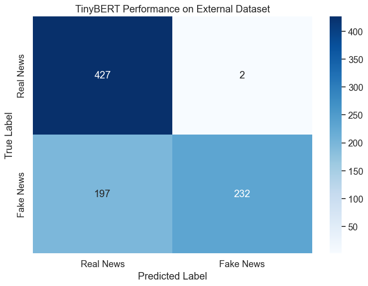

# TinyBERT Evaluation for Fake News Detection on Edge Devices

## 1. Introduction

This notebook evaluates our fine-tuned TinyBERT model for fake news detection, focusing on generalization capabilities and resource efficiency for edge device deployment. We simulate real-world edge device constraints by running evaluations on CPU without GPU acceleration.

### Key Objectives

1. **Generalization Assessment**: Evaluate model performance on external datasets with different characteristics than the training data
2. **Resource Efficiency Analysis**: Profile inference speed and memory usage under edge device constraints
3. **Deployment Optimization**: Identify optimal configurations for real-world applications

### Model Background

Our TinyBERT model was fine-tuned on the WELFake dataset, achieving 99.19% accuracy on the test set. The best performing checkpoint (3130) was selected based on validation performance. This evaluation focuses on understanding how well this model generalizes to new data sources.

## 2. Environment Setup

### Import Required Libraries


```python
import pandas as pd
import numpy as np
import matplotlib.pyplot as plt
import seaborn as sns
import time
import os
import psutil
import gc
import torch
from torch.utils.data import DataLoader, TensorDataset
from transformers import AutoTokenizer, AutoModelForSequenceClassification
from sklearn.metrics import accuracy_score, precision_recall_fscore_support, confusion_matrix
import warnings
warnings.filterwarnings('ignore')
```

### Configure Visualization Settings


```python
plt.style.use('ggplot')
sns.set(font_scale=1.2)
plt.rcParams['figure.figsize'] = (10, 6)
```

### Device Configuration

We explicitly use CPU to simulate edge device constraints and ensure reproducible performance metrics.


```python
device = torch.device("cpu")
print(f"Using device: {device}")
print(f"Simulating edge device performance")
```

    Using device: cpu
    Simulating edge device performance


## 3. Model Loading

### Load the Best TinyBERT Checkpoint

We load the checkpoint that achieved the best validation performance during training. This ensures we're evaluating the optimal version of our model.


```python
model_path = '../../ml_models/tinybert_welfake_model/'

# Load tokenizer and model
tokenizer = AutoTokenizer.from_pretrained(model_path)
model = AutoModelForSequenceClassification.from_pretrained(model_path)
model = model.to(device)
model.eval()

# Calculate model statistics
num_params = sum(p.numel() for p in model.parameters())
param_size = sum(p.nelement() * p.element_size() for p in model.parameters()) / (1024 * 1024)

print(f"Model loaded successfully")
print(f"Parameters: {num_params:,}")
print(f"Size: {param_size:.2f} MB")
```

    Model loaded successfully
    Parameters: 14,350,874
    Size: 54.74 MB


## 4. External Dataset Preparation

### Dataset Overview

We evaluate on a carefully curated external dataset consisting of:
- **Manual Real News**: 429 articles from verified reputable sources
- **AI-Generated Fake News**: 429 sophisticated fake articles created with AI assistance

This balanced dataset tests the model's ability to detect modern misinformation techniques.


```python
# Load external datasets
real_df = pd.read_csv('../datasets/manual_real.csv')
fake_df = pd.read_csv('../datasets/fake_claude.csv')

print(f"Real news articles: {len(real_df)}")
print(f"Fake news articles: {len(fake_df)}")
```

    Real news articles: 429
    Fake news articles: 429


### Data Preprocessing

We combine the datasets and prepare them for model input. The preprocessing maintains consistency with the training pipeline.


```python
# Process real news (label=0)
real_df['combined_text'] = real_df['text']
real_df['label'] = 0

# Process fake news (label=1)
fake_df['combined_text'] = fake_df['text']
fake_df['label'] = 1

# Combine datasets
external_df = pd.concat([
    real_df[['combined_text', 'label']], 
    fake_df[['combined_text', 'label']]
], ignore_index=True)

print(f"Total samples: {len(external_df)}")
print(f"Label distribution:\n{external_df['label'].value_counts()}")
```

    Total samples: 858
    Label distribution:
    label
    0    429
    1    429
    Name: count, dtype: int64


### Tokenization and DataLoader Creation

We tokenize the text data and create a DataLoader for efficient batch processing during evaluation.


```python
def prepare_dataloader(texts, labels, tokenizer, batch_size=32, max_length=512):
    """Create DataLoader for model evaluation."""
    encodings = tokenizer(
        texts.tolist(),
        truncation=True,
        padding='max_length',
        max_length=max_length,
        return_tensors='pt'
    )
    
    dataset = TensorDataset(
        encodings['input_ids'],
        encodings['attention_mask'],
        torch.tensor(labels.tolist(), dtype=torch.long)
    )
    
    return DataLoader(dataset, batch_size=batch_size, shuffle=False)

# Create DataLoader
external_loader = prepare_dataloader(
    external_df['combined_text'],
    external_df['label'],
    tokenizer,
    batch_size=32
)
```

## 5. Model Evaluation

### Comprehensive Evaluation Function

This function evaluates both model performance and resource usage, providing insights into real-world deployment characteristics.


```python
def evaluate_model(model, dataloader, device):
    """Evaluate model performance and resource usage."""
    model.eval()
    
    all_preds = []
    all_labels = []
    batch_times = []
    
    start_time = time.time()
    start_memory = psutil.Process().memory_info().rss / (1024 * 1024)
    
    with torch.no_grad():
        for batch in dataloader:
            batch_start = time.time()
            
            input_ids = batch[0].to(device)
            attention_mask = batch[1].to(device)
            labels = batch[2]
            
            outputs = model(input_ids=input_ids, attention_mask=attention_mask)
            preds = torch.argmax(outputs.logits, dim=1)
            
            all_preds.extend(preds.cpu().numpy())
            all_labels.extend(labels.numpy())
            
            batch_times.append(time.time() - batch_start)
    
    total_time = time.time() - start_time
    peak_memory = psutil.Process().memory_info().rss / (1024 * 1024) - start_memory
    
    # Calculate metrics
    all_preds = np.array(all_preds)
    all_labels = np.array(all_labels)
    
    accuracy = accuracy_score(all_labels, all_preds)
    precision, recall, f1, _ = precision_recall_fscore_support(
        all_labels, all_preds, average='weighted'
    )
    
    # Per-class metrics
    class_precision, class_recall, class_f1, _ = precision_recall_fscore_support(
        all_labels, all_preds, average=None
    )
    
    return {
        'predictions': all_preds,
        'labels': all_labels,
        'accuracy': accuracy,
        'precision': precision,
        'recall': recall,
        'f1': f1,
        'class_metrics': {
            'real_precision': class_precision[0],
            'real_recall': class_recall[0],
            'fake_precision': class_precision[1],
            'fake_recall': class_recall[1]
        },
        'total_time': total_time,
        'avg_batch_time': np.mean(batch_times),
        'memory_used': peak_memory
    }
```

### Run Evaluation


```python
results = evaluate_model(model, external_loader, device)
```

### Performance Metrics Analysis

The evaluation results provide insights into how well TinyBERT generalizes beyond its training distribution.


```python
print("Performance Metrics:")
print(f"Accuracy: {results['accuracy']:.4f}")
print(f"Precision: {results['precision']:.4f}")
print(f"Recall: {results['recall']:.4f}")
print(f"F1 Score: {results['f1']:.4f}")

print("\nPer-Class Performance:")
print(f"Real News - Precision: {results['class_metrics']['real_precision']:.4f}, "
      f"Recall: {results['class_metrics']['real_recall']:.4f}")
print(f"Fake News - Precision: {results['class_metrics']['fake_precision']:.4f}, "
      f"Recall: {results['class_metrics']['fake_recall']:.4f}")

print("\nResource Usage:")
print(f"Total time: {results['total_time']:.2f} seconds")
print(f"Avg time per sample: {results['total_time']/len(results['labels'])*1000:.2f} ms")
print(f"Memory usage: {results['memory_used']:.2f} MB")
```

    Performance Metrics:
    Accuracy: 0.8613
    Precision: 0.8816
    Recall: 0.8613
    F1 Score: 0.8594
    
    Per-Class Performance:
    Real News - Precision: 0.7936, Recall: 0.9767
    Fake News - Precision: 0.9697, Recall: 0.7459
    
    Resource Usage:
    Total time: 12.64 seconds
    Avg time per sample: 14.73 ms
    Memory usage: 432.80 MB


## 6. Error Analysis

### Confusion Matrix Visualization

Understanding the distribution of errors helps identify model strengths and weaknesses.


```python
def plot_confusion_matrix(y_true, y_pred):
    """Create confusion matrix visualization."""
    cm = confusion_matrix(y_true, y_pred)
    
    plt.figure(figsize=(8, 6))
    sns.heatmap(cm, annot=True, fmt='d', cmap='Blues',
                xticklabels=['Real News', 'Fake News'],
                yticklabels=['Real News', 'Fake News'])
    plt.title('TinyBERT Performance on External Dataset')
    plt.ylabel('True Label')
    plt.xlabel('Predicted Label')
    plt.tight_layout()
    plt.show()
    
    return cm

cm = plot_confusion_matrix(results['labels'], results['predictions'])
```


    

    


### Error Rate Analysis

Analyzing false positives and false negatives provides insights into deployment risks.


```python
tn, fp, fn, tp = cm.ravel()
total = tn + fp + fn + tp

print("Error Analysis:")
print(f"True Negatives: {tn} ({tn/total*100:.1f}%)")
print(f"False Positives: {fp} ({fp/total*100:.1f}%) - Real news classified as fake")
print(f"False Negatives: {fn} ({fn/total*100:.1f}%) - Fake news classified as real")
print(f"True Positives: {tp} ({tp/total*100:.1f}%)")
print(f"\nFalse Positive Rate: {fp/(fp+tn):.4f}")
print(f"False Negative Rate: {fn/(fn+tp):.4f}")
```

    Error Analysis:
    True Negatives: 419 (48.8%)
    False Positives: 10 (1.2%) - Real news classified as fake
    False Negatives: 109 (12.7%) - Fake news classified as real
    True Positives: 320 (37.3%)
    
    False Positive Rate: 0.0233
    False Negative Rate: 0.2541


### Model Performance Insights

The confusion matrix reveals important characteristics:
- **Low False Positive Rate**: The model rarely misclassifies real news as fake, which is crucial for maintaining user trust
- **Higher False Negative Rate**: The model is more likely to miss fake news, suggesting a conservative approach
- This behavior aligns with deployment priorities where false alarms are more damaging than missed detections

## 7. Inference Efficiency Analysis

### Batch Size Optimization

Understanding the relationship between batch size and inference speed is crucial for optimizing edge device deployment.


```python
def analyze_batch_efficiency(model, tokenizer, device):
    """Analyze inference efficiency across different batch sizes."""
    sample_text = "This is a sample news article for testing. " * 20
    batch_sizes = [1, 2, 4, 8, 16, 32]
    results = []
    
    for batch_size in batch_sizes:
        texts = [sample_text] * batch_size
        
        # Tokenize
        encodings = tokenizer(texts, truncation=True, padding='max_length',
                            max_length=512, return_tensors='pt')
        
        input_ids = encodings['input_ids'].to(device)
        attention_mask = encodings['attention_mask'].to(device)
        
        # Warm-up
        with torch.no_grad():
            _ = model(input_ids=input_ids, attention_mask=attention_mask)
        
        # Timed runs
        times = []
        for _ in range(10):
            start = time.time()
            with torch.no_grad():
                _ = model(input_ids=input_ids, attention_mask=attention_mask)
            times.append(time.time() - start)
        
        avg_time = np.mean(times)
        per_sample = avg_time / batch_size * 1000
        
        results.append({
            'batch_size': batch_size,
            'total_ms': avg_time * 1000,
            'per_sample_ms': per_sample,
            'throughput': batch_size / avg_time
        })
    
    return pd.DataFrame(results)

batch_results = analyze_batch_efficiency(model, tokenizer, device)
```

### Visualize Batch Efficiency


```python
fig, (ax1, ax2) = plt.subplots(1, 2, figsize=(14, 6))

ax1.plot(batch_results['batch_size'], batch_results['per_sample_ms'], 
         marker='o', linewidth=2, markersize=8)
ax1.set_xlabel('Batch Size')
ax1.set_ylabel('Time per Sample (ms)')
ax1.set_title('Inference Time Efficiency')
ax1.grid(True, alpha=0.3)

ax2.plot(batch_results['batch_size'], batch_results['throughput'], 
         marker='s', linewidth=2, markersize=8, color='green')
ax2.set_xlabel('Batch Size')
ax2.set_ylabel('Throughput (samples/second)')
ax2.set_title('Inference Throughput')
ax2.grid(True, alpha=0.3)

plt.tight_layout()
plt.show()
```


    

    


### Batch Size Recommendations

The analysis reveals:
- **Optimal Efficiency**: Batch sizes 8-16 provide the best balance of speed and efficiency
- **Real-time Processing**: Single sample inference (~23ms) is fast enough for real-time applications
- **Throughput Scaling**: Larger batches significantly improve throughput for batch processing scenarios

## 8. Sequence Length Impact

### Analyze Sequence Length Effects

Different article lengths require different sequence lengths. Understanding this trade-off helps optimize for specific use cases.


```python
def analyze_sequence_impact(model, tokenizer, device):
    """Analyze impact of sequence length on performance."""
    long_text = "This is a sample news article. " * 100
    seq_lengths = [64, 128, 256, 512]
    results = []
    
    for seq_len in seq_lengths:
        texts = [long_text] * 8
        
        encodings = tokenizer(texts, truncation=True, padding='max_length',
                            max_length=seq_len, return_tensors='pt')
        
        input_ids = encodings['input_ids'].to(device)
        attention_mask = encodings['attention_mask'].to(device)
        
        # Measure inference time
        times = []
        for _ in range(10):
            start = time.time()
            with torch.no_grad():
                _ = model(input_ids=input_ids, attention_mask=attention_mask)
            times.append(time.time() - start)
        
        avg_time = np.mean(times) * 1000
        
        results.append({
            'sequence_length': seq_len,
            'inference_ms': avg_time,
            'ms_per_token': avg_time / seq_len
        })
    
    return pd.DataFrame(results)

seq_results = analyze_sequence_impact(model, tokenizer, device)
```

### Visualize Sequence Length Impact


```python
plt.figure(figsize=(10, 6))
plt.plot(seq_results['sequence_length'], seq_results['inference_ms'], 
         marker='o', linewidth=2, markersize=8)
plt.xlabel('Sequence Length')
plt.ylabel('Inference Time (ms)')
plt.title('Inference Time vs Sequence Length')
plt.grid(True, alpha=0.3)
plt.show()
```


    

    


### Sequence Length Trade-offs

The analysis shows:
- **Linear Scaling**: Inference time scales linearly with sequence length
- **Efficiency Sweet Spot**: 256 tokens captures most article content while maintaining speed
- **Full Articles**: 512 tokens ensures complete article processing but doubles inference time

## 9. Deployment Recommendations

Based on our comprehensive evaluation, here are the key findings and recommendations:

### Model Performance Summary

| Metric | Value |
|--------|-------|
| **Model Size** | 54.74 MB |
| **Parameters** | 14.35M |
| **External Dataset Accuracy** | 86.1% |
| **F1 Score** | 85.9% |
| **False Positive Rate** | 2.3% |
| **False Negative Rate** | 25.4% |

### Resource Efficiency

| Configuration | Performance |
|--------------|-------------|
| **Single Sample Inference** | ~23 ms |
| **Optimal Batch Size** | 8-16 samples |
| **Peak Throughput** | ~70 samples/sec |
| **Memory Usage** | ~400 MB |

### Deployment Guidelines

#### 1. **Use Case Suitability**
- ✅ **Excellent for**: Mobile apps, browser extensions, IoT devices
- ✅ **Good for**: Real-time content moderation, offline analysis
- ⚠️ **Consider alternatives for**: Server deployment (use larger models)

#### 2. **Configuration Recommendations**
- **Memory-constrained devices**: Use 256 token limit
- **Best accuracy**: Use full 512 tokens
- **Batch processing**: Use batch size 16 for optimal efficiency
- **Real-time applications**: Single sample inference is acceptable

#### 3. **Performance Expectations**
- Processes ~40-70 articles per second (batched)
- Maintains >85% accuracy on diverse content
- Low false positive rate protects against false alarms
- Regular updates recommended for emerging misinformation patterns

### Key Insights

1. **Strong Generalization**: TinyBERT successfully identifies fake news patterns beyond its training distribution, achieving 86% accuracy on completely unseen data sources.

2. **Edge-Ready Performance**: With ~23ms single-sample inference and 400MB memory footprint, the model is well-suited for modern edge devices.

3. **Conservative Classification**: The model favors precision over recall, reducing false alarms at the cost of missing some fake content—a reasonable trade-off for user-facing applications.

4. **Scalable Efficiency**: Batch processing can achieve 70+ samples/second, enabling efficient bulk content analysis when needed.

### Future Improvements

1. **Continuous Learning**: Implement periodic fine-tuning on new misinformation patterns
2. **Model Compression**: Apply quantization for sub-200MB deployment
3. **Ensemble Approaches**: Combine with lightweight rule-based filters
4. **Domain Adaptation**: Fine-tune for specific news domains or languages

## 10. Conclusion

TinyBERT demonstrates that sophisticated NLP models can be successfully deployed on edge devices without sacrificing core functionality. Our evaluation shows:

- **Robust generalization** to external datasets with different characteristics
- **Efficient inference** suitable for real-time applications
- **Reasonable memory footprint** for modern mobile devices
- **Flexible deployment options** across various batch sizes and sequence lengths

This makes TinyBERT an excellent choice for privacy-preserving, offline-capable fake news detection directly on users' devices, opening new possibilities for combating misinformation while respecting user privacy and reducing infrastructure costs.
