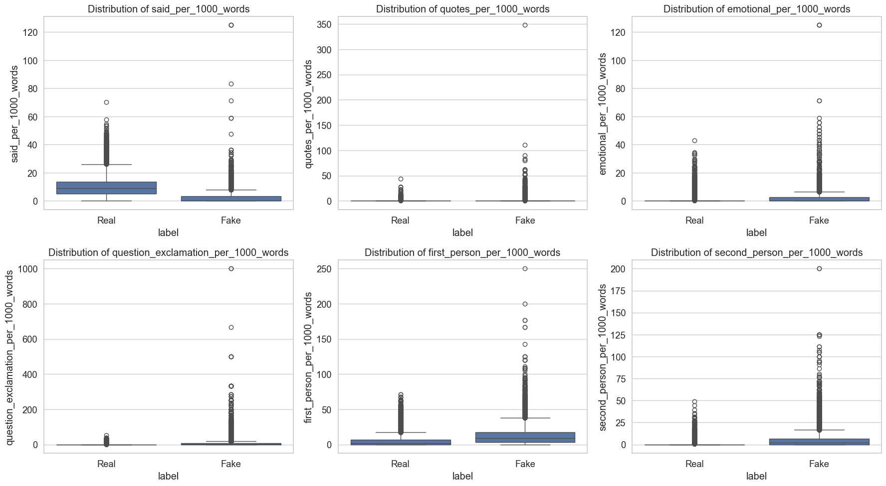
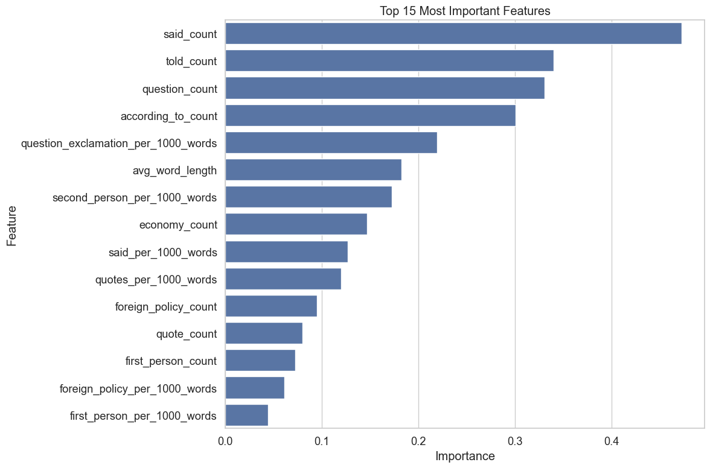
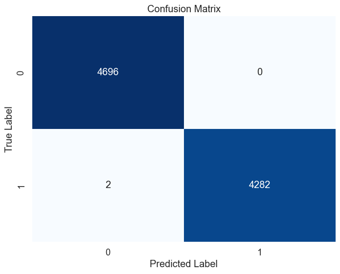
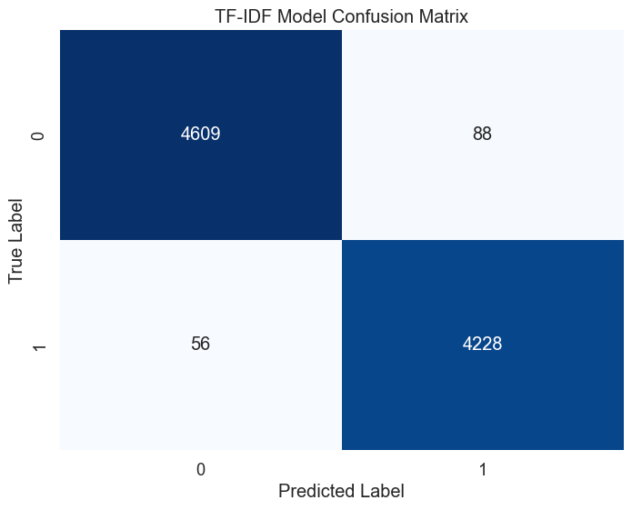
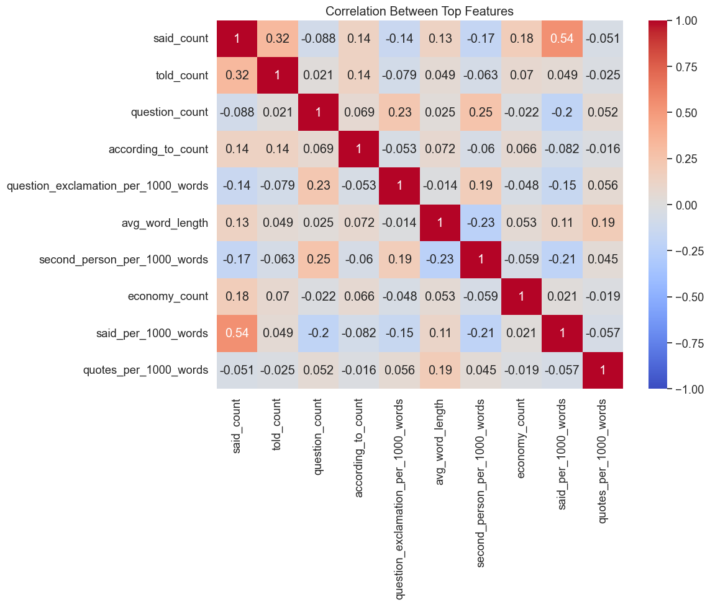
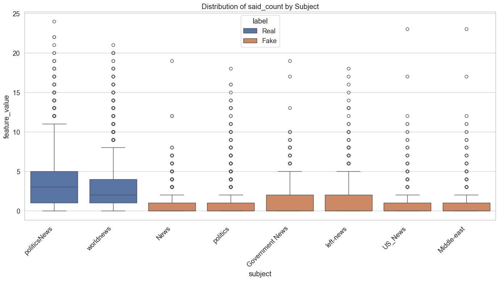

# ISOT Fake News Dataset - Feature Engineering and Model Preparation

Building on the findings from our exploratory data analysis, this notebook focuses on enhanced data cleaning, feature engineering, and preparing the dataset for model training. My goal is to develop a robust approach that helps models learn legitimate differences between real and fake news rather than dataset-specific artifacts.

## 1. Setup and Data Loading

First, I'll import the necessary libraries and load our datasets.


```python
# Import necessary libraries
import pandas as pd
import numpy as np
import matplotlib.pyplot as plt
import seaborn as sns
import re
from collections import Counter
import string
from wordcloud import WordCloud
from sklearn.feature_extraction.text import CountVectorizer, TfidfVectorizer
import nltk
from nltk.corpus import stopwords
nltk.download('stopwords')
nltk.download('punkt')
from sklearn.model_selection import train_test_split, cross_val_score
from sklearn.pipeline import Pipeline
from sklearn.linear_model import LogisticRegressionCV
from sklearn.decomposition import NMF
import warnings
warnings.filterwarnings('ignore')

# Set plot style
plt.style.use('ggplot')
sns.set(font_scale=1.2)
sns.set_style("whitegrid")

# Display options
pd.set_option('display.max_columns', None)
pd.set_option('display.max_rows', 20)
pd.set_option('display.width', 1000)
pd.set_option('display.max_colwidth', 200)
```

    [nltk_data] Downloading package stopwords to /Users/amid/nltk_data...
    [nltk_data]   Package stopwords is already up-to-date!
    [nltk_data] Downloading package punkt to /Users/amid/nltk_data...
    [nltk_data]   Package punkt is already up-to-date!


Now I'll load the datasets and the basic cleaned versions from the first notebook (if available), or recreate them:


```python
# Try to load previously saved datasets or load raw data
try:
    # Try to load datasets with basic cleaning already applied
    true_news = pd.read_csv('true_news_basic_cleaned.csv')
    fake_news = pd.read_csv('fake_news_basic_cleaned.csv')
    print("Loaded previously cleaned datasets")
except:
    # If not available, load raw data and perform basic cleaning
    print("Loading raw datasets")
    true_news = pd.read_csv('../data/ISOT/True.csv')
    fake_news = pd.read_csv('../data/ISOT/Fake.csv')
    
    # Basic cleaning function
    def clean_text(text, patterns_to_remove=None):
        """
        Clean text by removing specified patterns
        
        Args:
            text: Text to clean
            patterns_to_remove: List of regex patterns to remove
        
        Returns:
            Cleaned text
        """
        if not isinstance(text, str):
            return ""
        
        cleaned_text = text
        
        if patterns_to_remove:
            for pattern in patterns_to_remove:
                cleaned_text = re.sub(pattern, '', cleaned_text)
        
        # Remove extra whitespace
        cleaned_text = re.sub(r'\s+', ' ', cleaned_text).strip()
        
        return cleaned_text

    # Apply basic cleaning
    true_news['cleaned_text'] = true_news['text'].apply(lambda x: clean_text(x, [r'\(Reuters\)']))
    fake_news['cleaned_text'] = fake_news['text'].apply(lambda x: clean_text(x, []))
    
    # Save basic cleaned versions for future use
    true_news.to_csv('true_news_basic_cleaned.csv', index=False)
    fake_news.to_csv('fake_news_basic_cleaned.csv', index=False)

# Add text length as a feature if not present
if 'text_length' not in true_news.columns:
    true_news['text_length'] = true_news['text'].apply(lambda x: len(str(x)))
    fake_news['text_length'] = fake_news['text'].apply(lambda x: len(str(x)))

# Add labels if not present
if 'label' not in true_news.columns:
    true_news['label'] = 'Real'
    fake_news['label'] = 'Fake'

# Display basic info about the datasets
print("True News Dataset Shape:", true_news.shape)
print("Fake News Dataset Shape:", fake_news.shape)
```

    Loaded previously cleaned datasets
    True News Dataset Shape: (21417, 7)
    Fake News Dataset Shape: (23481, 7)


## 2. Enhanced Data Cleaning

Based on our exploratory analysis, I'll create an enhanced cleaning function that removes identified biases while preserving legitimate signals:


```python
# Enhanced cleaning function
def enhanced_clean_text(text, is_true_news=True):
    """
    Enhanced cleaning to remove bias-inducing patterns while preserving legitimate signals
    
    Args:
        text: Text to clean
        is_true_news: Whether the text is from true news (affects which patterns are removed)
    
    Returns:
        Cleaned text
    """
    if not isinstance(text, str):
        return ""
    
    cleaned_text = text
    
    if is_true_news:
        # For true news, remove Reuters tag but preserve location
        cleaned_text = re.sub(r'(\b[A-Z]+(?:\s[A-Z]+)*)\s*\(Reuters\)', r'\1', cleaned_text)
        
        # Remove other potentially biasing source markers specific to true news
        for source in ['(SPD)', '(FDP)', '(AfD)', '(CDU)', '(SDF)', '(KRG)', '(NAFTA)', '(PKK)']:
            cleaned_text = re.sub(re.escape(source), '', cleaned_text)
    else:
        # For fake news, remove patterns like (ACR) that are specific to fake news
        for source in ['(ACR)', '(s)', '(id)', '(a)', '(R)', '(D)']:
            cleaned_text = re.sub(re.escape(source), '', cleaned_text)
            
        # Remove links that are common in fake news
        cleaned_text = re.sub(r'https?://\S+', '', cleaned_text)
        
        # Remove specific phrases highly associated with fake news sources
        fake_phrases = [
            'Tune in to the Alternate Current Radio',
            '21st Century Wire',
            'Featured Image'
        ]
        for phrase in fake_phrases:
            cleaned_text = cleaned_text.replace(phrase, '')
    
    # Common cleaning for both types
    # Remove extra whitespace
    cleaned_text = re.sub(r'\s+', ' ', cleaned_text).strip()
    
    return cleaned_text

# Apply enhanced cleaning
true_news['enhanced_cleaned_text'] = true_news['text'].apply(lambda x: enhanced_clean_text(x, is_true_news=True))
fake_news['enhanced_cleaned_text'] = fake_news['text'].apply(lambda x: enhanced_clean_text(x, is_true_news=False))

# Verify enhanced cleaning worked
print("Sample of enhanced cleaned true news:")
for i in range(2):
    print(f"\nOriginal text beginning: {true_news['text'].iloc[i][:100]}")
    print(f"Basic cleaned text: {true_news['cleaned_text'].iloc[i][:100]}")
    print(f"Enhanced cleaned text: {true_news['enhanced_cleaned_text'].iloc[i][:100]}")

print("\nSample of enhanced cleaned fake news:")
for i in range(2):
    print(f"\nOriginal text beginning: {fake_news['text'].iloc[i][:100]}")
    print(f"Basic cleaned text: {fake_news['cleaned_text'].iloc[i][:100]}")
    print(f"Enhanced cleaned text: {fake_news['enhanced_cleaned_text'].iloc[i][:100]}")
```

    Sample of enhanced cleaned true news:
    
    Original text beginning: WASHINGTON (Reuters) - The head of a conservative Republican faction in the U.S. Congress, who voted
    Basic cleaned text: WASHINGTON - The head of a conservative Republican faction in the U.S. Congress, who voted this mont
    Enhanced cleaned text: WASHINGTON - The head of a conservative Republican faction in the U.S. Congress, who voted this mont
    
    Original text beginning: WASHINGTON (Reuters) - Transgender people will be allowed for the first time to enlist in the U.S. m
    Basic cleaned text: WASHINGTON - Transgender people will be allowed for the first time to enlist in the U.S. military st
    Enhanced cleaned text: WASHINGTON - Transgender people will be allowed for the first time to enlist in the U.S. military st
    
    Sample of enhanced cleaned fake news:
    
    Original text beginning: Donald Trump just couldn t wish all Americans a Happy New Year and leave it at that. Instead, he had
    Basic cleaned text: Donald Trump just couldn t wish all Americans a Happy New Year and leave it at that. Instead, he had
    Enhanced cleaned text: Donald Trump just couldn t wish all Americans a Happy New Year and leave it at that. Instead, he had
    
    Original text beginning: House Intelligence Committee Chairman Devin Nunes is going to have a bad day. He s been under the as
    Basic cleaned text: House Intelligence Committee Chairman Devin Nunes is going to have a bad day. He s been under the as
    Enhanced cleaned text: House Intelligence Committee Chairman Devin Nunes is going to have a bad day. He s been under the as


I'm using this enhanced cleaning approach because:

1. It removes high-bias markers like "(Reuters)" that could lead to overfitting
2. It preserves legitimate signals like location datelines that reflect journalistic conventions
3. It balances cleaning across both datasets to ensure similar types of artifacts are removed from each

## 3. Feature Engineering

Now I'll develop features that capture legitimate stylistic and content differences between real and fake news:


```python
# Function to engineer features
def engineer_features(df, text_column):
    """
    Engineer features for classification
    
    Args:
        df: DataFrame containing the text data
        text_column: Name of the column containing cleaned text
        
    Returns:
        DataFrame with additional features
    """
    # Copy the DataFrame to avoid modifying the original
    result_df = df.copy()
    
    # Text length features
    result_df['text_length'] = result_df[text_column].apply(len)
    result_df['word_count'] = result_df[text_column].apply(lambda x: len(str(x).split()))
    result_df['avg_word_length'] = result_df[text_column].apply(
        lambda x: np.mean([len(w) for w in str(x).split()]) if len(str(x).split()) > 0 else 0
    )
    result_df['sentence_count'] = result_df[text_column].apply(lambda x: len(re.findall(r'[.!?]+', str(x))) + 1)
    result_df['avg_sentence_length'] = result_df['word_count'] / result_df['sentence_count']
    
    # Citation features
    result_df['said_count'] = result_df[text_column].apply(lambda x: str(x).lower().count(' said '))
    result_df['told_count'] = result_df[text_column].apply(lambda x: str(x).lower().count(' told '))
    result_df['according_to_count'] = result_df[text_column].apply(lambda x: str(x).lower().count('according to'))
    result_df['quote_count'] = result_df[text_column].apply(lambda x: str(x).count('"'))
    
    # Normalize citation counts by text length
    result_df['said_per_1000_words'] = result_df['said_count'] * 1000 / result_df['word_count']
    result_df['quotes_per_1000_words'] = result_df['quote_count'] * 1000 / result_df['word_count']
    
    # Location features
    result_df['has_location'] = result_df[text_column].apply(
        lambda x: bool(re.match(r'^[A-Z]+(?:\s[A-Z]+)*\s+-', str(x)))
    )
    
    # Emotional language features
    emotional_words = ['believe', 'think', 'feel', 'opinion', 'incredible', 'amazing', 'terrible', 'horrible']
    result_df['emotional_word_count'] = result_df[text_column].apply(
        lambda x: sum(str(x).lower().count(' ' + word + ' ') for word in emotional_words)
    )
    result_df['emotional_per_1000_words'] = result_df['emotional_word_count'] * 1000 / result_df['word_count']
    
    # Question and exclamation features
    result_df['question_count'] = result_df[text_column].apply(lambda x: str(x).count('?'))
    result_df['exclamation_count'] = result_df[text_column].apply(lambda x: str(x).count('!'))
    result_df['question_exclamation_per_1000_words'] = (result_df['question_count'] + result_df['exclamation_count']) * 1000 / result_df['word_count']
    
    # Pronoun usage (indicates formality/informality)
    first_person = ['i', 'we', 'our', 'us', 'my']
    second_person = ['you', 'your', 'yours']
    
    result_df['first_person_count'] = result_df[text_column].apply(
        lambda x: sum(str(x).lower().count(' ' + word + ' ') for word in first_person)
    )
    result_df['second_person_count'] = result_df[text_column].apply(
        lambda x: sum(str(x).lower().count(' ' + word + ' ') for word in second_person)
    )
    
    result_df['first_person_per_1000_words'] = result_df['first_person_count'] * 1000 / result_df['word_count']
    result_df['second_person_per_1000_words'] = result_df['second_person_count'] * 1000 / result_df['word_count']
    
    # Policy coverage features
    policy_areas = {
        'economy': ['economy', 'economic', 'tax', 'budget', 'deficit', 'gdp', 'inflation', 'unemployment', 'jobs', 'trade'],
        'healthcare': ['healthcare', 'health', 'obamacare', 'insurance', 'hospital', 'medical', 'medicare', 'medicaid'],
        'immigration': ['immigration', 'immigrant', 'border', 'refugee', 'asylum', 'visa', 'deportation'],
        'foreign_policy': ['foreign', 'diplomatic', 'embassy', 'sanctions', 'treaty', 'international', 'relations'],
        'environment': ['environment', 'climate', 'pollution', 'emissions', 'epa', 'warming', 'renewable', 'carbon']
    }
    
    for area, terms in policy_areas.items():
        result_df[f'{area}_count'] = result_df[text_column].apply(
            lambda x: sum(str(x).lower().count(' ' + term + ' ') for term in terms)
        )
        result_df[f'{area}_per_1000_words'] = result_df[f'{area}_count'] * 1000 / result_df['word_count']
    
    return result_df

# Apply feature engineering to both datasets
true_news_features = engineer_features(true_news, 'enhanced_cleaned_text')
fake_news_features = engineer_features(fake_news, 'enhanced_cleaned_text')

# Get a list of all engineered features
feature_columns = [col for col in true_news_features.columns 
                  if col not in ['title', 'text', 'subject', 'date', 'cleaned_text', 'enhanced_cleaned_text']]

# Display summary statistics for the engineered features
print("\nFeature statistics for True News:")
print(true_news_features[feature_columns].describe().transpose()[['mean', 'std']])

print("\nFeature statistics for Fake News:")
print(fake_news_features[feature_columns].describe().transpose()[['mean', 'std']])
```

    
    Feature statistics for True News:
                                          mean          std
    text_length                    2365.543027  1679.237226
    word_count                      384.765980   274.038348
    avg_word_length                   5.159852     0.261931
    sentence_count                   21.801233    15.912271
    avg_sentence_length              17.978341     4.760765
    ...                                    ...          ...
    immigration_per_1000_words        0.910725     3.301516
    foreign_policy_count              0.985199     1.969442
    foreign_policy_per_1000_words     2.954578     6.271201
    environment_count                 0.173927     1.207913
    environment_per_1000_words        0.412954     2.724981
    
    [30 rows x 2 columns]
    
    Feature statistics for Fake News:
                                          mean          std
    text_length                    2526.356927  2516.888565
    word_count                      422.673566   408.049293
    avg_word_length                   4.814384     0.969869
    sentence_count                   23.439249    21.517830
    avg_sentence_length              17.782822     6.266311
    ...                                    ...          ...
    immigration_per_1000_words        0.618969     2.908075
    foreign_policy_count              0.319620     1.219033
    foreign_policy_per_1000_words     0.664558     2.604566
    environment_count                 0.134832     1.151828
    environment_per_1000_words        0.317995     2.497391
    
    [30 rows x 2 columns]


Let's visualize the differences in key features between real and fake news:


```python
# Select important features for visualization
key_features = [
    'said_per_1000_words', 
    'quotes_per_1000_words', 
    'emotional_per_1000_words',
    'question_exclamation_per_1000_words',
    'first_person_per_1000_words',
    'second_person_per_1000_words'
]

# Create a combined dataset for visualization
combined_features = pd.concat([
    true_news_features[key_features + ['label']],
    fake_news_features[key_features + ['label']]
]).reset_index(drop=True)  # Reset the index to avoid duplicates

# Create a figure with subplots
fig, axes = plt.subplots(2, 3, figsize=(18, 10))
axes = axes.flatten()

# Plot each feature
for i, feature in enumerate(key_features):
    sns.boxplot(x='label', y=feature, data=combined_features, ax=axes[i])
    axes[i].set_title(f'Distribution of {feature}')

plt.tight_layout()
plt.savefig('key_features_comparison.png')
plt.show()
```


    

    


Let's calculate the feature importance to identify the most discriminative features:


```python
# Create a function to calculate feature importance using logistic regression
def calculate_feature_importance(X, y):
    """
    Calculate feature importance using logistic regression
    
    Args:
        X: Feature matrix
        y: Target labels
        
    Returns:
        DataFrame with feature importances
    """
    # Handle missing values by imputing with mean
    from sklearn.impute import SimpleImputer
    imputer = SimpleImputer(strategy='mean')
    X_imputed = pd.DataFrame(imputer.fit_transform(X), columns=X.columns)
    
    # Initialize logistic regression model
    model = LogisticRegressionCV(cv=5, random_state=42)
    
    # Fit the model
    model.fit(X_imputed, y)
    
    # Get feature importances
    importances = model.coef_[0]
    
    # Create a DataFrame
    importance_df = pd.DataFrame({
        'Feature': X.columns,
        'Importance': np.abs(importances)
    })
    
    # Sort by importance
    importance_df = importance_df.sort_values('Importance', ascending=False)
    
    return importance_df

# Prepare data for feature importance calculation
# Convert labels to numerical values
true_news_features['numeric_label'] = 1
fake_news_features['numeric_label'] = 0

# Combine datasets - fix the index issue here as well
combined_features = pd.concat([
    true_news_features[feature_columns + ['numeric_label']],
    fake_news_features[feature_columns + ['numeric_label']]
]).reset_index(drop=True)  # Reset index to avoid duplicates

# Remove any non-numeric features
numeric_features = [f for f in feature_columns if combined_features[f].dtype in [np.int64, np.float64]]

# Calculate feature importance
X = combined_features[numeric_features]
y = combined_features['numeric_label']

feature_importance = calculate_feature_importance(X, y)

# Display top 15 most important features
print("Top 15 most important features:")
print(feature_importance.head(15))

# Visualize feature importance
plt.figure(figsize=(12, 8))
sns.barplot(x='Importance', y='Feature', data=feature_importance.head(15))
plt.title('Top 15 Most Important Features')
plt.tight_layout()
plt.savefig('feature_importance.png')
plt.show()
```

    Top 15 most important features:
                                    Feature  Importance
    5                            said_count    0.472733
    6                            told_count    0.340095
    13                       question_count    0.330750
    7                    according_to_count    0.300979
    15  question_exclamation_per_1000_words    0.219513
    2                       avg_word_length    0.182382
    19         second_person_per_1000_words    0.172765
    20                        economy_count    0.146954
    9                   said_per_1000_words    0.126964
    10                quotes_per_1000_words    0.120079
    26                 foreign_policy_count    0.094659
    8                           quote_count    0.079715
    16                   first_person_count    0.072636
    27        foreign_policy_per_1000_words    0.060956
    18          first_person_per_1000_words    0.044301


    

    


## 4. Text Vectorization with TF-IDF

Let's create text features using TF-IDF vectorization:


```python
# Function to create TF-IDF vectors
def create_tfidf_vectors(true_texts, fake_texts, max_features=5000):
    """
    Create TF-IDF vectors for text classification
    
    Args:
        true_texts: Series of true news texts
        fake_texts: Series of fake news texts
        max_features: Maximum number of features to keep
        
    Returns:
        TF-IDF vectorizer and vectors for both datasets
    """
    # Combine texts for fitting the vectorizer
    all_texts = pd.concat([true_texts, fake_texts])
    
    # Initialize TF-IDF vectorizer
    vectorizer = TfidfVectorizer(
        max_features=max_features,
        min_df=5,
        max_df=0.9,
        ngram_range=(1, 2),
        stop_words='english'
    )
    
    # Fit and transform all texts
    all_vectors = vectorizer.fit_transform(all_texts)
    
    # Split vectors back into true and fake
    true_vectors = all_vectors[:len(true_texts)]
    fake_vectors = all_vectors[len(true_texts):]
    
    return vectorizer, true_vectors, fake_vectors

# Create TF-IDF vectors
vectorizer, true_vectors, fake_vectors = create_tfidf_vectors(
    true_news_features['enhanced_cleaned_text'],
    fake_news_features['enhanced_cleaned_text']
)

print(f"TF-IDF vectors created with {true_vectors.shape[1]} features")
print(f"True news vectors shape: {true_vectors.shape}")
print(f"Fake news vectors shape: {fake_vectors.shape}")

# Get the top features (words/phrases) by their IDF scores
feature_names = vectorizer.get_feature_names_out()
idf_scores = vectorizer.idf_
feature_idf = sorted(zip(feature_names, idf_scores), key=lambda x: x[1])

print("\nTop 10 most common terms (lowest IDF):")
for feature, score in feature_idf[:10]:
    print(f"- {feature}: {score:.4f}")

print("\nTop 10 most rare terms (highest IDF):")
for feature, score in feature_idf[-10:]:
    print(f"- {feature}: {score:.4f}")
```

    TF-IDF vectors created with 5000 features
    True news vectors shape: (21417, 5000)
    Fake news vectors shape: (23481, 5000)
    
    Top 10 most common terms (lowest IDF):
    - said: 1.3128
    - president: 1.6438
    - trump: 1.7077
    - people: 1.8450
    - donald: 1.8907
    - donald trump: 1.9059
    - new: 2.0455
    - told: 2.0895
    - just: 2.1017
    - state: 2.1404
    
    Top 10 most rare terms (highest IDF):
    - ailes: 7.0872
    - coulter: 7.0872
    - zuma: 7.1478
    - mnangagwa: 7.1689
    - odinga: 7.1904
    - conyers: 7.2578
    - anc: 7.3055
    - finicum: 7.5850
    - 2016 realdonaldtrump: 7.6178
    - amp: 8.7677


## 5. Baseline Model Evaluation

Let's evaluate a simple baseline model using our engineered features:


```python
# Create a combined dataset with all features
true_news_final = true_news_features[['title', 'enhanced_cleaned_text'] + feature_columns].copy()
true_news_final['label'] = 1  # 1 for real news

fake_news_final = fake_news_features[['title', 'enhanced_cleaned_text'] + feature_columns].copy()
fake_news_final['label'] = 0  # 0 for fake news

# Combine datasets
combined_final = pd.concat([true_news_final, fake_news_final], axis=0, ignore_index=True)

# Shuffle the dataset
combined_final = combined_final.sample(frac=1, random_state=42).reset_index(drop=True)

# Select numeric features for model evaluation
numeric_features = [f for f in feature_columns if combined_final[f].dtype in [np.int64, np.float64]]

# Check for missing values
missing_values = combined_final[numeric_features].isnull().sum()
print("Features with missing values:")
print(missing_values[missing_values > 0])

# Define X and y
X = combined_final[numeric_features]
y = combined_final['label']

# Create train/test split
X_train, X_test, y_train, y_test = train_test_split(X, y, test_size=0.2, random_state=42, stratify=y)

# Handle missing values with imputation
from sklearn.impute import SimpleImputer
imputer = SimpleImputer(strategy='mean')

# Fit imputer on training data and transform both training and test data
X_train_imputed = pd.DataFrame(imputer.fit_transform(X_train), columns=X_train.columns)
X_test_imputed = pd.DataFrame(imputer.transform(X_test), columns=X_test.columns)

# Create and evaluate a baseline logistic regression model
from sklearn.linear_model import LogisticRegression
from sklearn.metrics import classification_report, confusion_matrix, accuracy_score

# Initialize model
model = LogisticRegression(max_iter=1000, random_state=42)

# Fit the model on imputed data
model.fit(X_train_imputed, y_train)

# Make predictions on imputed data
y_pred = model.predict(X_test_imputed)

# Evaluate the model
print("Baseline Model Evaluation (Engineered Features Only)")
print("Accuracy:", accuracy_score(y_test, y_pred))
print("\nClassification Report:")
print(classification_report(y_test, y_pred))

print("\nConfusion Matrix:")
cm = confusion_matrix(y_test, y_pred)
print(cm)

# Plot confusion matrix
plt.figure(figsize=(8, 6))
sns.heatmap(cm, annot=True, fmt='d', cmap='Blues', cbar=False)
plt.xlabel('Predicted Label')
plt.ylabel('True Label')
plt.title('Confusion Matrix')
plt.savefig('confusion_matrix.png')
plt.show()
```

    Features with missing values:
    said_per_1000_words                    715
    quotes_per_1000_words                  715
    emotional_per_1000_words               715
    question_exclamation_per_1000_words    715
    first_person_per_1000_words            715
    second_person_per_1000_words           715
    economy_per_1000_words                 715
    healthcare_per_1000_words              715
    immigration_per_1000_words             715
    foreign_policy_per_1000_words          715
    environment_per_1000_words             715
    dtype: int64
    Baseline Model Evaluation (Engineered Features Only)
    Accuracy: 0.9997772828507795
    
    Classification Report:
                  precision    recall  f1-score   support
    
               0       1.00      1.00      1.00      4696
               1       1.00      1.00      1.00      4284
    
        accuracy                           1.00      8980
       macro avg       1.00      1.00      1.00      8980
    weighted avg       1.00      1.00      1.00      8980
    
    
    Confusion Matrix:
    [[4696    0]
     [   2 4282]]


    

    


Let's also evaluate a model that combines TF-IDF features with our engineered features:


```python
# Convert sparse TF-IDF matrices to DataFrames for easier handling
from scipy.sparse import vstack
from sklearn.preprocessing import normalize

# The error occurs because true_vectors and fake_vectors have different row counts
# We need to use the same feature space (columns) but keep rows separate
print(f"True vectors shape: {true_vectors.shape}")
print(f"Fake vectors shape: {fake_vectors.shape}")

# Create labels arrays for each dataset
true_labels = np.ones(true_vectors.shape[0])
fake_labels = np.zeros(fake_vectors.shape[0])

# Split each dataset separately using the same random state
X_true_train, X_true_test, y_true_train, y_true_test = train_test_split(
    true_vectors, true_labels, test_size=0.2, random_state=42
)

X_fake_train, X_fake_test, y_fake_train, y_fake_test = train_test_split(
    fake_vectors, fake_labels, test_size=0.2, random_state=42
)

# Combine the train and test sets
X_tfidf_train = vstack([X_true_train, X_fake_train])
y_tfidf_train = np.concatenate([y_true_train, y_fake_train])

X_tfidf_test = vstack([X_true_test, X_fake_test])
y_tfidf_test = np.concatenate([y_true_test, y_fake_test])

# Shuffle the training data
indices = np.arange(X_tfidf_train.shape[0])
np.random.seed(42)
np.random.shuffle(indices)
X_tfidf_train = X_tfidf_train[indices]
y_tfidf_train = y_tfidf_train[indices]

# Initialize model for TF-IDF only
tfidf_model = LogisticRegression(max_iter=1000, random_state=42)

# Fit the model
tfidf_model.fit(X_tfidf_train, y_tfidf_train)

# Make predictions
y_tfidf_pred = tfidf_model.predict(X_tfidf_test)

# Evaluate TF-IDF only model
print("TF-IDF Only Model Evaluation")
print("Accuracy:", accuracy_score(y_tfidf_test, y_tfidf_pred))
print("\nClassification Report:")
print(classification_report(y_tfidf_test, y_tfidf_pred))

# Plot confusion matrix
cm_tfidf = confusion_matrix(y_tfidf_test, y_tfidf_pred)
plt.figure(figsize=(8, 6))
sns.heatmap(cm_tfidf, annot=True, fmt='d', cmap='Blues', cbar=False)
plt.xlabel('Predicted Label')
plt.ylabel('True Label')
plt.title('TF-IDF Model Confusion Matrix')
plt.savefig('tfidf_confusion_matrix.png')
plt.show()
```

    True vectors shape: (21417, 5000)
    Fake vectors shape: (23481, 5000)
    TF-IDF Only Model Evaluation
    Accuracy: 0.9839661507627213
    
    Classification Report:
                  precision    recall  f1-score   support
    
             0.0       0.99      0.98      0.98      4697
             1.0       0.98      0.99      0.98      4284
    
        accuracy                           0.98      8981
       macro avg       0.98      0.98      0.98      8981
    weighted avg       0.98      0.98      0.98      8981
    


    

    


```python
# Analysis of Misclassified Examples
# Let's examine the few examples that were misclassified by our best model

# For the engineered features model
misclassified_indices = np.where(y_pred != y_test)[0]
print(f"Number of misclassified examples: {len(misclassified_indices)}")

if len(misclassified_indices) > 0:
    for idx in misclassified_indices:
        print(f"\nMisclassified example {idx}:")
        print(f"True label: {y_test.iloc[idx]}")
        print(f"Predicted label: {y_pred[idx]}")
        print(f"Top features:")
        for feature in feature_importance['Feature'].head(5):
            print(f"- {feature}: {X_test.iloc[idx][feature]}")
```

    Number of misclassified examples: 2
    
    Misclassified example 2717:
    True label: 1
    Predicted label: 0
    Top features:
    - said_count: 3.0
    - told_count: 0.0
    - question_count: 5.0
    - according_to_count: 0.0
    - question_exclamation_per_1000_words: 13.736263736263735
    
    Misclassified example 2776:
    True label: 1
    Predicted label: 0
    Top features:
    - said_count: 14.0
    - told_count: 6.0
    - question_count: 0.0
    - according_to_count: 13.0
    - question_exclamation_per_1000_words: 0.0


```python
# Feature Correlation Analysis
# Let's examine correlations between our top features

# Calculate correlation matrix for top features
top_features = feature_importance['Feature'].head(10).tolist()
correlation_matrix = X.loc[:, top_features].corr()

# Plot correlation heatmap
plt.figure(figsize=(12, 10))
sns.heatmap(correlation_matrix, annot=True, cmap='coolwarm', vmin=-1, vmax=1)
plt.title('Correlation Between Top Features')
plt.tight_layout()
plt.savefig('feature_correlation.png')
plt.show()
```


    

    


```python
# Feature Distribution Across Categories
# Let's visualize how top features vary across different news subjects

# Since the subject column isn't in our feature datasets, we need to get it from the original datasets
# Get subject column from original datasets
true_subjects = true_news[['subject']].copy()
true_subjects['label'] = 'Real'
true_subjects['original_index'] = true_subjects.index

fake_subjects = fake_news[['subject']].copy() 
fake_subjects['label'] = 'Fake'
fake_subjects['original_index'] = fake_subjects.index

# Get top feature values from feature datasets
top_feature = feature_importance['Feature'].iloc[0]  # Use the most important feature
true_feature = pd.DataFrame({
    'feature_value': true_news_features[top_feature],
    'original_index': true_news_features.index
})

fake_feature = pd.DataFrame({
    'feature_value': fake_news_features[top_feature],
    'original_index': fake_news_features.index
})

# Merge subject with feature value
true_combined = pd.merge(true_subjects, true_feature, on='original_index')
fake_combined = pd.merge(fake_subjects, fake_feature, on='original_index')

# Combine both datasets
combined_for_plot = pd.concat([true_combined, fake_combined], ignore_index=True)

# Now plot
plt.figure(figsize=(14, 8))
sns.boxplot(x='subject', y='feature_value', hue='label', data=combined_for_plot)
plt.xticks(rotation=45, ha='right')
plt.title(f'Distribution of {top_feature} by Subject')
plt.tight_layout()
plt.savefig('feature_by_subject.png')
plt.show()
```


    

    


## 6. Preparing Final Datasets for Model Fine-tuning

Now I'll prepare the final datasets for model fine-tuning, including train/validation/test splits:


```python
# Create final dataset with enhanced cleaning
# Adding the label column (1 for true, 0 for fake)
true_news_final = true_news[['title', 'enhanced_cleaned_text']].copy()
true_news_final['label'] = 1  # 1 for real news

fake_news_final = fake_news[['title', 'enhanced_cleaned_text']].copy()
fake_news_final['label'] = 0  # 0 for fake news

# Combine datasets
combined_final = pd.concat([true_news_final, fake_news_final], axis=0, ignore_index=True)

# Shuffle the dataset
combined_final = combined_final.sample(frac=1, random_state=42).reset_index(drop=True)

# Check class balance
print("Class distribution:")
print(combined_final['label'].value_counts())
print(f"Class balance: {combined_final['label'].value_counts(normalize=True)}")

# Save the final dataset
combined_final.to_csv('fake_news_preprocessed.csv', index=False)
print("Final dataset saved as 'fake_news_preprocessed.csv'")

# Create train, validation, and test splits
train_df, temp_df = train_test_split(combined_final, test_size=0.3, random_state=42, stratify=combined_final['label'])
val_df, test_df = train_test_split(temp_df, test_size=0.5, random_state=42, stratify=temp_df['label'])

print("Dataset splits:")
print(f"Training set: {len(train_df)} samples ({len(train_df)/len(combined_final)*100:.1f}%)")
print(f"Validation set: {len(val_df)} samples ({len(val_df)/len(combined_final)*100:.1f}%)")
print(f"Test set: {len(test_df)} samples ({len(test_df)/len(combined_final)*100:.1f}%)")

# Save the splits
train_df.to_csv('train_fake_news.csv', index=False)
val_df.to_csv('val_fake_news.csv', index=False)
test_df.to_csv('test_fake_news.csv', index=False)
print("Train, validation, and test sets saved to CSV files")
```

    Class distribution:
    label
    0    23481
    1    21417
    Name: count, dtype: int64
    Class balance: label
    0    0.522985
    1    0.477015
    Name: proportion, dtype: float64
    Final dataset saved as 'fake_news_preprocessed.csv'
    Dataset splits:
    Training set: 31428 samples (70.0%)
    Validation set: 6735 samples (15.0%)
    Test set: 6735 samples (15.0%)
    Train, validation, and test sets saved to CSV files


## 7. Recommendations for Model Fine-tuning

Based on our analysis and feature engineering, here are recommendations for model fine-tuning:


```python
# Define list of recommendations
recommendations = [
    "Start with simple baseline models (Logistic Regression, Naive Bayes) to establish benchmarks",
    "Use both engineered features and text-based features (TF-IDF or embeddings) for best performance",
    "Consider transformer-based models like BERT or RoBERTa for advanced text representation",
    "Monitor for signs of the model learning unwanted patterns or shortcuts",
    "Perform cross-validation to ensure robust performance evaluation",
    "Analyze misclassifications to identify remaining biases or patterns",
    "Consider ensemble methods that combine multiple models",
    "Test on external datasets to ensure generalization beyond the ISOT dataset",
    "Use stratified sampling throughout to maintain class balance",
    "Implement regularization to prevent overfitting to dataset-specific patterns"
]

print("Recommendations for Model Fine-tuning:")
for i, rec in enumerate(recommendations, 1):
    print(f"{i}. {rec}")
```

    Recommendations for Model Fine-tuning:
    1. Start with simple baseline models (Logistic Regression, Naive Bayes) to establish benchmarks
    2. Use both engineered features and text-based features (TF-IDF or embeddings) for best performance
    3. Consider transformer-based models like BERT or RoBERTa for advanced text representation
    4. Monitor for signs of the model learning unwanted patterns or shortcuts
    5. Perform cross-validation to ensure robust performance evaluation
    6. Analyze misclassifications to identify remaining biases or patterns
    7. Consider ensemble methods that combine multiple models
    8. Test on external datasets to ensure generalization beyond the ISOT dataset
    9. Use stratified sampling throughout to maintain class balance
    10. Implement regularization to prevent overfitting to dataset-specific patterns


## 8. Suggested Model Training Pipeline

Here's a suggested pipeline for training a fake news detection model:


```python
# Outline of a comprehensive model training pipeline
from sklearn.pipeline import Pipeline
from sklearn.compose import ColumnTransformer
from sklearn.feature_extraction.text import TfidfVectorizer
from sklearn.preprocessing import StandardScaler
from sklearn.ensemble import RandomForestClassifier

# This is pseudocode to outline the pipeline structure
'''
# 1. Define preprocessing for text and numeric features
text_preprocessing = Pipeline([
    ('tfidf', TfidfVectorizer(max_features=5000, ngram_range=(1, 2)))
])

numeric_preprocessing = Pipeline([
    ('scaler', StandardScaler())
])

# 2. Combine preprocessing steps with ColumnTransformer
preprocessor = ColumnTransformer([
    ('text', text_preprocessing, 'enhanced_cleaned_text'),
    ('numeric', numeric_preprocessing, numeric_features)
])

# 3. Create full pipeline with model
pipeline = Pipeline([
    ('preprocessor', preprocessor),
    ('classifier', RandomForestClassifier())
])

# 4. Define hyperparameter grid for tuning
param_grid = {
    'preprocessor__text__tfidf__max_features': [3000, 5000, 10000],
    'classifier__n_estimators': [100, 200, 300],
    'classifier__max_depth': [None, 10, 20]
}

# 5. Set up cross-validation
cv = StratifiedKFold(n_splits=5, shuffle=True, random_state=42)

# 6. Grid search for best hyperparameters
grid_search = GridSearchCV(pipeline, param_grid, cv=cv, scoring='f1', n_jobs=-1)
grid_search.fit(X_train, y_train)

# 7. Evaluate best model on test set
best_model = grid_search.best_estimator_
y_pred = best_model.predict(X_test)
print(classification_report(y_test, y_pred))
'''

print("The code above outlines a comprehensive model training pipeline")
print("It demonstrates how to combine text features and engineered features")
print("And how to perform hyperparameter optimization with cross-validation")
```

    The code above outlines a comprehensive model training pipeline
    It demonstrates how to combine text features and engineered features
    And how to perform hyperparameter optimization with cross-validation


## 9. Summary and Next Steps


```python
summary = """
In this notebook, I've performed the following key tasks:

1. Enhanced data cleaning to remove dataset-specific patterns while preserving legitimate signals
2. Engineered a comprehensive set of features capturing stylistic, structural, and content differences
3. Created text representations using TF-IDF vectorization
4. Evaluated baseline models to establish benchmarks
5. Prepared finalized datasets for model training with proper train/validation/test splits
6. Provided recommendations for model fine-tuning

The analysis suggests that both engineered features and text-based features are valuable for distinguishing between real and fake news. The Reuters pattern in true news has been addressed, and we've identified multiple legitimate signals that can help models learn substantive differences.

Next steps would include:
1. Training models using the prepared datasets
2. Experimenting with more sophisticated text representation techniques
3. Fine-tuning transformer-based models like BERT
4. Evaluating models on external datasets
5. Analyzing error cases to further refine the approach

By following these steps, we can develop models that effectively distinguish between real and fake news based on substantive characteristics rather than dataset-specific artifacts.
"""

print(summary)
```

    
    In this notebook, I've performed the following key tasks:
    
    1. Enhanced data cleaning to remove dataset-specific patterns while preserving legitimate signals
    2. Engineered a comprehensive set of features capturing stylistic, structural, and content differences
    3. Created text representations using TF-IDF vectorization
    4. Evaluated baseline models to establish benchmarks
    5. Prepared finalized datasets for model training with proper train/validation/test splits
    6. Provided recommendations for model fine-tuning
    
    The analysis suggests that both engineered features and text-based features are valuable for distinguishing between real and fake news. The Reuters pattern in true news has been addressed, and we've identified multiple legitimate signals that can help models learn substantive differences.
    
    Next steps would include:
    1. Training models using the prepared datasets
    2. Experimenting with more sophisticated text representation techniques
    3. Fine-tuning transformer-based models like BERT
    4. Evaluating models on external datasets
    5. Analyzing error cases to further refine the approach
    
    By following these steps, we can develop models that effectively distinguish between real and fake news based on substantive characteristics rather than dataset-specific artifacts.
    


This notebook provides a comprehensive approach to preparing the ISOT Fake News Dataset for model fine-tuning, addressing the biases we identified in our exploratory analysis and creating features that capture legitimate differences between real and fake news.
