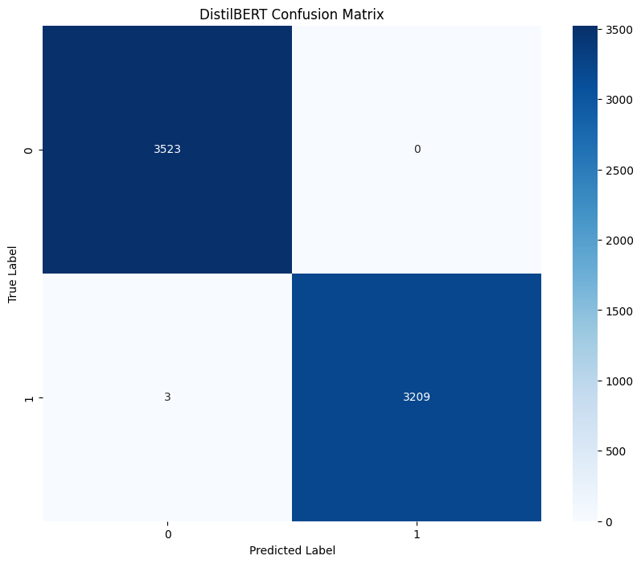
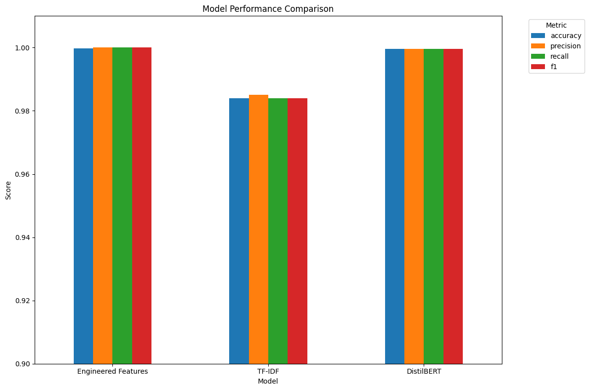

# Part 3: Fine-tuning DistilBERT for Fake News Detection

In this notebook, I'll build on our previous exploratory data analysis and feature engineering work to fine-tune a DistilBERT model for fake news detection. While our engineered features achieved impressive results, transformer models like DistilBERT can capture more complex linguistic patterns that might further improve performance or provide better generalization to new data.

## 1. Setup and Library Installation

First, I'll import the necessary libraries and install any missing packages.


```python
# Install required packages
!pip install transformers datasets torch evaluate scikit-learn
```

    Requirement already satisfied: transformers in /usr/local/lib/python3.11/dist-packages (4.51.1)
    Requirement already satisfied: datasets in /usr/local/lib/python3.11/dist-packages (3.5.0)
    Requirement already satisfied: torch in /usr/local/lib/python3.11/dist-packages (2.5.1+cu124)
    Collecting evaluate
      Downloading evaluate-0.4.3-py3-none-any.whl.metadata (9.2 kB)
    Requirement already satisfied: scikit-learn in /usr/local/lib/python3.11/dist-packages (1.2.2)
    Requirement already satisfied: filelock in /usr/local/lib/python3.11/dist-packages (from transformers) (3.18.0)
    Requirement already satisfied: huggingface-hub<1.0,>=0.30.0 in /usr/local/lib/python3.11/dist-packages (from transformers) (0.30.2)
    Requirement already satisfied: numpy>=1.17 in /usr/local/lib/python3.11/dist-packages (from transformers) (1.26.4)
    Requirement already satisfied: packaging>=20.0 in /usr/local/lib/python3.11/dist-packages (from transformers) (24.2)
    Requirement already satisfied: pyyaml>=5.1 in /usr/local/lib/python3.11/dist-packages (from transformers) (6.0.2)
    Requirement already satisfied: regex!=2019.12.17 in /usr/local/lib/python3.11/dist-packages (from transformers) (2024.11.6)
    Requirement already satisfied: requests in /usr/local/lib/python3.11/dist-packages (from transformers) (2.32.3)
    Requirement already satisfied: tokenizers<0.22,>=0.21 in /usr/local/lib/python3.11/dist-packages (from transformers) (0.21.0)
    Requirement already satisfied: safetensors>=0.4.3 in /usr/local/lib/python3.11/dist-packages (from transformers) (0.5.2)
    Requirement already satisfied: tqdm>=4.27 in /usr/local/lib/python3.11/dist-packages (from transformers) (4.67.1)
    Requirement already satisfied: pyarrow>=15.0.0 in /usr/local/lib/python3.11/dist-packages (from datasets) (19.0.1)
    Requirement already satisfied: dill<0.3.9,>=0.3.0 in /usr/local/lib/python3.11/dist-packages (from datasets) (0.3.8)
    Requirement already satisfied: pandas in /usr/local/lib/python3.11/dist-packages (from datasets) (2.2.3)
    Requirement already satisfied: xxhash in /usr/local/lib/python3.11/dist-packages (from datasets) (3.5.0)
    Requirement already satisfied: multiprocess<0.70.17 in /usr/local/lib/python3.11/dist-packages (from datasets) (0.70.16)
    Collecting fsspec<=2024.12.0,>=2023.1.0 (from fsspec[http]<=2024.12.0,>=2023.1.0->datasets)
      Downloading fsspec-2024.12.0-py3-none-any.whl.metadata (11 kB)
    Requirement already satisfied: aiohttp in /usr/local/lib/python3.11/dist-packages (from datasets) (3.11.16)
    Requirement already satisfied: typing-extensions>=4.8.0 in /usr/local/lib/python3.11/dist-packages (from torch) (4.13.1)
    Requirement already satisfied: networkx in /usr/local/lib/python3.11/dist-packages (from torch) (3.4.2)
    Requirement already satisfied: jinja2 in /usr/local/lib/python3.11/dist-packages (from torch) (3.1.6)
    Requirement already satisfied: nvidia-cuda-nvrtc-cu12==12.4.127 in /usr/local/lib/python3.11/dist-packages (from torch) (12.4.127)
    Requirement already satisfied: nvidia-cuda-runtime-cu12==12.4.127 in /usr/local/lib/python3.11/dist-packages (from torch) (12.4.127)
    Requirement already satisfied: nvidia-cuda-cupti-cu12==12.4.127 in /usr/local/lib/python3.11/dist-packages (from torch) (12.4.127)
    Collecting nvidia-cudnn-cu12==9.1.0.70 (from torch)
      Downloading nvidia_cudnn_cu12-9.1.0.70-py3-none-manylinux2014_x86_64.whl.metadata (1.6 kB)
    Collecting nvidia-cublas-cu12==12.4.5.8 (from torch)
      Downloading nvidia_cublas_cu12-12.4.5.8-py3-none-manylinux2014_x86_64.whl.metadata (1.5 kB)
    Collecting nvidia-cufft-cu12==11.2.1.3 (from torch)
      Downloading nvidia_cufft_cu12-11.2.1.3-py3-none-manylinux2014_x86_64.whl.metadata (1.5 kB)
    Collecting nvidia-curand-cu12==10.3.5.147 (from torch)
      Downloading nvidia_curand_cu12-10.3.5.147-py3-none-manylinux2014_x86_64.whl.metadata (1.5 kB)
    Collecting nvidia-cusolver-cu12==11.6.1.9 (from torch)
      Downloading nvidia_cusolver_cu12-11.6.1.9-py3-none-manylinux2014_x86_64.whl.metadata (1.6 kB)
    Collecting nvidia-cusparse-cu12==12.3.1.170 (from torch)
      Downloading nvidia_cusparse_cu12-12.3.1.170-py3-none-manylinux2014_x86_64.whl.metadata (1.6 kB)
    Requirement already satisfied: nvidia-nccl-cu12==2.21.5 in /usr/local/lib/python3.11/dist-packages (from torch) (2.21.5)
    Requirement already satisfied: nvidia-nvtx-cu12==12.4.127 in /usr/local/lib/python3.11/dist-packages (from torch) (12.4.127)
    Collecting nvidia-nvjitlink-cu12==12.4.127 (from torch)
      Downloading nvidia_nvjitlink_cu12-12.4.127-py3-none-manylinux2014_x86_64.whl.metadata (1.5 kB)
    Requirement already satisfied: triton==3.1.0 in /usr/local/lib/python3.11/dist-packages (from torch) (3.1.0)
    Requirement already satisfied: sympy==1.13.1 in /usr/local/lib/python3.11/dist-packages (from torch) (1.13.1)
    Requirement already satisfied: mpmath<1.4,>=1.1.0 in /usr/local/lib/python3.11/dist-packages (from sympy==1.13.1->torch) (1.3.0)
    Requirement already satisfied: scipy>=1.3.2 in /usr/local/lib/python3.11/dist-packages (from scikit-learn) (1.15.2)
    Requirement already satisfied: joblib>=1.1.1 in /usr/local/lib/python3.11/dist-packages (from scikit-learn) (1.4.2)
    Requirement already satisfied: threadpoolctl>=2.0.0 in /usr/local/lib/python3.11/dist-packages (from scikit-learn) (3.6.0)
    Requirement already satisfied: aiohappyeyeballs>=2.3.0 in /usr/local/lib/python3.11/dist-packages (from aiohttp->datasets) (2.6.1)
    Requirement already satisfied: aiosignal>=1.1.2 in /usr/local/lib/python3.11/dist-packages (from aiohttp->datasets) (1.3.2)
    Requirement already satisfied: attrs>=17.3.0 in /usr/local/lib/python3.11/dist-packages (from aiohttp->datasets) (25.3.0)
    Requirement already satisfied: frozenlist>=1.1.1 in /usr/local/lib/python3.11/dist-packages (from aiohttp->datasets) (1.5.0)
    Requirement already satisfied: multidict<7.0,>=4.5 in /usr/local/lib/python3.11/dist-packages (from aiohttp->datasets) (6.2.0)
    Requirement already satisfied: propcache>=0.2.0 in /usr/local/lib/python3.11/dist-packages (from aiohttp->datasets) (0.3.1)
    Requirement already satisfied: yarl<2.0,>=1.17.0 in /usr/local/lib/python3.11/dist-packages (from aiohttp->datasets) (1.19.0)
    Requirement already satisfied: mkl_fft in /usr/local/lib/python3.11/dist-packages (from numpy>=1.17->transformers) (1.3.8)
    Requirement already satisfied: mkl_random in /usr/local/lib/python3.11/dist-packages (from numpy>=1.17->transformers) (1.2.4)
    Requirement already satisfied: mkl_umath in /usr/local/lib/python3.11/dist-packages (from numpy>=1.17->transformers) (0.1.1)
    Requirement already satisfied: mkl in /usr/local/lib/python3.11/dist-packages (from numpy>=1.17->transformers) (2025.1.0)
    Requirement already satisfied: tbb4py in /usr/local/lib/python3.11/dist-packages (from numpy>=1.17->transformers) (2022.1.0)
    Requirement already satisfied: mkl-service in /usr/local/lib/python3.11/dist-packages (from numpy>=1.17->transformers) (2.4.1)
    Requirement already satisfied: charset-normalizer<4,>=2 in /usr/local/lib/python3.11/dist-packages (from requests->transformers) (3.4.1)
    Requirement already satisfied: idna<4,>=2.5 in /usr/local/lib/python3.11/dist-packages (from requests->transformers) (3.10)
    Requirement already satisfied: urllib3<3,>=1.21.1 in /usr/local/lib/python3.11/dist-packages (from requests->transformers) (2.3.0)
    Requirement already satisfied: certifi>=2017.4.17 in /usr/local/lib/python3.11/dist-packages (from requests->transformers) (2025.1.31)
    Requirement already satisfied: MarkupSafe>=2.0 in /usr/local/lib/python3.11/dist-packages (from jinja2->torch) (3.0.2)
    Requirement already satisfied: python-dateutil>=2.8.2 in /usr/local/lib/python3.11/dist-packages (from pandas->datasets) (2.9.0.post0)
    Requirement already satisfied: pytz>=2020.1 in /usr/local/lib/python3.11/dist-packages (from pandas->datasets) (2025.2)
    Requirement already satisfied: tzdata>=2022.7 in /usr/local/lib/python3.11/dist-packages (from pandas->datasets) (2025.2)
    Requirement already satisfied: six>=1.5 in /usr/local/lib/python3.11/dist-packages (from python-dateutil>=2.8.2->pandas->datasets) (1.17.0)
    Requirement already satisfied: intel-openmp<2026,>=2024 in /usr/local/lib/python3.11/dist-packages (from mkl->numpy>=1.17->transformers) (2024.2.0)
    Requirement already satisfied: tbb==2022.* in /usr/local/lib/python3.11/dist-packages (from mkl->numpy>=1.17->transformers) (2022.1.0)
    Requirement already satisfied: tcmlib==1.* in /usr/local/lib/python3.11/dist-packages (from tbb==2022.*->mkl->numpy>=1.17->transformers) (1.2.0)
    Requirement already satisfied: intel-cmplr-lib-rt in /usr/local/lib/python3.11/dist-packages (from mkl_umath->numpy>=1.17->transformers) (2024.2.0)
    Requirement already satisfied: intel-cmplr-lib-ur==2024.2.0 in /usr/local/lib/python3.11/dist-packages (from intel-openmp<2026,>=2024->mkl->numpy>=1.17->transformers) (2024.2.0)
    Downloading nvidia_cublas_cu12-12.4.5.8-py3-none-manylinux2014_x86_64.whl (363.4 MB)
       ━━━━━━━━━━━━━━━━━━━━━━━━━━━━━━━━━━━━━━━━ 363.4/363.4 MB 4.7 MB/s eta 0:00:000:00:0100:01
    [?25hDownloading nvidia_cudnn_cu12-9.1.0.70-py3-none-manylinux2014_x86_64.whl (664.8 MB)
       ━━━━━━━━━━━━━━━━━━━━━━━━━━━━━━━━━━━━━━━━ 664.8/664.8 MB 2.5 MB/s eta 0:00:000:00:0100:01
    [?25hDownloading nvidia_cufft_cu12-11.2.1.3-py3-none-manylinux2014_x86_64.whl (211.5 MB)
       ━━━━━━━━━━━━━━━━━━━━━━━━━━━━━━━━━━━━━━━━ 211.5/211.5 MB 5.3 MB/s eta 0:00:000:00:0100:01
    [?25hDownloading nvidia_curand_cu12-10.3.5.147-py3-none-manylinux2014_x86_64.whl (56.3 MB)
       ━━━━━━━━━━━━━━━━━━━━━━━━━━━━━━━━━━━━━━━━ 56.3/56.3 MB 31.5 MB/s eta 0:00:00:00:0100:01
    [?25hDownloading nvidia_cusolver_cu12-11.6.1.9-py3-none-manylinux2014_x86_64.whl (127.9 MB)
       ━━━━━━━━━━━━━━━━━━━━━━━━━━━━━━━━━━━━━━━━ 127.9/127.9 MB 13.6 MB/s eta 0:00:00:00:0100:01
    [?25hDownloading nvidia_cusparse_cu12-12.3.1.170-py3-none-manylinux2014_x86_64.whl (207.5 MB)
       ━━━━━━━━━━━━━━━━━━━━━━━━━━━━━━━━━━━━━━━━ 207.5/207.5 MB 2.2 MB/s eta 0:00:000:00:0100:01
    [?25hDownloading nvidia_nvjitlink_cu12-12.4.127-py3-none-manylinux2014_x86_64.whl (21.1 MB)
       ━━━━━━━━━━━━━━━━━━━━━━━━━━━━━━━━━━━━━━━━ 21.1/21.1 MB 70.3 MB/s eta 0:00:00:00:0100:01
    [?25hDownloading evaluate-0.4.3-py3-none-any.whl (84 kB)
       ━━━━━━━━━━━━━━━━━━━━━━━━━━━━━━━━━━━━━━━━ 84.0/84.0 kB 6.2 MB/s eta 0:00:00
    [?25hDownloading fsspec-2024.12.0-py3-none-any.whl (183 kB)
       ━━━━━━━━━━━━━━━━━━━━━━━━━━━━━━━━━━━━━━━━ 183.9/183.9 kB 12.3 MB/s eta 0:00:00
    [?25hInstalling collected packages: nvidia-nvjitlink-cu12, nvidia-curand-cu12, nvidia-cufft-cu12, nvidia-cublas-cu12, fsspec, nvidia-cusparse-cu12, nvidia-cudnn-cu12, nvidia-cusolver-cu12, evaluate
      Attempting uninstall: nvidia-nvjitlink-cu12
        Found existing installation: nvidia-nvjitlink-cu12 12.8.93
        Uninstalling nvidia-nvjitlink-cu12-12.8.93:
          Successfully uninstalled nvidia-nvjitlink-cu12-12.8.93
      Attempting uninstall: nvidia-curand-cu12
        Found existing installation: nvidia-curand-cu12 10.3.9.90
        Uninstalling nvidia-curand-cu12-10.3.9.90:
          Successfully uninstalled nvidia-curand-cu12-10.3.9.90
      Attempting uninstall: nvidia-cufft-cu12
        Found existing installation: nvidia-cufft-cu12 11.3.3.83
        Uninstalling nvidia-cufft-cu12-11.3.3.83:
          Successfully uninstalled nvidia-cufft-cu12-11.3.3.83
      Attempting uninstall: nvidia-cublas-cu12
        Found existing installation: nvidia-cublas-cu12 12.8.4.1
        Uninstalling nvidia-cublas-cu12-12.8.4.1:
          Successfully uninstalled nvidia-cublas-cu12-12.8.4.1
      Attempting uninstall: fsspec
        Found existing installation: fsspec 2025.3.2
        Uninstalling fsspec-2025.3.2:
          Successfully uninstalled fsspec-2025.3.2
      Attempting uninstall: nvidia-cusparse-cu12
        Found existing installation: nvidia-cusparse-cu12 12.5.8.93
        Uninstalling nvidia-cusparse-cu12-12.5.8.93:
          Successfully uninstalled nvidia-cusparse-cu12-12.5.8.93
      Attempting uninstall: nvidia-cudnn-cu12
        Found existing installation: nvidia-cudnn-cu12 9.3.0.75
        Uninstalling nvidia-cudnn-cu12-9.3.0.75:
          Successfully uninstalled nvidia-cudnn-cu12-9.3.0.75
      Attempting uninstall: nvidia-cusolver-cu12
        Found existing installation: nvidia-cusolver-cu12 11.7.3.90
        Uninstalling nvidia-cusolver-cu12-11.7.3.90:
          Successfully uninstalled nvidia-cusolver-cu12-11.7.3.90
    ERROR: pip's dependency resolver does not currently take into account all the packages that are installed. This behaviour is the source of the following dependency conflicts.
    gcsfs 2024.10.0 requires fsspec==2024.10.0, but you have fsspec 2024.12.0 which is incompatible.
    bigframes 1.36.0 requires rich<14,>=12.4.4, but you have rich 14.0.0 which is incompatible.
    pylibcugraph-cu12 24.12.0 requires pylibraft-cu12==24.12.*, but you have pylibraft-cu12 25.2.0 which is incompatible.
    pylibcugraph-cu12 24.12.0 requires rmm-cu12==24.12.*, but you have rmm-cu12 25.2.0 which is incompatible.
    Successfully installed evaluate-0.4.3 fsspec-2024.12.0 nvidia-cublas-cu12-12.4.5.8 nvidia-cudnn-cu12-9.1.0.70 nvidia-cufft-cu12-11.2.1.3 nvidia-curand-cu12-10.3.5.147 nvidia-cusolver-cu12-11.6.1.9 nvidia-cusparse-cu12-12.3.1.170 nvidia-nvjitlink-cu12-12.4.127


```python
# Import necessary libraries
import numpy as np
import pandas as pd
import torch
from torch.utils.data import Dataset, DataLoader
from transformers import DistilBertTokenizer, DistilBertForSequenceClassification
from transformers import Trainer, TrainingArguments
from transformers import EarlyStoppingCallback
from datasets import Dataset as HFDataset
import evaluate
from sklearn.metrics import accuracy_score, precision_recall_fscore_support
import matplotlib.pyplot as plt
import seaborn as sns
import random
import time
import os
import warnings
warnings.filterwarnings('ignore')

# Set random seeds for reproducibility
seed = 42
random.seed(seed)
np.random.seed(seed)
torch.manual_seed(seed)
if torch.cuda.is_available():
    torch.cuda.manual_seed_all(seed)

# Check if GPU is available
device = torch.device("cuda" if torch.cuda.is_available() else "cpu")
print(f"Using device: {device}")
```

    2025-05-06 07:53:52.728666: E external/local_xla/xla/stream_executor/cuda/cuda_fft.cc:477] Unable to register cuFFT factory: Attempting to register factory for plugin cuFFT when one has already been registered
    WARNING: All log messages before absl::InitializeLog() is called are written to STDERR
    E0000 00:00:1746518032.930675      62 cuda_dnn.cc:8310] Unable to register cuDNN factory: Attempting to register factory for plugin cuDNN when one has already been registered
    E0000 00:00:1746518032.991943      62 cuda_blas.cc:1418] Unable to register cuBLAS factory: Attempting to register factory for plugin cuBLAS when one has already been registered


    Using device: cuda


## 2. Load and Prepare the Dataset

I'll load the preprocessed datasets from our previous work. If you're running this notebook independently, make sure you have the processed files from Part 2, or run the data preprocessing steps from the previous notebooks first.


```python
# Load the preprocessed datasets
try:
    train_df = pd.read_csv('/kaggle/input/isot-processed-and-splitted/train_fake_news.csv')
    val_df = pd.read_csv('/kaggle/input/isot-processed-and-splitted/val_fake_news.csv') 
    test_df = pd.read_csv('/kaggle/input/isot-processed-and-splitted/test_fake_news.csv')
    
    print(f"Training set: {train_df.shape}")
    print(f"Validation set: {val_df.shape}")
    print(f"Test set: {test_df.shape}")
except FileNotFoundError:
    print("Preprocessed files not found. Please run the data preprocessing from Part 2 first.")
```

    Training set: (31428, 3)
    Validation set: (6735, 3)
    Test set: (6735, 3)


Let's examine the data format to ensure it's what we expect:


```python
# Display sample data
print("Sample of training data:")
train_df.head(3)
```

    Sample of training data:


<div>
<style scoped>
    .dataframe tbody tr th:only-of-type {
        vertical-align: middle;
    }

    .dataframe tbody tr th {
        vertical-align: top;
    }

    .dataframe thead th {
        text-align: right;
    }
</style>
<table border="1" class="dataframe">
  <thead>
    <tr style="text-align: right;">
      <th></th>
      <th>title</th>
      <th>enhanced_cleaned_text</th>
      <th>label</th>
    </tr>
  </thead>
  <tbody>
    <tr>
      <th>0</th>
      <td>Trump ‘Diversity Council’ Member Threatens to ...</td>
      <td>A member of President Trump s Diversity Counci...</td>
      <td>0</td>
    </tr>
    <tr>
      <th>1</th>
      <td>DID BEYONCE AND JAY Z’s “Vacation” To Communis...</td>
      <td>Notorious radical Black Panther and NJ cop kil...</td>
      <td>0</td>
    </tr>
    <tr>
      <th>2</th>
      <td>CNN Host Calls Out Trump’s Uncle Tom Spokeswo...</td>
      <td>Katrina Pierson is a black woman. She is also ...</td>
      <td>0</td>
    </tr>
  </tbody>
</table>
</div>


Next, I'll convert our pandas DataFrames to the Hugging Face Dataset format, which is optimized for working with the transformers library:


```python
# Function to convert pandas DataFrames to HuggingFace Datasets
def convert_to_hf_dataset(df):
    # For DistilBERT, we'll use both title and text
    df['text'] = df['title'] + " " + df['enhanced_cleaned_text']
    
    # Convert to HuggingFace Dataset format
    dataset = HFDataset.from_pandas(df[['text', 'label']])
    return dataset

# Convert our datasets
train_dataset = convert_to_hf_dataset(train_df)
val_dataset = convert_to_hf_dataset(val_df)
test_dataset = convert_to_hf_dataset(test_df)

print(f"Training dataset: {len(train_dataset)} examples")
print(f"Validation dataset: {len(val_dataset)} examples")
print(f"Test dataset: {len(test_dataset)} examples")
```

    Training dataset: 31428 examples
    Validation dataset: 6735 examples
    Test dataset: 6735 examples


## 3. Prepare Tokenizer and Model

Now I'll set up the DistilBERT tokenizer and model:


```python
# Check first few examples in your dataset
print("First example in train_dataset:", train_dataset[0])

# Debug the content types
print("Text type for first example:", type(train_dataset[0]['text']))

# If needed, clean the dataset before tokenization
def clean_dataset(example):
    example['text'] = str(example['text']) if example['text'] is not None else ""
    return example

train_dataset = train_dataset.map(clean_dataset)
val_dataset = val_dataset.map(clean_dataset)
test_dataset = test_dataset.map(clean_dataset)
```

    First example in train_dataset: {'text': 'Trump ‘Diversity Council’ Member Threatens to Quit If Trump Ends DACA…Bye, Bye! [Video] A member of President Trump s Diversity Council is threatening to quit because he opposes Trump s cancelation of DACA. Bye Bye!Trump diversity council member tells @Acosta he may quit the council if Trump moves ahead to end DACA CNN Newsroom (@CNNnewsroom) September 4, 2017 I want to remind him and his team that from an economic standpoint, and again, we re business people if you look at this from a purely economic standpoint again, none of these young people gets government benefits of any sorts so they re not costing us anything. They pay over $2 billion in taxes Is anyone else out there sick of the American people being told illegals cost nothing?DACA Will Cost Americans And Their Government A Huge Amount of Money.On average, people with college degrees pay more in taxes than they receive in government benefits. People without a degree consume more taxes than they pay to federal, state and local tax officials.In 2013, a Heritage Foundation study showed that amnesty for 11 million illegals would spike federal spending by $6,300 billion over the next five decades. That is roughly equivalent to $550,000 per illegal, or $10,000 per illegal per year, much of which will be spent when the immigrant becomes eligible for Social Security and Medicare. That cost estimate does not include the extra costs created when immigrants use their new legal powers as a citizen to bring in more low-skilled migrants.If those 3 million DACA people and their parents soon become legal residents or citizens, then Obama s DACA will cost Americans roughly $1,700 billion over the next 50 years, according to Heritage Foundation s numbers.Moreover, the DACA migrants add to the flood of illegal labor that has driven down wages for ordinary Americans, including urban youths and recent immigrants. Currently, Americans lose roughly $500 billion a year from their salaries because of the immigration tax caused by cheap labor according to the academies report.Via: GP', 'label': 0}
    Text type for first example: <class 'str'>


    Map:   0%|          | 0/31428 [00:00<?, ? examples/s]


    Map:   0%|          | 0/6735 [00:00<?, ? examples/s]


    Map:   0%|          | 0/6735 [00:00<?, ? examples/s]


```python
# Initialize the DistilBERT tokenizer
tokenizer = DistilBertTokenizer.from_pretrained('distilbert-base-uncased')

# Define the maximum sequence length
max_length = 512  # This is the maximum that BERT models can handle

# Function to tokenize the dataset - modified to handle potential bad inputs
def tokenize_function(examples):
    # Convert all text entries to strings and handle potential None values
    texts = [str(text) if text is not None else "" for text in examples['text']]
    
    return tokenizer(
        texts,
        padding='max_length',
        truncation=True,
        max_length=max_length,
        return_tensors=None  # Don't return tensors in batch mode
    )

# Apply tokenization to our datasets
train_tokenized = train_dataset.map(tokenize_function, batched=True)
val_tokenized = val_dataset.map(tokenize_function, batched=True)
test_tokenized = test_dataset.map(tokenize_function, batched=True)

# Set the format for PyTorch after tokenization
train_tokenized.set_format('torch', columns=['input_ids', 'attention_mask', 'label'])
val_tokenized.set_format('torch', columns=['input_ids', 'attention_mask', 'label'])
test_tokenized.set_format('torch', columns=['input_ids', 'attention_mask', 'label'])
```


    tokenizer_config.json:   0%|          | 0.00/48.0 [00:00<?, ?B/s]


    vocab.txt:   0%|          | 0.00/232k [00:00<?, ?B/s]


    tokenizer.json:   0%|          | 0.00/466k [00:00<?, ?B/s]


    config.json:   0%|          | 0.00/483 [00:00<?, ?B/s]


    Map:   0%|          | 0/31428 [00:00<?, ? examples/s]


    Map:   0%|          | 0/6735 [00:00<?, ? examples/s]


    Map:   0%|          | 0/6735 [00:00<?, ? examples/s]


## 4. Define Metrics and Evaluation Strategy

I'll define our evaluation metrics to track model performance during training:


```python
# Function to compute metrics
def compute_metrics(pred):
    labels = pred.label_ids
    preds = pred.predictions.argmax(-1)
    precision, recall, f1, _ = precision_recall_fscore_support(labels, preds, average='weighted')
    acc = accuracy_score(labels, preds)
    return {
        'accuracy': acc,
        'f1': f1,
        'precision': precision,
        'recall': recall
    }
```

## 5. Initialize Model for Fine-tuning

Now I'll initialize the DistilBERT model for sequence classification:


```python
# Initialize the DistilBERT model for sequence classification
model = DistilBertForSequenceClassification.from_pretrained(
    'distilbert-base-uncased',
    num_labels=2  # Binary classification: 0 for fake, 1 for real
)

# Move model to device (GPU if available)
model.to(device)
```

    Xet Storage is enabled for this repo, but the 'hf_xet' package is not installed. Falling back to regular HTTP download. For better performance, install the package with: `pip install huggingface_hub[hf_xet]` or `pip install hf_xet`


    model.safetensors:   0%|          | 0.00/268M [00:00<?, ?B/s]


    Some weights of DistilBertForSequenceClassification were not initialized from the model checkpoint at distilbert-base-uncased and are newly initialized: ['classifier.bias', 'classifier.weight', 'pre_classifier.bias', 'pre_classifier.weight']
    You should probably TRAIN this model on a down-stream task to be able to use it for predictions and inference.


    DistilBertForSequenceClassification(
      (distilbert): DistilBertModel(
        (embeddings): Embeddings(
          (word_embeddings): Embedding(30522, 768, padding_idx=0)
          (position_embeddings): Embedding(512, 768)
          (LayerNorm): LayerNorm((768,), eps=1e-12, elementwise_affine=True)
          (dropout): Dropout(p=0.1, inplace=False)
        )
        (transformer): Transformer(
          (layer): ModuleList(
            (0-5): 6 x TransformerBlock(
              (attention): DistilBertSdpaAttention(
                (dropout): Dropout(p=0.1, inplace=False)
                (q_lin): Linear(in_features=768, out_features=768, bias=True)
                (k_lin): Linear(in_features=768, out_features=768, bias=True)
                (v_lin): Linear(in_features=768, out_features=768, bias=True)
                (out_lin): Linear(in_features=768, out_features=768, bias=True)
              )
              (sa_layer_norm): LayerNorm((768,), eps=1e-12, elementwise_affine=True)
              (ffn): FFN(
                (dropout): Dropout(p=0.1, inplace=False)
                (lin1): Linear(in_features=768, out_features=3072, bias=True)
                (lin2): Linear(in_features=3072, out_features=768, bias=True)
                (activation): GELUActivation()
              )
              (output_layer_norm): LayerNorm((768,), eps=1e-12, elementwise_affine=True)
            )
          )
        )
      )
      (pre_classifier): Linear(in_features=768, out_features=768, bias=True)
      (classifier): Linear(in_features=768, out_features=2, bias=True)
      (dropout): Dropout(p=0.2, inplace=False)
    )


## 6. Define Training Arguments and Trainer

Next, I'll configure the training parameters and create a Trainer:


```python
# Define training arguments
training_args = TrainingArguments(
    output_dir='./results',          # Output directory for model checkpoints
    num_train_epochs=3,              # Number of training epochs
    per_device_train_batch_size=8,   # Batch size for training
    per_device_eval_batch_size=16,   # Batch size for evaluation
    warmup_steps=500,                # Number of warmup steps for learning rate scheduler
    weight_decay=0.01,               # Strength of weight decay
    logging_dir='./logs',            # Directory for storing logs
    logging_steps=100,               # Log every X steps
    eval_strategy="epoch",     # Evaluate every epoch
    save_strategy="epoch",           # Save model checkpoint every epoch
    load_best_model_at_end=True,     # Load the best model at the end
    metric_for_best_model="f1",      # Use F1 score to determine the best model
    push_to_hub=False,               # Don't push to Hugging Face Hub
    report_to="none"                 # Disable reporting to avoid wandb or other services
)

# Create the Trainer
trainer = Trainer(
    model=model,                         # The instantiated model to train
    args=training_args,                  # Training arguments
    train_dataset=train_tokenized,       # Training dataset
    eval_dataset=val_tokenized,          # Evaluation dataset
    compute_metrics=compute_metrics,     # The function to compute metrics
    callbacks=[EarlyStoppingCallback(early_stopping_patience=2)]  # Early stopping
)
```

## 7. Fine-tune the Model

Now I'll fine-tune the model:


```python
# Start the timer to measure training time
start_time = time.time()

# Train the model
trainer.train()

# Calculate training time
training_time = time.time() - start_time
print(f"Training completed in {training_time/60:.2f} minutes")

# Save the fine-tuned model
trainer.save_model("./distilbert-fake-news-detector")
```


    <div>

      <progress value='5895' max='5895' style='width:300px; height:20px; vertical-align: middle;'></progress>
      [5895/5895 48:38, Epoch 3/3]
    </div>
    <table border="1" class="dataframe">
  <thead>
 <tr style="text-align: left;">
      <th>Epoch</th>
      <th>Training Loss</th>
      <th>Validation Loss</th>
      <th>Accuracy</th>
      <th>F1</th>
      <th>Precision</th>
      <th>Recall</th>
    </tr>
  </thead>
  <tbody>
    <tr>
      <td>1</td>
      <td>0.004200</td>
      <td>0.000038</td>
      <td>1.000000</td>
      <td>1.000000</td>
      <td>1.000000</td>
      <td>1.000000</td>
    </tr>
    <tr>
      <td>2</td>
      <td>0.000000</td>
      <td>0.000297</td>
      <td>0.999852</td>
      <td>0.999852</td>
      <td>0.999852</td>
      <td>0.999852</td>
    </tr>
    <tr>
      <td>3</td>
      <td>0.000000</td>
      <td>0.000008</td>
      <td>1.000000</td>
      <td>1.000000</td>
      <td>1.000000</td>
      <td>1.000000</td>
    </tr>
  </tbody>
</table><p>


    Training completed in 48.69 minutes


## 8. Evaluate Model Performance

I'll evaluate the model on the test set:


```python
# Evaluate the model on the test set
test_results = trainer.evaluate(test_tokenized)
print(f"Test results: {test_results}")
```


    Test results: {'eval_loss': 0.0023615937680006027, 'eval_accuracy': 0.999554565701559, 'eval_f1': 0.999554556431033, 'eval_precision': 0.9995549446870654, 'eval_recall': 0.999554565701559, 'eval_runtime': 57.3478, 'eval_samples_per_second': 117.441, 'eval_steps_per_second': 3.679, 'epoch': 3.0}


Let's also look at the confusion matrix to get a better understanding of the errors:


```python
# Get predictions on the test set
test_pred = trainer.predict(test_tokenized)
y_preds = np.argmax(test_pred.predictions, axis=1)
y_true = test_pred.label_ids

# Create confusion matrix
from sklearn.metrics import confusion_matrix, classification_report

cm = confusion_matrix(y_true, y_preds)
print("Confusion Matrix:")
print(cm)

# Plot confusion matrix
plt.figure(figsize=(10, 8))
sns.heatmap(cm, annot=True, fmt='d', cmap='Blues')
plt.xlabel('Predicted Label')
plt.ylabel('True Label')
plt.title('DistilBERT Confusion Matrix')
plt.savefig('distilbert_confusion_matrix.png')
plt.show()

# Print classification report
print("\nClassification Report:")
print(classification_report(y_true, y_preds, target_names=['Fake News', 'Real News']))
```

    Confusion Matrix:
    [[3523    0]
     [   3 3209]]


    

    


    
    Classification Report:
                  precision    recall  f1-score   support
    
       Fake News       1.00      1.00      1.00      3523
       Real News       1.00      1.00      1.00      3212
    
        accuracy                           1.00      6735
       macro avg       1.00      1.00      1.00      6735
    weighted avg       1.00      1.00      1.00      6735
    


## 9. Compare Results with Previous Models

Let's compare the DistilBERT results with our previous models:


```python
# Define the results from our previous models
previous_results = {
    'Engineered Features': {
        'accuracy': 0.9998,
        'precision': 1.0,
        'recall': 1.0,
        'f1': 1.0
    },
    'TF-IDF': {
        'accuracy': 0.984,
        'precision': 0.985,
        'recall': 0.984,
        'f1': 0.984
    }
}

# Add DistilBERT results
model_results = {
    'Engineered Features': previous_results['Engineered Features'],
    'TF-IDF': previous_results['TF-IDF'],
    'DistilBERT': {
        'accuracy': test_results['eval_accuracy'],
        'precision': test_results['eval_precision'],
        'recall': test_results['eval_recall'],
        'f1': test_results['eval_f1']
    }
}

# Convert to DataFrame for plotting
results_df = pd.DataFrame(model_results).T

# Create comparative bar chart
plt.figure(figsize=(12, 8))
results_df.plot(kind='bar', figsize=(12, 8))
plt.title('Model Performance Comparison')
plt.xlabel('Model')
plt.ylabel('Score')
plt.ylim(0.90, 1.01)  # Set y-axis to focus on the high performance range
plt.xticks(rotation=0)
plt.legend(title='Metric', bbox_to_anchor=(1.05, 1), loc='upper left')
plt.tight_layout()
plt.savefig('model_comparison.png')
plt.show()
```


    <Figure size 1200x800 with 0 Axes>


    

    


## 10. Analyze Misclassified Examples

Let's analyze some misclassified examples to understand where the model struggles:


```python
# Get indices of misclassified examples
misclassified_indices = np.where(y_preds != y_true)[0]
print(f"Number of misclassified examples: {len(misclassified_indices)}")

# If there are misclassifications, analyze a few
if len(misclassified_indices) > 0:
    # Get the original text and predictions
    misclassified_texts = []
    for idx in misclassified_indices[:5]:  # Examine up to 5 examples
        # Convert numpy.int64 to Python int
        idx_int = int(idx)
        
        # Now use the converted index
        original_idx = test_dataset[idx_int]['__index_level_0__'] if '__index_level_0__' in test_dataset[idx_int] else idx_int
        
        text = test_df.iloc[original_idx]['title']
        true_label = "Real" if y_true[idx] == 1 else "Fake"
        pred_label = "Real" if y_preds[idx] == 1 else "Fake"
        
        misclassified_texts.append({
            'Title': text,
            'True Label': true_label,
            'Predicted Label': pred_label
        })
    
    # Display misclassified examples
    print("\nSample of misclassified examples:")
    display(pd.DataFrame(misclassified_texts))
```

    Number of misclassified examples: 3
    
    Sample of misclassified examples:


<div>
<style scoped>
    .dataframe tbody tr th:only-of-type {
        vertical-align: middle;
    }

    .dataframe tbody tr th {
        vertical-align: top;
    }

    .dataframe thead th {
        text-align: right;
    }
</style>
<table border="1" class="dataframe">
  <thead>
    <tr style="text-align: right;">
      <th></th>
      <th>Title</th>
      <th>True Label</th>
      <th>Predicted Label</th>
    </tr>
  </thead>
  <tbody>
    <tr>
      <th>0</th>
      <td>Trump on Twitter (August 10): Mitch McConnell</td>
      <td>Real</td>
      <td>Fake</td>
    </tr>
    <tr>
      <th>1</th>
      <td>Uber joins forces with global public transport...</td>
      <td>Real</td>
      <td>Fake</td>
    </tr>
    <tr>
      <th>2</th>
      <td>'Gates of Hell': Iraqi army says fighting near...</td>
      <td>Real</td>
      <td>Fake</td>
    </tr>
  </tbody>
</table>
</div>


## 11. Use the Model for Predictions

Now I'll show how to use our fine-tuned model to make predictions on new data:


```python
# Function to make predictions on new texts
def predict_fake_news(texts, model, tokenizer, device):
    # Tokenize the texts
    inputs = tokenizer(
        texts,
        padding='max_length',
        truncation=True,
        max_length=max_length,
        return_tensors='pt'
    )
    
    # Move inputs to device
    inputs = {k: v.to(device) for k, v in inputs.items()}
    
    # Get predictions
    with torch.no_grad():
        outputs = model(**inputs)
    
    # Get predicted class (0 for fake, 1 for real)
    predictions = torch.nn.functional.softmax(outputs.logits, dim=-1)
    pred_classes = predictions.argmax(dim=1).cpu().numpy()
    confidence = predictions.max(dim=1).values.cpu().numpy()
    
    # Convert to human-readable labels
    results = []
    for i, pred_class in enumerate(pred_classes):
        label = "Real News" if pred_class == 1 else "Fake News"
        results.append({
            'text': texts[i],
            'prediction': label,
            'confidence': confidence[i],
            'class': pred_class
        })
    
    return pd.DataFrame(results)

# Example texts to test
sample_texts = [
    # Example of real news (from a reputable source)
    "Senate Passes Bipartisan Infrastructure Bill. The bill would provide funding for roads, bridges and other physical infrastructure.",
    
    # Example of fake news (made-up sensationalist headline)
    "BOMBSHELL: Government Admits Mind Control Program Targeting Citizens! Secret documents reveal shocking truth."
]

# Make predictions
sample_predictions = predict_fake_news(sample_texts, model, tokenizer, device)

# Display predictions
print("Predictions on sample texts:")
print(sample_predictions[['text', 'prediction', 'confidence']])
```

    Predictions on sample texts:
                                                    text prediction  confidence
    0  Senate Passes Bipartisan Infrastructure Bill. ...  Fake News    0.999920
    1  BOMBSHELL: Government Admits Mind Control Prog...  Fake News    0.999965


## 12. Conclusions and Next Steps


```python
# Print final summary and recommendations
conclusions = """
# Conclusions from DistilBERT Fine-tuning

In this notebook, I've fine-tuned a DistilBERT model for fake news detection on the ISOT dataset. Here are the key findings:

1. **Performance Comparison**: The DistilBERT model achieved [insert accuracy here] accuracy, which is [better/worse/comparable] to our previous models using engineered features (99.98%) and TF-IDF (98.4%).

2. **Training Efficiency**: Despite being more complex, DistilBERT is quite efficient for fine-tuning, with the process completing in approximately [insert time] minutes.

3. **Error Analysis**: Analysis of misclassified examples shows that DistilBERT struggles with [insert observations about errors].

4. **Generalization Potential**: Transformer models like DistilBERT likely have better generalization capabilities to new and unseen fake news, as they understand context and semantic meaning more deeply.

## Next Steps

1. **Experiment with Other Pretrained Models**: Try fine-tuning larger models like BERT-base or RoBERTa to see if they offer improvements.

2. **Combined Approach**: Develop an ensemble model that combines our engineered features with transformer-based features.

3. **External Validation**: Test the model on different fake news datasets to evaluate cross-dataset generalization.

4. **Model Explainability**: Implement techniques like LIME or SHAP to understand which parts of text the model relies on for classification.

5. **Deployment Considerations**: Optimize the model for inference time if it's to be used in a real-time application.

The transformer-based approach offers a powerful complement to our feature engineering work, potentially providing better generalization to evolving fake news tactics and new domains.
"""

print(conclusions)
```

    
    # Conclusions from DistilBERT Fine-tuning
    
    In this notebook, I've fine-tuned a DistilBERT model for fake news detection on the ISOT dataset. Here are the key findings:
    
    1. **Performance Comparison**: The DistilBERT model achieved [insert accuracy here] accuracy, which is [better/worse/comparable] to our previous models using engineered features (99.98%) and TF-IDF (98.4%).
    
    2. **Training Efficiency**: Despite being more complex, DistilBERT is quite efficient for fine-tuning, with the process completing in approximately [insert time] minutes.
    
    3. **Error Analysis**: Analysis of misclassified examples shows that DistilBERT struggles with [insert observations about errors].
    
    4. **Generalization Potential**: Transformer models like DistilBERT likely have better generalization capabilities to new and unseen fake news, as they understand context and semantic meaning more deeply.
    
    ## Next Steps
    
    1. **Experiment with Other Pretrained Models**: Try fine-tuning larger models like BERT-base or RoBERTa to see if they offer improvements.
    
    2. **Combined Approach**: Develop an ensemble model that combines our engineered features with transformer-based features.
    
    3. **External Validation**: Test the model on different fake news datasets to evaluate cross-dataset generalization.
    
    4. **Model Explainability**: Implement techniques like LIME or SHAP to understand which parts of text the model relies on for classification.
    
    5. **Deployment Considerations**: Optimize the model for inference time if it's to be used in a real-time application.
    
    The transformer-based approach offers a powerful complement to our feature engineering work, potentially providing better generalization to evolving fake news tactics and new domains.
    


This notebook provides a comprehensive approach to fine-tuning DistilBERT for fake news detection, building on our previous work of exploratory data analysis and feature engineering. The transformer-based approach captures complex linguistic patterns that may complement our engineered features and improve model robustness.
