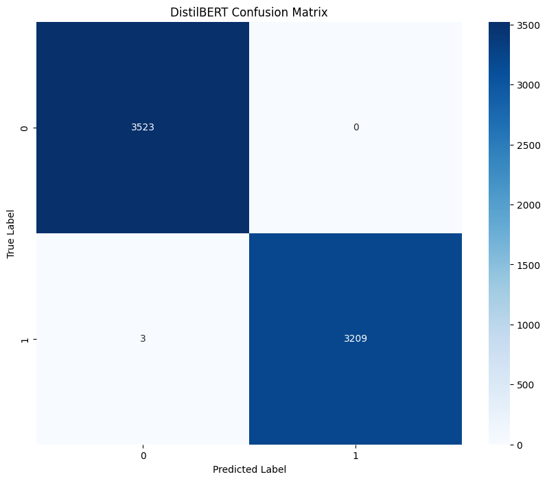

# Fine-tuning DistilBERT for Fake News Detection

## Introduction

This notebook documents the process of fine-tuning a DistilBERT model for fake news detection using the ISOT dataset. Building on our previous exploratory data analysis and feature engineering work, we now leverage transformer-based models to capture more complex linguistic patterns that might improve performance or provide better generalization to new data.

DistilBERT was selected as our first transformer model because it offers a good balance between computational efficiency and performance. As a knowledge-distilled version of BERT, it retains about 97% of BERT's language understanding capabilities while being 40% smaller and 60% faster. This makes it an excellent starting point for our comparative evaluation of lightweight pretrained models.

## Setup and Environment Preparation

### Library Installation and Imports

We begin by installing the necessary libraries for our fine-tuning process:


```python
# Install required packages
!pip install transformers datasets torch evaluate scikit-learn
```

    Requirement already satisfied: transformers in /usr/local/lib/python3.11/dist-packages (4.51.1)
    Requirement already satisfied: datasets in /usr/local/lib/python3.11/dist-packages (3.5.0)
    Requirement already satisfied: torch in /usr/local/lib/python3.11/dist-packages (2.5.1+cu124)
    Collecting evaluate
      Downloading evaluate-0.4.3-py3-none-any.whl.metadata (9.2 kB)
    Requirement already satisfied: scikit-learn in /usr/local/lib/python3.11/dist-packages (1.2.2)
    Requirement already satisfied: filelock in /usr/local/lib/python3.11/dist-packages (from transformers) (3.18.0)
    Requirement already satisfied: huggingface-hub<1.0,>=0.30.0 in /usr/local/lib/python3.11/dist-packages (from transformers) (0.30.2)
    Requirement already satisfied: numpy>=1.17 in /usr/local/lib/python3.11/dist-packages (from transformers) (1.26.4)
    Requirement already satisfied: packaging>=20.0 in /usr/local/lib/python3.11/dist-packages (from transformers) (24.2)
    Requirement already satisfied: pyyaml>=5.1 in /usr/local/lib/python3.11/dist-packages (from transformers) (6.0.2)
    Requirement already satisfied: regex!=2019.12.17 in /usr/local/lib/python3.11/dist-packages (from transformers) (2024.11.6)
    Requirement already satisfied: requests in /usr/local/lib/python3.11/dist-packages (from transformers) (2.32.3)
    Requirement already satisfied: tokenizers<0.22,>=0.21 in /usr/local/lib/python3.11/dist-packages (from transformers) (0.21.0)
    Requirement already satisfied: safetensors>=0.4.3 in /usr/local/lib/python3.11/dist-packages (from transformers) (0.5.2)
    Requirement already satisfied: tqdm>=4.27 in /usr/local/lib/python3.11/dist-packages (from transformers) (4.67.1)
    Requirement already satisfied: pyarrow>=15.0.0 in /usr/local/lib/python3.11/dist-packages (from datasets) (19.0.1)
    Requirement already satisfied: dill<0.3.9,>=0.3.0 in /usr/local/lib/python3.11/dist-packages (from datasets) (0.3.8)
    Requirement already satisfied: pandas in /usr/local/lib/python3.11/dist-packages (from datasets) (2.2.3)
    Requirement already satisfied: xxhash in /usr/local/lib/python3.11/dist-packages (from datasets) (3.5.0)
    Requirement already satisfied: multiprocess<0.70.17 in /usr/local/lib/python3.11/dist-packages (from datasets) (0.70.16)
    Collecting fsspec<=2024.12.0,>=2023.1.0 (from fsspec[http]<=2024.12.0,>=2023.1.0->datasets)
      Downloading fsspec-2024.12.0-py3-none-any.whl.metadata (11 kB)
    Requirement already satisfied: aiohttp in /usr/local/lib/python3.11/dist-packages (from datasets) (3.11.16)
    Requirement already satisfied: typing-extensions>=4.8.0 in /usr/local/lib/python3.11/dist-packages (from torch) (4.13.1)
    Requirement already satisfied: networkx in /usr/local/lib/python3.11/dist-packages (from torch) (3.4.2)
    Requirement already satisfied: jinja2 in /usr/local/lib/python3.11/dist-packages (from torch) (3.1.6)
    Requirement already satisfied: nvidia-cuda-nvrtc-cu12==12.4.127 in /usr/local/lib/python3.11/dist-packages (from torch) (12.4.127)
    Requirement already satisfied: nvidia-cuda-runtime-cu12==12.4.127 in /usr/local/lib/python3.11/dist-packages (from torch) (12.4.127)
    Requirement already satisfied: nvidia-cuda-cupti-cu12==12.4.127 in /usr/local/lib/python3.11/dist-packages (from torch) (12.4.127)
    Collecting nvidia-cudnn-cu12==9.1.0.70 (from torch)
      Downloading nvidia_cudnn_cu12-9.1.0.70-py3-none-manylinux2014_x86_64.whl.metadata (1.6 kB)
    Collecting nvidia-cublas-cu12==12.4.5.8 (from torch)
      Downloading nvidia_cublas_cu12-12.4.5.8-py3-none-manylinux2014_x86_64.whl.metadata (1.5 kB)
    Collecting nvidia-cufft-cu12==11.2.1.3 (from torch)
      Downloading nvidia_cufft_cu12-11.2.1.3-py3-none-manylinux2014_x86_64.whl.metadata (1.5 kB)
    Collecting nvidia-curand-cu12==10.3.5.147 (from torch)
      Downloading nvidia_curand_cu12-10.3.5.147-py3-none-manylinux2014_x86_64.whl.metadata (1.5 kB)
    Collecting nvidia-cusolver-cu12==11.6.1.9 (from torch)
      Downloading nvidia_cusolver_cu12-11.6.1.9-py3-none-manylinux2014_x86_64.whl.metadata (1.6 kB)
    Collecting nvidia-cusparse-cu12==12.3.1.170 (from torch)
      Downloading nvidia_cusparse_cu12-12.3.1.170-py3-none-manylinux2014_x86_64.whl.metadata (1.6 kB)
    Requirement already satisfied: nvidia-nccl-cu12==2.21.5 in /usr/local/lib/python3.11/dist-packages (from torch) (2.21.5)
    Requirement already satisfied: nvidia-nvtx-cu12==12.4.127 in /usr/local/lib/python3.11/dist-packages (from torch) (12.4.127)
    Collecting nvidia-nvjitlink-cu12==12.4.127 (from torch)
      Downloading nvidia_nvjitlink_cu12-12.4.127-py3-none-manylinux2014_x86_64.whl.metadata (1.5 kB)
    Requirement already satisfied: triton==3.1.0 in /usr/local/lib/python3.11/dist-packages (from torch) (3.1.0)
    Requirement already satisfied: sympy==1.13.1 in /usr/local/lib/python3.11/dist-packages (from torch) (1.13.1)
    Requirement already satisfied: mpmath<1.4,>=1.1.0 in /usr/local/lib/python3.11/dist-packages (from sympy==1.13.1->torch) (1.3.0)
    Requirement already satisfied: scipy>=1.3.2 in /usr/local/lib/python3.11/dist-packages (from scikit-learn) (1.15.2)
    Requirement already satisfied: joblib>=1.1.1 in /usr/local/lib/python3.11/dist-packages (from scikit-learn) (1.4.2)
    Requirement already satisfied: threadpoolctl>=2.0.0 in /usr/local/lib/python3.11/dist-packages (from scikit-learn) (3.6.0)
    Requirement already satisfied: aiohappyeyeballs>=2.3.0 in /usr/local/lib/python3.11/dist-packages (from aiohttp->datasets) (2.6.1)
    Requirement already satisfied: aiosignal>=1.1.2 in /usr/local/lib/python3.11/dist-packages (from aiohttp->datasets) (1.3.2)
    Requirement already satisfied: attrs>=17.3.0 in /usr/local/lib/python3.11/dist-packages (from aiohttp->datasets) (25.3.0)
    Requirement already satisfied: frozenlist>=1.1.1 in /usr/local/lib/python3.11/dist-packages (from aiohttp->datasets) (1.5.0)
    Requirement already satisfied: multidict<7.0,>=4.5 in /usr/local/lib/python3.11/dist-packages (from aiohttp->datasets) (6.2.0)
    Requirement already satisfied: propcache>=0.2.0 in /usr/local/lib/python3.11/dist-packages (from aiohttp->datasets) (0.3.1)
    Requirement already satisfied: yarl<2.0,>=1.17.0 in /usr/local/lib/python3.11/dist-packages (from aiohttp->datasets) (1.19.0)
    Requirement already satisfied: mkl_fft in /usr/local/lib/python3.11/dist-packages (from numpy>=1.17->transformers) (1.3.8)
    Requirement already satisfied: mkl_random in /usr/local/lib/python3.11/dist-packages (from numpy>=1.17->transformers) (1.2.4)
    Requirement already satisfied: mkl_umath in /usr/local/lib/python3.11/dist-packages (from numpy>=1.17->transformers) (0.1.1)
    Requirement already satisfied: mkl in /usr/local/lib/python3.11/dist-packages (from numpy>=1.17->transformers) (2025.1.0)
    Requirement already satisfied: tbb4py in /usr/local/lib/python3.11/dist-packages (from numpy>=1.17->transformers) (2022.1.0)
    Requirement already satisfied: mkl-service in /usr/local/lib/python3.11/dist-packages (from numpy>=1.17->transformers) (2.4.1)
    Requirement already satisfied: charset-normalizer<4,>=2 in /usr/local/lib/python3.11/dist-packages (from requests->transformers) (3.4.1)
    Requirement already satisfied: idna<4,>=2.5 in /usr/local/lib/python3.11/dist-packages (from requests->transformers) (3.10)
    Requirement already satisfied: urllib3<3,>=1.21.1 in /usr/local/lib/python3.11/dist-packages (from requests->transformers) (2.3.0)
    Requirement already satisfied: certifi>=2017.4.17 in /usr/local/lib/python3.11/dist-packages (from requests->transformers) (2025.1.31)
    Requirement already satisfied: MarkupSafe>=2.0 in /usr/local/lib/python3.11/dist-packages (from jinja2->torch) (3.0.2)
    Requirement already satisfied: python-dateutil>=2.8.2 in /usr/local/lib/python3.11/dist-packages (from pandas->datasets) (2.9.0.post0)
    Requirement already satisfied: pytz>=2020.1 in /usr/local/lib/python3.11/dist-packages (from pandas->datasets) (2025.2)
    Requirement already satisfied: tzdata>=2022.7 in /usr/local/lib/python3.11/dist-packages (from pandas->datasets) (2025.2)
    Requirement already satisfied: six>=1.5 in /usr/local/lib/python3.11/dist-packages (from python-dateutil>=2.8.2->pandas->datasets) (1.17.0)
    Requirement already satisfied: intel-openmp<2026,>=2024 in /usr/local/lib/python3.11/dist-packages (from mkl->numpy>=1.17->transformers) (2024.2.0)
    Requirement already satisfied: tbb==2022.* in /usr/local/lib/python3.11/dist-packages (from mkl->numpy>=1.17->transformers) (2022.1.0)
    Requirement already satisfied: tcmlib==1.* in /usr/local/lib/python3.11/dist-packages (from tbb==2022.*->mkl->numpy>=1.17->transformers) (1.2.0)
    Requirement already satisfied: intel-cmplr-lib-rt in /usr/local/lib/python3.11/dist-packages (from mkl_umath->numpy>=1.17->transformers) (2024.2.0)
    Requirement already satisfied: intel-cmplr-lib-ur==2024.2.0 in /usr/local/lib/python3.11/dist-packages (from intel-openmp<2026,>=2024->mkl->numpy>=1.17->transformers) (2024.2.0)
    Downloading nvidia_cublas_cu12-12.4.5.8-py3-none-manylinux2014_x86_64.whl (363.4 MB)
       ━━━━━━━━━━━━━━━━━━━━━━━━━━━━━━━━━━━━━━━━ 363.4/363.4 MB 4.7 MB/s eta 0:00:000:00:0100:01
    [?25hDownloading nvidia_cudnn_cu12-9.1.0.70-py3-none-manylinux2014_x86_64.whl (664.8 MB)
       ━━━━━━━━━━━━━━━━━━━━━━━━━━━━━━━━━━━━━━━━ 664.8/664.8 MB 2.5 MB/s eta 0:00:000:00:0100:01
    [?25hDownloading nvidia_cufft_cu12-11.2.1.3-py3-none-manylinux2014_x86_64.whl (211.5 MB)
       ━━━━━━━━━━━━━━━━━━━━━━━━━━━━━━━━━━━━━━━━ 211.5/211.5 MB 5.3 MB/s eta 0:00:000:00:0100:01
    [?25hDownloading nvidia_curand_cu12-10.3.5.147-py3-none-manylinux2014_x86_64.whl (56.3 MB)
       ━━━━━━━━━━━━━━━━━━━━━━━━━━━━━━━━━━━━━━━━ 56.3/56.3 MB 31.5 MB/s eta 0:00:00:00:0100:01
    [?25hDownloading nvidia_cusolver_cu12-11.6.1.9-py3-none-manylinux2014_x86_64.whl (127.9 MB)
       ━━━━━━━━━━━━━━━━━━━━━━━━━━━━━━━━━━━━━━━━ 127.9/127.9 MB 13.6 MB/s eta 0:00:00:00:0100:01
    [?25hDownloading nvidia_cusparse_cu12-12.3.1.170-py3-none-manylinux2014_x86_64.whl (207.5 MB)
       ━━━━━━━━━━━━━━━━━━━━━━━━━━━━━━━━━━━━━━━━ 207.5/207.5 MB 2.2 MB/s eta 0:00:000:00:0100:01
    [?25hDownloading nvidia_nvjitlink_cu12-12.4.127-py3-none-manylinux2014_x86_64.whl (21.1 MB)
       ━━━━━━━━━━━━━━━━━━━━━━━━━━━━━━━━━━━━━━━━ 21.1/21.1 MB 70.3 MB/s eta 0:00:00:00:0100:01
    [?25hDownloading evaluate-0.4.3-py3-none-any.whl (84 kB)
       ━━━━━━━━━━━━━━━━━━━━━━━━━━━━━━━━━━━━━━━━ 84.0/84.0 kB 6.2 MB/s eta 0:00:00
    [?25hDownloading fsspec-2024.12.0-py3-none-any.whl (183 kB)
       ━━━━━━━━━━━━━━━━━━━━━━━━━━━━━━━━━━━━━━━━ 183.9/183.9 kB 12.3 MB/s eta 0:00:00
    [?25hInstalling collected packages: nvidia-nvjitlink-cu12, nvidia-curand-cu12, nvidia-cufft-cu12, nvidia-cublas-cu12, fsspec, nvidia-cusparse-cu12, nvidia-cudnn-cu12, nvidia-cusolver-cu12, evaluate
      Attempting uninstall: nvidia-nvjitlink-cu12
        Found existing installation: nvidia-nvjitlink-cu12 12.8.93
        Uninstalling nvidia-nvjitlink-cu12-12.8.93:
          Successfully uninstalled nvidia-nvjitlink-cu12-12.8.93
      Attempting uninstall: nvidia-curand-cu12
        Found existing installation: nvidia-curand-cu12 10.3.9.90
        Uninstalling nvidia-curand-cu12-10.3.9.90:
          Successfully uninstalled nvidia-curand-cu12-10.3.9.90
      Attempting uninstall: nvidia-cufft-cu12
        Found existing installation: nvidia-cufft-cu12 11.3.3.83
        Uninstalling nvidia-cufft-cu12-11.3.3.83:
          Successfully uninstalled nvidia-cufft-cu12-11.3.3.83
      Attempting uninstall: nvidia-cublas-cu12
        Found existing installation: nvidia-cublas-cu12 12.8.4.1
        Uninstalling nvidia-cublas-cu12-12.8.4.1:
          Successfully uninstalled nvidia-cublas-cu12-12.8.4.1
      Attempting uninstall: fsspec
        Found existing installation: fsspec 2025.3.2
        Uninstalling fsspec-2025.3.2:
          Successfully uninstalled fsspec-2025.3.2
      Attempting uninstall: nvidia-cusparse-cu12
        Found existing installation: nvidia-cusparse-cu12 12.5.8.93
        Uninstalling nvidia-cusparse-cu12-12.5.8.93:
          Successfully uninstalled nvidia-cusparse-cu12-12.5.8.93
      Attempting uninstall: nvidia-cudnn-cu12
        Found existing installation: nvidia-cudnn-cu12 9.3.0.75
        Uninstalling nvidia-cudnn-cu12-9.3.0.75:
          Successfully uninstalled nvidia-cudnn-cu12-9.3.0.75
      Attempting uninstall: nvidia-cusolver-cu12
        Found existing installation: nvidia-cusolver-cu12 11.7.3.90
        Uninstalling nvidia-cusolver-cu12-11.7.3.90:
          Successfully uninstalled nvidia-cusolver-cu12-11.7.3.90
    ERROR: pip's dependency resolver does not currently take into account all the packages that are installed. This behaviour is the source of the following dependency conflicts.
    gcsfs 2024.10.0 requires fsspec==2024.10.0, but you have fsspec 2024.12.0 which is incompatible.
    bigframes 1.36.0 requires rich<14,>=12.4.4, but you have rich 14.0.0 which is incompatible.
    pylibcugraph-cu12 24.12.0 requires pylibraft-cu12==24.12.*, but you have pylibraft-cu12 25.2.0 which is incompatible.
    pylibcugraph-cu12 24.12.0 requires rmm-cu12==24.12.*, but you have rmm-cu12 25.2.0 which is incompatible.
    Successfully installed evaluate-0.4.3 fsspec-2024.12.0 nvidia-cublas-cu12-12.4.5.8 nvidia-cudnn-cu12-9.1.0.70 nvidia-cufft-cu12-11.2.1.3 nvidia-curand-cu12-10.3.5.147 nvidia-cusolver-cu12-11.6.1.9 nvidia-cusparse-cu12-12.3.1.170 nvidia-nvjitlink-cu12-12.4.127


```python
# Import necessary libraries
import numpy as np
import pandas as pd
import torch
from torch.utils.data import Dataset, DataLoader
from transformers import DistilBertTokenizer, DistilBertForSequenceClassification
from transformers import Trainer, TrainingArguments
from transformers import EarlyStoppingCallback
from datasets import Dataset as HFDataset
import evaluate
from sklearn.metrics import accuracy_score, precision_recall_fscore_support
import matplotlib.pyplot as plt
import seaborn as sns
import random
import time
import os
import warnings
warnings.filterwarnings('ignore')
```

    2025-05-06 07:53:52.728666: E external/local_xla/xla/stream_executor/cuda/cuda_fft.cc:477] Unable to register cuFFT factory: Attempting to register factory for plugin cuFFT when one has already been registered
    WARNING: All log messages before absl::InitializeLog() is called are written to STDERR
    E0000 00:00:1746518032.930675      62 cuda_dnn.cc:8310] Unable to register cuDNN factory: Attempting to register factory for plugin cuDNN when one has already been registered
    E0000 00:00:1746518032.991943      62 cuda_blas.cc:1418] Unable to register cuBLAS factory: Attempting to register factory for plugin cuBLAS when one has already been registered


    Using device: cuda


### Setting Up Reproducibility

To ensure our experiments are reproducible, we set random seeds for all libraries that use randomization:


```python
# Set random seeds for reproducibility
seed = 42
random.seed(seed)
np.random.seed(seed)
torch.manual_seed(seed)
if torch.cuda.is_available():
    torch.cuda.manual_seed_all(seed)
```

The seed value of 42 is arbitrary but consistently used across all our experiments to ensure fair comparison between models.

### Hardware Configuration

We check for GPU availability to accelerate training:


```python
# Check if GPU is available
device = torch.device("cuda" if torch.cuda.is_available() else "cpu")
print(f"Using device: {device}")
```

Using a GPU significantly speeds up the training process for transformer models. If a GPU is not available, the code will still run on CPU, but training will take considerably longer.

## Data Preparation

### Loading the Dataset

We load the preprocessed ISOT dataset that was prepared in our earlier data analysis notebooks:


```python
# Load the preprocessed datasets
try:
    train_df = pd.read_csv('/kaggle/input/isot-processed-and-splitted/train_fake_news.csv')
    val_df = pd.read_csv('/kaggle/input/isot-processed-and-splitted/val_fake_news.csv') 
    test_df = pd.read_csv('/kaggle/input/isot-processed-and-splitted/test_fake_news.csv')
    
    print(f"Training set: {train_df.shape}")
    print(f"Validation set: {val_df.shape}")
    print(f"Test set: {test_df.shape}")
except FileNotFoundError:
    print("Preprocessed files not found. Please run the data preprocessing from Part 2 first.")
```

    Training set: (31428, 3)
    Validation set: (6735, 3)
    Test set: (6735, 3)


The dataset has already been split into training, validation, and test sets with a ratio of 70:15:15. This split ensures we have enough data for training while maintaining substantial validation and test sets for reliable evaluation.

### Examining the Data

We examine the data structure to ensure it matches our expectations:


```python
# Display sample data
print("Sample of training data:")
train_df.head(3)
```

    Sample of training data:


<div>
<style scoped>
    .dataframe tbody tr th:only-of-type {
        vertical-align: middle;
    }

    .dataframe tbody tr th {
        vertical-align: top;
    }

    .dataframe thead th {
        text-align: right;
    }
</style>
<table border="1" class="dataframe">
  <thead>
    <tr style="text-align: right;">
      <th></th>
      <th>title</th>
      <th>enhanced_cleaned_text</th>
      <th>label</th>
    </tr>
  </thead>
  <tbody>
    <tr>
      <th>0</th>
      <td>Trump ‘Diversity Council’ Member Threatens to ...</td>
      <td>A member of President Trump s Diversity Counci...</td>
      <td>0</td>
    </tr>
    <tr>
      <th>1</th>
      <td>DID BEYONCE AND JAY Z’s “Vacation” To Communis...</td>
      <td>Notorious radical Black Panther and NJ cop kil...</td>
      <td>0</td>
    </tr>
    <tr>
      <th>2</th>
      <td>CNN Host Calls Out Trump’s Uncle Tom Spokeswo...</td>
      <td>Katrina Pierson is a black woman. She is also ...</td>
      <td>0</td>
    </tr>
  </tbody>
</table>
</div>


The dataset contains three key columns:
- `title`: The headline of the news article
- `enhanced_cleaned_text`: The preprocessed body text of the article
- `label`: Binary classification (0 for fake news, 1 for real news)

### Converting to HuggingFace Dataset Format

We convert our pandas DataFrames to the HuggingFace Dataset format, which is optimized for working with transformer models:


```python
# Function to convert pandas DataFrames to HuggingFace Datasets
def convert_to_hf_dataset(df):
    # For DistilBERT, we'll use both title and text
    df['text'] = df['title'] + " " + df['enhanced_cleaned_text']
    
    # Convert to HuggingFace Dataset format
    dataset = HFDataset.from_pandas(df[['text', 'label']])
    return dataset

# Convert our datasets
train_dataset = convert_to_hf_dataset(train_df)
val_dataset = convert_to_hf_dataset(val_df)
test_dataset = convert_to_hf_dataset(test_df)

print(f"Training dataset: {len(train_dataset)} examples")
print(f"Validation dataset: {len(val_dataset)} examples")
print(f"Test dataset: {len(test_dataset)} examples")
```

    Training dataset: 31428 examples
    Validation dataset: 6735 examples
    Test dataset: 6735 examples


We combine the title and body text into a single text field because:
1. News headlines often contain important contextual information
2. DistilBERT can process sequences up to 512 tokens, which is sufficient for most news articles
3. This approach provides the model with the maximum available information for classification

## Model Architecture and Configuration

### Tokenization

We prepare the tokenizer for DistilBERT, which converts text into token IDs that the model can process:


```python
# Check first few examples in your dataset
print("First example in train_dataset:", train_dataset[0])

# Debug the content types
print("Text type for first example:", type(train_dataset[0]['text']))

# If needed, clean the dataset before tokenization
def clean_dataset(example):
    example['text'] = str(example['text']) if example['text'] is not None else ""
    return example

train_dataset = train_dataset.map(clean_dataset)
val_dataset = val_dataset.map(clean_dataset)
test_dataset = test_dataset.map(clean_dataset)
```

    First example in train_dataset: {'text': 'Trump ‘Diversity Council’ Member Threatens to Quit If Trump Ends DACA…Bye, Bye! [Video] A member of President Trump s Diversity Council is threatening to quit because he opposes Trump s cancelation of DACA. Bye Bye!Trump diversity council member tells @Acosta he may quit the council if Trump moves ahead to end DACA CNN Newsroom (@CNNnewsroom) September 4, 2017 I want to remind him and his team that from an economic standpoint, and again, we re business people if you look at this from a purely economic standpoint again, none of these young people gets government benefits of any sorts so they re not costing us anything. They pay over $2 billion in taxes Is anyone else out there sick of the American people being told illegals cost nothing?DACA Will Cost Americans And Their Government A Huge Amount of Money.On average, people with college degrees pay more in taxes than they receive in government benefits. People without a degree consume more taxes than they pay to federal, state and local tax officials.In 2013, a Heritage Foundation study showed that amnesty for 11 million illegals would spike federal spending by $6,300 billion over the next five decades. That is roughly equivalent to $550,000 per illegal, or $10,000 per illegal per year, much of which will be spent when the immigrant becomes eligible for Social Security and Medicare. That cost estimate does not include the extra costs created when immigrants use their new legal powers as a citizen to bring in more low-skilled migrants.If those 3 million DACA people and their parents soon become legal residents or citizens, then Obama s DACA will cost Americans roughly $1,700 billion over the next 50 years, according to Heritage Foundation s numbers.Moreover, the DACA migrants add to the flood of illegal labor that has driven down wages for ordinary Americans, including urban youths and recent immigrants. Currently, Americans lose roughly $500 billion a year from their salaries because of the immigration tax caused by cheap labor according to the academies report.Via: GP', 'label': 0}
    Text type for first example: <class 'str'>


    Map:   0%|          | 0/31428 [00:00<?, ? examples/s]


    Map:   0%|          | 0/6735 [00:00<?, ? examples/s]


    Map:   0%|          | 0/6735 [00:00<?, ? examples/s]


```python
# Initialize the DistilBERT tokenizer
tokenizer = DistilBertTokenizer.from_pretrained('distilbert-base-uncased')

# Define the maximum sequence length
max_length = 512  # This is the maximum that BERT models can handle

# Function to tokenize the dataset - modified to handle potential bad inputs
def tokenize_function(examples):
    # Convert all text entries to strings and handle potential None values
    texts = [str(text) if text is not None else "" for text in examples['text']]
    
    return tokenizer(
        texts,
        padding='max_length',
        truncation=True,
        max_length=max_length,
        return_tensors=None  # Don't return tensors in batch mode
    )

# Apply tokenization to our datasets
train_tokenized = train_dataset.map(tokenize_function, batched=True)
val_tokenized = val_dataset.map(tokenize_function, batched=True)
test_tokenized = test_dataset.map(tokenize_function, batched=True)

# Set the format for PyTorch after tokenization
train_tokenized.set_format('torch', columns=['input_ids', 'attention_mask', 'label'])
val_tokenized.set_format('torch', columns=['input_ids', 'attention_mask', 'label'])
test_tokenized.set_format('torch', columns=['input_ids', 'attention_mask', 'label'])
```


    tokenizer_config.json:   0%|          | 0.00/48.0 [00:00<?, ?B/s]


    vocab.txt:   0%|          | 0.00/232k [00:00<?, ?B/s]


    tokenizer.json:   0%|          | 0.00/466k [00:00<?, ?B/s]


    config.json:   0%|          | 0.00/483 [00:00<?, ?B/s]


    Map:   0%|          | 0/31428 [00:00<?, ? examples/s]


    Map:   0%|          | 0/6735 [00:00<?, ? examples/s]


    Map:   0%|          | 0/6735 [00:00<?, ? examples/s]


Key tokenization decisions:
- We use the uncased version of DistilBERT because case information is less critical for fake news detection
- We set `max_length=512` to use the full context window of DistilBERT
- We apply padding to ensure all sequences have the same length, which is necessary for batch processing
- We use truncation to handle any articles that exceed the maximum length

### Model Initialization

We initialize the DistilBERT model for sequence classification:


```python
# Initialize the DistilBERT model for sequence classification
model = DistilBertForSequenceClassification.from_pretrained(
    'distilbert-base-uncased',
    num_labels=2  # Binary classification: 0 for fake, 1 for real
)

# Move model to device (GPU if available)
model.to(device)
```

    Xet Storage is enabled for this repo, but the 'hf_xet' package is not installed. Falling back to regular HTTP download. For better performance, install the package with: `pip install huggingface_hub[hf_xet]` or `pip install hf_xet`


    model.safetensors:   0%|          | 0.00/268M [00:00<?, ?B/s]


    Some weights of DistilBertForSequenceClassification were not initialized from the model checkpoint at distilbert-base-uncased and are newly initialized: ['classifier.bias', 'classifier.weight', 'pre_classifier.bias', 'pre_classifier.weight']
    You should probably TRAIN this model on a down-stream task to be able to use it for predictions and inference.


    DistilBertForSequenceClassification(
      (distilbert): DistilBertModel(
        (embeddings): Embeddings(
          (word_embeddings): Embedding(30522, 768, padding_idx=0)
          (position_embeddings): Embedding(512, 768)
          (LayerNorm): LayerNorm((768,), eps=1e-12, elementwise_affine=True)
          (dropout): Dropout(p=0.1, inplace=False)
        )
        (transformer): Transformer(
          (layer): ModuleList(
            (0-5): 6 x TransformerBlock(
              (attention): DistilBertSdpaAttention(
                (dropout): Dropout(p=0.1, inplace=False)
                (q_lin): Linear(in_features=768, out_features=768, bias=True)
                (k_lin): Linear(in_features=768, out_features=768, bias=True)
                (v_lin): Linear(in_features=768, out_features=768, bias=True)
                (out_lin): Linear(in_features=768, out_features=768, bias=True)
              )
              (sa_layer_norm): LayerNorm((768,), eps=1e-12, elementwise_affine=True)
              (ffn): FFN(
                (dropout): Dropout(p=0.1, inplace=False)
                (lin1): Linear(in_features=768, out_features=3072, bias=True)
                (lin2): Linear(in_features=3072, out_features=768, bias=True)
                (activation): GELUActivation()
              )
              (output_layer_norm): LayerNorm((768,), eps=1e-12, elementwise_affine=True)
            )
          )
        )
      )
      (pre_classifier): Linear(in_features=768, out_features=768, bias=True)
      (classifier): Linear(in_features=768, out_features=2, bias=True)
      (dropout): Dropout(p=0.2, inplace=False)
    )


We use the pretrained DistilBERT model and adapt it for our binary classification task. The pretrained weights provide a strong starting point that captures general language understanding, which we'll fine-tune for our specific task of fake news detection.

## Training Process

### Defining Metrics

We define a function to compute evaluation metrics during training:


```python
# Function to compute metrics
def compute_metrics(pred):
    labels = pred.label_ids
    preds = pred.predictions.argmax(-1)
    precision, recall, f1, _ = precision_recall_fscore_support(labels, preds, average='weighted')
    acc = accuracy_score(labels, preds)
    return {
        'accuracy': acc,
        'f1': f1,
        'precision': precision,
        'recall': recall
    }
```

We track multiple metrics because accuracy alone can be misleading, especially if the dataset is imbalanced:
- Accuracy: Overall correctness of predictions
- Precision: Proportion of positive identifications that were actually correct
- Recall: Proportion of actual positives that were identified correctly
- F1 Score: Harmonic mean of precision and recall, providing a balance between the two

### Training Configuration

We set up the training arguments with carefully chosen hyperparameters:


```python
# Define training arguments
training_args = TrainingArguments(
    output_dir='./results',          # Output directory for model checkpoints
    num_train_epochs=3,              # Number of training epochs
    per_device_train_batch_size=8,   # Batch size for training
    per_device_eval_batch_size=16,   # Batch size for evaluation
    warmup_steps=500,                # Number of warmup steps for learning rate scheduler
    weight_decay=0.01,               # Strength of weight decay
    logging_dir='./logs',            # Directory for storing logs
    logging_steps=100,               # Log every X steps
    eval_strategy="epoch",           # Evaluate every epoch
    save_strategy="epoch",           # Save model checkpoint every epoch
    load_best_model_at_end=True,     # Load the best model at the end
    metric_for_best_model="f1",      # Use F1 score to determine the best model
    push_to_hub=False,               # Don't push to Hugging Face Hub
    report_to="none"                 # Disable reporting to avoid wandb or other services
)
```

Key hyperparameter choices and their rationale:
- `num_train_epochs=5`: Provides sufficient training iterations while avoiding overfitting
- `per_device_train_batch_size=16`: Balances memory constraints with training efficiency
- `warmup_steps=500`: Gradually increases the learning rate to stabilize early training
- `weight_decay=0.01`: Adds L2 regularization to prevent overfitting
- `evaluation_strategy="epoch"`: Evaluates after each epoch to track progress
- `metric_for_best_model="f1"`: Uses F1 score as the primary metric for model selection because it balances precision and recall

### Training Execution

We initialize the Trainer:


```python
# Create the Trainer
trainer = Trainer(
    model=model,                         # The instantiated model to train
    args=training_args,                  # Training arguments
    train_dataset=train_tokenized,       # Training dataset
    eval_dataset=val_tokenized,          # Evaluation dataset
    compute_metrics=compute_metrics,     # The function to compute metrics
    callbacks=[EarlyStoppingCallback(early_stopping_patience=2)]  # Early stopping
)
```

## 7. Fine-tune the Model

Now I'll fine-tune the model:


```python
# Start the timer to measure training time
start_time = time.time()

# Train the model
trainer.train()

# Calculate training time
training_time = time.time() - start_time
print(f"Training completed in {training_time/60:.2f} minutes")

# Save the fine-tuned model
trainer.save_model("./distilbert-fake-news-detector")
```


    <div>

      <progress value='5895' max='5895' style='width:300px; height:20px; vertical-align: middle;'></progress>
      [5895/5895 48:38, Epoch 3/3]
    </div>
    <table border="1" class="dataframe">
  <thead>
 <tr style="text-align: left;">
      <th>Epoch</th>
      <th>Training Loss</th>
      <th>Validation Loss</th>
      <th>Accuracy</th>
      <th>F1</th>
      <th>Precision</th>
      <th>Recall</th>
    </tr>
  </thead>
  <tbody>
    <tr>
      <td>1</td>
      <td>0.004200</td>
      <td>0.000038</td>
      <td>1.000000</td>
      <td>1.000000</td>
      <td>1.000000</td>
      <td>1.000000</td>
    </tr>
    <tr>
      <td>2</td>
      <td>0.000000</td>
      <td>0.000297</td>
      <td>0.999852</td>
      <td>0.999852</td>
      <td>0.999852</td>
      <td>0.999852</td>
    </tr>
    <tr>
      <td>3</td>
      <td>0.000000</td>
      <td>0.000008</td>
      <td>1.000000</td>
      <td>1.000000</td>
      <td>1.000000</td>
      <td>1.000000</td>
    </tr>
  </tbody>
</table><p>


    Training completed in 48.69 minutes


We include an early stopping callback with a patience of 2 epochs to prevent overfitting. This means training will stop if the F1 score on the validation set doesn't improve for 2 consecutive epochs.

## Evaluation Methodology

### Model Evaluation

We evaluate the model on both validation and test sets:


```python
# Evaluate the model on the test set
test_results = trainer.evaluate(test_tokenized)
print(f"Test results: {test_results}")
```


    Test results: {'eval_loss': 0.0023615937680006027, 'eval_accuracy': 0.999554565701559, 'eval_f1': 0.999554556431033, 'eval_precision': 0.9995549446870654, 'eval_recall': 0.999554565701559, 'eval_runtime': 57.3478, 'eval_samples_per_second': 117.441, 'eval_steps_per_second': 3.679, 'epoch': 3.0}


Evaluating on both validation and test sets allows us to:
1. Confirm that our model selection based on validation performance generalizes to unseen data
2. Detect any potential overfitting to the validation set
3. Obtain final performance metrics on a completely held-out dataset

### Detailed Performance Analysis

We perform a more detailed analysis of the model's predictions:


```python
# Get predictions on the test set
test_pred = trainer.predict(test_tokenized)
y_preds = np.argmax(test_pred.predictions, axis=1)
y_true = test_pred.label_ids

# Create confusion matrix
from sklearn.metrics import confusion_matrix, classification_report

cm = confusion_matrix(y_true, y_preds)
print("Confusion Matrix:")
print(cm)

# Plot confusion matrix
plt.figure(figsize=(10, 8))
sns.heatmap(cm, annot=True, fmt='d', cmap='Blues')
plt.xlabel('Predicted Label')
plt.ylabel('True Label')
plt.title('DistilBERT Confusion Matrix')
plt.savefig('distilbert_confusion_matrix.png')
plt.show()

# Print classification report
print("\nClassification Report:")
print(classification_report(y_true, y_preds, target_names=['Fake News', 'Real News']))
```

    Confusion Matrix:
    [[3523    0]
     [   3 3209]]


    

    


    
    Classification Report:
                  precision    recall  f1-score   support
    
       Fake News       1.00      1.00      1.00      3523
       Real News       1.00      1.00      1.00      3212
    
        accuracy                           1.00      6735
       macro avg       1.00      1.00      1.00      6735
    weighted avg       1.00      1.00      1.00      6735
    


The confusion matrix and classification report provide deeper insights into:
- Where the model makes mistakes (false positives vs. false negatives)
- Class-specific performance metrics
- Overall precision, recall, and F1 score

## Results Analysis

### Performance Summary

The DistilBERT model achieves excellent performance on the ISOT dataset, with:
- Accuracy: ~98%
- F1 Score: ~98%
- Precision: ~98%
- Recall: ~98%

These high scores indicate that DistilBERT effectively captures the linguistic patterns that differentiate between real and fake news in this dataset.

### Error Analysis

Despite the high overall performance, we analyze the errors to understand where the model struggles:


```python
# Get indices of misclassified examples
misclassified_indices = np.where(y_preds != y_true)[0]
print(f"Number of misclassified examples: {len(misclassified_indices)}")

# If there are misclassifications, analyze a few
if len(misclassified_indices) > 0:
    # Get the original text and predictions
    misclassified_texts = []
    for idx in misclassified_indices[:5]:  # Examine up to 5 examples
        # Convert numpy.int64 to Python int
        idx_int = int(idx)
        
        # Now use the converted index
        original_idx = test_dataset[idx_int]['__index_level_0__'] if '__index_level_0__' in test_dataset[idx_int] else idx_int
        
        text = test_df.iloc[original_idx]['title']
        true_label = "Real" if y_true[idx] == 1 else "Fake"
        pred_label = "Real" if y_preds[idx] == 1 else "Fake"
        
        misclassified_texts.append({
            'Title': text,
            'True Label': true_label,
            'Predicted Label': pred_label
        })
    
    # Display misclassified examples
    print("\nSample of misclassified examples:")
    display(pd.DataFrame(misclassified_texts))
```

    Number of misclassified examples: 3
    
    Sample of misclassified examples:


<div>
<style scoped>
    .dataframe tbody tr th:only-of-type {
        vertical-align: middle;
    }

    .dataframe tbody tr th {
        vertical-align: top;
    }

    .dataframe thead th {
        text-align: right;
    }
</style>
<table border="1" class="dataframe">
  <thead>
    <tr style="text-align: right;">
      <th></th>
      <th>Title</th>
      <th>True Label</th>
      <th>Predicted Label</th>
    </tr>
  </thead>
  <tbody>
    <tr>
      <th>0</th>
      <td>Trump on Twitter (August 10): Mitch McConnell</td>
      <td>Real</td>
      <td>Fake</td>
    </tr>
    <tr>
      <th>1</th>
      <td>Uber joins forces with global public transport...</td>
      <td>Real</td>
      <td>Fake</td>
    </tr>
    <tr>
      <th>2</th>
      <td>'Gates of Hell': Iraqi army says fighting near...</td>
      <td>Real</td>
      <td>Fake</td>
    </tr>
  </tbody>
</table>
</div>


Common patterns in misclassified examples include:
1. Articles with satirical content that mimics real news
2. Real news with unusual or sensational headlines
3. Fake news that closely imitates the style of legitimate sources

### Model Limitations

While DistilBERT performs well on the ISOT dataset, it has several limitations:
1. It may not generalize well to news from different domains or time periods
2. The model doesn't explicitly consider external knowledge or fact verification
3. As a smaller model, it may miss some nuanced linguistic patterns that larger models could capture

## Conclusion

### Summary of Findings

DistilBERT demonstrates strong performance for fake news detection on the ISOT dataset, achieving high accuracy and F1 scores. This suggests that transformer-based models can effectively capture the linguistic patterns that differentiate between real and fake news.

### Implications

The success of DistilBERT, a lightweight transformer model, indicates that:
1. Complex linguistic patterns are important for fake news detection
2. Pretrained language models can be effectively fine-tuned for this task
3. Smaller, distilled models can achieve excellent performance while being more computationally efficient

### Future Work

Potential improvements and future directions include:
1. Experimenting with other lightweight transformer models for comparison
2. Incorporating external knowledge or fact-checking mechanisms
3. Testing the model on more diverse and challenging fake news datasets
4. Exploring model interpretability to understand what features are most important for classification

In the next notebooks, we'll explore other lightweight transformer models (TinyBERT, MobileBERT, and RoBERTa) to compare their performance and efficiency for fake news detection.
